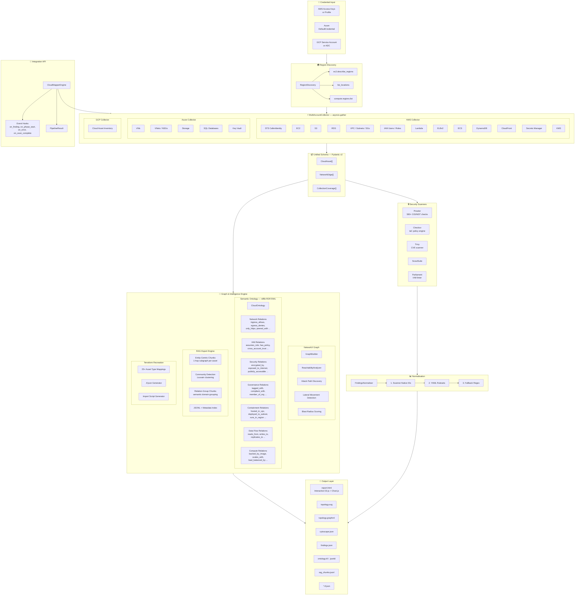

# ☁️ CloudMapper — Cloud Infrastructure Mapping & Security Intelligence Agent

A production-grade Python pipeline that simultaneously maps multi-cloud infrastructure (AWS + Azure + GCP), builds semantic knowledge graphs with ontological reasoning, runs security scanners, generates RAG-ready outputs for LLM integration, and produces Terraform recreation files — all from a single CLI or programmatic API.

[](https://python.org)
[](LICENSE)

---

## Architecture



---

## Features

| Category | Details |
|---|---|
| **Multi-Cloud** | AWS (15 services), Azure (VMs, VNets, NSGs, Storage, SQL, Key Vault), GCP (Cloud Asset Inventory) |
| **Multi-Provider** | Simultaneous scanning of AWS + Azure + GCP via `asyncio.gather` |
| **Multi-Account** | AWS STS AssumeRole, Azure subscription iteration, GCP project iteration |
| **Multi-Region** | Auto-discovery of all regions per provider, or `--regions all` sentinel |
| **Direct Credentials** | Accept access keys directly — no IAM roles needed for third-party scanning |
| **Semantic Ontology** | ~62 relation types across 7 domains (Network, IAM, Security, Governance, Containment, Data Flow, Compute) via RDF/OWL |
| **RAG-Ready** | 3 chunking strategies (entity-centric, community-detection, relation-group) with JSONL + metadata index |
| **Terraform Recreation** | `.tf.json` generator for 25+ asset types with `terraform import` script |
| **Security Scanning** | Prowler, ScoutSuite, Checkov, Trivy, Parliament (IAM linting) |
| **Graph Analysis** | NetworkX reachability, attack path discovery, lateral movement detection, blast radius scoring |
| **Compliance** | CIS, NIST 800-53, PCI-DSS, GDPR, SOC2, HIPAA — scanner-native + loadable YAML rulesets |
| **Integration API** | `CloudMapperEngine` with event hooks for embedding into SIEM/SOAR/larger systems |
| **Reports** | Interactive HTML (D3.js + Chart.js), SVG topology, GraphML, Cytoscape JSON |
| **Docker** | Multi-stage Dockerfile for immutable OS / CI/CD deployment |
| **Extensibility** | Plugin registry via `importlib.metadata` entry points |

---

## Quick Start

### Install with Poetry

```bash
git clone https://github.com/morpheuslord/cloudmapper.git
cd cloudmapper
poetry install
eval $(poetry env activate)
```

### Install with pip

```bash
pip install -e ".[dev]"
```

### Docker (recommended for immutable OS / CI)

```bash
# Build
docker build -t cloudmapper:latest .

# Run a scan
docker run --rm -v $(pwd)/reports:/app/reports \
  cloudmapper:latest run -p aws \
  --aws-key YOUR_KEY --aws-secret YOUR_SECRET \
  --regions us-east-1

# Or via environment variables (more secure)
export AWS_ACCESS_KEY_ID=YOUR_KEY
export AWS_SECRET_ACCESS_KEY=YOUR_SECRET
docker compose run --rm cloudmapper run -p aws --regions us-east-1
```

---

## Usage

### Full Pipeline

```bash
# Single provider, single region
cloudmapper run -p aws --aws-key YOUR_KEY --aws-secret YOUR_SECRET --regions us-east-1

# Multi-provider, all regions
cloudmapper run -p aws -p azure -p gcp --regions all

# Scan all 3 providers simultaneously
cloudmapper run -p all --regions all --terraform

# With a config file
cloudmapper -c config.yaml run -p aws
```

### Individual Commands

```bash
# Collect assets only
cloudmapper collect -p aws --region us-east-1

# Run scanners only
cloudmapper scan -p aws --scanners prowler,checkov --iac-dir ./infra

# Generate reports from existing findings
cloudmapper report --input ./reports/findings.json --format all
```

### CLI Flags

| Flag | Description |
|---|---|
| `-p, --provider` | Provider(s) to scan: `aws`, `azure`, `gcp`, `all`. Repeatable: `-p aws -p azure` |
| `--aws-key` | AWS access key ID (direct credential) |
| `--aws-secret` | AWS secret access key (direct credential) |
| `--profile` | AWS CLI profile name (fallback if no direct keys) |
| `--regions` | Regions to scan: `all` for auto-discovery, or comma-separated list |
| `--region` | Single AWS region (legacy, ignored if `--regions` is set) |
| `--subscription-id` | Azure subscription ID |
| `--project-id` | GCP project ID |
| `--ontology / --no-ontology` | Build semantic ontology graph (default: on) |
| `--rag-export / --no-rag-export` | Generate RAG-ready chunks (default: on) |
| `--terraform / --no-terraform` | Generate Terraform `.tf.json` files (default: off) |
| `-o, --output` | Output directory (default: `./reports`) |
| `--scanners` | Scanners to run, comma-separated (default: `prowler,checkov`) |

---

## Configuration

Copy and customise `config.yaml`:

```yaml
# Scan multiple providers simultaneously
providers:
  - aws
  - azure

aws:
  regions:
    - ALL                    # Auto-discover all enabled regions
  access_key_id: null        # Direct access key (or use --aws-key CLI flag)
  secret_access_key: null    # Direct secret key (or use --aws-secret CLI flag)
  profile: null              # AWS CLI profile (fallback)
  accounts: []               # Cross-account IDs (optional)
  role_name: null            # IAM role for cross-account (optional)

azure:
  subscription_ids: []
  regions:
    - ALL                    # Auto-discover all Azure locations

gcp:
  project_ids: []
  regions:
    - ALL                    # Auto-discover all GCP regions

ontology:
  enabled: true
  export_formats: [turtle, json-ld]

rag:
  enabled: true
  chunk_strategy: hybrid     # entity | community | relation_group | hybrid

terraform:
  enabled: false
  output_dir: ./reports/terraform

graph:
  persist_graphml: true
  compute_attack_paths: true

scanners:
  enabled: [prowler, checkov]
  timeout_seconds: 3600

concurrency_limit: 5         # Max concurrent API calls per provider
```

---

## Programmatic API

CloudMapper exposes a `CloudMapperEngine` for embedding into larger systems:

```python
from cloudmapper.api import CloudMapperEngine
from cloudmapper.config import CloudMapperConfig

config = CloudMapperConfig(providers=["aws", "azure"])
config.aws.access_key_id = "AKIAXX..."
config.aws.secret_access_key = "..."

engine = CloudMapperEngine(config)

# Event hooks for real-time integration (SIEM, SOAR, etc.)
engine.on_finding = lambda finding: send_to_splunk(finding)
engine.on_phase_start = lambda phase: log_progress(phase)
engine.on_error = lambda phase, exc: alert_slack(phase, exc)

# Run full pipeline
result = await engine.run_pipeline()
print(result.to_summary())
# {'total_assets': 57, 'total_findings': 12, 'providers_scanned': ['aws', 'azure'], ...}

# Or run individual phases
collection = await engine.collect()
analysis = await engine.analyze(collection)
```

---

## Semantic Ontology

CloudMapper builds an RDF/OWL knowledge graph with **~62 semantic relation types** across 7 domains:

| Domain | Example Relations |
|---|---|
| **Network** | `ingress_allows`, `egress_denies`, `only_https`, `peered_with`, `nat_gateway_routes` |
| **IAM** | `assumes_role`, `has_policy`, `cross_account_trust`, `admin_access` |
| **Security** | `encrypted_by`, `exposed_to_internet`, `publicly_accessible`, `rotation_enabled` |
| **Governance** | `tagged_with`, `compliant_with`, `member_of_org`, `cost_allocated` |
| **Containment** | `hosted_in_vpc`, `deployed_to_subnet`, `runs_in_region`, `attached_to` |
| **Data Flow** | `reads_from`, `writes_to`, `replicates_to`, `cached_by` |
| **Compute** | `backed_by_image`, `scales_with`, `load_balanced_by`, `container_runs` |

Export formats: Turtle (`.ttl`), JSON-LD (`.jsonld`), RDF/XML, N-Triples.

---

## RAG-Ready Export

Three chunking strategies optimised for retrieval-augmented generation:

| Strategy | Description |
|---|---|
| **Entity-Centric** | 1-hop subgraph per asset — yields one chunk per asset with all its relations |
| **Community-Detection** | Louvain clustering — groups tightly-connected assets into logical communities |
| **Relation-Group** | Groups by semantic domain — e.g., all "network" or "IAM" relations together |

Output: `rag_chunks.jsonl` (one JSON object per line) + `rag_metadata_index.json` (chunk index for retrieval).

---

## Terraform Recreation

Generates `.tf.json` files mapping 25+ CloudAsset types to Terraform resources:

```bash
cloudmapper run -p aws --terraform --regions us-east-1
# Output: reports/terraform/*.tf.json + reports/terraform/import.sh
```

Supports: EC2, S3, RDS, VPC, Subnets, Security Groups, IAM, Lambda, ELBv2, ECS, DynamoDB, CloudFront, Secrets Manager, KMS, Azure VMs, VNets, NSGs, Storage, GCP instances, networks, and more.

---

## Compliance Rule Sourcing

Three-tier compliance mapping strategy:

| Priority | Source | Example |
|---|---|---|
| **1. Scanner-native** | Prowler ASFF, Checkov `check_id` | `CIS-1.5`, `CKV_AWS_18` |
| **2. External rulesets** | YAML files in `rules/` | `rules/cis_aws_v3.yaml` |
| **3. Fallback regex** | `_FALLBACK_RULES` in normaliser | Pattern matching (last resort) |

Add new frameworks by dropping YAML into `rules/`:

```yaml
framework: SOC2
controls:
  - id: "SOC2-CC6.1"
    title: "Access Control"
    patterns: ["access.*control", "authorization"]
    severity: HIGH
```

---

## Project Structure

```
cloudmapper/
├── cli.py                    # Click CLI — collect, scan, report, run
├── config.py                 # Pydantic v2 YAML config (multi-provider, regions)
├── credentials.py            # AWS/Azure/GCP credential resolution
├── api.py                    # CloudMapperEngine — programmatic integration API
├── region_discovery.py       # Auto-discover regions (AWS/Azure/GCP + fallbacks)
├── registry.py               # Plugin discovery via entry_points
├── retry.py                  # Async retry with exponential backoff
├── coverage.py               # Per-service collection tracking
├── normaliser.py             # Three-tier compliance aggregator
├── schema/
│   └── models.py             # Pydantic models (CloudAsset, Finding, ScanResult)
├── collectors/
│   ├── base.py               # BaseCollector ABC
│   ├── aws.py                # Async AWS (15 services, aioboto3)
│   ├── azure.py              # Azure SDK collector
│   ├── gcp.py                # GCP Cloud Asset Inventory collector
│   └── multi.py              # Multi-provider parallel orchestrator
├── scanners/
│   ├── prowler.py            # Prowler ASFF parser
│   ├── scoutsuite.py         # ScoutSuite JS parser
│   ├── checkov.py            # Checkov JSON parser
│   ├── trivy.py              # Trivy CVE parser
│   └── iam_linter.py         # Parliament IAM policy linter
├── graph/
│   ├── builder.py            # NetworkX graph (GraphML, Cytoscape, attack paths)
│   ├── reachability.py       # BFS reachability + blast radius analysis
│   ├── ontology.py           # RDF/OWL semantic ontology (~62 relation types)
│   └── rag_export.py         # RAG-ready chunking (entity, community, relation)
└── renderers/
    ├── svg.py                # SVG topology renderer
    ├── html_report.py        # Jinja2 HTML report (D3.js + Chart.js)
    ├── json_export.py        # JSON findings exporter
    └── terraform_export.py   # .tf.json generator with import scripts

tests/
├── test_collectors.py        # moto-mocked AWS tests
├── test_normaliser.py        # Normaliser + graph tests
├── test_ontology.py          # 19 ontology tests
├── test_rag_export.py        # 22 RAG export tests
├── test_terraform_export.py  # 20 Terraform export tests
├── test_region_discovery.py  # 18 region discovery tests
└── test_api.py               # 16 API + config tests

config.yaml                   # Configuration file
Dockerfile                    # Multi-stage Docker build
docker-compose.yml            # Docker Compose for easy deployment
```

---

## Output Files

| File | Description |
|---|---|
| `reports/findings.json` | All findings, assets, edges, compliance results |
| `reports/topology.svg` | Network topology diagram |
| `reports/topology.graphml` | GraphML for Gephi/Neo4j import |
| `reports/topology-cytoscape.json` | Cytoscape.js compatible graph |
| `reports/report.html` | Interactive HTML report (air-gapped capable) |
| `reports/ontology.ttl` | RDF/OWL semantic ontology (Turtle format) |
| `reports/ontology.jsonld` | JSON-LD semantic ontology |
| `reports/rag_chunks.jsonl` | RAG-ready chunks for LLM retrieval |
| `reports/rag_metadata_index.json` | Chunk metadata index |
| `reports/terraform/*.tf.json` | Terraform recreation files |
| `reports/terraform/import.sh` | Terraform import commands |

---

## Extending with Plugins

Register custom collectors or scanners via `pyproject.toml`:

```toml
[tool.poetry.plugins."cloudmapper.collectors"]
custom = "my_package.collector:MyCollector"

[tool.poetry.plugins."cloudmapper.scanners"]
custom = "my_package.scanner:MyScanner"
```

CloudMapper discovers plugins at runtime via `importlib.metadata` — no core code changes needed.

---

## AWS Services Collected

EC2, S3, RDS, VPC, Subnets, Security Groups, IAM Users, IAM Roles, Lambda, ELBv2, ECS, DynamoDB, CloudFront, Secrets Manager, KMS

---

## Requirements

- Python 3.11+
- Docker (recommended for immutable OS / CI)
- Cloud provider credentials (access keys, service accounts, or CLI profiles)
- Optional: Prowler, Checkov, Trivy, ScoutSuite, Parliament

---

## License

MIT
