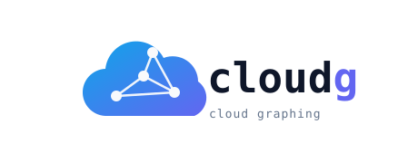
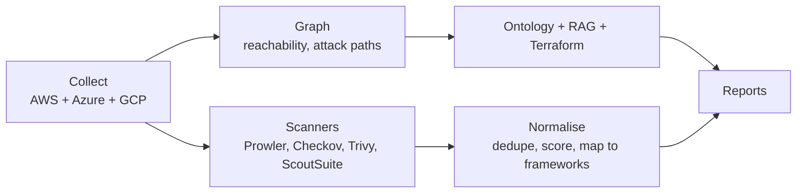

<p align="center">
  
</p>

# cloudg

cloudg (short for cloud graphing) maps cloud infrastructure across AWS, Azure and GCP, builds a graph of what it finds, runs security scanners over the same inventory, and writes everything out as reports you can actually use: an interactive HTML report, GraphML, an RDF ontology, RAG chunks for LLM pipelines, and Terraform files that recreate the live infrastructure.

It started as a single-account AWS mapper and grew into a pipeline. One command collects assets from every configured provider in parallel, feeds them through a NetworkX graph for reachability and attack path analysis, fans out to Prowler, ScoutSuite, Checkov and Trivy, then merges and deduplicates all findings against 28 compliance frameworks.

## Install

With uv, which is what I use for development:

```bash
git clone https://github.com/morpheuslord/cloudg.git
cd cloudg

uv venv && source .venv/bin/activate
uv pip install -e ".[all,dev]"
```

Plain pip works too: `pip install -e ".[all]"`. The cloud SDKs are extras, so `pip install cloudg[aws]` pulls only boto3/aioboto3, `[azure]` and `[gcp]` do the same for their SDKs, and `[all]` installs the lot. The core package with no extras still gives you the graph engine, the ontology, the normaliser and the report renderers.

The external scanners (Prowler, Checkov, Trivy, ScoutSuite) are separate executables, not Python dependencies. `install.sh` (Linux/macOS) and `install.bat` (Windows) set up everything including the scanners and the cloud CLIs. Docker is the lazy path, since the image bundles all four scanners:

```bash
docker build -t cloudg:latest .
docker compose run --rm cloudg run -p aws --regions us-east-1
```

## Quick start

```bash
# one provider, one region
cloudg run -p aws --regions us-east-1

# everything, everywhere
cloudg run -p all --regions all

# with Terraform recreation files
cloudg run -p aws --regions us-east-1 --terraform
```

Reports land in `./reports`. Open `report.html` first.

## Authentication

Every provider supports several auth methods, resolved in a fixed priority order. The same config works on a laptop, in CI, and on cloud compute.

### AWS

1. Direct keys: `--aws-key` / `--aws-secret` (plus `--aws-session-token` for temporary credentials), or the standard env vars.
2. OIDC web identity federation: `--aws-role-arn` together with `--aws-web-identity-token-file`. This is the GitHub Actions / GitLab CI / EKS service account pattern, no long-lived keys anywhere.
3. A named CLI profile via `--profile`, including SSO profiles.
4. Nothing at all: the default chain picks up env vars, cached SSO credentials, or the EC2/ECS instance role, so a scan running on cloud compute inherits its host's role.

On top of any of these you can layer STS role assumption with `--aws-role-arn` and, for the third-party auditor pattern, `--aws-external-id`. Multi-account fan-out uses `accounts` plus `role_name` in the config file, and cloudg assumes that role in each account before collecting.

### Azure

1. Workload identity federation: `--azure-tenant-id`, `--azure-client-id` and `--azure-federated-token-file` (AKS workload identity, GitHub OIDC).
2. Service principal with a client secret: `--azure-client-secret`.
3. Service principal with a certificate: `--azure-cert-path`.
4. Managed identity: `--azure-managed-identity`, with `managed_identity_client_id` in the config for user-assigned identities.
5. The DefaultAzureCredential chain, which also covers `az login` sessions.

### GCP

1. A credentials file via `--gcp-credentials-file`: either a service account key JSON or a workload identity federation (`external_account`) config.
2. Application default credentials: `GOOGLE_APPLICATION_CREDENTIALS`, gcloud user credentials, or the GCE/GKE metadata server.

`--gcp-impersonate-sa` layers service account impersonation on top of either, which is handy when your user account may impersonate a read-only scanner service account.

The full set of fields lives in `config.yaml` with comments for each method.

## What the pipeline does



Collection runs all providers concurrently with asyncio, iterating accounts and regions per provider (regions are auto-discovered when you pass `--regions all`). Assets and network edges go into a directed graph, where BFS from the internet node finds exposed resources and blast radius scoring estimates what an attacker could reach from each node.

The same inventory feeds three other exports. The ontology module infers about 62 typed relations (`exposed_to_internet`, `assumes_role`, `encrypted_by`, `hosted_in_vpc` and so on) and writes RDF you can query with SPARQL. The RAG exporter chunks the graph three ways (per asset, per Louvain community, per relation domain) into JSONL for retrieval pipelines. The Terraform exporter maps 25+ asset types to `.tf.json` resources with an `import.sh` to adopt them into state.

Scanner findings are deduplicated by resource and title, rescored against CVSS, and mapped to compliance controls.

## Compliance rules

Findings are tagged with framework controls in four tiers, most precise first:

1. Whatever the scanner itself reports (Prowler ASFF, Checkov check IDs).
2. Exact check-ID lookup against the shipped rulesets. These are generated from Prowler's public compliance data (Apache-2.0) and cover 28 frameworks with 4,166 controls and 10,236 check mappings across AWS, Azure and GCP: CIS 5.0 for each cloud, NIST 800-53 rev 5, NIST CSF 2.0, PCI DSS 4.0, SOC 2, HIPAA, GDPR, ISO 27001:2022, MITRE ATT&CK, and the AWS Foundational Security Best Practices.
3. Regex pattern rules for scanners that emit no compliance metadata.
4. A small built-in fallback table.

The rulesets ship inside the package (`cloudg/rules/`). To refresh them against a newer Prowler release:

```bash
git clone --depth 1 https://github.com/prowler-cloud/prowler /tmp/prowler
python scripts/import_prowler_compliance.py /tmp/prowler
```

Adding your own framework is a YAML file in the rules directory:

```yaml
framework: MY-FRAMEWORK
controls:
  - id: "MF-1.1"
    title: "Storage is encrypted"
    patterns: ["encrypt.*rest"]        # regex tier
    checks: ["s3_default_encryption"]  # exact tier, optional
```

`cloudg/policies/` additionally holds Cloud Custodian policy packs (AWS governance, AWS security, Azure, GCP) you can run with `custodian run` independently of cloudg.

## CLI reference

| Flag | Meaning |
|---|---|
| `-p, --provider` | `aws`, `azure`, `gcp` or `all`; repeatable |
| `--regions` | `all` for auto-discovery, or a comma-separated list |
| `--aws-key`, `--aws-secret`, `--aws-session-token` | direct AWS credentials |
| `--aws-role-arn`, `--aws-external-id` | STS role assumption |
| `--aws-web-identity-token-file` | OIDC token file for web identity federation |
| `--profile` | AWS CLI profile |
| `--subscription-id`, `--azure-tenant-id`, `--azure-client-id` | Azure identity |
| `--azure-client-secret`, `--azure-cert-path` | service principal credentials |
| `--azure-federated-token-file`, `--azure-managed-identity` | federation / managed identity |
| `--project-id`, `--gcp-credentials-file`, `--gcp-impersonate-sa` | GCP identity |
| `--scanners` | comma-separated subset of `prowler,scoutsuite,checkov,trivy,iam` |
| `--iac-dir` | directory for Checkov to scan |
| `--images` | container images for Trivy |
| `--ontology/--no-ontology` | RDF ontology export (on by default) |
| `--rag-export/--no-rag-export` | RAG chunk export (on by default) |
| `--terraform/--no-terraform` | Terraform recreation (off by default) |
| `-o, --output` | output directory, `./reports` by default |

`cloudg collect` and `cloudg scan` run the individual phases; `cloudg report -i findings.json` re-renders reports from a previous run.

## Output files

| File | What it is |
|---|---|
| `report.html` | interactive report, D3 topology plus findings table, works offline |
| `findings.json` | all findings, assets, edges and compliance results |
| `topology.svg`, `topology.graphml`, `topology-cytoscape.json` | the graph in three formats |
| `ontology.ttl`, `ontology.jsonld` | the RDF ontology |
| `rag_chunks.jsonl`, `rag_metadata_index.json` | retrieval-ready chunks |
| `terraform/*.tf.json`, `terraform/import.sh` | recreation files |

## Using it as a library

```python
from cloudg import CloudGConfig, CloudGEngine

config = CloudGConfig(providers=["aws"])
config.aws.role_arn = "arn:aws:iam::123456789012:role/scanner"
config.aws.external_id = "my-external-id"

engine = CloudGEngine(config)
engine.on_finding = lambda f: forward_to_siem(f)

result = engine.run_pipeline_sync()
print(result.to_summary())
```

The engine exposes `collect()`, `scan()` and `analyze()` separately if you only need part of the pipeline, and event hooks (`on_finding`, `on_phase_start`, `on_error`, `on_scan_complete`) for streaming integration.

Custom collectors and scanners register through entry points, no core changes needed:

```toml
[project.entry-points."cloudg.collectors"]
mycloud = "my_package.collector:MyCollector"
```

## Development

```bash
uv pip install -e ".[all,dev]"
pytest             # 152 tests, moto-mocked AWS included
ruff check cloudg/ tests/
uv build           # wheel + sdist for PyPI
```

Python 3.11 or newer. The moto/aiobotocore incompatibility around async response bodies is handled in `tests/conftest.py`, so the suite runs against current versions of both.

## License

MIT
