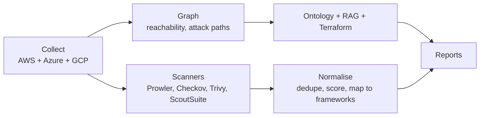

<p align="center">
  
</p>

<p align="center">
  <a href="LICENSE"></a>
  
  
  <a href="https://github.com/astral-sh/uv"></a>
</p>

<p align="center">
  <b>cloudg</b> (cloud graphing) maps AWS, Azure and GCP infrastructure into a graph,<br>
  runs security scanners over the same inventory, and turns the results into reports you can actually use.
</p>

---

One command collects assets from every configured provider in parallel, feeds them through a NetworkX graph for reachability and attack path analysis, fans out to Prowler, ScoutSuite, Checkov and Trivy, then merges and deduplicates all findings against 28 compliance frameworks. Out the other end come an interactive HTML report, GraphML, an RDF ontology, RAG chunks for LLM pipelines, and Terraform files that recreate the live infrastructure.

Need the map without the security tooling? `cloudg map` is a scanner-independent inventory mapper: it deep-collects everything deployed (or default) in an account, down to the network fabric, sweeps every service for the rest, and links it all into one asset map you can overlay with scanner findings later. See [Inventory mapping](#inventory-mapping).

**Full documentation:** the rendered handbook lives at [morpheuslord.github.io/cloudg](https://morpheuslord.github.io/cloudg/), with the same content as markdown in the [feature reference](https://github.com/morpheuslord/cloudg/blob/main/docs/DOCUMENTATION.md) and release notes in the [changelog](https://github.com/morpheuslord/cloudg/blob/main/CHANGELOG.md).

---

## Quick start

```bash
git clone https://github.com/morpheuslord/cloudg.git
cd cloudg

uv venv && source .venv/bin/activate
uv pip install -e ".[all,dev]"
```

```bash
# one provider, one region
cloudg run -p aws --regions us-east-1

# everything, everywhere
cloudg run -p all --regions all

# with Terraform recreation files
cloudg run -p aws --regions us-east-1 --terraform
```

Reports land in `./reports`. Open `report.html` first.

Already ran the scanners yourself? Feed cloudg their native output files instead — no cloud credentials, no scanner binaries:

```bash
cloudg ingest --prowler ./prowler-output/ --checkov ./results_json.json --trivy ./trivy.json
```

Any combination of Prowler, ScoutSuite, Checkov and Trivy outputs works; cloudg normalises, deduplicates across scanners via the check-equivalence rulesets, maps compliance frameworks, and renders the reports.

<details>
<summary><b>Other install options (pip, Docker, installer scripts)</b></summary>

<br>

Plain pip works too: `pip install -e ".[all]"`. The cloud SDKs are extras, so `pip install cloudg[aws]` pulls only boto3/aioboto3, `[azure]` and `[gcp]` do the same for their SDKs, and `[all]` installs the lot. The core package with no extras still gives you the graph engine, the ontology, the normaliser and the report renderers.

The external scanners (Prowler, Checkov, Trivy, ScoutSuite) are separate executables, not Python dependencies. `install.sh` (Linux/macOS) and `install.bat` (Windows) set up everything including the scanners and the cloud CLIs.

Docker is the lazy path, since the image bundles all four scanners:

```bash
docker build -t cloudg:latest .
docker compose run --rm cloudg run -p aws --regions us-east-1
```

</details>

---

## Inventory mapping

`cloudg map` answers a different question than `cloudg run`: what exists, and how is it wired together. Finding out what is wrong stays the scanners' job, and none of them runs here or even needs to be installed. What makes the map complete:

- Deep service collectors. Containers (ECR repositories, ECS services and task definitions, EKS clusters, nodegroups, Fargate profiles, addons, access entries) and the Kubernetes workloads running inside EKS; Lambda with its triggers, function URLs, images and layers; API Gateway, SQS, SNS, EventBridge, Step Functions, Kinesis; data stores; Route 53; CloudFormation stacks and the resources they manage; the whole IAM graph; and the security services and scanners watching the account (GuardDuty, Security Hub, Inspector, Macie, Config, Access Analyzer, WAF, Network Firewall, Shield, CloudTrail), including where they are not enabled.
- Breadth across every service. On AWS, a Cloud Control API sweep lists every resource type that supports listing (800+), tagged or not, next to 133 dedicated collectors. Azure is read through Azure Resource Graph across every subscription and management group, GCP through Cloud Asset Inventory across the whole organization, both with full resource properties.
- Every account at once. `--org` discovers the AWS Organization from the management account (OU tree, accounts, SCPs, and the Control Tower landing zone with its governed regions and enabled controls) and maps every member account.
- Typed interdependencies. Edges say what they mean: S3 `INVOKES` Lambda, task definition `USES_IMAGE` ECR repository, function `ASSUMES_ROLE` role, WAF `PROTECTS` ALB, Inspector `MONITORS` instance, stack `MANAGES` resource, SCP `GOVERNS` OU, plus cross-account trust to accounts you did not map. `cloudg deps` then answers "what does this need" and "what breaks if it goes".

```bash
# map one provider
cloudg map -p aws --regions all

# every account in the AWS Organization / Control Tower landing zone
cloudg map -p aws --org --regions all

# map everything, everywhere
cloudg map -p all --regions all

# what depends on this role, and what does it depend on?
cloudg deps arn:aws:iam::123456789012:role/app-role

# overlay scanner findings you generated earlier -> asset map + compliance map
cloudg map -p aws --regions all --findings ./reports/raw-findings.json
```

Outputs: `inventory-map.json` (assets, interconnections, summary), `inventory-map.graphml`, `inventory-graph.json` for viewers, `inventory-dependencies.json` (shared dependencies, blast radius, cross-account edges, security coverage gaps) and, with `--org`, `inventory-organization.json`. With `--findings`, additionally `asset-map.json` (each asset with its findings and severity breakdown) and `compliance-map.json` (framework → affected assets). The map never depends on the scanners; you can map today and merge in findings from a scan you run next week.

All of this is also a library API, see [Using it as a library](#using-it-as-a-library):

```python
from cloudg import CloudGConfig, CloudGEngine

engine = CloudGEngine(CloudGConfig(providers=["aws", "azure", "gcp"]))
inventory = engine.map_inventory_sync(output_dir="./reports")
print(inventory.summary["assets_by_service"])
```

---

## Authentication

Every provider supports several auth methods, resolved in a fixed priority order. The same config works on a laptop, in CI, and on cloud compute. The full set of fields lives in `config.yaml` with comments for each method.

<details>
<summary><b>AWS</b></summary>

<br>

1. Direct keys: `--aws-key` / `--aws-secret` (plus `--aws-session-token` for temporary credentials), or the standard env vars.
2. OIDC web identity federation: `--aws-role-arn` together with `--aws-web-identity-token-file`. This is the GitHub Actions / GitLab CI / EKS service account pattern, no long-lived keys anywhere.
3. A named CLI profile via `--profile`, including SSO profiles.
4. Nothing at all: the default chain picks up env vars, cached SSO credentials, or the EC2/ECS instance role, so a scan running on cloud compute inherits its host's role.

On top of any of these you can layer STS role assumption with `--aws-role-arn` and, for the third-party auditor pattern, `--aws-external-id`. Multi-account fan-out uses `accounts` plus `role_name` in the config file, and cloudg assumes that role in each account before collecting.

</details>

<details>
<summary><b>Azure</b></summary>

<br>

1. Workload identity federation: `--azure-tenant-id`, `--azure-client-id` and `--azure-federated-token-file` (AKS workload identity, GitHub OIDC).
2. Service principal with a client secret: `--azure-client-secret`.
3. Service principal with a certificate: `--azure-cert-path`.
4. Managed identity: `--azure-managed-identity`, with `managed_identity_client_id` in the config for user-assigned identities.
5. The DefaultAzureCredential chain, which also covers `az login` sessions.

</details>

<details>
<summary><b>GCP</b></summary>

<br>

1. A credentials file via `--gcp-credentials-file`: either a service account key JSON or a workload identity federation (`external_account`) config.
2. Application default credentials: `GOOGLE_APPLICATION_CREDENTIALS`, gcloud user credentials, or the GCE/GKE metadata server.

`--gcp-impersonate-sa` layers service account impersonation on top of either, which is handy when your user account may impersonate a read-only scanner service account.

</details>

---

## What the pipeline does



Collection runs all providers concurrently with asyncio, iterating accounts and regions per provider (regions are auto-discovered when you pass `--regions all`). Assets and network edges go into a directed graph, where BFS from the internet node finds exposed resources and blast radius scoring estimates what an attacker could reach from each node.

The same inventory feeds three other exports. The ontology module infers about 62 typed relations (`exposed_to_internet`, `assumes_role`, `encrypted_by`, `hosted_in_vpc` and so on) and writes RDF you can query with SPARQL. The RAG exporter chunks the graph three ways (per asset, per Louvain community, per relation domain) into JSONL for retrieval pipelines. The Terraform exporter maps 25+ asset types to `.tf.json` resources with an `import.sh` to adopt them into state.

Scanner findings are deduplicated in two passes — within a scanner by (scanner, check ID, resource), and across scanners only when both the normalised title and the underlying check semantics (`rules/check_equivalence.yaml`) match — then rescored against CVSS and mapped to compliance controls.

---

## Compliance rules

Findings are tagged with framework controls in four tiers, most precise first:

1. Whatever the scanner itself reports (Prowler ASFF, Checkov check IDs).
2. Exact check-ID lookup against the shipped rulesets. These are generated from Prowler's public compliance data (Apache-2.0) and cover 28 frameworks with 4,166 controls and 10,236 check mappings across AWS, Azure and GCP: CIS 5.0 for each cloud, NIST 800-53 rev 5, NIST CSF 2.0, PCI DSS 4.0, SOC 2, HIPAA, GDPR, ISO 27001:2022, MITRE ATT&CK, and the AWS Foundational Security Best Practices.
3. Regex pattern rules for scanners that emit no compliance metadata.
4. A small built-in fallback table.

<details>
<summary><b>Refreshing and extending the rulesets</b></summary>

<br>

The rulesets ship inside the package (`cloudg/rules/`). To refresh them against a newer Prowler release:

```bash
git clone --depth 1 https://github.com/prowler-cloud/prowler /tmp/prowler
python scripts/import_prowler_compliance.py /tmp/prowler
```

Adding your own framework is a YAML file in the rules directory:

```yaml
framework: MY-FRAMEWORK
controls:
  - id: "MF-1.1"
    title: "Storage is encrypted"
    patterns: ["encrypt.*rest"]        # regex tier
    checks: ["s3_default_encryption"]  # exact tier, optional
```

`cloudg/policies/` additionally holds Cloud Custodian policy packs (AWS governance, AWS security, Azure, GCP) you can run with `custodian run` independently of cloudg.

</details>

---

## Reference

<details>
<summary><b>CLI flags</b></summary>

<br>

| Flag | Meaning |
|---|---|
| `-p, --provider` | `aws`, `azure`, `gcp` or `all`; repeatable |
| `--regions` | `all` for auto-discovery, or a comma-separated list |
| `--aws-key`, `--aws-secret`, `--aws-session-token` | direct AWS credentials |
| `--aws-role-arn`, `--aws-external-id` | STS role assumption |
| `--aws-web-identity-token-file` | OIDC token file for web identity federation |
| `--profile` | AWS CLI profile |
| `--subscription-id`, `--azure-tenant-id`, `--azure-client-id` | Azure identity |
| `--azure-client-secret`, `--azure-cert-path` | service principal credentials |
| `--azure-federated-token-file`, `--azure-managed-identity` | federation / managed identity |
| `--project-id`, `--gcp-credentials-file`, `--gcp-impersonate-sa` | GCP identity |
| `--scanners` | comma-separated subset of `prowler,scoutsuite,checkov,trivy,iam` |
| `--iac-dir` | directory for Checkov to scan |
| `--images` | container images for Trivy |
| `--ontology/--no-ontology` | RDF ontology export (on by default) |
| `--rag-export/--no-rag-export` | RAG chunk export (on by default) |
| `--terraform/--no-terraform` | Terraform recreation (off by default) |
| `-o, --output` | output directory, `./reports` by default |

`cloudg collect` and `cloudg scan` run the individual phases; `cloudg map` builds the scanner-independent inventory map (`--findings` merges existing findings into asset/compliance maps, `--no-sweep` skips the catch-all sweep); `cloudg ingest` aggregates scanner outputs you already have (`--prowler`, `--scoutsuite`, `--checkov`, `--trivy`, each taking a file or directory and repeatable); `cloudg report -i findings.json` re-renders reports from a previous run.

</details>

<details>
<summary><b>Output files</b></summary>

<br>

| File | What it is |
|---|---|
| `report.html` | interactive report, D3 topology plus findings table, works offline |
| `findings.json` | all findings, assets, edges and compliance results |
| `topology.svg`, `topology.graphml`, `topology-cytoscape.json` | the graph in three formats |
| `ontology.ttl`, `ontology.jsonld` | the RDF ontology |
| `rag_chunks.jsonl`, `rag_metadata_index.json` | retrieval-ready chunks |
| `terraform/*.tf.json`, `terraform/import.sh` | recreation files |
| `inventory-map.json`, `inventory-map.graphml`, `inventory-graph.json` | scanner-independent inventory map (`cloudg map`) |
| `asset-map.json`, `compliance-map.json` | inventory merged with scanner findings (`cloudg map --findings`) |

</details>

---

## Using it as a library

```python
from cloudg import CloudGConfig, CloudGEngine

config = CloudGConfig(providers=["aws"])
config.aws.role_arn = "arn:aws:iam::123456789012:role/scanner"
config.aws.external_id = "my-external-id"

engine = CloudGEngine(config)
engine.on_finding = lambda f: forward_to_siem(f)

result = engine.run_pipeline_sync()
print(result.to_summary())
```

The engine exposes `collect()`, `scan()` and `analyze()` separately if you only need part of the pipeline, `map_inventory()` for scanner-independent inventory mapping, `ingest_reports()` / `run_from_reports()` for working from existing scanner output files, and event hooks (`on_finding`, `on_phase_start`, `on_error`, `on_scan_complete`) for streaming integration.

Inventory mapping composes with the rest: map now, scan whenever, merge later.

```python
from cloudg import CloudGConfig, CloudGEngine
from cloudg.inventory import InventoryMapper, RelationshipLinker

config = CloudGConfig(providers=["aws"])
engine = CloudGEngine(config)

inventory = engine.map_inventory_sync()          # no scanners involved
findings = engine.ingest_reports({"prowler": ["./prowler-out/"]})

mapper = InventoryMapper(config)
asset_map = mapper.build_asset_map(inventory, findings)        # asset -> risk
compliance = mapper.build_compliance_map(inventory, findings)  # framework -> assets

# the linker also works standalone, on any list of CloudAssets
edges = RelationshipLinker(inventory.assets).link()
```

Much more of cloudg is public, importable API than the CLI suggests. The [Python API chapter](https://github.com/morpheuslord/cloudg/blob/main/docs/DOCUMENTATION.md#python-api) documents the full surface, including:

| API | What it gives you |
|---|---|
| `cloudg.inventory.InventoryMapper` / `RelationshipLinker` | scanner-free inventory maps and metadata-derived relationship edges |
| `cloudg.graph.builder.GraphBuilder` | NetworkX graph, attack paths, centrality/blast-radius metrics, D3/Cytoscape/GraphML export |
| `cloudg.graph.ontology.CloudOntology` | RDF ontology (~62 typed relations), SPARQL-queryable, Turtle/JSON-LD |
| `cloudg.graph.rag_export.RAGExporter` | retrieval-ready JSONL chunks of the infrastructure for LLM pipelines |
| `cloudg.renderers.terraform_export.TerraformExporter` | `.tf.json` recreation of live infrastructure plus `import.sh` |
| `cloudg.ingest.parse_report` and the scanner classes | every scanner's parser, usable standalone |
| `cloudg.normaliser.FindingsNormaliser` | cross-scanner dedupe, CVSS rescoring, compliance mapping |

Custom collectors and scanners register through entry points, no core changes needed:

```toml
[project.entry-points."cloudg.collectors"]
mycloud = "my_package.collector:MyCollector"
```

---

## Development

```bash
uv pip install -e ".[all,dev]"
pytest             # 152 tests, moto-mocked AWS included
ruff check cloudg/ tests/
uv build           # wheel + sdist for PyPI
```

Python 3.11 or newer. The moto/aiobotocore incompatibility around async response bodies is handled in `tests/conftest.py`, so the suite runs against current versions of both.

---

