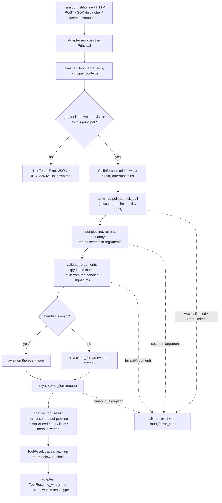

# cloudg MCP layer

cloudg 0.6.0 ships a Model Context Protocol (MCP) layer in `cloudg/mcp/`. It exposes the
inventory, the relationship graph, findings, compliance mappings and the RDF ontology to AI
agents as MCP tools, resources and prompts, with an access and data-transformation policy
applied to every request.

This guide is for programmers who want to run the layer, plug it into an MCP server they
already operate, or call it from Python. Three companion documents cover the rest:

- [MCP_TOOLS.md](MCP_TOOLS.md): the catalog, every tool, resource, template and prompt with
  its arguments and result shape.
- [MCP_PRIVACY.md](MCP_PRIVACY.md): policies, profiles, roles, detectors, transforms and the
  pseudonym vault.
- [MCP_INTERNALS.md](MCP_INTERNALS.md): how the package is built, for contributors.

Every example output below was produced by running the command or script shown against the
synthetic estate in `tests/mcp/fixtures/sample_estate.py`. Long JSON is trimmed and marked
with `...`, and absolute paths are shortened to `.../docest`.

## Contents

1. [What the layer is](#1-what-the-layer-is)
2. [Installation](#2-installation)
3. [Quick start with a desktop client](#3-quick-start-with-a-desktop-client)
4. [The request lifecycle](#4-the-request-lifecycle)
5. [CLI reference](#5-cli-reference)
6. [Transports and protocol versions](#6-transports-and-protocol-versions)
7. [Flavors](#7-flavors)
8. [Mounting into an existing MCP server](#8-mounting-into-an-existing-mcp-server)
9. [Framework-free export](#9-framework-free-export)
10. [In-process use](#10-in-process-use)
11. [The workspace](#11-the-workspace)
12. [Pagination and cursors](#12-pagination-and-cursors)
13. [Errors](#13-errors)
14. [Middleware](#14-middleware)
15. [Live tools and the credential preflight](#15-live-tools-and-the-credential-preflight)
16. [Security model in brief](#16-security-model-in-brief)
17. [Troubleshooting and FAQ](#17-troubleshooting-and-faq)

---

## 1. What the layer is

The center of the package is one class, `cloudg.mcp.CloudGMCPLayer`. It owns four things:

| Part | Class | What it holds |
|---|---|---|
| Registry | `cloudg.mcp.core.Registry` | Tool, resource, resource-template and prompt specs |
| Workspace | `cloudg.mcp.state.Workspace` | Loaded datasets, the active one, allowed directories |
| Policy | `cloudg.mcp.policy.Policy` | Who may call what, rate limits, input and output transforms |
| Middleware | list of `async (info, call_next)` callables | Audit, metrics, caching, concurrency, your own |

Whatever server or transport a request arrives through, it ends up in one of four layer
methods: `call_tool`, `read_resource`, `get_prompt` or `complete`. That is why a policy
written once applies the same way to Claude Desktop over stdio, to a web client over HTTP, to
an MCP server you mounted cloudg into, and to a Python script.

There are three ways to use it.

| Mode | Entry point | Use it when |
|---|---|---|
| Standalone server | `cloudg mcp serve` (stdio, streamable HTTP, legacy SSE) | You want cloudg as its own MCP server for a desktop client or a gateway |
| Mounted | `layer.register_into(server)` | You already run an MCP server (official `mcp` SDK 1.x or 2.x, or `fastmcp` 2/3/4) and want cloudg's primitives inside it |
| In-process | `await layer.call_tool(...)` and friends | You are writing Python (an agent framework, a test, a batch job) and do not need MCP on the wire |

The default catalog, as listed under the `open` profile, has 74 tools, 13 resources,
11 resource templates and 11 prompts. The CLI adds a 14th resource, `cloudg://metrics`
(section 14.3). The default `standard` profile hides one tool (`reveal_token`), so
`cloudg mcp tools` shows 73 there. The categories are:

| Category | What its tools do |
|---|---|
| `workspace` | Load, select, snapshot, diff and unload datasets |
| `inventory` | Search, inspect and aggregate assets, accounts, regions, tags, coverage, org |
| `graph` | Neighbors, paths, exposure, attack and lateral paths, dependencies, blast radius, centrality, sub-graphs |
| `findings` | Browse, summarize, prioritize, suppress and ingest security findings |
| `compliance` | Framework posture, controls and compliance gaps |
| `ontology` | RDF ontology, read-only SPARQL, semantic neighbourhoods, RAG chunks |
| `export` | Terraform recreation and report files |
| `live` | Collect from cloud APIs, run scanners, report the live rate-limit state |
| `meta` | Server capabilities and cloudg's vocabulary |
| `privacy` | Policy, pseudonym vault and data-handling controls |
| `prompts` | Packaged analysis workflows |

The per-tool reference is in [MCP_TOOLS.md](MCP_TOOLS.md).

## 2. Installation

```bash
pip install cloudg            # the layer, the CLI and the dependency-free native server
pip install "cloudg[mcp]"     # adds the official mcp SDK (mcp>=1.30,<3) for the SDK flavor and adapters
pip install fastmcp           # only if you want the fastmcp flavor or mount into fastmcp
```

Python 3.11 or newer is required. Importing `cloudg.mcp` imports nothing outside cloudg's own
dependencies; `mcp` and `fastmcp` are imported lazily, inside the functions that need them.

What you get without the extra:

| Feature | Plain `cloudg` | With `cloudg[mcp]` | With `fastmcp` |
|---|---|---|---|
| `CloudGMCPLayer`, in-process calls, `export_definitions` | yes | yes | yes |
| `cloudg mcp tools / resources / prompts / call / read / config` | yes | yes | yes |
| `cloudg mcp serve --flavor native` (stdio, HTTP, SSE) | yes | yes | yes |
| `cloudg mcp serve --flavor sdk` | no | yes | yes (fastmcp depends on mcp) |
| `cloudg mcp serve --flavor fastmcp` | no | no | yes |
| `register_into(...)` an SDK server | no | yes | yes |
| `register_into(...)` a `fastmcp.FastMCP` | no | no | yes |

`--flavor auto` (the default) picks the SDK when `mcp.server.lowlevel` imports and falls back
to the native server otherwise, so `cloudg mcp serve` works either way.

The SDK flavor's HTTP transport runs on uvicorn and Starlette. Both arrive with the `mcp`
package; cloudg does not list them separately.

The CLI is reachable three ways, all running the same click group:

```bash
cloudg mcp serve            # the mcp group on the main cloudg CLI
cloudg-mcp serve            # stand-alone console script (pyproject: cloudg-mcp = "cloudg.mcp.cli:main")
python -m cloudg.mcp serve  # module entry point, handy inside virtualenvs
```

If you installed cloudg in editable mode before 0.6.0, reinstall (`pip install -e .`) so the
`cloudg-mcp` script gets created. `cloudg mcp config` falls back to `cloudg mcp serve` or to
`python -m cloudg.mcp serve` when the script is missing.

## 3. Quick start with a desktop client

### 3.1 Try it in a terminal first

Before wiring a client, check that the layer loads your data. `--dataset` takes
`NAME=PATH` or a bare `PATH`, where the path is an `inventory-map.json`, its directory, a `findings.json`
report or native scanner output.

```bash
cloudg mcp call workspace_status --dataset prod=inventory/inventory-map.json
```

```json
{
  "active_dataset": "prod",
  "datasets": [
    {
      "name": "prod",
      "kind": "inventory",
      "source": ".../docest/inventory/inventory-map.json",
      "loaded_at": "2026-10-08T14:11:27+00:00",
      "version": 0,
      "providers": ["aws", "azure", "gcp"],
      "assets": 44,
      "edges": 56,
      "findings": 12,
      "compliance_results": 8,
      "cached": {"graph": false, "dependency_graph": false, "ontology": false,
                 "centrality": false, "rag_entity": false}
    }
  ],
  "allowed_roots": [".../docest", ".../docest/reports"],
  "output_dir": ".../docest/reports",
  "providers_configured": ["aws"]
}
```

(Reformatted: the real output prints one value per line.) A second call with arguments:

```bash
cloudg mcp call find_assets --dataset prod=inventory/inventory-map.json \
  --args '{"internet_exposed": true, "limit": 3, "fields": ["name","type","account_id","arn"]}'
```

```json
{
  "dataset": "prod",
  "total": 6,
  "offset": 0,
  "returned": 3,
  "next_cursor": "c3.d1894090b2cc",
  "truncated": true,
  "items": [
    {"id": "bastion", "name": "bastion", "type": "EC2", "account_id": "111111111111",
     "arn": "arn:aws:ec2:us-east-1:111111111111:instance/i-0bast"},
    {"id": "az-vm", "name": "jump-vm", "type": "VIRTUAL_MACHINE", ...},
    {"id": "logs-bucket", "name": "prod-logs", "type": "S3_BUCKET", ...}
  ]
}
```

### 3.2 Generate the client configuration

`cloudg mcp config` prints a JSON snippet for the client you name. It finds the launch
command itself, in this order: a `cloudg-mcp` executable on `PATH`, then `cloudg`, then the
current Python interpreter with `-m cloudg.mcp`. The snippet goes to stdout and a one-line
hint about where to paste it goes to stderr.

The outputs below came from a virtualenv where neither script was on `PATH`, so the
interpreter fallback was used. On a normal install the command is the `cloudg-mcp` script and
the arguments start with `serve`.

Claude Desktop (`cloudg mcp config --client claude-desktop`, the default):

```json
{
  "mcpServers": {
    "cloudg": {
      "command": "/run/media/morpheuslord/Personal_Files/Projects/cloudg/.venv/bin/python",
      "args": ["-m", "cloudg.mcp", "serve"]
    }
  }
}
```

Hint printed to stderr: merge it into `claude_desktop_config.json` (Settings, Developer, Edit
Config), then restart Claude Desktop.

Claude Code (`--client claude-code`):

```json
{
  "mcpServers": {
    "cloudg": {
      "type": "stdio",
      "command": "/run/media/morpheuslord/Personal_Files/Projects/cloudg/.venv/bin/python",
      "args": ["-m", "cloudg.mcp", "serve"],
      "env": {}
    }
  }
}
```

Save it as `.mcp.json` in the project root, or pass the inner entry to
`claude mcp add-json cloudg '<entry JSON>'`.

Cursor (`--client cursor`) produces the same shape as Claude Desktop. Merge it into
`~/.cursor/mcp.json` (global) or `.cursor/mcp.json` (project).

VS Code (`--client vscode`) uses a `servers` key and an explicit type:

```json
{
  "servers": {
    "cloudg": {
      "type": "stdio",
      "command": "/run/media/morpheuslord/Personal_Files/Projects/cloudg/.venv/bin/python",
      "args": ["-m", "cloudg.mcp", "serve"]
    }
  }
}
```

Save it as `.vscode/mcp.json`.

To bake options into the launch command, pass them to `config`. Dataset paths are resolved
to absolute paths, because the client starts the server from a working directory you do not
control:

```bash
cloudg mcp config --client claude-desktop --policy strict \
  --dataset prod=./reports/inventory-map.json --read-only
```

```json
{
  "mcpServers": {
    "cloudg": {
      "command": "/run/media/morpheuslord/Personal_Files/Projects/cloudg/.venv/bin/python",
      "args": [
        "-m", "cloudg.mcp", "serve",
        "--policy", "strict",
        "--dataset", "prod=/run/media/morpheuslord/Personal_Files/Projects/cloudg/reports/inventory-map.json",
        "--read-only"
      ]
    }
  }
}
```

### 3.3 Connecting to a running HTTP server

With `--transport http` the snippet points at a URL instead of launching a process.
`--token-env VAR` adds a bearer header that reads the token from an environment variable, in
the syntax each client expands. `--policy`, `--dataset` and `--read-only` are ignored in this
mode, since the server is already running.

```bash
cloudg mcp config --client claude-code --transport http --token-env CLOUDG_MCP_TOKEN
```

```json
{
  "mcpServers": {
    "cloudg": {
      "type": "http",
      "url": "http://127.0.0.1:8765/mcp",
      "headers": {"Authorization": "Bearer ${CLOUDG_MCP_TOKEN}"}
    }
  }
}
```

Cursor gets `"Bearer ${env:CLOUDG_MCP_TOKEN}"` and no `type`; VS Code gets `servers`,
`"type": "http"` and `${env:...}`. Claude Desktop's config file only launches local
commands, so cloudg bridges to the URL with `mcp-remote`:

```json
{
  "mcpServers": {
    "cloudg": {
      "command": "npx",
      "args": ["-y", "mcp-remote", "http://127.0.0.1:8765/mcp",
               "--header", "Authorization:Bearer ${CLOUDG_MCP_TOKEN}"]
    }
  }
}
```

The generated Claude Desktop entry has no `env` block. Whether `${CLOUDG_MCP_TOKEN}` gets a
value depends on the environment Claude Desktop passes to `npx`, which I did not test. If the
header arrives empty, add `"env": {"CLOUDG_MCP_TOKEN": "..."}` to the entry by hand.

### 3.4 First conversation

The server sends instructions on `initialize` that tell the model to start with
`workspace_status`. If no dataset was preloaded, ask the assistant to load one: "Load
`/abs/path/to/reports/inventory-map.json` and show me the internet-exposed assets with HIGH
findings." The path must sit inside an allowed root (section 11.3), so either preload with
`--dataset` or set `CLOUDG_MCP_ALLOWED_ROOTS` in the client's `env` block.

## 4. The request lifecycle

This is what happens to a `tools/call`, from the transport to the bytes that go back. Resource
reads, prompts and completions follow the same path with the differences listed in 4.3.



### 4.1 Step by step

1. The transport decodes one JSON-RPC request. On stdio that is one line of stdin; on
   streamable HTTP it is the POST body; inside an SDK or fastmcp server it is whatever object
   the framework hands to cloudg's handler.
2. The adapter works out who is calling. It fills a `RequestInfo` (transport, lower-cased
   headers, session id, client info, an SDK OAuth access token if the host validated one, a
   principal already set by an auth middleware) and runs the principal resolver. The default
   resolver returns, in order: a principal set by an auth layer, a principal built from an
   OAuth token (client id as the id, scopes as roles), the local user for stdio and in-memory
   transports, and otherwise `anonymous` with role `default`. Section 8.8 covers custom
   resolvers.
3. The adapter builds a `ToolContext` with the principal, the request id, a progress
   callback and a log callback wired to the client's session, and calls
   `layer.call_tool(name, arguments, principal=..., context=...)`.
4. `get_tool` strips the layer prefix, looks the name up and asks
   `policy.is_allowed(spec, principal)`. When a prefix is set, only prefixed names resolve.
   An unknown tool, or one the policy hides from this principal, is recorded in the policy's
   audit trail (`policy.record_hidden`, decision `not_found`) and raises
   `NotFoundError("Unknown tool: ...")`. This is the only failure in a tool call that becomes
   a JSON-RPC error; hidden and nonexistent tools look the same to the caller.
5. The layer builds a `CallInfo(kind="tool", name, spec, arguments, principal, context)` and
   runs the middleware chain, outermost first. Each middleware gets `(info, call_next)`. The
   built-in audit, metrics, cache and concurrency middleware sit here (section 14). Middleware
   runs before the terminal's policy check; the cache middleware runs `check_call` itself
   before it serves a hit (14.4).
6. The terminal step calls `policy.check_call(spec, principal, arguments)`. It raises
   `AccessDeniedError` (code -31001) when the policy denies the call and `RateLimitedError`
   (code -31029) when a token bucket is empty, and it records the decision in the policy's
   own audit ring buffer. A denial can only happen here for a tool that is still listed,
   which is the case when the policy sets `hide_denied: false`.
7. The input pipeline runs over the arguments. In the shipped profiles it reverses
   pseudonyms, aliases and fences so the handler sees real identifiers, and the `standard`
   profile refuses arguments that contain secrets. A refusal here is written back to the
   policy's audit trail (`policy.record_rejection`), so the entry `check_call` made as
   "allowed" does not stand. See [MCP_PRIVACY.md](MCP_PRIVACY.md).
8. `validate_arguments(handler, arguments)` validates and coerces the arguments with a
   pydantic model generated from the handler's signature. Unknown keys are rejected
   (`extra="forbid"`), defaults are filled in, and `"5"` becomes `5` for an `int` parameter.
   A failure raises `InvalidArgumentsError` with pydantic's error list as `data`.
9. The handler runs. Coroutine functions are awaited on the server's event loop. Plain
   functions run in a worker thread through `asyncio.to_thread`, so a slow graph or ontology
   build does not block other requests. Either way the call is wrapped in
   `asyncio.wait_for(..., timeout)`, where the timeout is the tool's own `timeout_seconds` if
   set, else the layer's `default_timeout` (300 seconds, `--timeout` on the CLI). A timeout
   cannot stop a worker thread; it only stops waiting for it (see 17.9).
10. The result is normalized. A `ToolResult` returned by the handler is kept. Anything else
    goes through `_jsonable` (pydantic models are dumped with `raw_data` excluded, dataclasses
    and objects with `to_dict()` are converted, enums become their values) and, if it is not a
    dict, gets wrapped as `{"result": value}`.
11. The output pipeline runs over the structured result. For a `ToolResult` the handler built
    itself, it also runs over each text block, the text of each embedded text resource, and
    the result's `_meta`. The fields of every resource link are transformed too. What the pipeline did (counts and labels, never
    the matched values) lands in `_meta["cloudg/transforms"]`.
12. For a plain (non-`ToolResult`) return value, the transformed structured value is
    serialized as indented JSON into a single text block, so clients that ignore
    `structuredContent` still see the data. If that text is longer than
    `max_output_chars` (200,000 by default) it is cut and ends with
    `... [truncated by cloudg mcp layer]`, and the transform report gets `truncated_chars`,
    the number of characters removed. The structured value itself is not cut.
13. Links the handler attached with `ctx.link(...)` are appended as `resource_link` content
    blocks, and `_meta["cloudg/duration_ms"]` is set.
14. The `ToolResult` goes back through the middleware (which can read or decorate it) to the
    adapter, which calls `to_wire()` and converts the dict to its framework's result type.

Any `MCPLayerError` raised from steps 5 to 9, by middleware, by the policy or by the handler,
is caught by `call_tool` and turned into an `isError: true` result. Its message goes through
the output pipeline too, and `_meta` gets `cloudg/error_code` and, when the error carried
data, `cloudg/error_data`. Other exceptions from the handler become an error result with code
`handler_error` and the text `ExceptionType: message`. The full traceback goes to the server
log only.

### 4.2 Anatomy of a result

Here is a real `find_assets` result under the `strict` profile, from
`cloudg mcp call find_assets --policy strict --dataset prod=inventory/inventory-map.json --args
'{"internet_exposed": true, "limit": 2, "fields": ["name","type","account_id","arn"]}' --raw`.
The text block (trimmed) carries the same JSON as `structuredContent`. Asset ids, names,
account and subscription ids, ARNs and even the dataset name are pseudonymized; `_meta`
reports what changed.

```json
{
  "content": [
    {"type": "text", "text": "{\n  \"dataset\": \"ds-1475e44a6f\",\n  \"total\": 6, ..."}
  ],
  "isError": false,
  "structuredContent": {
    "dataset": "ds-1475e44a6f",
    "total": 6,
    "offset": 0,
    "returned": 2,
    "next_cursor": "c2.d1894090b2cc",
    "truncated": true,
    "items": [
      {"id": "res-8de954a6d9", "name": "res-8de954a6d9", "type": "EC2",
       "account_id": "159502568516",
       "arn": "arn:aws:ec2:us-east-1:159502568516:instance/res-5aa71a0ad9"},
      {"id": "res-53547ed676", "name": "res-97535e063f", "type": "VIRTUAL_MACHINE",
       "account_id": "7ddc072e-dc71-811e-92e1-6a274106cb38",
       "arn": "/subscriptions/7ddc072e-dc71-811e-92e1-6a274106cb38/resourceGroups/rg-5ebd747ca7/providers/Microsoft.Compute/virtualMachines/res-97535e063f"}
    ]
  },
  "_meta": {
    "cloudg/transforms": {
      "pseudonymized": {"dataset_name": 1, "resource_name": 4, "aws_account_id": 1,
                        "aws_arn": 1, "azure_subscription_id": 1, "azure_resource_id": 1},
      "content_annotations": {"audience": ["user", "assistant"], "priority": 0.6},
      "annotations": {
        "classification": {"sensitivity": "confidential", "pseudonymized_entities": ["..."],
                           "note": "Identifiers are pseudonyms; pass them back unchanged and tools resolve the real resources."},
        "provenance": {"kind": "tool", "name": "find_assets", "policy": "strict",
                       "dataset": "ds-1475e44a6f", "...": "..."},
        "transformed": {"pseudonymized": 9}
      }
    },
    "cloudg/duration_ms": 3
  }
}
```

The pseudonyms keep their shape (a 12-digit account id stays 12 digits, a subscription id
stays a UUID) and are stable for the life of the vault key, so the model can pass
`res-8de954a6d9` back as a `ref` and the tool resolves the real asset.

The `_meta` keys the layer writes all start with `cloudg/` (the `META_PREFIX` constant):

| Key | Where | Meaning |
|---|---|---|
| `cloudg/category`, `cloudg/sensitivity`, `cloudg/tags` | every listed tool, resource, template, prompt | Catalog metadata |
| `cloudg/transforms` | tool results, resource contents | Transform report (counts, annotations, truncation) |
| `cloudg/duration_ms` | tool results | Time from `CallInfo` creation to the end of finalization |
| `cloudg/error_code` | error results | Numeric JSON-RPC style code or a string (`timeout`, `handler_error`) |
| `cloudg/error_data` | error results | The error's `data`, transformed |
| `cloudg/cache` | cached results | `"hit"` when `CachingMiddleware` served it |
| `cloudg/retries` | retried results | How many retries `RetryMiddleware` needed |

### 4.3 Resources, prompts and completions

| Step | `resources/read` | `prompts/get` | `completion/complete` |
|---|---|---|---|
| Lookup | exact URI first, then the template whose pattern matches (longest template string tried first) | name with prefix stripped | prompt argument's `completion` function or template's `completions[var]` |
| Unknown or hidden | `NotFoundError`, protocol error; recorded with `policy.record_hidden` | `NotFoundError`, protocol error; recorded | empty `{"values": [], "total": 0, "hasMore": false}` |
| Required arguments | template variables come from the URI | missing required arguments raise `InvalidArgumentsError` (an empty string counts as missing) | n/a |
| Middleware | yes, `kind="resource"`, `name` = the URI, `arguments` = template variables | yes, `kind="prompt"` | yes, `kind="completion"`, `name` = prompt name or template string, `arguments` = `{"argument", "value", "context"}`; never cached |
| `policy.check_call` | yes | yes | yes, recorded with kind `completion`; a denial or rate limit is raised (protocol error) |
| Input pipeline | over the template variables | over the prompt arguments | over the partial value and `context.arguments` |
| Handler errors | propagate as JSON-RPC errors | propagate as JSON-RPC errors | swallowed, empty result |
| Timeout | none | none | none |
| Output pipeline | over text contents (`str` or JSON); `bytes` become a blob and are not transformed | over text, embedded text resources and links in each message | over the values, each wrapped as `{argument_name: value}` so key-based detectors recognize it |
| Result cap | none | none | first 100 values, `total` and `hasMore` reported |

A resource handler may return a `str` (sent as text with the spec's MIME type), `bytes`
(base64 blob), a list of `TextResourceContents` / `BlobResourceContents`, or any
JSON-serializable value (dumped as indented JSON). A prompt handler may return a
`PromptResult`, a list of `PromptMessage`, or a plain string, which becomes one user message.

## 5. CLI reference

All seven commands live in the click group `cloudg.mcp.cli.mcp_group`. Under `cloudg mcp ...`
the root `cloudg` command prints its banner to stderr and loads `-c/--config` before the
subcommand runs; under `cloudg-mcp` and `python -m cloudg.mcp` there is no banner and no root
config. Every command except `serve --transport stdio` writes only its result to stdout, so
output can be piped.

### 5.1 Options shared by serve, tools, resources, prompts, call and read

| Option | Default | Env var | Effect |
|---|---|---|---|
| `-c, --config PATH` | the parent `cloudg -c` config, else `CloudGConfig()` | | cloudg `config.yaml` for providers, credentials and the report directory |
| `--policy NAME_OR_FILE` | `standard` | `CLOUDG_MCP_POLICY` | Built-in profile (`open`, `standard`, `strict`, `read_only`, `airgapped`, `audit`, `soc-analyst`), a `.yaml`/`.yml`/`.json` file, or inline JSON starting with `{` |
| `--dataset [NAME=]PATH` | none | | Preload a dataset; repeatable. The name defaults to the parent directory for `inventory-map.json`, else the file stem |
| `--prefix TEXT` | `""` | | Prepended to every tool and prompt name. At most 64 characters from `A-Za-z0-9_.-`; anything else stops with `Error: Invalid prefix ...` |
| `--include-category CAT` | all | | Only expose these categories; repeatable; applies to tools, resources, templates and prompts |
| `--exclude-category CAT` | none | | Hide categories; repeatable |
| `--include-tool NAME` | all | | Only expose these tools; repeatable; resources and prompts are unaffected |
| `--exclude-tool NAME` | none | | Hide tools; repeatable |
| `--read-only` | off | | Drop tools that have the `write_fs`, `cloud_access` or `exec` capability or are annotated destructive. Loading datasets and other in-memory changes stay available |
| `--audit-log FILE` | off | `CLOUDG_MCP_AUDIT_LOG` | Append a JSONL audit trail (section 14.2), created with mode 0600 |
| `--timeout SECONDS` | 300 | | Default per-call tool timeout. Tools with their own `timeout_seconds` (the live tools use 3600 and 7200) keep theirs. `0` disables the default |
| `--registry MODULE:ATTR` | built-in catalog | | Serve a custom `Registry`, or a zero-argument callable returning one. `ATTR` defaults to `default_registry` |

`--dataset` paths are trusted: they are loaded even when they lie outside the workspace's
allowed roots, because the operator typed them. The roots only restrict what tools may open.

The metrics middleware is always enabled from the CLI, so `cloudg://metrics` is always
listed.

### 5.2 Principal options (tools, resources, prompts, call, read)

| Option | Effect |
|---|---|
| `--role ROLE` | Act as a principal with this role; repeatable |
| `--principal-id ID` | Principal id to act as |

With neither, the CLI acts as `Principal.local()`: id `local`, roles `{"default", "local"}`.
With either, it uses `Principal(id=ID or "cli", roles=ROLES or {"default"})`. Use these to see
what a given role is allowed to list or call before you hand out tokens:

```bash
cloudg mcp tools --policy my-policy.yaml --role analyst
cloudg mcp call reveal_token --policy standard --role admin --args '{"token": "..."}'
```

### 5.3 `serve`

```bash
cloudg mcp serve [OPTIONS]
```

| Option | Default | Env var | Effect |
|---|---|---|---|
| `--transport` | `stdio` | | `stdio`, `http`, `streamable-http` (same as `http`) or `sse` (streamable HTTP plus the deprecated `/sse` and `/messages/` endpoints) |
| `--host` | `127.0.0.1` | | HTTP bind address |
| `--port` | `8765` | | HTTP port |
| `--path` | `/mcp` | | Streamable HTTP endpoint |
| `--flavor` | `auto` | | `auto`, `native`, `sdk` or `fastmcp` (section 7) |
| `--auth-token TOKEN[:ROLES[:ID]]` | none | `CLOUDG_MCP_AUTH_TOKENS` (whitespace-separated specs) | Require `Authorization: Bearer TOKEN` on HTTP. `ROLES` is a comma list; the principal also gets `default`. `TOKEN` may be `env:VARNAME`. A token that contains `:` needs the full `TOKEN:ROLES:ID` form (6.3). Repeatable. Ignored on stdio |
| `--allowed-origin PATTERN` | loopback origins | | Allowed browser `Origin` values (`fnmatch` patterns, `*` for any), replacing the default. Same-origin requests are always accepted. Checked on every bind and by every flavor; repeatable |
| `--allowed-host PATTERN` | loopback names when bound to loopback | | Allowed `Host` values. Without it, a non-loopback bind does not check `Host` (`Origin` still is); repeatable |
| `--cors-origin ORIGIN` | none | | Grant CORS to this browser origin; repeatable. Native flavor only: with `sdk` or `fastmcp` the server refuses to start |
| `--json-response` | off | | Answer POSTs with JSON, never SSE. The fastmcp flavor accepts it for `http` only and refuses it with `--transport sse` |
| `--stateless` | off | | Session-less streamable HTTP (handshake-era clients). Same fastmcp restriction as `--json-response` |
| `--cache-ttl SECONDS` | off | | Cache results of read-only, idempotent tools for N seconds |
| `--max-concurrency N` | off | | Cap concurrent tool calls |
| `--page-size N` | 100 | | Items per page for list results (native flavor only) |
| `--log-level` | `WARNING` | | `DEBUG`, `INFO`, `WARNING` or `ERROR` (case-insensitive). Sets the `cloudg` logger's level; logs go to stderr |

Plus every option in 5.1. Token specs and option combinations are validated before the
server starts:

```text
$ cloudg mcp serve --auth-token env:NOPE_VAR:x
Error: Invalid value for --auth-token: Environment variable 'NOPE_VAR' for an auth token is empty
$ cloudg mcp serve --transport http --flavor sdk --cors-origin http://x
Error: --cors-origin is only supported by the native flavor (use --flavor native)
$ cloudg mcp serve --transport sse --flavor fastmcp --json-response
Error: --json-response / --stateless apply to Streamable HTTP; the fastmcp flavor cannot combine them with --transport sse
```

When the server stops, it calls `policy.save_vault()`, which writes the pseudonym vault to the
policy's `vault.path` when one is configured (and does nothing otherwise).

Examples:

```bash
# stdio for a desktop client, strict policy, one dataset
cloudg mcp serve --policy strict --dataset prod=/srv/cloudg/reports/inventory-map.json

# streamable HTTP on loopback with two tokens and an audit log
cloudg mcp serve --transport http --auth-token env:CLOUDG_ANALYST_TOKEN:analyst:alice \
  --auth-token env:CLOUDG_ADMIN_TOKEN:admin,analyst:ops --audit-log /var/log/cloudg/mcp.jsonl

# reachable from other hosts: always with tokens and explicit Host / Origin lists
cloudg mcp serve --transport http --host 0.0.0.0 --auth-token env:CLOUDG_MCP_TOKEN:analyst \
  --allowed-host 'mcp.internal.example:*' --allowed-origin 'https://console.internal.example'
```

When an HTTP server starts, one line goes to stderr, for example
`cloudg MCP server (native, http) listening on http://127.0.0.1:8799/mcp`.

### 5.4 `tools`, `resources`, `prompts`

```bash
cloudg mcp tools [--json] [--category CAT ...] [principal options] [layer options]
cloudg mcp resources [--json] [principal options] [layer options]
cloudg mcp prompts [--json] [principal options] [layer options]
```

Without `--json` they print a table; with it they print the exact wire definitions the policy
shows to that principal (`tools/list` entries; for resources an object with `resources` and
`resourceTemplates`). `tools --category` filters on `_meta["cloudg/category"]`.

```text
$ cloudg mcp prompts
                                     cloudg MCP prompts (11)
 Prompt                       Category  Arguments              Description
 security_posture_review      prompts   dataset                Whole-estate security review: risks, ...
 executive_summary            prompts   dataset                Non-technical one-page summary ...
 attack_surface_report        prompts   dataset                External attack surface: exposed ...
 investigate_asset            prompts   ref*, dataset          Deep dive on one asset: config, ...
 blast_radius_assessment      prompts   ref*, dataset          Impact of compromise or loss of one asset.
 change_impact_analysis       prompts   ref*, change, dataset  What a planned change to one asset ...
 cross_account_trust_review   prompts   dataset                IAM trust and grants across account ...
 compliance_gap_analysis      prompts   framework*, dataset    Failing controls, responsible assets ...
 remediation_plan             prompts   severity, dataset      Phased fix plan for findings ...
 incident_triage              prompts   finding_id*, dataset   Exploitability, impact and containment ...
 drift_review                 prompts   base*, target          Explain the differences between two datasets ...
```

(Box-drawing characters removed and descriptions trimmed.) A `*` marks a required argument.

How many tools each built-in profile lists for the local user, and how many keep their
`outputSchema` (see 17.5 for why the number drops to zero):

| Profile | Tools listed | With `outputSchema` | Hidden compared to `open` |
|---|---|---|---|
| `open` | 74 | 18 | none |
| `standard` | 73 | 0 | `reveal_token` |
| `airgapped` | 69 | 0 | `reveal_token`, the four collecting and scanning tools |
| `read_only` | 66 | 0 | `reveal_token`, the four collecting and scanning tools, `export_ontology`, `export_report`, `export_terraform` |
| `audit` | 66 | 0 | same as `read_only` |
| `strict` | 64 | 0 | as `read_only`, plus `get_asset_metadata`, `privacy_audit_log` |
| `soc-analyst` | 64 | 0 | same as `strict` |

`rate_limit_status` is in the `live` category but reads only local state, so every profile
keeps it.

### 5.5 `call`

```bash
cloudg mcp call TOOL [--args JSON|@FILE|-] [--raw] [principal options] [layer options]
```

Calls the tool in-process through the full layer (policy, transforms, middleware) and prints
the structured result, or the text blocks when there is no structured result. `--raw` prints
the whole `CallToolResult` wire object. `--args` takes a JSON object literal, `@path/to.json`,
or `-` to read stdin.

Exit status is 0 on success and 1 when the tool returns `isError: true`, so `call` works in
shell scripts. An unknown or hidden tool prints `Error: Unknown tool: NAME` and exits 1.

```text
$ cloudg mcp call get_asset --dataset prod=inventory/inventory-map.json --args '{"ref": "bastoin"}' --raw
{
  "content": [
    {
      "type": "text",
      "text": "No asset matches 'bastoin' in dataset 'prod'. Did you mean: 'bastion', 'bastion-admin'? Use find_assets(query=...) to search by name, ARN or tag."
    }
  ],
  "isError": true,
  "_meta": {
    "cloudg/error_code": -32602,
    "cloudg/error_data": {"suggestions": ["bastion", "bastion-admin"]}
  }
}
$ echo $?
1
```

### 5.6 `read`

```bash
cloudg mcp read URI [principal options] [layer options]
```

Reads a resource in-process and prints each text content as is, or the wire JSON of blob
contents. Unknown URIs print `Error: Unknown resource: URI` and exit 1.

```bash
cloudg mcp read cloudg://datasets/prod/summary --dataset prod=inventory/inventory-map.json
cloudg mcp read 'cloudg://assets/arn:aws:ec2:us-east-1:111111111111:instance/i-0bast' --dataset ...
```

### 5.7 `config`

```bash
cloudg mcp config [--client claude-desktop|claude-code|cursor|vscode] [--name cloudg]
                  [--transport stdio|http] [--url http://127.0.0.1:8765/mcp]
                  [--command auto|"CMD ARGS"] [--policy P] [--dataset [NAME=]PATH ...]
                  [--read-only] [--token-env VAR]
```

| Option | Default | Effect |
|---|---|---|
| `--client` | `claude-desktop` | Output format |
| `--name` | `cloudg` | Server key in the config |
| `--transport` | `stdio` | `stdio` launches the server; `http` connects to `--url` |
| `--url` | `http://127.0.0.1:8765/mcp` | Server URL for `http` |
| `--command` | `auto` | Launch command; `auto` tries `cloudg-mcp serve`, `cloudg mcp serve`, `python -m cloudg.mcp serve`. Anything else is split with `shlex` |
| `--policy`, `--dataset`, `--read-only` | none | Appended to the launch arguments (stdio only). Dataset paths are made absolute |
| `--token-env VAR` | none | For `http`: add `Authorization: Bearer ${VAR}` in the client's variable syntax |

The Python function behind it is `cloudg.mcp.cli.client_config(client, *, name, transport,
url, command, serve_args, token_env) -> dict` if you generate configs from code.

### 5.8 Environment variables

| Variable | Read by | Meaning |
|---|---|---|
| `CLOUDG_MCP_POLICY` | `Policy.load(None)`, the `--policy` option | Policy used when none is given: profile name, file path or inline JSON |
| `CLOUDG_MCP_ALLOWED_ROOTS` | `Workspace()` | `os.pathsep`-separated directories that tools may read and write (default: the current directory and the configured report directory) |
| `CLOUDG_MCP_VAULT_KEY` | the pseudonym vault | HMAC key for pseudonyms. Without it a random key is generated per process, so pseudonyms change on every restart. Details in [MCP_PRIVACY.md](MCP_PRIVACY.md) |
| `CLOUDG_MCP_AUDIT_LOG` | `--audit-log` | JSONL audit file |
| `CLOUDG_MCP_AUDIT_SALT` | `AuditLogMiddleware` | HMAC key for argument hashes in the audit log. Without it the key is random per process, and hashes cannot be compared across restarts |
| `CLOUDG_MCP_AUTH_TOKENS` | `serve --auth-token` | Whitespace-separated token specs |
| `CLOUDG_DOCS_DIR` | the `cloudg://docs/{topic}` resources | Directory holding `DOCUMENTATION.md` and `INVENTORY_REFERENCE.md` when the package is not run from a source checkout |
| `AWS_WEB_IDENTITY_TOKEN_FILE` | the live tools' AWS preflight | Checked when the config has a role ARN but no token file |

A policy can also name its own vault key variable (`vault.key_env`); `CLOUDG_MCP_VAULT_KEY`
is the default.

## 6. Transports and protocol versions

### 6.1 stdio

With `--transport stdio` the client launches the server and talks newline-delimited JSON-RPC
over its stdin and stdout. stdout carries protocol messages and nothing else; one stray
`print()` from a handler or a library would corrupt the stream and the client would drop the
connection. Each flavor guards this:

| Flavor | How stdout is protected |
|---|---|
| native | `protected_stdout()` duplicates the real stdout file descriptor for the protocol, then points `sys.stdout` and fd 1 at stderr for the life of the server |
| sdk, mcp 2.x | the SDK's `stdio_server()` diverts fd 1 to stderr itself |
| sdk, mcp 1.x | cloudg wraps the SDK's stdio server in the same `protected_stdout()` |
| fastmcp | `run_async(transport="stdio", show_banner=False)`, so fastmcp's banner stays off stdout |

Logging is left to the host process. `serve` sets the level of the `cloudg` logger and,
only when no handler is configured anywhere (neither on the root logger nor on `cloudg`),
gives `cloudg` a stderr handler; it never touches root handlers. A handler bound to
`sys.stdout` cannot reach the protocol stream anyway on the native and SDK stdio servers,
because file descriptor 1 already points at stderr while they serve. The root `cloudg`
command prints its banner to stderr when the subcommand is `mcp`. The test suite has a tool that calls `print()` and
`os.write(1, ...)` during a stdio session and checks that the protocol stream stays clean.

On the native stdio server, stdin is read by a daemon thread and responses are written by a
single writer task, so messages never interleave. `initialize`, notifications and responses
are handled in order; every other request runs as its own task, so `ping` and
`notifications/cancelled` work while a long tool call is in flight. At EOF the server closes
listen streams, gives in-flight requests 5 seconds (`shutdown_grace`), cancels what is left
and exits.

A raw session, to show the framing (output trimmed):

```bash
printf '%s\n' \
  '{"jsonrpc":"2.0","id":1,"method":"initialize","params":{"protocolVersion":"2025-06-18","capabilities":{},"clientInfo":{"name":"sh","version":"0"}}}' \
  '{"jsonrpc":"2.0","method":"notifications/initialized"}' \
  '{"jsonrpc":"2.0","id":2,"method":"tools/call","params":{"name":"dataset_summary","arguments":{}}}' \
| cloudg-mcp serve --flavor native --dataset prod=inventory/inventory-map.json
```

```text
{"jsonrpc":"2.0","id":1,"result":{"protocolVersion":"2025-06-18","capabilities":{"tools":{"listChanged":true},"resources":{"subscribe":true,"listChanged":true},"prompts":{"listChanged":true},"logging":{},"completions":{}},"serverInfo":{"name":"cloudg", ...
{"jsonrpc":"2.0","id":2,"result":{"content":[{"type":"text","text":"{\n  \"dataset\": \"prod\",\n  \"kind\": \"inventory\", ...
```

stderr stayed empty. Bearer tokens are ignored on stdio (the local user launched the
process), and the caller is `Principal.local()`.

### 6.2 Streamable HTTP (native flavor)

The native HTTP server is a small HTTP/1.1 implementation on `asyncio.start_server`. One
endpoint (`--path`, default `/mcp`) takes POST, GET and DELETE; `/healthz` answers GET
without authentication.

POST carries one JSON-RPC message, or a batch where the negotiated protocol version allows it.
The response mode is chosen per request:

| Situation | Response |
|---|---|
| The body holds only notifications or responses | `202 Accepted`, empty body |
| `subscriptions/listen` | SSE stream (requires `Accept: text/event-stream`, else 406) |
| `tools/call`, `resources/read` or `prompts/get`, client accepts SSE, no `--json-response` | SSE stream: progress and log notifications for that request, then the response |
| Client accepts only JSON, or `--json-response`, or any other method | `application/json` |
| 2026-07-28 request whose method does not exist | 404 with JSON-RPC -32601 |

SSE responses carry `Cache-Control: no-cache, no-transform` and `X-Accel-Buffering: no` and
send a `: keepalive` comment every 15 seconds while the handler works. Each message is an
`event: message` frame.

Requests are checked in this order; the first failing check answers:

| Check | Status | When |
|---|---|---|
| `Host` header against the allow-list | 421 | Default list: `localhost`, `127.0.0.1` and `[::1]`, with or without a port, applied when bound to a loopback address, where a request without `Host` is refused too. On other binds the check is off unless you pass `--allowed-host` |
| `Origin` header against the allow-list | 403 | Only when `Origin` is present. Default: `http(s)://localhost`, `127.0.0.1` and `[::1]` with any port, whatever the bind address. `--cors-origin` values are added. A same-origin request (Origin `host:port` equal to `Host`) is always accepted |
| `OPTIONS` preflight | 204 with CORS headers, or 405 when CORS is off | |
| `/healthz` | 200 `{"status":"ok"}` | Before authentication |
| Bearer token | 401 with `WWW-Authenticate: Bearer realm="cloudg-mcp"` | When tokens are configured and the header is missing or wrong |
| Request line and headers | 400, or 431 above 64 KiB of headers | |
| Body size | 413 above 4 MiB (`HTTPConfig.max_body_bytes`) | Content-Length or chunked |
| `Content-Type: application/json` | 415 | POST |
| `Accept` | 406 | When it lists neither JSON nor SSE (an empty `Accept` counts as both) |
| JSON parse | 400 with -32700 | |
| 2026-07-28 envelope and headers | 400 with -32020, -32602 or -32022 | See 6.4 |
| `MCP-Protocol-Version` (handshake era) | 400 | Unsupported value, or different from the version the session negotiated |
| Session | 400 without `Mcp-Session-Id`, 404 unknown or another principal's | Not in stateless mode |
| Session cap | 503 | More than 1000 live sessions |
| Any other path | 404; other methods on the endpoint 405 | |

Sessions (handshake era, not `--stateless`): the `initialize` response carries
`Mcp-Session-Id` (32 random hex characters). Later requests must send it. A session is bound
to the principal id that created it; another principal presenting the id gets 404. Sessions
expire after an hour without requests (`session_idle_timeout`) unless a GET stream is open.
`GET` with `Accept: text/event-stream` and the session id opens the session's standalone
stream, which carries list-changed and resource-updated notifications; a second GET on the
same session gets 409. `DELETE` ends the session.

`--stateless` drops sessions entirely. `initialize` is still answered (without a session id),
every other request runs in a throwaway session pre-initialized at the version from
`MCP-Protocol-Version`, or 2025-03-26 when the header is missing, and GET and DELETE return
405. Stateless mode cannot deliver standalone notifications.

`--transport sse` additionally serves the deprecated 2024-11-05 HTTP+SSE transport:
`GET /sse` opens a stream whose first event is `endpoint` with
`/messages/?session_id=...`, and the client POSTs messages there (202); responses arrive on
the stream.

A walk-through with curl against
`cloudg-mcp serve --transport http --flavor native --port 8799 --dataset prod=inventory/inventory-map.json --auth-token s3cret:analyst:alice --audit-log audit-http.jsonl`:

```text
$ curl -si -X POST http://127.0.0.1:8799/mcp -H 'Content-Type: application/json' \
    -H 'Accept: application/json, text/event-stream' \
    -d '{"jsonrpc":"2.0","id":1,"method":"initialize","params":{"protocolVersion":"2025-11-25","capabilities":{},"clientInfo":{"name":"curl","version":"1"}}}'
HTTP/1.1 401 Unauthorized
Server: cloudg-mcp
Content-Type: application/json
Content-Length: 84
WWW-Authenticate: Bearer realm="cloudg-mcp"

{"jsonrpc": "2.0", "id": null, "error": {"code": -32600, "message": "Unauthorized"}}
```

The same request with `-H 'Authorization: Bearer s3cret'`:

```text
HTTP/1.1 200 OK
Server: cloudg-mcp
Content-Type: application/json
Content-Length: 890
Mcp-Session-Id: 3163cbab926770195146bffd05643926

{"jsonrpc":"2.0","id":1,"result":{"protocolVersion":"2025-11-25","capabilities":{"tools":{"listChanged":true},"resources":{"subscribe":true,"listChanged":true},"prompts":{"listChanged":true},"logging":{},"completions":{}},"serverInfo":{"name":"cloudg","version":"0.6.0","title":"cloudg"},"instructions":"cloudg exposes a multi-cloud ...
```

Then `notifications/initialized` (202 Accepted, empty body) and a tool call. With both media
types accepted, `tools/call` streams:

```text
$ curl -si -N -X POST http://127.0.0.1:8799/mcp -H 'Authorization: Bearer s3cret' \
    -H 'Content-Type: application/json' -H 'Accept: application/json, text/event-stream' \
    -H "Mcp-Session-Id: $SID" -H 'MCP-Protocol-Version: 2025-11-25' \
    -d '{"jsonrpc":"2.0","id":3,"method":"tools/call","params":{"name":"count_assets","arguments":{"group_by":"provider"},"_meta":{"progressToken":"p1"}}}'
HTTP/1.1 200 OK
Server: cloudg-mcp
Content-Type: text/event-stream
Cache-Control: no-cache, no-transform
Transfer-Encoding: chunked
X-Accel-Buffering: no

event: message
data: {"jsonrpc":"2.0","id":3,"result":{"content":[{"type":"text","text":"..."}],"isError":false,"structuredContent":{"dataset":"prod","group_by":"provider","total":44,"group_count":3,"groups":{"AWS":36,"AZURE":5,"GCP":3},"truncated":false},"_meta":{"cloudg/transforms":{...,"provenance":{...,"principal_roles":["analyst","default"]}}},"cloudg/duration_ms":14}}}
```

Note `principal_roles: ["analyst", "default"]`: a token principal gets the roles in its spec
plus `default`, so policy rules written for the default role apply to it.

The failure cases from the table, all against the same server:

```text
--- Origin: https://evil.example
HTTP/1.1 403 Forbidden
{"jsonrpc": "2.0", "id": null, "error": {"code": -32600, "message": "Forbidden: invalid Origin"}}
--- Host: attacker.example:8799
HTTP/1.1 421 Misdirected Request
{"jsonrpc": "2.0", "id": null, "error": {"code": -32600, "message": "Invalid Host header"}}
--- Origin: http://127.0.0.1:8799 (same origin as the Host)
HTTP/1.1 200 OK
{"jsonrpc":"2.0","id":9,"result":{}}
--- no Mcp-Session-Id
HTTP/1.1 400 Bad Request
{"jsonrpc": "2.0", "id": null, "error": {"code": -32600, "message": "Bad Request: Mcp-Session-Id header is required"}}
--- Mcp-Session-Id: deadbeef
HTTP/1.1 404 Not Found
{"jsonrpc": "2.0", "id": null, "error": {"code": -32600, "message": "Session not found"}}
--- MCP-Protocol-Version: 2025-06-18 on a 2025-11-25 session
HTTP/1.1 400 Bad Request
{"jsonrpc": "2.0", "id": null, "error": {"code": -32600, "message": "MCP-Protocol-Version 2025-06-18 does not match the negotiated version 2025-11-25"}}
--- MCP-Protocol-Version: 2099-01-01
HTTP/1.1 400 Bad Request
{"jsonrpc": "2.0", "id": null, "error": {"code": -32600, "message": "Unsupported MCP-Protocol-Version: 2099-01-01"}}
--- Content-Type: text/plain
HTTP/1.1 415 Unsupported Media Type
{"jsonrpc": "2.0", "id": null, "error": {"code": -32600, "message": "Content-Type must be application/json"}}
--- GET with Accept: application/json
HTTP/1.1 406 Not Acceptable
{"jsonrpc": "2.0", "id": null, "error": {"code": -32600, "message": "Not Acceptable: GET requires Accept: text/event-stream"}}
--- PUT
HTTP/1.1 405 Method Not Allowed
Allow: GET, POST, DELETE
--- a JSON-RPC batch on a 2025-11-25 session
HTTP/1.1 200 OK
{"jsonrpc":"2.0","id":null,"error":{"code":-32600,"message":"JSON-RPC batches are not supported by protocol version 2025-11-25"}}
--- DELETE with the session id, then a ping with the same id
HTTP/1.1 200 OK
HTTP/1.1 404 Not Found
{"jsonrpc": "2.0", "id": null, "error": {"code": -32600, "message": "Session not found"}}
```

(Headers other than the status line trimmed.)

### 6.3 Bearer tokens and roles

`--auth-token` specs map a static token to a principal. The roles and id fields are read from
the right, and every token principal carries `default` in addition to its roles. Results of
`cloudg.mcp.native.auth.parse_token_spec` for a few specs:

| Spec | Token | Principal id | Roles |
|---|---|---|---|
| `s3cret` | `s3cret` | `token-1ec1c26b` (first 8 hex of sha256 of the token) | `default` |
| `s3cret:analyst` | `s3cret` | `token-1ec1c26b` | `analyst`, `default` |
| `s3cret:analyst,admin:alice` | `s3cret` | `alice` | `admin`, `analyst`, `default` |
| `s3cret::alice` | `s3cret` | `alice` | `default` |
| `env:CLOUDG_MCP_TOKEN:analyst:ci-bot` | value of `$CLOUDG_MCP_TOKEN` | `ci-bot` | `analyst`, `default` |
| `abc:def::` | `abc:def` | `token-ec595285` | `default` |
| `abc:def:analyst:` | `abc:def` | `token-ec595285` | `analyst`, `default` |
| `abc:def` | `abc` | `token-ba7816bf` | `def`, `default` |

The last row is the trap: a token that contains a colon must be written in the full
three-field form, with empty fields where you have nothing to say. Environment variable names
cannot contain colons. Tokens are kept only as SHA-256 digests and compared with
`hmac.compare_digest` against every entry, so the time taken does not reveal which token
matched. Roles feed the policy's `roles:` section; see [MCP_PRIVACY.md](MCP_PRIVACY.md). The
audit log records the principal id, so give tokens an explicit `:ID`.

In Python, `TokenAuth` does the same thing:

```python
from cloudg.mcp import Principal
from cloudg.mcp.native.auth import TokenAuth

auth = TokenAuth({
    "t-analyst": "analyst",                                  # roles as a string
    "t-ops": ["ops", "analyst"],                              # or an iterable
    "t-admin": Principal(id="admin-1", roles={"admin"}),      # or a full principal
}, required=True)
auth.authenticate("Bearer t-ops")   # -> Principal(id='token-...', roles={'analyst', 'default', 'ops'}, ...)
auth.authenticate("Bearer nope")    # -> None
```

Roles given as a string or an iterable get `default` added; a `Principal` you build yourself
is used exactly as given (the Starlette example in 8.6 shows `principal_roles: ["analyst"]`
for that reason).

With `required=False` a request without a valid token is let through as the anonymous
principal instead of getting 401.

### 6.4 The two protocol eras

MCP has two incompatible ways of starting a conversation, and cloudg serves both on the same
server object:

| | Handshake era | Stateless era |
|---|---|---|
| Versions | 2024-11-05, 2025-03-26, 2025-06-18, 2025-11-25 | 2026-07-28 |
| Start | `initialize`, then `notifications/initialized` | none; every request carries `params._meta` with `io.modelcontextprotocol/protocolVersion` and `io.modelcontextprotocol/clientCapabilities` |
| Discovery | the `initialize` result | `server/discover` |
| HTTP sessions | `Mcp-Session-Id` | none |
| HTTP request headers | `MCP-Protocol-Version` optional, checked against the negotiated version when sent | `MCP-Protocol-Version` and `Mcp-Method` required, `Mcp-Name` for `tools/call`, `prompts/get`, `resources/read` |
| Change notifications | GET stream (HTTP) or the stdio connection; `resources/subscribe` | `subscriptions/listen` stream |
| Logging | `logging/setLevel` per session | `io.modelcontextprotocol/logLevel` per request; no log notifications without it |
| `ping` | yes | removed (404 with -32601) |
| Batches | 2024-11-05 and 2025-03-26 only | never |
| Result extras | none | `resultType: "complete"`; `ttlMs` and `cacheScope` on list, read and discover results; `io.modelcontextprotocol/serverInfo` in `_meta` |
| Resource not found | -32002 | -32602 |

The first request on a connection decides its era. After that, the native server refuses the
other era's requests on the same connection: `initialize` on a 2026 connection gets -32022,
and a 2026 envelope on a handshake connection gets -32600. Before `initialize`, a handshake
connection accepts only `ping` and answers everything else with
`Server not initialized: send initialize first` (-32600).

Version negotiation:

| Client sends | Native server answers |
|---|---|
| `initialize` with one of the four handshake versions | that version |
| `initialize` with an unknown version, or `2026-07-28` | `2025-11-25` (latest handshake version) |
| A 2026-07-28 envelope | handled at 2026-07-28 |
| An envelope with another version | -32022 with `{"supported": ["2026-07-28"], "requested": ...}` (HTTP 400) |
| An envelope without `clientCapabilities` | -32602 (HTTP 400) |

On HTTP, every 2026 POST must also carry headers that repeat parts of the body, as in mcp
2.3: `MCP-Protocol-Version` (equal to the envelope's version) and `Mcp-Method` (equal to the
method), plus `Mcp-Name` for `tools/call`, `prompts/get` and `resources/read` (equal to the
`name` or `uri` parameter; non-ASCII values use the `=?base64?...?=` form). The native server
checks in the same order as the SDK, and the first failure answers with HTTP 400: the
envelope keys (-32602), then the headers (-32020), then the version (-32602 when it is not a
string, -32022 when it is unsupported). Real exchanges with the native server:

```text
$ M='"_meta":{"io.modelcontextprotocol/protocolVersion":"2026-07-28","io.modelcontextprotocol/clientCapabilities":{}}'
$ curl -si -X POST $URL -H 'Authorization: Bearer s3cret' -H 'Content-Type: application/json' \
    -H 'Accept: application/json' -d "{\"jsonrpc\":\"2.0\",\"id\":1,\"method\":\"server/discover\",\"params\":{$M}}"
HTTP/1.1 400 Bad Request
{"jsonrpc": "2.0", "id": 1, "error": {"code": -32020, "message": "MCP-Protocol-Version header does not match the request envelope's protocol version"}}

$ curl -s -X POST $URL -H 'Authorization: Bearer s3cret' -H 'Content-Type: application/json' \
    -H 'Accept: application/json' -H 'MCP-Protocol-Version: 2026-07-28' -H 'Mcp-Method: server/discover' \
    -d "{\"jsonrpc\":\"2.0\",\"id\":1,\"method\":\"server/discover\",\"params\":{$M}}"
{"jsonrpc":"2.0","id":1,"result":{
  "supportedVersions":["2024-11-05","2025-03-26","2025-06-18","2025-11-25","2026-07-28"],
  "capabilities":{"tools":{"listChanged":true},"resources":{"subscribe":true,"listChanged":true},
                  "prompts":{"listChanged":true},"logging":{},"completions":{}},
  "instructions":"cloudg exposes a multi-cloud ...",
  "resultType":"complete","ttlMs":0,"cacheScope":"private",
  "_meta":{"io.modelcontextprotocol/serverInfo":{"name":"cloudg","version":"0.6.0","title":"cloudg"}}}}

--- tools/call with MCP-Protocol-Version and Mcp-Method but no Mcp-Name
HTTP/1.1 400 Bad Request
{"jsonrpc": "2.0", "id": 2, "error": {"code": -32020, "message": "Mcp-Name header does not match the request body's 'name' parameter"}}
--- the same with -H 'Mcp-Name: count_assets'
structuredContent.groups {'AWS': 36, 'AZURE': 5, 'GCP': 3}, resultType complete,
_meta serverInfo {'name': 'cloudg', 'version': '0.6.0', 'title': 'cloudg'}
--- Mcp-Method: tools/list on a prompts/list body
HTTP/1.1 400 Bad Request
{"jsonrpc": "2.0", "id": 4, "error": {"code": -32020, "message": "Mcp-Method header does not match the request body's method"}}
--- envelope without clientCapabilities
HTTP/1.1 400 Bad Request
{"jsonrpc": "2.0", "id": 5, "error": {"code": -32602, "message": "params._meta is missing the required envelope key(s): io.modelcontextprotocol/clientCapabilities"}}
--- envelope and MCP-Protocol-Version both 2027-01-01, Mcp-Method set
HTTP/1.1 400 Bad Request
{"jsonrpc": "2.0", "id": 6, "error": {"code": -32022, "message": "Unsupported protocol version: 2027-01-01", "data": {"supported": ["2026-07-28"], "requested": "2027-01-01"}}}
--- ping with an envelope
HTTP/1.1 404 Not Found
{"jsonrpc":"2.0","id":7,"error":{"code":-32601,"message":"Method not found","data":"ping"}}
--- a batch of envelope requests
HTTP/1.1 400 Bad Request
{"jsonrpc": "2.0", "id": null, "error": {"code": -32600, "message": "JSON-RPC batches are not supported by protocol version 2026-07-28"}}
```

Progress works the same in both eras: put a `progressToken` in `params._meta` and the
notifications arrive on the request's SSE stream. `ontology_stats` reports progress while it
builds the ontology for the first time:

```text
event: message
data: {"jsonrpc":"2.0","method":"notifications/progress","params":{"progressToken":"tok-1","progress":0,"total":1,"message":"building ontology for 44 assets"}}

event: message
data: {"jsonrpc":"2.0","method":"notifications/progress","params":{"progressToken":"tok-1","progress":1,"total":1,"message":"ontology built"}}

event: message
data: {"jsonrpc":"2.0","id":11,"result":{"content":[{"type":"text","text":"{\n  \"dataset\": \"prod\",\n  \"built_now\": true,\n  \"total_triples\": 1185, ...
```

Change notifications on the 2026 era come from `subscriptions/listen`. The request names
what it wants; the stream first acknowledges, then sends one notification per change, each
tagged with the listen request's id. Here a second client loaded a dataset while the stream
was open:

```text
$ curl -s -N -X POST $URL ... -H 'MCP-Protocol-Version: 2026-07-28' -H 'Mcp-Method: subscriptions/listen' \
    -d '{"jsonrpc":"2.0","id":"listen-1","method":"subscriptions/listen","params":{"notifications":{"resourcesListChanged":true,"toolsListChanged":true,"resourceSubscriptions":["cloudg://workspace"]},'"$M"'}}'
event: message
data: {"jsonrpc":"2.0","method":"notifications/subscriptions/acknowledged","params":{"notifications":{"toolsListChanged":true,"resourcesListChanged":true,"resourceSubscriptions":["cloudg://workspace"]},"_meta":{"io.modelcontextprotocol/subscriptionId":"listen-1"}}}

event: message
data: {"jsonrpc":"2.0","method":"notifications/resources/list_changed","params":{"_meta":{"io.modelcontextprotocol/subscriptionId":"listen-1"}}}

event: message
data: {"jsonrpc":"2.0","method":"notifications/resources/updated","params":{"uri":"cloudg://workspace","_meta":{"io.modelcontextprotocol/subscriptionId":"listen-1"}}}
```

The verified end-to-end matrix with the official SDK client (`mcp.Client` from mcp 2.3.0,
launching `cloudg mcp serve` over stdio): `mode="auto"` negotiated 2026-07-28 against both the
native and the SDK flavor, and `mode="legacy"` negotiated 2025-11-25 against the SDK flavor.
In every run the client listed 73 tools under `standard` (64 under `strict`), 14 resources
(the catalog's 13 plus `cloudg://metrics`), 11 templates and 11 prompts, and the ARN
returned by `find_assets` (pseudonymized under `strict`) worked as the `ref` of a follow-up
`get_asset` call.

## 7. Flavors

`--flavor` (and `build_server(layer, flavor)`) chooses which implementation speaks MCP. The
layer, the policy and the results are identical across flavors; what differs is the wire code
and which serve options apply.

| Flavor | Implementation | Needs | Pick it when |
|---|---|---|---|
| `auto` | `sdk` if `import mcp.server.lowlevel` works, else `native` | | You do not care |
| `native` | `cloudg.mcp.native`, standard library only | nothing | Minimal installs, air-gapped hosts, or when you want every option below (paging, CORS, `/healthz`) |
| `sdk` | the official SDK's low-level `Server`, uvicorn for HTTP | `cloudg[mcp]` | You want the reference implementation on the wire, or the SDK's OAuth support when you build the app yourself |
| `fastmcp` | `fastmcp.FastMCP` with cloudg components | `fastmcp` | You want fastmcp's middleware, auth providers or `mount` |

Which serve options each flavor honors:

| Option | native | sdk | fastmcp |
|---|---|---|---|
| `--transport stdio / http / sse` | yes | yes | yes |
| `--host`, `--port`, `--path` | yes | yes | yes (`--path` is not used for `sse`) |
| `--auth-token` | yes | yes (ASGI middleware) | yes (ASGI middleware) |
| `--allowed-origin`, `--allowed-host` | yes | yes (cloudg's `OriginHostGuard` in front of the SDK app) | yes (same guard) |
| `--cors-origin` | yes | refused at start-up | refused at start-up |
| `--json-response` | yes | yes | yes for `http`; refused with `sse` |
| `--stateless` | yes | yes (affects handshake-era sessions only) | yes for `http`; refused with `sse` |
| `--page-size` | yes | no (one page) | no |
| `/healthz` | yes | no | no |

The flavors share one DNS-rebinding check, `cloudg.mcp.native.http.OriginHostGuard`. The
native server runs it itself; for the SDK and fastmcp flavors it sits in
`TokenAuthASGIMiddleware` in front of the framework's app, and the frameworks' own checks are
switched off so requests are not filtered twice. The rules, identical everywhere:

- `Origin` is checked on every bind. A request without `Origin` (non-browser clients) passes;
  otherwise the origin must match `--allowed-origin` (default: loopback origins on any port)
  or be same-origin, meaning its `host:port` equals the `Host` header. Failure: 403.
- `Host` is checked against `--allowed-host` when given. Without it, a loopback bind accepts
  only loopback names (and refuses a missing `Host`), and any other bind does not check it,
  since the server cannot know which names it is reached by. Failure: 421.

Against the SDK flavor bound to `0.0.0.0` with a token and no `--allowed-host`, an
`Origin: https://evil.example` got `403 Forbidden` with
`{"jsonrpc": "2.0", "id": null, "error": {"code": -32600, "message": "Forbidden: invalid Origin"}}`,
`Host: whatever.example` got `200 OK`, and a request without the token got `401`. The fastmcp
flavor (fastmcp 4.0.11) with `--json-response` answered `initialize` with
`content-type: application/json` and refused a bad `Origin` with 403 and a bad `Host` with 421.
Behind a reverse proxy on a public name, pass `--allowed-host` with that name.

Versions checked for this release:

| Package | Version | Checked with |
|---|---|---|
| mcp | 2.3.0 | the main dev environment: SDK flavor over stdio and HTTP, `MCPServer` and low-level `Server` mounting, both eras |
| mcp | 1.30.0 | scratch venv: `FastMCP` and low-level `Server` mounting, adapter, native, middleware and CLI tests |
| fastmcp | 4.0.11 (on mcp 2.3.0) | scratch venv: mounting, adapter tests, the fastmcp flavor over HTTP |
| fastmcp | 3.4.8 (on mcp 1.30.0) | scratch venv: mounting, adapter tests |
| fastmcp | 2.14.7 (on mcp 1.30.0) | scratch venv: mounting, adapter tests |

The `mcp` extra is `mcp>=1.30,<3`, the range those versions cover. How tightly to pin beyond
that depends on how you use the SDK:

- Mounting into the SDK's high-level servers reaches into private attributes:
  `MCPServer._lowlevel_server` (mcp 2.x), `FastMCP._mcp_server` (mcp 1.x, and fastmcp's inner
  server), and `MCPServer._subscriptions` for the 2026 notification bus. A minor SDK release
  can rename them; `install` then raises a `TypeError` that says so. For this path, pin the
  minor version you tested.
- Mounting into a low-level `Server`, and the SDK flavor (which builds one), use the
  request-handler API (`get_request_handler` / `add_request_handler` on 2.x, which the SDK
  marks provisional, and `request_handlers` on 1.x). The extra's range is enough there. The
  one private attribute on this path is the 2.x session's `_connection`, read only to track
  handshake-era sessions for change notifications.
- The native flavor depends on no SDK at all.

```toml
# pyproject.toml of an app that mounts cloudg into an MCPServer / FastMCP
dependencies = [
  "cloudg[mcp]>=0.6,<0.7",
  "mcp>=2.3,<2.4",          # or "mcp>=1.30,<1.31" on the 1.x line
  # "fastmcp>=4.0.11,<4.1", # only if you mount into fastmcp
]
```

## 8. Mounting into an existing MCP server

### 8.1 `register_into`

```python
layer.register_into(server, *, prefix=None, include=None, principal_resolver=None,
                    list_changed=True) -> binding
# equivalent: cloudg.mcp.adapters.register_into(layer, server, ...)
#             cloudg.mcp.register_into(layer, server, ...)
```

| Argument | Meaning |
|---|---|
| `server` | An `mcp.server.mcpserver.MCPServer` (mcp 2.x), an `mcp.server.fastmcp.FastMCP` (mcp 1.x), an `mcp.server.lowlevel.Server` (1.x or 2.x), a `fastmcp.FastMCP` (2.x, 3.x, 4.x), or the layer's own `NativeMCPServer` (returned unchanged) |
| `prefix` | Sets `layer.prefix`; tool and prompt names become `prefix + name`. Resource URIs are never prefixed (they already start with `cloudg://`) |
| `include` | Subset of `{"tools", "resources", "templates", "prompts", "completions", "logging", "subscriptions"}`; default all. Anything else raises `ValueError` |
| `principal_resolver` | `fn(RequestInfo) -> Principal or None`; `None` falls back to the default resolver (8.8) |
| `list_changed` | Advertise `listChanged` capabilities on SDK servers so clients act on change notifications |

The server kind is detected by `cloudg.mcp.adapters.detect_server_kind(server)`, which
returns `native`, `fastmcp`, `sdk-highlevel` or `lowlevel`, falls back to duck typing for
subclasses and wrappers, and raises `TypeError` for anything it does not recognize.

What every adapter guarantees:

- Tools are listed from the layer's own wire dicts, so `inputSchema`, `outputSchema`,
  `annotations`, `title` and `_meta` reach the client exactly as cloudg built them. The host
  framework never re-derives a schema from a Python signature.
- The host's own tools, resources and prompts keep working. List results are the host's
  entries followed by cloudg's; a name or URI the host already defines keeps the host's
  version and logs a warning.
- Calls for names and URIs cloudg owns go to the layer; everything else goes to the host's
  original handler.
- `structuredContent`, `isError`, resource links and `_meta` pass through.
- Progress and log notifications reach the client; change notifications (8.10) are
  forwarded.
- Every request goes through `layer.call_tool / read_resource / get_prompt / complete`, so
  policy, transforms and middleware apply.

Mount after the host has registered its own handlers. The low-level adapters wrap whatever
handler is installed when `register_into` runs; a host handler registered later replaces
cloudg's wrapper. On mcp 1.30, calling `register_into` before the host's `@server.list_tools()`
decorator left `tools/list` returning only the host's one tool.

### 8.2 mcp 2.x `MCPServer`

```python
import asyncio
from pathlib import Path

from mcp import Client
from mcp.server.mcpserver import MCPServer

from cloudg.mcp import CloudGMCPLayer, Workspace

ROOT = Path("docest")
server = MCPServer("platform-tools")


@server.tool()
def ticket_count(team: str) -> int:
    """How many open tickets a team has (the host's own tool)."""
    return 7


layer = CloudGMCPLayer(policy="standard", workspace=Workspace(allowed_roots=[ROOT]))
layer.workspace.load(ROOT / "inventory" / "inventory-map.json", "prod")
binding = layer.register_into(server, prefix="cloudg_")
print("binding:", type(binding).__name__, "sdk_major =", binding.sdk_major)


async def main() -> None:
    for mode in ("legacy", "auto"):
        async with Client(server, mode=mode) as client:
            tools = (await client.list_tools()).tools
            names = [t.name for t in tools]
            print(mode, client.protocol_version, len(names), names[:3], "...", names[-2:])
            res = await client.call_tool("cloudg_count_assets", {"group_by": "provider"})
            print("  structured:", res.structured_content["groups"])
            res = await client.call_tool("ticket_count", {"team": "sec"})
            print("  host tool:", res.content[0].text)


asyncio.run(main())
```

Output (mcp 2.3.0):

```text
binding: LowLevelBinding sdk_major = 2
legacy 2025-11-25 74 ['ticket_count', 'cloudg_workspace_status', 'cloudg_list_datasets'] ... ['cloudg_list_detectors', 'cloudg_privacy_audit_log']
  structured: {'AWS': 36, 'AZURE': 5, 'GCP': 3}
  host tool: 7
auto 2026-07-28 74 ['ticket_count', 'cloudg_workspace_status', 'cloudg_list_datasets'] ... ['cloudg_list_detectors', 'cloudg_privacy_audit_log']
  structured: {'AWS': 36, 'AZURE': 5, 'GCP': 3}
  host tool: 7
```

To serve it, use the host's own runner (`server.run()`, `server.streamable_http_app()`, and
so on). On `MCPServer`, a tool name cloudg does not own falls through to the host, which
answers an unknown name with an `isError` result instead of a JSON-RPC error.

### 8.3 mcp 1.x `FastMCP`

```python
import asyncio
from pathlib import Path

from mcp.server.fastmcp import FastMCP
from mcp.shared.memory import create_connected_server_and_client_session

from cloudg.mcp import CloudGMCPLayer, Workspace

ROOT = Path("docest")
server = FastMCP("platform-tools")


@server.tool()
def ticket_count(team: str) -> int:
    """How many open tickets a team has (the host's own tool)."""
    return 7


layer = CloudGMCPLayer(policy="standard", workspace=Workspace(allowed_roots=[ROOT]))
layer.workspace.load(ROOT / "inventory", "prod")
binding = layer.register_into(server, prefix="cloudg_")
print("binding:", type(binding).__name__, "sdk_major =", binding.sdk_major)


async def main() -> None:
    async with create_connected_server_and_client_session(server) as session:
        tools = (await session.list_tools()).tools
        print(len(tools), [t.name for t in tools][:3])
        res = await session.call_tool("cloudg_count_assets", {"group_by": "provider"})
        print("structured:", res.structuredContent["groups"])


asyncio.run(main())
```

Output (mcp 1.30.0; the SDK's own INFO log lines removed):

```text
binding: LowLevelBinding sdk_major = 1
74 ['ticket_count', 'cloudg_workspace_status', 'cloudg_list_datasets']
structured: {'AWS': 36, 'AZURE': 5, 'GCP': 3}
```

### 8.4 The low-level `Server`

mcp 2.x, a server that already answers `tools/list` and `tools/call` itself:

```python
import asyncio
import json
from pathlib import Path

import mcp.types as types
from mcp import Client
from mcp.server.lowlevel import Server

from cloudg.mcp import CloudGMCPLayer, Workspace

ROOT = Path("docest")
HOST_TOOL = types.Tool(name="ping_host", description="Host liveness.",
                       input_schema={"type": "object", "properties": {}})


async def list_tools(ctx, params):
    return types.ListToolsResult(tools=[HOST_TOOL])


async def call_tool(ctx, params):
    return types.CallToolResult(content=[types.TextContent(type="text", text="pong")])


server = Server("platform", on_list_tools=list_tools, on_call_tool=call_tool)
layer = CloudGMCPLayer(policy="standard", workspace=Workspace(allowed_roots=[ROOT]),
                       include_categories=["workspace", "inventory"])
layer.workspace.load(ROOT / "inventory", "prod")
layer.register_into(server, prefix="cloudg_")


async def main() -> None:
    async with Client(server, mode="auto") as client:
        names = [t.name for t in (await client.list_tools()).tools]
        print(len(names), names[:4])
        print((await client.call_tool("ping_host", {})).content[0].text)
        res = await client.call_tool("cloudg_list_regions", {})
        print(json.dumps(res.structured_content)[:160])


asyncio.run(main())
```

```text
20 ['ping_host', 'cloudg_workspace_status', 'cloudg_list_datasets', 'cloudg_load_dataset']
pong
{"dataset": "prod", "total": 5, "items": [{"region": "us-east-1", "providers": ["AWS"], "assets": 24, "accounts": 1}, {"region": "global", "providers": ["AWS"],
```

`include_categories` cut the catalog to 19 tools; with the host's tool that makes 20.

mcp 1.x, with the decorator API:

```python
import mcp.types as types
from mcp.server.lowlevel import Server

server = Server("platform")


@server.list_tools()
async def list_tools() -> list[types.Tool]:
    return [types.Tool(name="ping_host", description="Host liveness.",
                       inputSchema={"type": "object", "properties": {}})]


@server.call_tool()
async def call_tool(name: str, arguments: dict) -> list[types.TextContent]:
    return [types.TextContent(type="text", text="pong")]


layer = CloudGMCPLayer(policy="standard", workspace=Workspace(allowed_roots=[ROOT]))
layer.workspace.load(ROOT / "inventory", "prod")
layer.register_into(server, prefix="cloudg_")      # after the decorators
```

With mcp 1.30 the in-memory session listed 74 tools, `ping_host` answered `pong`, and
`cloudg_count_assets` returned `{'AWS': 36, 'AZURE': 5, 'GCP': 3}`.

A low-level server with no handlers of its own simply becomes a cloudg server. That is what
`build_server(layer, "lowlevel")` does (8.9).

### 8.5 Standalone `fastmcp`

```python
import asyncio
from pathlib import Path

import fastmcp

from cloudg.mcp import CloudGMCPLayer, Workspace

ROOT = Path("docest")
server = fastmcp.FastMCP("platform-tools")


@server.tool
def ticket_count(team: str) -> int:
    """How many open tickets a team has (the host's own tool)."""
    return 7


layer = CloudGMCPLayer(policy="standard", workspace=Workspace(allowed_roots=[ROOT]))
layer.workspace.load(ROOT / "inventory", "prod")
binding = layer.register_into(server, prefix="cloudg_")


async def main() -> None:
    async with fastmcp.Client(server) as client:
        tools = await client.list_tools()
        print(len(tools), [t.name for t in tools][:3])
        res = await client.call_tool_mcp("cloudg_count_assets", {"group_by": "provider"})
        print("structured:", res.structuredContent["groups"])
        text = await client.read_resource("cloudg://datasets/prod/summary")
        print("resource bytes:", len(text[0].text))


asyncio.run(main())
```

Output, identical on fastmcp 4.0.11, 3.4.8 and 2.14.7 apart from the version line:

```text
fastmcp 4.0.11 mcp 2.3.0 binding: FastMCPBinding
74 ['ticket_count', 'cloudg_workspace_status', 'cloudg_list_datasets']
structured: {'AWS': 36, 'AZURE': 5, 'GCP': 3}
resource bytes: 1783
```

fastmcp 4 also warns that `structuredContent` is deprecated in favor of `structured_content`
on its client result; use whichever your fastmcp version supports.

cloudg registers fastmcp component objects, adds a fastmcp middleware that filters list
results through the policy for the calling principal, and binds completions and resource
subscriptions on fastmcp's inner SDK server, since fastmcp components cannot express those.
fastmcp features such as its own middleware, auth providers, tags and the in-memory client
keep working. According to fastmcp 4's upgrade guide, `mount(namespace=...)` renames tools
and rewrites resource URIs, so resource links inside cloudg results would no longer match
(not tested here). Use `prefix=` rather than mounting a cloudg-only fastmcp server under a
namespace.

### 8.6 Inside an existing Starlette or ASGI app

The SDK's `streamable_http_app()` returns a Starlette app. Two details matter when you mount
it: Starlette's `Mount` does not run a sub-app's lifespan, so start the SDK session manager in
the parent app's lifespan; and mounting under `/mcp` with the SDK's default inner path makes
`POST /mcp` answer with a redirect, so mount at `/` and set `streamable_http_path` instead.

```python
from contextlib import asynccontextmanager
from pathlib import Path

from mcp.server.transport_security import TransportSecuritySettings
from starlette.applications import Starlette
from starlette.responses import JSONResponse
from starlette.routing import Mount, Route

from cloudg.mcp import CloudGMCPLayer, Principal, Workspace
from cloudg.mcp.adapters import build_server
from cloudg.mcp.native.auth import TokenAuth
from cloudg.mcp.server import TokenAuthASGIMiddleware

ROOT = Path("docest")
layer = CloudGMCPLayer(policy="standard", workspace=Workspace(allowed_roots=[ROOT]))
layer.workspace.load(ROOT / "inventory", "prod")


def resolver(info):
    # TokenAuthASGIMiddleware already put the principal on the request scope;
    # add the tenant header as an attribute for policies and audit.
    if info.principal is not None:
        info.principal.attributes["tenant"] = info.header("x-tenant", "unknown")
        return info.principal
    return None  # fall back to the default resolver (anonymous on HTTP)


mcp_server = build_server(layer, "lowlevel", principal_resolver=resolver)
mcp_app = mcp_server.streamable_http_app(
    streamable_http_path="/mcp",
    transport_security=TransportSecuritySettings(
        enable_dns_rebinding_protection=True,
        allowed_hosts=["127.0.0.1:*", "localhost:*"],
        allowed_origins=["http://localhost:*"],
    ),
)


async def health(request):
    return JSONResponse({"ok": True})


@asynccontextmanager
async def lifespan(app):
    # Mount() does not run a sub-app's lifespan: start the session manager here
    async with mcp_server.session_manager.run():
        yield


auth = TokenAuth({"t-analyst": Principal(id="ana", roles={"analyst"})})
app = Starlette(
    routes=[Route("/health", health), Mount("/", app=TokenAuthASGIMiddleware(mcp_app, auth))],
    lifespan=lifespan,
)
```

Run with `uvicorn asgi_app:app --port 8797`. Results with mcp 2.3.0:

```text
$ curl -s http://127.0.0.1:8797/health
{"ok":true}
$ curl -si -X POST http://127.0.0.1:8797/mcp -H 'Content-Type: application/json' \
    -H 'Accept: application/json, text/event-stream' -d '{"jsonrpc":"2.0","id":1,"method":"tools/list","params":{"_meta":{...}}}'
HTTP/1.1 401 Unauthorized
www-authenticate: Bearer realm="cloudg-mcp"
{"jsonrpc":"2.0","id":null,"error":{"code":-32600,"message":"Unauthorized"}}
$ curl -s -X POST http://127.0.0.1:8797/mcp -H 'Authorization: Bearer t-analyst' -H 'X-Tenant: acme' \
    -H 'MCP-Protocol-Version: 2026-07-28' -H 'Mcp-Method: tools/call' -H 'Mcp-Name: count_assets' ... \
    -d '{"jsonrpc":"2.0","id":2,"method":"tools/call","params":{"name":"count_assets","arguments":{"group_by":"provider"},"_meta":{...}}}'
{"jsonrpc":"2.0","id":2,"result":{"_meta":{"cloudg/transforms":{...,"provenance":{...,"principal_roles":["analyst"]}}},"cloudg/duration_ms":1,"io.modelcontextprotocol/serverInfo":{"name":"cloudg","version":"0.6.0"}},"content":[...
```

`TokenAuthASGIMiddleware(app, auth, guard=None)` first runs `guard` (an `OriginHostGuard`,
section 7) when one is given, answering 421 or 403. It then checks the bearer header on HTTP
scopes, answers 401 when `auth.required` and the token is wrong, and otherwise stores the
principal in `scope["cloudg.principal"]` and `scope["state"]["cloudg.principal"]`. The
adapters' default resolution finds it there. Lifespan and non-HTTP scopes pass through
untouched, and with neither `auth` nor `guard` the middleware does nothing. The example above
keeps the SDK's own `TransportSecuritySettings`; to get cloudg's rules instead, pass
`guard=OriginHostGuard("127.0.0.1", allowed_origins=None, allowed_hosts=None)` (from
`cloudg.mcp.native.http`) and `TransportSecuritySettings(enable_dns_rebinding_protection=False)`,
which is what `cloudg mcp serve --flavor sdk` does. The example was re-run after that change
and behaved as shown.

If your app already authenticates users, skip `TokenAuth` and put your own `Principal` into
`scope["cloudg.principal"]` in your middleware, or write a resolver that reads your session.

For the low-level server, `mcp_server.streamable_http_app(...)` also accepts the SDK's
`auth=AuthSettings(...)` and `token_verifier=...` for OAuth; the default resolver then turns
the validated `AccessToken` into a principal (8.8). I did not test an OAuth setup for this
guide.

### 8.7 Prefixes and name collisions

`prefix` exists so that cloudg's 74 tools cannot collide with the host's. With
`prefix="cloudg_"`:

- `tools/list` shows `cloudg_find_assets`; prompts get the same prefix.
- The adapters only claim names that start with the prefix and whose remainder is a cloudg
  tool. `find_assets` without the prefix goes to the host.
- Resource URIs are not prefixed.
- With a prefix set, only prefixed names resolve, in-process too:
  `layer.call_tool("progress_async")` on a layer with `prefix="cloudg_"` raised
  `NotFoundError -32602 "Unknown tool: progress_async"`, while `"cloudg_progress_async"`
  worked.
- The constructor validates the prefix: at most 64 characters from `A-Za-z0-9_.-`.
  `CloudGMCPLayer(prefix="cloudg:")` raises
  `ValueError: Invalid prefix 'cloudg:': use up to 64 of A-Z a-z 0-9 _ . -`. Exposed names
  must also match `^[A-Za-z0-9_.-]{1,128}$`.

`register_into(prefix=...)` sets `layer.prefix` on the shared layer object directly, so
mounting one layer into two servers with different prefixes leaves both using the last one.
Build one layer per prefix. That path also skips the constructor's check: `register_into(layer,
server, prefix="bad:")` was accepted, and the failure only came when the tool list was rendered
(`ValueError: Invalid exposed tool name 'bad:echo'`). Prefer passing the prefix to
`CloudGMCPLayer(...)`.

### 8.8 Principal resolvers

The adapters fill a `cloudg.mcp.native.auth.RequestInfo` for every request:

| Field | Content |
|---|---|
| `transport` | `stdio`, `http`, `sse` or `memory` |
| `headers` | HTTP headers with lower-cased names; empty on stdio |
| `session_id` | `Mcp-Session-Id` when present |
| `client_info` | The client's `clientInfo` dict when the framework exposes it |
| `access_token` | The SDK's `AccessToken` when the host validated an OAuth bearer token |
| `principal` | A principal stored by an auth middleware (`scope["cloudg.principal"]`) |
| `raw` | The framework's own request context object |

`info.header(name, default=None)` reads a header case-insensitively, and `info.bearer_token`
returns the token from `Authorization: Bearer ...` or `None`.

A resolver is `fn(info) -> Principal | None`. Returning `None`, or raising (which is logged),
falls back to `default_principal_resolver`:

1. `info.principal`, if an auth layer set one.
2. An OAuth access token: id from `client_id` (or `oauth-client`), roles `{"default", *scopes}`,
   attributes `{"auth": "oauth", "scopes": [...]}`.
3. The local user (`Principal.local()`) for `stdio` and `memory` transports.
4. `Principal(id="anonymous", roles={"default"})` for anything else.

Map OAuth scopes to the role names your policy uses, or keep the scope names as roles. A
resolver that trusts a gateway's identity header:

```python
from cloudg.mcp import Principal


def gateway_resolver(info):
    # Only safe when nothing but the gateway can reach this server.
    user = info.header("x-authenticated-user")
    groups = info.header("x-authenticated-groups", "")
    if not user:
        return None
    return Principal(id=user, roles={g.strip() for g in groups.split(",") if g.strip()}
                     or {"default"}, attributes={"auth": "gateway"})


layer.register_into(server, principal_resolver=gateway_resolver)
```

Never derive roles from `clientInfo`; any client can send any value there.

### 8.9 `build_server`

```python
from cloudg.mcp.adapters import build_server

build_server(layer, flavor="auto", *, name=None, principal_resolver=None, include=None,
             **native_kwargs)
```

| Flavor | Returns |
|---|---|
| `auto` | `lowlevel` when `mcp` imports, else `native` |
| `sdk`, `lowlevel` | `mcp.server.lowlevel.Server(name or layer.name, version=layer.version, instructions=layer.instructions)` with cloudg registered |
| `mcpserver` | `MCPServer` (mcp 2.x) or `FastMCP` (mcp 1.x) with cloudg registered |
| `fastmcp` | `fastmcp.FastMCP(name or layer.name, instructions=...)` with cloudg registered |
| `native` | `NativeMCPServer(layer, principal_resolver=..., **native_kwargs)` |

The SDK and fastmcp objects carry the binding at `server._cloudg_binding`. The shorter
`cloudg.mcp.build_server(layer, flavor="auto")` takes only the flavor.

Running a built server yourself, for example with the SDK's stdio helpers on mcp 2.x:

```python
import anyio
from mcp.server.stdio import stdio_server

server = build_server(layer, "lowlevel")


async def main():
    async with stdio_server() as (read, write):
        await server.run(read, write, server.create_initialization_options())

anyio.run(main)
```

This is what `cloudg mcp serve --flavor sdk` does on stdio. For everything else, prefer
`layer.serve(...)` (10.3).

### 8.10 Change notifications

The workspace reports changes to the layer: loading a dataset fires `("resources", None)`
and `("resource", uri)` for `cloudg://workspace`, `cloudg://datasets` and the dataset's
summary; mutations such as suppressing findings fire `("resource", uri)` for those URIs.
Tools may also call `ctx.layer.notify_change("tools")` or `("prompts")`. The adapters turn
these into protocol notifications:

| Event | Handshake era | 2026-07-28 era |
|---|---|---|
| `tools`, `prompts`, `resources` | `notifications/*/list_changed` to every session the adapter has seen | event on the `subscriptions/listen` streams that asked for it |
| `resource` with a URI | `notifications/resources/updated`, only to sessions that called `resources/subscribe` for that URI | event on listen streams whose `resourceSubscriptions` include the URI |

On mcp 2.x the adapter publishes 2026 events on the server's subscription bus, installing a
`subscriptions/listen` handler when the server has none. Notifications raised from a worker
thread (a sync handler) are marshalled onto the event loop first.

## 9. Framework-free export

For gateways, agent frameworks or custom servers that do not use an MCP SDK,
`export_definitions` returns the wire definitions as one principal sees them, plus async
handlers that still go through the layer.

```python
from cloudg.mcp import export_definitions          # or cloudg.mcp.adapters.export_definitions

defs = export_definitions(layer, principal=None)   # None = Principal.local()
```

`ExportedDefinitions` fields:

| Field | Content |
|---|---|
| `server` | `{"name", "version", "instructions"}` |
| `tools`, `resources`, `resource_templates`, `prompts` | MCP wire dicts, snapshot for the given principal |
| `handlers` | `{method: async fn(params, *, principal=None) -> result dict}` for `tools/list`, `tools/call`, `resources/list`, `resources/templates/list`, `resources/read`, `prompts/list`, `prompts/get`, `completion/complete` |
| `tool_functions` | `{exposed tool name: async fn(**arguments) -> CallToolResult dict}`, bound to the export's principal |

`await defs.dispatch(method, params, principal=...)` runs one handler. An unknown method raises
`KeyError`; protocol-level failures (unknown tool, unknown resource, prompt argument errors)
raise `MCPLayerError` subclasses; `defs.as_dict()` returns the definitions for serializing.

From a run against a small test registry with `prefix="cloudg_"`:

```python
print(sorted(defs.handlers))
# ['completion/complete', 'prompts/get', 'prompts/list', 'resources/list', 'resources/read',
#  'resources/templates/list', 'tools/call', 'tools/list']
print(sorted(defs.tool_functions))
# ['cloudg_boom', 'cloudg_custom_result', 'cloudg_progress_async', 'cloudg_reset', 'cloudg_slow_sync']
await defs.dispatch("tools/call", {"name": "cloudg_custom_result", "arguments": {}})
# {'content': [{'type': 'text', 'text': 'two assets'},
#              {'type': 'resource_link', 'uri': 'cloudg://workspace', 'name': 'workspace',
#               'mimeType': 'application/json', 'annotations': {'priority': 0.5}}],
#  'isError': False, 'structuredContent': {'count': 2}, '_meta': {'cloudg/duration_ms': 0}}
await defs.tool_functions["cloudg_progress_async"](steps=1)
# {'content': [...], 'isError': False, 'structuredContent': {'result': [1, 2, 3]}, ...}
```

Function-calling formats for model APIs, each `fn(layer, principal=None) -> list`:

```python
from cloudg.mcp.adapters import to_anthropic_tools, to_langchain_tools, to_openai_tools

to_openai_tools(layer)[0]
# {'type': 'function',
#  'function': {'name': 'cloudg_slow_sync', 'description': 'Sleeps in a worker thread.',
#               'parameters': {'additionalProperties': False,
#                              'properties': {'seconds': {'default': 1.0, 'description': 'How long',
#                                                         'maximum': 10, 'minimum': 0,
#                                                         'type': 'number'}},
#                              'type': 'object'}}}

to_anthropic_tools(layer)[0]
# {'name': 'cloudg_slow_sync', 'description': 'Sleeps in a worker thread.',
#  'input_schema': {...same schema...}}
```

When the model asks for a tool, execute it with `await layer.call_tool(name, arguments,
principal=...)` and send back the text content, or the structured content if your API
accepts JSON. A loop with the Anthropic SDK:

```python
import json
import anthropic

client = anthropic.AsyncAnthropic()
tools = to_anthropic_tools(layer, principal)
messages = [{"role": "user", "content": "Which assets are internet exposed?"}]
while True:
    reply = await client.messages.create(model=MODEL, max_tokens=2048, tools=tools,
                                         messages=messages)
    messages.append({"role": "assistant", "content": reply.content})
    calls = [b for b in reply.content if b.type == "tool_use"]
    if not calls:
        break
    results = []
    for call in calls:
        res = await layer.call_tool(call.name, call.input, principal=principal)
        results.append({"type": "tool_result", "tool_use_id": call.id, "is_error": res.is_error,
                        "content": res.content[0].text if res.content else ""})
    messages.append({"role": "user", "content": results})
```

`MODEL` is whichever model id you use. I did not run this loop for the guide; the
`to_anthropic_tools` output above is real.

`to_langchain_tools(layer, principal=None)` returns LangChain `StructuredTool` objects with
`response_format="content_and_artifact"` (text as content, structured result as artifact).
It needs `pip install langchain-core`, which was not installed in the test environment, so
this function is untested here.

## 10. In-process use

### 10.1 `CloudGMCPLayer`

```python
from cloudg.mcp import CloudGMCPLayer

CloudGMCPLayer(
    config=None, *, workspace=None, policy=None, registry=None,
    include_categories=None, exclude_categories=None, include_tools=None, exclude_tools=None,
    prefix="", middleware=(), default_timeout=300.0, max_output_chars=200_000,
    name="cloudg", version=None, instructions=None,
)
```

| Argument | Default | Meaning |
|---|---|---|
| `config` | `CloudGConfig()` | cloudg configuration; used only to build the default workspace |
| `workspace` | `Workspace(config)` | Shared state (section 11). Pass your own to set allowed roots or share datasets between layers |
| `policy` | `$CLOUDG_MCP_POLICY` or `standard` | A `Policy`, a profile name, a path, inline JSON or a dict |
| `registry` | `default_registry()` | Primitives to expose |
| `include_categories` / `exclude_categories` | none | Filter every kind of primitive by category |
| `include_tools` / `exclude_tools` | none | Filter tools by internal name |
| `prefix` | `""` | Prepended to tool and prompt names; validated (at most 64 of `A-Za-z0-9_.-`), `ValueError` otherwise |
| `middleware` | `()` | Middleware list, outermost first |
| `default_timeout` | 300.0 | Seconds; `None` or `0` disables. A tool's own `timeout_seconds` wins |
| `max_output_chars` | 200,000 | Cap on the text block of one tool result |
| `name`, `version`, `instructions` | `"cloudg"`, cloudg's version, built-in text | Server identity and the instructions sent on `initialize` / `server/discover` |

When any filter is given, the layer builds a new `Registry` with the matching specs, so the
registry you pass is not modified. Without filters the layer uses your registry object as is,
and later `registry.add(...)` calls show up in the layer.

Other attributes and methods:

| Member | Purpose |
|---|---|
| `layer.workspace`, `layer.policy`, `layer.registry`, `layer.middleware` | The parts |
| `layer.use(mw)` | Append a middleware (innermost so far); returns the layer |
| `layer.on_change(fn)` | Register `fn(kind, uri)` for change events |
| `layer.notify_change(kind, uri=None)` | Fire a change event; safe from worker threads |
| `layer.exposed_name(name)` / `layer.internal_name(exposed)` | Add or strip the prefix |
| `layer.context(principal=None, **fields)` | Build a `ToolContext` |
| `layer.list_tools(p)`, `list_resources(p)`, `list_resource_templates(p)`, `list_prompts(p)` | Specs visible to principal `p` |
| `layer.tools_wire(p)`, `resources_wire(p)`, `resource_templates_wire(p)`, `prompts_wire(p)` | The same as wire dicts |
| `layer.get_tool(name, p)` | The spec, or `NotFoundError` |
| `await layer.call_tool(name, arguments=None, *, principal=None, context=None)` | `ToolResult` |
| `await layer.read_resource(uri, *, principal=None, context=None)` | list of `TextResourceContents` / `BlobResourceContents` |
| `await layer.get_prompt(name, arguments=None, *, principal=None, context=None)` | `PromptResult` |
| `await layer.complete(ref, argument, *, principal=None, context_arguments=None)` | `{"values", "total", "hasMore"}` |
| `layer.register_into(server, **kw)` | Section 8 |
| `layer.serve(transport="stdio", **kw)` | Section 10.3 |

If you pass neither `principal` nor `context`, the call runs as `Principal.local()`. If you
pass only a context, its principal is used.

### 10.2 Calling things

```python
import asyncio
from pathlib import Path

from cloudg.config import CloudGConfig
from cloudg.mcp import CloudGMCPLayer, Principal, Workspace

ROOT = Path("docest")


async def main():
    ws = Workspace(CloudGConfig(), allowed_roots=[ROOT], output_dir=ROOT / "out")
    layer = CloudGMCPLayer(policy="standard", workspace=ws)

    res = await layer.call_tool("load_dataset", {"path": "inventory", "name": "prod"})
    print(res.structured["total_assets"], [c.to_wire()["type"] for c in res.content])

    res = await layer.call_tool("get_asset", {"ref": "bastion"})
    print(res.structured["max_severity"], res.meta["cloudg/duration_ms"])

    contents = await layer.read_resource("cloudg://datasets/prod/summary")
    print(contents[0].mime_type, len(contents[0].text))

    prompt = await layer.get_prompt("investigate_asset", {"ref": "bastion"})
    print([m.content.to_wire()["type"] for m in prompt.messages])

    done = await layer.complete({"type": "ref/resource", "uri": "cloudg://assets/{+ref}"},
                                {"name": "ref", "value": "web"})
    print(done)

    analyst = Principal(id="alice", roles={"analyst"})
    res = await layer.call_tool("find_assets", {"internet_exposed": True}, principal=analyst)
    print(res.is_error, res.structured["total"])


asyncio.run(main())
```

Results from that run (values copied from the printed output):

| Call | Result |
|---|---|
| `load_dataset` | 44 assets; content is a `text` block plus a `resource_link` to `cloudg://datasets/prod/summary` |
| `get_asset("bastion")` | `max_severity` HIGH; links to `cloudg://assets/bastion` and `cloudg://assets/bastion/neighbors` |
| `read_resource(".../summary")` | one `application/json` text content |
| `get_prompt("investigate_asset")` | a `text` message with instructions, then a `resource` message embedding the asset's detail |
| `complete(... "web")` | `{"values": ["web-1", "web-2", "web-acl", "web-alb", "web-tg", "sg-web"], "total": 6, "hasMore": false}` |

Completion matches substrings, which is why `sg-web` is offered for `web`. Dataset names
complete too: `{"type": "ref/resource", "uri": "cloudg://datasets/{dataset}/summary"}` with an
empty value returned `{"values": ["prod"], "total": 1, "hasMore": false}`, and the
`framework` argument of the `compliance_gap_analysis` prompt with value `CIS` returned
`["CIS-AWS", "CIS-Azure", "CIS-GCP"]`.

### 10.3 `layer.serve`

```python
layer.serve("stdio")                                   # blocks until stdin closes
layer.serve("http", host="127.0.0.1", port=8765, auth_tokens=["env:TOKEN:analyst:ci"])
```

`layer.serve(transport, ...)` passes everything on to `cloudg.mcp.server.serve(layer, transport, ...)`,
which runs `serve_async` in `asyncio.run` and returns quietly on Ctrl+C. The async version:

```python
from cloudg.mcp.server import serve_async

await serve_async(
    layer, transport="stdio", *, flavor="auto", host="127.0.0.1", port=8765, path="/mcp",
    auth=None, auth_tokens=None, allowed_origins=None, allowed_hosts=None, cors_origins=(),
    json_response=False, stateless=False, page_size=100, principal_resolver=None,
    log_level="INFO", ready=None,
)
```

The arguments mirror the CLI options. `auth` takes a ready `TokenAuth`; `auth_tokens` takes
spec strings. `serve_async` leaves the application's logging alone: it sets the `cloudg`
logger to `log_level` and adds a stderr handler to `cloudg` only when no handler is
configured anywhere. Invalid option combinations (section 5.3) raise `ValueError` before anything
starts. When serving ends, normally or by cancellation, it calls `layer.policy.save_vault()`
so pseudonyms issued during the session are persisted for policies with a vault path. `ready` is an `asyncio.Future` that the native HTTP server resolves with the
bound `(host, port)` once it listens, which is how tests start a server on port 0:

```python
import asyncio
from cloudg.mcp.server import serve_async


async def main():
    ready = asyncio.get_running_loop().create_future()
    task = asyncio.create_task(serve_async(layer, "http", flavor="native", port=0, ready=ready))
    host, port = await ready
    print(f"listening on http://{host}:{port}/mcp")
    ...                     # talk to it
    task.cancel()
```

To build a layer the way the CLI does, with its middleware stack, use
`cloudg.mcp.server.create_layer_from_options(...)`. It takes `config`, `config_path`,
`policy`, `datasets`, `prefix`, the four filters, `read_only`, `audit_log`, `metrics=True`,
`cache_ttl`, `max_concurrency`, `registry`, `middleware` (added innermost), `default_timeout`,
`workspace` and any extra `CloudGMCPLayer` keyword. `read_only_registry(registry)` is the
filter behind `--read-only`.

### 10.4 `Principal`

```python
from cloudg.mcp import Principal

Principal(id="anonymous", roles={"default"}, attributes={})
Principal.local()        # id "local", roles {"default", "local"}
```

`roles` drive the policy; `attributes` are free-form and reach handlers and transforms.
Principals are plain dataclasses, and the policy only reads them.

### 10.5 `ToolContext`

Every handler receives a `ToolContext` as its first argument (named `ctx` or `context`).

| Member | Meaning |
|---|---|
| `ctx.layer`, `ctx.workspace`, `ctx.config` | The layer, its workspace, the workspace's cloudg config |
| `ctx.principal` | The caller |
| `ctx.kind`, `ctx.name` | `tool`, `resource`, `prompt` or `completion`; the tool or prompt name, or the URI |
| `ctx.request_id` | The JSON-RPC id when an adapter supplied it |
| `ctx.session` | The adapter's session object (SDK session, fastmcp context, native session) or `None` |
| `ctx.meta` | Free-form per-call dict; completions find the other arguments in `ctx.meta["arguments"]` |
| `ctx.links` | Resource links collected by `ctx.link` |
| `await ctx.report_progress(progress, total=None, message=None)` | Progress notification; values that do not increase are dropped, as MCP requires |
| `ctx.report_progress_sync(progress, total=None, message=None)` | The same from a sync handler in a worker thread |
| `await ctx.log(level, data, logger_name="cloudg")` | MCP log notification (and the `cloudg.mcp` Python logger). Levels: debug, info, notice, warning, error, critical, alert, emergency; anything else becomes info |
| `ctx.link(uri, name, *, title=None, description=None, mime_type="application/json", priority=None)` | Append a `resource_link` to the result |

To receive progress and logs in-process, give the context callbacks:

```python
async def on_progress(progress, total, message):
    print("progress", progress, total, message)

ctx = layer.context(Principal.local(), progress_callback=on_progress,
                    log_callback=lambda level, data, name: print("log", level, data, name))
res = await layer.call_tool("cloudg_progress_async", {"steps": 2}, context=ctx)
```

With a test tool that reports each step twice and then logs at `notice`, the callbacks
received `(1, 2, 'step 1')`, `(2, 2, 'step 2')` (the repeated values were dropped) and
`('notice', {'done': 2}, 'cloudg')`. A sync tool that called `ctx.report_progress_sync` three
times delivered `(1, 3, 'step 1')`, `(2, 3, 'step 2')` and `(3, 3, 'step 3')` through the
same callback.

## 11. The workspace

### 11.1 What it holds

`cloudg.mcp.state.Workspace` is the in-memory state every request shares: named datasets,
which one is active, the directories tools may touch, and change listeners. A `Dataset` is
one loaded view of infrastructure (assets, edges, findings, compliance results, coverage,
organization, unresolved references) plus where it came from. Derived structures such as
lookup indexes, the NetworkX graph, the dependency graph, reachability, centrality and the
RDF ontology are built on first use, cached, and dropped when the dataset changes
(`dataset.version` goes up).

```python
from cloudg.mcp import Workspace

Workspace(config=None, *, allowed_roots=None, output_dir=None, max_datasets=16)
```

| Argument | Default | Meaning |
|---|---|---|
| `config` | `CloudGConfig()` | Used by the live tools and for the default report directory |
| `allowed_roots` | `$CLOUDG_MCP_ALLOWED_ROOTS`, else the current directory plus `config.report.output_dir` | Directories tools may read from and write to |
| `output_dir` | `config.report.output_dir` | Where export tools write. Added to the allowed roots if it is not inside one |
| `max_datasets` | 16 | Beyond this, the oldest non-active dataset is evicted |

Every tool takes an optional `dataset` argument; empty means the active one. Methods you will
use from Python:

| Method | Effect |
|---|---|
| `ws.load(path, name=None, *, kind="auto", activate=True, normalise=True, replace=False)` | Path-checked load; returns the `Dataset` |
| `ws.add(dataset, *, activate=True, replace=False)` | Add a `Dataset` you built yourself |
| `ws.check_name(name, *, replace=False)` | Validate a new dataset name before doing any work |
| `ws.add_inventory(result, name=None)` | Add an `InventoryResult` (for example from `CloudGEngine.map_inventory`) |
| `ws.get(name=None)` | The named or active dataset; `NoDatasetError` with a hint when there is none |
| `ws.select(name)`, `ws.remove(name)` | Change the active dataset; unload one |
| `ws.snapshot(name, new_name, *, replace=False)` | Copy a dataset under a new name, not activated |
| `ws.diff(base, target=None, limit=50)` | Added, removed and changed assets, edges and findings |
| `ws.names()`, `ws.datasets()`, `ws.active_name`, `len(ws)`, `name in ws` | Inspection |
| `ws.status()` | What `workspace_status` returns |
| `ws.check_path(path, *, must_exist=True)`, `ws.output_path(subpath="")` | Path safety (11.3) |
| `ws.on_change(fn)`, `ws.notify(kind, uri=None)`, `ws.mutated(dataset)` | Change events |
| `ws.unique_name(base)` | A free dataset name derived from `base` |

Dataset names must match `^[A-Za-z0-9_.-]{1,64}$`. An existing name is only overwritten with
`replace=True`; the `load_dataset`, `snapshot_dataset` and live tools take a `replace`
argument for the same purpose. Without it, a clash is an error that suggests a free name, from
a `map_inventory` call naming an existing dataset:

```json
{"isError": true,
 "text": "A dataset named 'live-1' already exists. Choose another name (for example 'live-1-2'), or pass replace=true to overwrite it.",
 "_meta": {"cloudg/error_code": -32602,
           "cloudg/error_data": {"existing": "live-1", "suggested": "live-1-2"}}}
```

(Shape condensed from the `ToolResult`.)

### 11.2 Loaders and auto-detection

`load(path, kind="auto")` decides what the file holds:

| Input | Detected kind |
|---|---|
| Directory with `inventory-map.json` | `inventory` (and a `findings.json` next to it is merged in) |
| Directory with `findings.json` | `report` |
| Directory containing `scoutsuite_results*.js` | `scoutsuite` |
| Directory containing `results_json.json` | `checkov` |
| File ending `.js` or named `scoutsuite_results*` | `scoutsuite` |
| JSON object with `findings` and (`metadata` or `summary`) | `report` (cloudg's `findings.json`) |
| JSON object with `assets` and `edges` and (`unresolved_references` or `regions`) | `inventory` |
| JSON object with any of `assets`, `edges`, `findings` | `generic` |
| JSON object with `Results` and (`ArtifactName`, `SchemaVersion` or `ArtifactType`) | `trivy` |
| JSON object with `check_type`, or whose `results` is an object | `checkov` |
| JSON object with `Findings` | `prowler` |
| JSON list whose first item has `check_type` | `checkov` |
| JSON list whose first item has `ProductArn`, `SchemaVersion`, `finding_info` or `status_code` | `prowler` |
| JSON list whose first item has `severity`, `title` or `resource_id` | `generic` |
| JSON Lines (first line parses, whole file does not) | `prowler` |

Anything else raises `InvalidArgumentsError` asking for an explicit `kind`, one of
`inventory`, `report`, `generic`, `prowler`, `scoutsuite`, `checkov`, `trivy`. Scanner output
is normalized (deduplicated and mapped to compliance frameworks) unless `normalise=False`. A
`report` that has `graph` but no `edges` gets its edges rebuilt from the D3 graph.

The default dataset name is the parent directory's name for `inventory-map.json` and the file
stem otherwise, made unique with `-2`, `-3` and so on.

### 11.3 Allowed roots and path safety

Every path a tool reads (`load_dataset`, `ingest_reports`, the Checkov IaC directory) goes
through `check_path`: relative paths are taken relative to the first allowed root, the path is
resolved with symlinks followed, and it must end up inside one of the roots. Otherwise the
tool fails with `AccessDeniedError` (-31001), and the message lists the roots. Writes go
through `output_path(subpath)`, which must stay under `output_dir`; `..` escapes are refused
the same way.

```text
cloudg.mcp.core.AccessDeniedError: Path .../docest/inventory/inventory-map.json is outside the
allowed roots (/run/media/morpheuslord/Personal_Files/Projects/cloudg,
/run/media/morpheuslord/Personal_Files/Projects/cloudg/reports). Ask the operator to add its
directory to the workspace's allowed roots.
```

The default root is the process's current directory, which is wherever the client launched
the server. Desktop clients do not let you choose it, so set the roots explicitly for them:

```json
{
  "mcpServers": {
    "cloudg": {
      "command": "cloudg-mcp",
      "args": ["serve", "--policy", "standard"],
      "env": {"CLOUDG_MCP_ALLOWED_ROOTS": "/srv/cloudg/reports:/srv/cloudg/scans"}
    }
  }
}
```

Use `;` instead of `:` as the separator on Windows. Paths given with `cloudg mcp serve
--dataset` skip the check, because the operator chose them.

### 11.4 Snapshots and diffs

`snapshot_dataset(new_name, dataset="")` freezes a copy; after re-collecting or ingesting new
findings, `diff_datasets(base, target="", limit=50)` compares the two: assets added, removed
and changed (matched on ARN), edges added and removed, findings new, resolved or with changed
severity, and assets that became internet-exposed. The `drift_review` prompt wraps this.

### 11.5 Change events

Workspace changes reach the layer's listeners and, through the adapters, the clients. Loading
a dataset in the in-process example produced these `(kind, uri)` events:

```text
[("resources", None),
 ("resource", "cloudg://workspace"),
 ("resource", "cloudg://datasets"),
 ("resource", "cloudg://datasets/prod/summary")]
```

`select` and in-place mutations send the three `resource` events without the list change;
`remove` sends the list change and the two workspace URIs.

## 12. Pagination and cursors

There are two independent kinds of paging.

Protocol lists (`tools/list`, `resources/list`, `resources/templates/list`, `prompts/list`)
are paged by the native server only, `--page-size` items at a time (100 by default; 0
disables paging). The cursor is opaque base64 JSON that names the list kind and offset:

```text
page_size=30: tools/list -> 30 tools, nextCursor "eyJrIjogInRvb2xzIiwgIm8iOiAzMH0"
              tools/list {cursor: ...} -> 30 tools, nextCursor "eyJrIjogInRvb2xzIiwgIm8iOiA2MH0"
              tools/list {cursor: "bogus"} -> {"code": -32602, "message": "Invalid cursor"}
```

The SDK and fastmcp adapters return cloudg's entries in one page. When the host server pages
its own list, cloudg's entries are appended to the host's last page.

Tool results are paged by the catalog tools themselves. List-style tools take `limit` (1 to
500, default 50) and `cursor`, and return `total`, `offset`, `returned`, `next_cursor` and
`truncated`:

```json
{"dataset": "prod", "total": 11, "offset": 0, "returned": 2, "next_cursor": "c2.e3e466fc0ea8",
 "truncated": true, "severity_breakdown": {"CRITICAL": 2, "HIGH": 5, "MEDIUM": 2, "LOW": 1, "INFO": 1},
 "items": ["..."]}
```

The cursor is `c<offset>.<12 hex characters>`. The hex part fingerprints the dataset name, the
dataset version and the tool's filter arguments (not `limit`, so the page size may change
between calls). Passing it back with
the same query continues at the offset (the next page above started at offset 2). Changing
the filters, or any change to the dataset, makes the old cursor stale:

```text
Stale cursor: the query arguments or the dataset changed since it was issued. Repeat the
call without cursor to start again.
```

That arrives as an `isError` result with code -32602. The short format is deliberate: the
privacy profiles redact long base64-looking tokens as possible secrets, and these cursors
survive redaction.

## 13. Errors

### 13.1 Protocol errors versus tool errors

MCP has two channels for failure. A JSON-RPC error means the request itself was wrong; an
`isError: true` tool result means the tool ran and failed, which the model can read and react
to (fix its arguments, pick another asset). cloudg uses them like this:

| Failure | Tool call | Resource read | Prompt get | Completion |
|---|---|---|---|---|
| Unknown or hidden name / URI | JSON-RPC -32602 | JSON-RPC -32002 (handshake) or -32602 (2026) | JSON-RPC -32602 | empty values |
| Invalid arguments | `isError`, -32602 | n/a | JSON-RPC -32602 (missing required) | n/a |
| Secret in an argument (`standard` and stricter) | `isError`, -32602 | JSON-RPC -32602 | JSON-RPC -32602 | JSON-RPC -32602 |
| Policy denial | `isError`, -31001 | JSON-RPC -31001 | JSON-RPC -31001 | JSON-RPC -31001 |
| Rate limit (policy, concurrency, live guard) | `isError`, -31029 | JSON-RPC -31029 | JSON-RPC -31029 | JSON-RPC -31029 |
| Not found inside the handler (asset, dataset) | `isError`, -32602 | JSON-RPC -32002 / -32602 | JSON-RPC error | empty values |
| Path outside allowed roots | `isError`, -31001 | n/a | n/a | n/a |
| Timeout | `isError`, `"timeout"` | n/a | n/a | n/a |
| Unexpected exception | `isError`, `"handler_error"` | JSON-RPC -32603 "Internal error" (native) | JSON-RPC -32603 | empty values |

(In-process, the "JSON-RPC" cells are raised `MCPLayerError` subclasses with the same `code`.)

### 13.2 Codes

| Code | Name | Raised for |
|---|---|---|
| -32700 | Parse error | Body or line is not JSON |
| -32600 | Invalid request | Bad JSON-RPC envelope, batches where not allowed, not initialized, HTTP-level rejections in the native server's body |
| -32601 | Method not found | Unknown method, or a method of the other era |
| -32602 | Invalid params | `InvalidArgumentsError`, `NotFoundError` (unknown tool, prompt, resource on 2026, stale cursor), bad cursors |
| -32603 | Internal error | Base `MCPLayerError`, unexpected server errors; the live tools' `PreflightError` |
| -32002 | Resource not found | Unknown resource on handshake-era connections |
| -32020 | Header mismatch | 2026 HTTP headers that are missing or disagree with the body |
| -32022 | Unsupported protocol version | 2026 envelope with an unknown version; `initialize` on a 2026 connection |
| -31001 | Access denied | `AccessDeniedError`: policy denial, path outside the allowed roots, `force=true` on a live tool without the admin or operator role |
| -31029 | Rate limited | `RateLimitedError`: policy token bucket, concurrency queue timeout, the live operation guard (`LiveOperationRefused`, section 15) |

cloudg's own codes sit in -31xxx because -32768 to -32000 belong to JSON-RPC and -32020 to
-32099 are reserved by MCP.

### 13.3 What an error result looks like

`cloudg/error_code` is either one of the numeric codes above or a string (`timeout`,
`handler_error`). `cloudg/error_data` carries the error's `data`, passed through the output
pipeline. Real results:

Invalid arguments (`cloudg mcp call find_assets --args '{"limit": 0, "colour": "red"}' --raw`):

```json
{
  "content": [{"type": "text", "text": "Invalid arguments: limit: Input should be greater than or equal to 1; colour: Extra inputs are not permitted"}],
  "isError": true,
  "_meta": {
    "cloudg/error_code": -32602,
    "cloudg/error_data": [
      {"loc": "limit", "msg": "Input should be greater than or equal to 1", "type": "greater_than_equal"},
      {"loc": "colour", "msg": "Extra inputs are not permitted", "type": "extra_forbidden"}
    ]
  }
}
```

Policy denial, from a policy with `hide_denied: false` and `deny_categories: [admin]`:

```json
{
  "content": [{"type": "text", "text": "Access to tool 'reset' denied: category 'admin' denied by policy 'doc-demo'"}],
  "isError": true,
  "_meta": {"cloudg/error_code": -31001,
            "cloudg/error_data": {"policy": "doc-demo", "reason": "category 'admin' denied by policy 'doc-demo'"}}
}
```

Rate limit (one call per minute, second call):

```json
{
  "content": [{"type": "text", "text": "Rate limit exceeded for tool 'boom' (1/minute); retry in 60.0s"}],
  "isError": true,
  "_meta": {"cloudg/error_code": -31029,
            "cloudg/error_data": {"retry_after": 60.0, "limit": "1/minute", "scope": "principal"}}
}
```

Timeout (a sync tool with `timeout_seconds=0.5` asked to sleep 2 seconds):

```json
{"content": [{"type": "text", "text": "Tool slow_sync timed out"}], "isError": true,
 "_meta": {"cloudg/error_code": "timeout"}}
```

Unexpected exception:

```json
{"content": [{"type": "text", "text": "RuntimeError: could not reach arn:aws:iam::123456789012:role/Deploy"}],
 "isError": true, "_meta": {"cloudg/error_code": "handler_error"}}
```

That last one ran under a policy without transforms, so the ARN in the exception text came
through. Under `standard` and stricter profiles the error text goes through the same output
pipeline as data. The traceback is logged on the server (`Tool boom failed`, logger
`cloudg.mcp`).

Protocol errors from the native server, in-process (`session.handle(...)`, handshake era):

```text
tools/call nope               {"code": -32602, "message": "Unknown tool: nope", "data": {"name": "nope"}}
resources/read test://items/omega
                              {"code": -32002, "message": "No item omega", "data": {"uri": "test://items/omega"}}
resources/read test://nothing {"code": -32002, "message": "Unknown resource: test://nothing", "data": {"uri": "test://nothing"}}
prompts/get greet (denied)    {"code": -31001, "message": "Access to prompt 'greet' denied: prompt denied by policy 'deny-prompts'", "data": {"policy": "deny-prompts", "reason": "prompt denied by policy 'deny-prompts'"}}
tools/call with "arguments": "oops"
                              {"code": -32602, "message": "arguments must be an object"}
no/such                       {"code": -32601, "message": "Method not found", "data": "no/such"}
resources/read test://items/omega on a 2026-07-28 request
                              {"code": -32602, "message": "No item omega", "data": {"uri": "test://items/omega"}}
```

In-process, the same failures raise. From the catalog:

```text
read_resource("cloudg://nope")                     NotFoundError -32602 "Unknown resource: cloudg://nope"
read_resource("cloudg://assets/does-not-exist")    ReferenceNotFoundError -32602 "No asset matches 'does-not-exist' in dataset 'prod'. ..." data={"suggestions": []}
get_prompt("investigate_asset", {})               InvalidArgumentsError -32602 "Missing required prompt arguments: ref"
```

The exception classes, all in `cloudg.mcp.core` and re-exported from `cloudg.mcp`:

```python
class MCPLayerError(Exception):          # code -32603; .message, .data
class InvalidArgumentsError(MCPLayerError):   # -32602
class NotFoundError(MCPLayerError):           # -32602
class AccessDeniedError(MCPLayerError):       # -31001
class RateLimitedError(MCPLayerError):        # -31029
```

`cloudg.mcp.state` adds `NoDatasetError` and `ReferenceNotFoundError`, both `NotFoundError`
subclasses. Raise them from your own handlers with a helpful message and `data=`; the model
sees both.

## 14. Middleware

### 14.1 Signature and order

```python
async def middleware(info: CallInfo, call_next) -> Any:
    ...
    result = await call_next(info)
    ...
    return result
```

`CallInfo` fields: `kind` (`tool`, `resource`, `prompt`, `completion`), `name` (tool or
prompt name, the URI for resources, the prompt name or template string for completions),
`spec`, `arguments` (tool or prompt arguments, template variables, or for completions
`{"argument": name, "value": partial, "context": {...}}`, all as received: pseudonyms not yet
reversed), `principal`, `context` (the `ToolContext`) and `started` (`time.monotonic()` at
creation). `call_next` returns a `ToolResult` for tools, a list of resource contents for
resources, a `PromptResult` for prompts and the `{"values", "total", "hasMore"}` dict for
completions. Raise an `MCPLayerError`
to reject; for tools the layer turns it into an error result.

Middleware passed to the layer runs outermost first; `layer.use(mw)` appends one innermost.
The CLI builds this stack:

```text
AuditLogMiddleware (if --audit-log)
  MetricsMiddleware (always)
    ConcurrencyLimitMiddleware (if --max-concurrency)
      CachingMiddleware (if --cache-ttl)
        terminal: policy check, input pipeline, validation, handler, output pipeline
```

Middleware runs before the terminal's `policy.check_call` and sees results after the output
pipeline. So the audit log records transform reports, and cached results are already
transformed for the principal they were cached for. `CachingMiddleware` runs `check_call`
itself before it serves a hit, so a cached answer spends a rate-limit token, gets the same
access decision and lands in the policy's audit buffer like a fresh one.

Completions pass through the chain too, so the audit log and metrics include them; the cache
never stores them, and the concurrency limiter counts them when its `kinds` include
`resource` or `completion`.

### 14.2 `AuditLogMiddleware`

```python
from cloudg.mcp.middleware import AuditLogMiddleware

AuditLogMiddleware(path=None, *, stream=None, salt=None, hash_values=True)
```

| Argument | Meaning |
|---|---|
| `path` | JSONL file to append to, created with mode 0600 and its directory created if needed |
| `stream` | Alternatively an open text stream |
| neither | Lines go to the `cloudg.mcp.audit` Python logger at INFO |
| `salt` | HMAC key for value hashes; default `$CLOUDG_MCP_AUDIT_SALT`, else random per process |
| `hash_values` | `False` logs argument keys only |

Argument values are never written. Each is reduced to the first 16 hex characters of
`HMAC-SHA256(salt, canonical JSON of the value)`, so someone holding the salt can confirm
whether a given value was queried without the log disclosing it. A line from the HTTP
walk-through (keys are sorted; one line per call):

```json
{"argument_hashes":{"group_by":"8b696647bea14c90"},"argument_keys":["group_by"],"duration_ms":14.11,"event":"mcp.call","kind":"tool","name":"count_assets","outcome":"ok","principal":{"id":"alice","roles":["analyst","default"]},"request_id":3,"sensitivity":"internal","transforms":{"annotations":{"classification":{"sensitivity":"internal"},"provenance":{"category":"inventory","dataset":"prod","generated_at":"2026-10-08T15:15:37+00:00","kind":"tool","name":"count_assets","policy":"standard","principal_roles":["analyst","default"]}},"content_annotations":{"audience":["user","assistant"],"priority":0.45}},"ts":"2026-10-08T15:15:37.292+00:00"}
```

A completion from the in-process run (the argument name, the partial value and the context
are hashed like any other arguments):

```json
{"argument_hashes":{"argument":"4c28dc8c565760ab","context":"395bcd84fe55f989","value":"dad9f4d26c10bf63"},"argument_keys":["argument","context","value"],"duration_ms":0.35,"event":"mcp.call","kind":"completion","name":"cloudg://assets/{+ref}","outcome":"ok","principal":{"id":"local","roles":["default","local"]},"request_id":null,"sensitivity":"confidential","ts":"2026-10-08T15:14:31.950+00:00"}
```

And a failed resource read:

```json
{"argument_hashes":{"ref":"06d94df112a60014"},"argument_keys":["ref"],"duration_ms":0.67,"error":{"code":-32602,"type":"ReferenceNotFoundError"},"event":"mcp.call","kind":"resource","name":"cloudg://assets/does-not-exist","outcome":"rejected","principal":{"id":"local","roles":["default","local"]},"request_id":null,"sensitivity":"confidential","ts":"2026-10-08T15:14:31.952+00:00"}
```

| Field | Meaning |
|---|---|
| `ts` | UTC timestamp, milliseconds |
| `event` | Always `mcp.call` |
| `kind`, `name` | What was called |
| `principal` | `{"id", "roles"}` |
| `request_id` | JSON-RPC id when the adapter supplied one |
| `argument_keys`, `argument_hashes` | Sorted keys; keyed hashes of the values |
| `duration_ms` | Wall time inside this middleware |
| `outcome` | `ok`, `error` (an `isError` result), `denied`, `rate_limited`, `rejected` (other `MCPLayerError`), `cancelled`, `exception` |
| `sensitivity` | The spec's sensitivity |
| `error` | `{"type", "code"}` for raised errors, `{"code"}` for error results |
| `transforms` | The transform report, when there is one |

Because the arguments are logged before the input pipeline, a pseudonymized argument is hashed
as the pseudonym. Calls to unknown or hidden primitives never reach the middleware (the
lookup fails first); the policy records them instead, as decision `not_found`. The policy's
trail is separate from this log (see [MCP_PRIVACY.md](MCP_PRIVACY.md) and the
`privacy_audit_log` tool). Call `close()` on shutdown
if you created the middleware with a path.

### 14.3 `MetricsMiddleware` and `cloudg://metrics`

`MetricsMiddleware()` (alias `TimingMiddleware`) counts calls, errors and rejections and keeps
latency per primitive (`kind:name`), with p95 over the last 256 calls. `snapshot()` returns a
dict, `reset()` clears it, and `register_metrics_resource(layer_or_registry, metrics,
uri="cloudg://metrics", replace=True)` serves the snapshot as a resource (category `server`,
sensitivity `internal`). The CLI always does both. A read after three tool calls and one
resource read:

```json
{
  "uptime_seconds": 0.6,
  "calls": 4,
  "errors": 0,
  "rejected": 0,
  "by_primitive": {
    "resource:cloudg://datasets/prod/summary": {"calls": 1, "errors": 0, "rejected": 0, "avg_ms": 0.52, "p95_ms": 0.52, "max_ms": 0.52, "last_call": "2026-10-08T15:14:31+00:00"},
    "tool:get_asset": {"calls": 2, "errors": 0, "rejected": 0, "avg_ms": 2.39, "p95_ms": 4.67, "max_ms": 4.67, "last_call": "2026-10-08T15:14:31+00:00"},
    "tool:load_dataset": {"calls": 1, "errors": 0, "rejected": 0, "avg_ms": 5.43, "p95_ms": 5.43, "max_ms": 5.43, "last_call": "2026-10-08T15:14:31+00:00"}
  }
}
```

Completions show up as `completion:<prompt or template>` once any have run. `errors` counts
error results and unexpected exceptions; `rejected` counts denials, rate
limits, other `MCPLayerError`s and cancellations.

### 14.4 `CachingMiddleware`

```python
CachingMiddleware(ttl=60.0, maxsize=256, *, predicate=None, cache_resources=False)
cache.attach(layer)       # clear the cache on every layer change event
cache.invalidate()        # clear by hand
cache.stats()             # {"size", "hits", "misses", "ttl"}
```

The rules:

- By default only tools whose annotations say both read-only and idempotent are cached
  (`is_cacheable_tool(spec)`). Tools with `cloud_access` or `exec` are not idempotent unless
  they say so, so live lookups are not cached. `predicate(info) -> bool` replaces that test;
  `cache_resources=True` also caches resource reads. Completions are never cached.
- A hit first runs `policy.check_call`, the step a hit skips in the terminal: the access
  decision, the rate-limit token and the policy audit entry apply as for a fresh call, and a
  rejection propagates the same way.
- The key is `(principal id, sorted roles, kind, name, canonical JSON of the arguments)`, so
  one principal's transformed result is never served to another.
- Error results are not cached.
- Any call to a tool that is not read-only clears the whole cache, and so does every layer
  change event once `attach` was called (the CLI attaches it).
- Entries expire after `ttl` seconds; the least recently used entry goes when `maxsize` is
  exceeded.
- Hits are deep copies marked with `_meta["cloudg/cache"] = "hit"`.

A second `get_asset(ref="bastion")` in the in-process run came back with
`"cloudg/cache": "hit"` and an audit `duration_ms` of 0.12 against 4.69 for the first call.

### 14.5 `ConcurrencyLimitMiddleware`

```python
ConcurrencyLimitMiddleware(limit=8, *, per_principal=None, queue_timeout=30.0, kinds=("tool",))
```

At most `limit` calls of the given kinds run at once, and at most `per_principal` per
principal id when set. A call that waits longer than `queue_timeout` seconds for a slot fails
with `RateLimitedError("Server busy: too many concurrent MCP calls")`, which a tool caller
sees as an error result with -31029. `queue_timeout=None` waits forever. Completions count
when `kinds` contains `"resource"` or `"completion"`. `in_flight` reports
the current count. `--max-concurrency N` adds it with `limit=N`.

### 14.6 `RetryMiddleware`

```python
RetryMiddleware(retries=2, *, backoff=0.5, retry_on=(ConnectionError, TimeoutError),
                retry_codes=("timeout",))
```

Retries read-only, idempotent tools when the call raises one of `retry_on` or returns an
error result whose `cloudg/error_code` is in `retry_codes`. The wait doubles each time
(0.5 s, 1 s, ...). A result that needed retries gets `_meta["cloudg/retries"]`. The CLI does
not add it. Keep in mind that a timed-out sync handler keeps running in its thread, so
retrying timeouts can stack threads doing the same work.

### 14.7 Writing your own

Middleware is any async callable. This one tags results with a request label and refuses
tool calls outside office hours for a role:

```python
import datetime
from cloudg.mcp import AccessDeniedError, ToolResult


async def office_hours(info, call_next):
    if info.kind == "tool" and "contractor" in info.principal.roles:
        hour = datetime.datetime.now().hour
        if not 8 <= hour < 18:
            raise AccessDeniedError("Contractors can call tools between 08:00 and 18:00",
                                    data={"hour": hour})
    result = await call_next(info)
    if isinstance(result, ToolResult):
        result.meta["example.com/request-label"] = f"{info.kind}:{info.name}"
    return result


layer = CloudGMCPLayer(policy="standard", middleware=[office_hours])
# or: layer.use(office_hours)
```

Run at 20:00 against the test registry's `echo` tool, a `contractor` got
`{"content": [{"type": "text", "text": "Contractors can call tools between 08:00 and 18:00"}],
"isError": true, "_meta": {"cloudg/error_code": -31001, "cloudg/error_data": {"hour": 20}}}`,
and the local user's result carried `"example.com/request-label": "tool:echo"` in `_meta`.

Use your own reverse-DNS prefix for `_meta` keys; prefixes whose second label is `mcp` or
`modelcontextprotocol` are reserved by the protocol.

Middleware sees arguments before the input pipeline, so do not branch on identifiers in
them when a pseudonymizing profile is active. Middleware that needs real identifiers belongs
inside the handler, or in a transform (see [MCP_PRIVACY.md](MCP_PRIVACY.md)).

## 15. Live tools and the credential preflight

The `live` category has five tools. Four touch cloud APIs: `map_inventory` (deep inventory
mapping, timeout 3600 s), `collect_assets` (the standard collection, 3600 s), `run_scanners`
(external scanners plus reachability analysis, 7200 s) and `run_pipeline` (collect, scan,
analyze, normalize, report; 7200 s). They are annotated `readOnlyHint: false`,
`idempotentHint: false`, `openWorldHint: true`, report progress per pipeline phase, put their
result in the workspace as a new active dataset, and return a summary with resource links
instead of the full data. The profiles `strict`, `read_only`, `airgapped`, `audit` and
`soc-analyst` hide them, and `--read-only` drops them.

The fifth, `rate_limit_status`, makes no cloud call. It reports the live-operation guard and
the cloud API throttling state; the resource `cloudg://ratelimit` serves the same data. Every
profile lists it.

### 15.1 What happens before a cloud call

The collecting tools run four checks, in this order, and stop at the first failure, so a
call that cannot succeed fails before it spends any API quota:

1. Dataset name. `name` is validated, and an existing dataset with that name is an error
   unless `replace=true` (example in 11.1). An empty `name` generates one from the tool and the
   time, `inventory-YYYYmmdd-HHMMSS` for `map_inventory`. `run_scanners` adds findings to an existing dataset and has no
   `name`.
2. `force`. `force=true` asks to skip the cooldown (step 4). Only principals with the
   `admin` or `operator` role may pass it; anyone else gets -31001 at this point.
3. Credential preflight (15.2), unless `preflight=false`.
4. The live operation guard (15.3).

`run_scanners` also checks its `iac_dir` against the allowed roots before any of this, and
only runs steps 3 and 4 for cloud scopes when Prowler or ScoutSuite is among the scanners.

### 15.2 The credential preflight

| Provider | Check |
|---|---|
| AWS | boto3 importable; static keys in the config pass; a role ARN plus a web-identity token file (`aws.web_identity_token_file` or `$AWS_WEB_IDENTITY_TOKEN_FILE`) passes if the file exists; otherwise a boto3 session (with `aws.profile` if set) must find credentials. No API call is made |
| Azure | builds cloudg's Azure credential and requests one token for `https://management.azure.com/.default` |
| GCP | builds cloudg's GCP credentials (application default credentials or the configured key) |

The whole check runs in a thread and is limited to 25 seconds. A failed check returns an
error result like:

```text
Cannot collect live data. aws: no credentials found (set aws.profile / access keys in the
cloudg config, AWS_PROFILE / AWS_ACCESS_KEY_ID in the server's environment, or run on a host
with an instance role). Fix the server's credentials, choose other providers, or work offline
with load_dataset. Pass preflight=false to skip this check.
```

with `cloudg/error_code` -32603 and `cloudg/error_data` `{"providers": {"aws": "..."}}`. (That
message is quoted from the code; I did not run a live tool against real cloud accounts.)

### 15.3 The live operation guard

Every workspace has one `LiveOperationGuard` (`workspace.live_guard`), built from the
`ratelimit` section of the cloudg config on first use. Each call is keyed by its operation and
its scopes. A scope is a provider plus whatever the config names for it: AWS accounts or the
profile, Azure subscription ids, GCP project ids or the organization id, or just the provider
when the config names none. The guard does three things:

- Single flight: a call identical to one already running waits for it and returns the same
  result with `"joined": true` and a note, instead of collecting a second time.
- Cooldown: after a live operation on a scope, new ones on that scope are refused for
  `live_cooldown_seconds` (120 by default; per-provider overrides under
  `ratelimit.<provider>.live_cooldown_seconds`), also after a failed run.
- Concurrency and quotas: at most `live_max_concurrent` (1) operations per scope and
  `live_max_concurrent_total` (2) overall, and optionally `live_caller_max_operations` per
  caller per `live_caller_window_seconds`.

```yaml
# cloudg config.yaml
ratelimit:
  live_cooldown_seconds: 120       # min time between live collections of one scope
  live_max_concurrent: 1           # concurrent live collections per scope
  live_max_concurrent_total: 2     # concurrent live collections overall
  live_caller_max_operations: 0    # per caller per window (0 = unlimited)
  live_caller_window_seconds: 3600
```

A refusal is `LiveOperationRefused`, a `RateLimitedError` (-31029). Its message names the
dataset from the last live run so the model can query that instead. With the engine replaced
by the test suite's fake engine and the preflight stubbed out, a second `map_inventory` for
`aws` right after the first returned:

```json
{
  "isError": true,
  "text": "live collection of aws ran recently; cooling down, retry in 120s or use the cached dataset. The last live result is already loaded as dataset 'live-1'; query it instead of collecting again. An admin or operator can pass force=true to skip the cooldown.",
  "_meta": {
    "cloudg/error_code": -31029,
    "cloudg/error_data": {
      "reason": "cooldown",
      "message": "live collection of aws ran recently; cooling down, retry in 120s or use the cached dataset",
      "retry_after_seconds": 120.0,
      "scopes": ["aws"],
      "caller": "local",
      "use_dataset": "live-1"
    }
  }
}
```

(Shape condensed from the `ToolResult`.) In the same run, `force=true` from the local user
(roles `default`, `local`) got

```text
force=true (skip the live cooldown) needs the admin or operator role. Use the dataset from the
last collection, or wait for the cooldown to end.
```

with -31001, and the same call from `Principal(id="ops", roles={"operator"})` ran and
produced dataset `live-3`. `rate_limit_status` afterwards:

```json
{
  "live_guard": {
    "in_flight": 0,
    "active_total": 0,
    "active_by_scope": {},
    "cooling_down": {"aws": 120.0},
    "started": 2,
    "joined": 0,
    "cooldown_seconds": 120.0,
    "provider_cooldowns": {},
    "max_concurrent_per_scope": 1,
    "max_concurrent_total": 2,
    "caller_max_operations": 0
  },
  "throttling": {
    "totals": {"calls": 0, "throttled": 0, "transient_errors": 0, "retries": 0, "gave_up": 0,
               "rejected": 0, "breaker_trips": 0, "wait_seconds": 0},
    "messages": [],
    "skipped": {},
    "scopes": {},
    "breakers": {},
    "slowed_buckets": {}
  }
}
```

The `throttling` half comes from the cloud API rate-limiting layer in `cloudg.resilience`,
which is documented with the rest of cloudg's configuration, not here. Live results also carry
a `throttling` summary when the run hit provider throttling.

The credentials are the server's, whoever calls. MCP principals do not get their own cloud
identities, so restrict the live tools to trusted roles in the policy.

## 16. Security model in brief

The details are in [MCP_PRIVACY.md](MCP_PRIVACY.md). The parts that touch this guide:

- The policy decides visibility (`is_allowed`, used for lists and lookups) and access
  (`check_call`, at call time), applies rate limits, and builds per-principal input and output
  transform pipelines. Hidden primitives are indistinguishable from nonexistent ones.
- `standard` (the default) redacts secrets, drops private keys, masks credential ids,
  sanitizes attacker-controllable text such as names, tags and descriptions, refuses secrets
  in arguments and denies `reveal` except to `admin` and `privacy-admin`. `strict`
  pseudonymizes identifiers as well and hides the collecting, export and restricted tools.
- Pseudonyms round-trip: a pseudonymized ARN passed back as an argument is reversed by the
  input pipeline before validation. Set `CLOUDG_MCP_VAULT_KEY` if pseudonyms must stay stable
  across restarts.
- Every transport binds to 127.0.0.1 by default, and every HTTP flavor runs the same
  `Origin` / `Host` guard (section 7) and supports static bearer tokens mapped to roles. The native server warns at start-up when
  bound to a non-loopback address without tokens.
- File access is confined to the allowed roots and writes to the output directory.
- Audit trails: the JSONL middleware (hashed argument values, completions included) and the
  policy's decision log, which also records calls to unknown or hidden primitives
  (`not_found`) and arguments refused by the input pipeline; every reveal is logged to
  `cloudg.mcp.audit` at WARNING.
- Live cloud calls go through the credential preflight and the live operation guard
  (section 15), so a model cannot hammer the provider APIs by repeating a collection.
- Tool annotations are derived from declared capabilities so clients can tell read-only
  tools from those with side effects (see [MCP_INTERNALS.md](MCP_INTERNALS.md)).

## 17. Troubleshooting and FAQ

### 17.1 The client shows no tools, or the server "disconnects" at once

Run the exact command from the client config in a terminal; if it exits, the error is on
stderr. Common causes: the `command` path is wrong for the client's environment (desktop apps
often have a minimal `PATH`, so use the absolute path `cloudg mcp config` prints); a
`--dataset` path that does not exist (the server refuses to start with
`Dataset not found: ...`); an unknown `--policy` name; or a Python older than 3.11. Then check
`cloudg mcp tools` with the same `--policy` and `--role`: a policy that hides everything for
the client's principal produces an empty list, not an error.

### 17.2 stdout corruption

Symptoms are parse errors in the client log or a dropped connection after a specific tool
call. The native and SDK stdio servers redirect stray `print()` and fd 1 writes to stderr,
but a library that writes to the real stdout file descriptor before the server starts can
still corrupt the stream. Do not wrap `cloudg mcp serve` in a script that echoes anything to
stdout. `cloudg -v mcp serve` is safe: the verbose logs go to stderr.

### 17.3 403 Forbidden: invalid Origin

The request carried an `Origin` header that is neither allowed (loopback by default) nor
same-origin with the `Host` header. Browsers always send it; most non-browser clients do not.
Add the page's origin with `--allowed-origin` (any flavor), and if a browser must read the
responses, with `--cors-origin` too (native flavor only).

### 17.4 421 Misdirected Request: Invalid Host header

The server is bound to loopback and received a `Host` other than `localhost`, `127.0.0.1` or
`[::1]` (or no `Host` at all), which is what DNS rebinding looks like. This also happens behind a reverse proxy that
forwards the public host name. Add it with `--allowed-host 'name:*'`.

### 17.5 `outputSchema` is missing under a privacy profile

`tools_wire` leaves out `outputSchema` for any tool whose output pipeline, for that
principal, is not empty. Masking and projection can change a value's type or drop a field,
and MCP clients must reject structured content that does not validate against an advertised
schema; the official SDK client raises an exception and the result is lost. Every built-in
profile except `open` has an output pipeline, so under them no tool advertises a schema, while
`open` shows 18. The structured content is still sent. If your client needs schemas, use a
policy without output transforms for that principal, and accept what that means for the data.

### 17.6 Large datasets and large results

- List tools are paginated (default 50 items, max 500). Prefer `find_assets` and other narrow
  queries over whole-graph resources such as `cloudg://graph/d3`.
- The text block of a tool result is capped at `max_output_chars` (200,000 by default; only
  settable from Python). With the cap set to 300 the text ended in
  `... [truncated by cloudg mcp layer]` and `cloudg/transforms` carried
  `{"truncated_chars": 1821}`, the number of characters removed, while `structuredContent`
  still held all 5 items. The cap
  protects the context window of clients that read text; it does not shrink the payload.
- The `standard` profile's projection step also caps output (`max_chars: 120000`,
  `max_string: 20000`); see [MCP_PRIVACY.md](MCP_PRIVACY.md).
- The first graph or ontology query on a dataset builds the structure (`ontology_stats`
  reports progress while it does). Later calls use the cache until the dataset changes.
- More than 16 datasets evicts the oldest inactive one.

### 17.7 `load_dataset` says the path is outside the allowed roots

See 11.3. Set `CLOUDG_MCP_ALLOWED_ROOTS` in the client's `env`, or preload with
`--dataset`, which skips the check.

### 17.8 Pseudonyms change after a restart

The vault key is random per process unless `CLOUDG_MCP_VAULT_KEY` (or the policy's
`vault.key`) is set. Pseudonyms from an earlier session will not resolve after a restart
without it. With a `vault.path` in the policy, the server also saves the vault when it stops
(`policy.save_vault()`); see [MCP_PRIVACY.md](MCP_PRIVACY.md).

### 17.9 A timed-out tool keeps using CPU

Sync handlers run in worker threads, and Python cannot stop a thread. After a timeout the
client gets its error result, but the thread finishes its work in the background. In the
timeout example the thread kept reporting progress after the error was returned. Long
operations should be async (they can be cancelled) or check a deadline themselves.

### 17.10 Hidden tool or denied tool?

With the default `hide_denied: true`, a denied tool is left out of `tools/list` and calling
it gives "Unknown tool". With `hide_denied: false` it stays listed and a call returns an error
result with -31001 and the reason. Either way the policy's audit trail records the attempt:
hidden or unknown names as `not_found`, denials as `denied`. Use `cloudg mcp tools --role ROLE`
to see what a role gets.

### 17.11 A token with a colon in it does not work

Specs are read from the right, so `abc:def` means token `abc` with role `def`. Write a token
that contains `:` in the full form, `abc:def::` or `abc:def:analyst:` (6.3), or put it in an
environment variable and use `env:VAR:ROLES:ID`.

### 17.12 A live tool says "cooling down"

The live operation guard refused it (15.3). Query the dataset named in `use_dataset`, wait
`retry_after_seconds`, or, as an `admin` or `operator`, pass `force=true`. Call
`rate_limit_status` first to see which scopes are cooling down.

### 17.13 Which flavor answered?

The start-up line on stderr names it (`native`, `mcp SDK 2.x`, `fastmcp`), and the HTTP
`Server` header is `cloudg-mcp` for the native server and `uvicorn` for the others.
