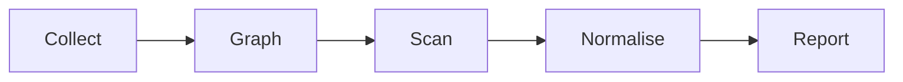

# Writing pages for the cloudg docs site

The site is built by `site/build.py` from three kinds of input:

- hand-written pages in `site/content/` (guides, CLI examples, API prose)
- generated reference data (click commands, docstrings, `config.yaml`, `CHANGELOG.md`)
- the long reference documents in `docs/*.md`, which are split at their `##` headings

Build it with:

```bash
.venv/bin/python site/build.py            # writes site/dist
.venv/bin/python site/build.py --serve    # builds, then serves on http://127.0.0.1:8000/cloudg/
```

## Style rules

- No em dashes anywhere, and no `--` or spaced en dash standing in for one. Use a comma, a colon, parentheses or two sentences.
- Straight quotes only. No emoji.
- Sentence-case headings.
- Run every page you write through the `/human` skill's scanner before committing it.
- Every code example must work as written against the current release. Check signatures in the source; run the Python ones when you can (the sample scanner output inlined in `tests/test_ingest.py` is handy for ingest examples).

## Front matter

Every file starts with YAML front matter.

```yaml
---
title: Inventory mapping
lede: "`cloudg map` asks a different question from `cloudg run`: what exists, and how is it wired together?"
meta:                       # optional strip under the lede (guides only)
  - [Command, "`cloudg map`"]
  - [Providers, "AWS, Azure, GCP"]
source: docs/DOCUMENTATION.md   # optional: what "Edit on GitHub" opens. Defaults to this file.
since: "0.5.1"                  # optional: shown as "Last changed in v0.5.1"
---
```

`lede` and `meta` values are inline markdown.

## Links

Write site links as root-relative paths without the base: `/guides/quickstart/`, `/cli/map/#options`, `/reference/config/ratelimit/#aws.retry_budget`. The build adds the base path. The full URL map is in `site/data/nav.yaml`.

## Markdown extensions

Standard CommonMark plus GFM tables. On top of that:

### Headings

`##` and `###` feed the "On this page" list. Anchors are generated from the text; force one with a trailing `{#my-anchor}`. Never skip a level.

### Code blocks

The info string takes a language and optional attributes:

````markdown
```python title="map_and_overlay.py" hl="4-6"
from cloudg import CloudGConfig, CloudGEngine
...
```
````

- `title` shows as the file name in the editor bar. Use a real file name for code people should save (`deploy.py`, `config.yaml`, `.github/workflows/cloudg.yml`).
- `hl` highlights lines: `hl="3"`, `hl="2,5-7"`.
- `bash` and `shell` blocks render as a terminal. Each command line gets a `$` prompt automatically; comment lines (`# ...`) are left out when the reader presses Copy. Put each command on its own line, or continue it with a trailing `\`.
- `console` is for a captured session with output. Write the prompt yourself (`$ cloudg deps ...`) and the output below it.
- Other languages (`python`, `yaml`, `json`, `toml`, `dockerfile`, `ini`, `text`) get line numbers.

### Code tabs

Consecutive fenced blocks that each carry a `tab` attribute become one tabbed block. Tabs with the same label are linked across the page, and the reader's choice is remembered.

````markdown
```bash tab="CLI"
cloudg map -p aws --regions all
```

```python tab="Python" title="map.py"
from cloudg import CloudGConfig, CloudGEngine
...
```

```bash tab="Docker"
docker run --rm -v ~/.aws:/home/cloudg/.aws:ro -v "$PWD/reports:/app/reports" cloudg map -p aws --regions all
```
````

Use the labels `CLI`, `Python`, `Docker` for ways to do one thing, and `pip`, `uv`, `Docker` for installs.

### Diagrams

A `mermaid` block renders as a diagram. Add a caption with `caption="..."`.

````markdown

````

Keep diagrams small enough to read at 680 px: up to about 12 nodes. Prefer `flowchart LR` or `TD`, `sequenceDiagram` for request flows and `stateDiagram-v2` for state machines. Don't set colours or `classDef` styles; the theme handles it. Quote labels that contain punctuation: `A["cloudg map --org"]`.

### Callouts

```markdown
:::note
The map doesn't depend on the scanners.
:::

:::warning Admin rights
AWSControlTowerExecution has admin rights.
:::
```

Kinds: `note`, `tip`, `warning`, `danger`. Text after the kind replaces the default label.

### Steps

Numbered steps, one `###` per step. Use four colons on the outer fence when a callout sits inside.

```markdown
::::steps
### Install
...
:::tip
...
:::
### Authenticate
...
::::
```

### Numbered cells

Two to four short items side by side, one `###` per cell.

```markdown
:::cells
### Deep collectors
ECS, EKS, Lambda triggers...
### Breadth sweep
On AWS, a Cloud Control sweep...
:::
```

### Link cards

A list of links rendered as a grid of cards. The text after the link is the description.

```markdown
:::links
- [Inventory mapping](/guides/inventory-mapping/) What exists and how it is wired.
- [cloudg deps](/cli/deps/) Blast radius for one asset.
:::
```

## Page kinds

### Guides: `site/content/guides/<slug>.md`

Front matter plus a body. The body starts with prose or an `##`, never with an `#` (the title comes from front matter).

### CLI commands: `site/content/cli/<slug>.md`

The generator writes the usage line and the options table from the click command. Your file adds:

```yaml
---
command: map            # or "mcp serve"
lede: Builds the scanner-independent inventory map.
intro: |                # optional markdown shown above the usage line
  ...
---
```

The body follows the options table. Typical sections: `## Examples`, `## Output files`, `## Exit codes`, `## Notes`. Pages without a `command` key (the shared flag pages) are plain pages.

### Python API: `site/content/api/<slug>.md`

```yaml
---
object: cloudg.api.CloudGEngine     # import path; omit for a plain page
members: [run_pipeline, run_pipeline_sync, collect, map_inventory]   # optional order/filter
lede: Runs the whole pipeline from Python, or any one phase of it.
---
```

The generator writes the kind tag, source link, signature and a ruled row per member (signature, docstring, parameter table). Your body follows the members. Typical sections: `## Examples`, `## Notes`.
