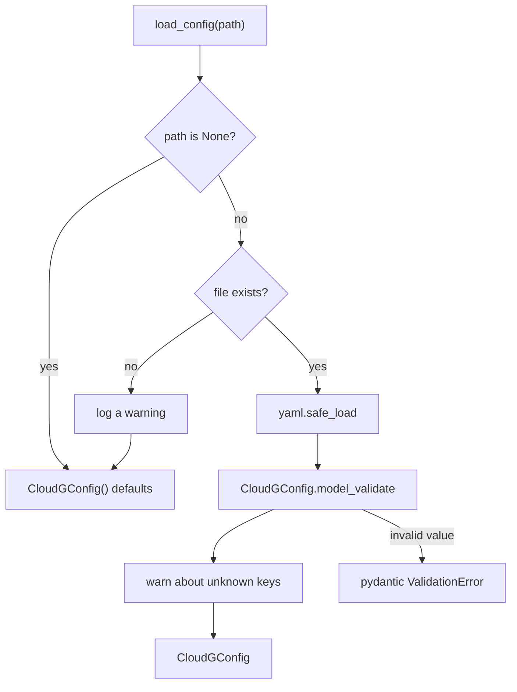

## Two ways to get a config

`CloudGConfig()` with no arguments is a working configuration: AWS only, `us-east-1`, all five scanners enabled, ontology and RAG export on, Terraform export off. Every field has a default, so you only set what differs.

In code, pass keyword arguments or assign to the nested models after construction:

```python
from cloudg import CloudGConfig

config = CloudGConfig(providers=["aws"])
config.aws.regions = ["eu-west-1", "eu-central-1"]
config.scanners.enabled = ["prowler", "iam"]
```

From a file, `load_config(path)` reads the YAML with `yaml.safe_load` and hands the dict to `CloudGConfig.model_validate()`. The file has the same shape as the model: top-level keys are the attributes below, nested keys are the fields of each section. The generated [config.yaml reference](/reference/config/providers/) documents every key with its default.



Two branches in that diagram return defaults instead of failing: a `None` path and a path that does not exist. A typo in the file name therefore gives you a run against `us-east-1` with every scanner enabled, and the only sign is a `WARNING cloudg.config: Config file ... not found, using defaults` line. If that matters, check `Path(path).is_file()` before calling, or use the strict loader in the examples. An empty file also gives defaults. The CLI calls the same function with the `-c` value and does not look for a `config.yaml` in the working directory on its own.

### The nested sections

Each section is its own pydantic model in `cloudg.config`. You can import them to build a section in one go, which also validates it at construction time.

| Attribute | Model | What it controls |
|---|---|---|
| `aws` | `AWSConfig` | regions, accounts, credentials (keys, profile, role, OIDC token file), botocore retries |
| `aws.organization` | `AWSOrganizationConfig` | AWS Organizations and Control Tower discovery for `cloudg map` |
| `azure` | `AzureConfig` | subscriptions, tenant, service principal or managed identity, locations, management groups |
| `gcp` | `GCPConfig` | projects or organization, credentials file, impersonation, Cloud Asset Inventory scope and skipped types |
| `scanners` | `ScannerConfig` | which scanners run, their extra arguments, Checkov frameworks, Trivy images, IaC directories |
| `inventory` | `InventoryConfig` | the deep inventory collectors: sweeps, service families, Kubernetes, IAM resource edges |
| `graph` | `GraphConfig` | graph engine options |
| `ontology` | `OntologyConfig` | ontology on or off, export formats |
| `rag` | `RAGConfig` | RAG export on or off, chunk size |
| `terraform` | `TerraformConfig` | Terraform recreation on or off, output directory |
| `report` | `ReportConfig` | report formats and directory used by the CLI |
| `rulesets` | `RulesetConfig` | the YAML rules directory used by the normaliser |
| `ratelimit` | `RateLimitConfig` | throttling: per-provider `ProviderRateLimitConfig`, per-service `ServiceRateLimitConfig`, live-run guard |

Three plain fields sit at the top level too: `log_file` and `verbose` (read by the CLI only) and `concurrency_limit` (1 to 50, default 5). It bounds the number of collection units running at once: one AWS account in one region, one Azure subscription, or one GCP project or organization. All providers share the limit, and it applies to `cloudg run`, `cloudg map`, `collect()` and `map_inventory()` alike. API call rates are set separately, under `ratelimit`.

The old single-provider form still works. `CloudGConfig(provider="azure")` sets `providers` to `["azure"]`, as long as `providers` was left at its default. `provider` itself is excluded from `model_dump()`.

### Unknown keys

Every section ignores keys it does not define, and says so. An unknown key at the top level or in any section, down to `ratelimit.<provider>.services.<name>`, produces a warning such as `Unknown config key aws.regoins is ignored`, and the field it was meant for keeps its default. The run goes on. If you would rather stop on a typo, use the [strict loader](#reject-unknown-keys) below.

### Environment variables

`CloudGConfig` reads nothing from the environment. Credentials are different: when a credential field is empty, the code that builds the cloud client falls back to the variables each SDK documents.

| Field left empty | Falls back to |
|---|---|
| `aws.web_identity_token_file` | `AWS_WEB_IDENTITY_TOKEN_FILE` |
| `aws.*` keys and `aws.profile` | the boto3 default chain (`AWS_ACCESS_KEY_ID`, `AWS_PROFILE`, instance and task roles, SSO cache) |
| `azure.tenant_id`, `azure.client_id` | `AZURE_TENANT_ID`, `AZURE_CLIENT_ID` |
| `azure.client_secret`, `azure.federated_token_file` | `AZURE_CLIENT_SECRET`, `AZURE_FEDERATED_TOKEN_FILE` |
| every Azure credential | `DefaultAzureCredential` |
| `gcp.credentials_file` | application default credentials, which read `GOOGLE_APPLICATION_CREDENTIALS` |

Two variables change cloudg behaviour outside the config: `CLOUDG_CATALOG_DIR` overlays the inventory reference catalogs, and `CLOUDG_CACHE_DIR` moves the Cloud Control schema cache (default `~/.cache/cloudg`). [Authentication](/guides/authentication/) covers the full credential order for each provider.

## Examples

### Build a multi-cloud config in code

Secrets come from the environment; nothing secret is written into the script.

```python title="multicloud_config.py"
import os

from cloudg import CloudGConfig, CloudGEngine
from cloudg.config import AWSConfig, AzureConfig, GCPConfig, ScannerConfig

config = CloudGConfig(
    providers=["aws", "azure", "gcp"],
    aws=AWSConfig(
        regions=["eu-west-1", "eu-central-1"],
        role_arn="arn:aws:iam::123456789012:role/cloudg-readonly",
        external_id=os.environ.get("CLOUDG_EXTERNAL_ID"),
    ),
    azure=AzureConfig(
        subscription_ids=["00000000-0000-0000-0000-000000000000"],
        tenant_id=os.environ.get("AZURE_TENANT_ID"),
        client_id=os.environ.get("AZURE_CLIENT_ID"),
        client_secret=os.environ.get("AZURE_CLIENT_SECRET"),
        regions=["westeurope", "northeurope"],
    ),
    gcp=GCPConfig(project_ids=["orders-prod", "orders-staging"]),
    scanners=ScannerConfig(enabled=["prowler", "checkov"], iac_directories=["./terraform"]),
)
config.ontology.export_formats = ["turtle"]
config.rag.enabled = False

# Only what differs from the defaults, without the client secret
print(config.model_dump(mode="json", exclude_defaults=True, exclude={"azure": {"client_secret"}}))
engine = CloudGEngine(config)
```

### Load config.yaml and override in code

```yaml title="config.yaml"
providers: [aws, gcp]
aws:
  regions: [eu-west-1, eu-central-1]
  profile: security-audit
gcp:
  organization_id: "123456789012"
scanners:
  enabled: [prowler, checkov]
  iac_directories: [./terraform]
```

```python title="load_and_override.py"
import sys

from cloudg import CloudGEngine, load_config

config = load_config("config.yaml")
if len(sys.argv) > 1:
    config.aws.regions = sys.argv[1].split(",")  # e.g. python load_and_override.py us-east-1

print(config.providers, config.aws.regions, config.gcp.organization_id)
engine = CloudGEngine(config)
```

Quote numeric IDs such as `organization_id` in YAML. Unquoted, `123456789012` is an integer and pydantic rejects it for a string field.

### Reject unknown keys

This loader fails on a missing file and on any key the models do not define, before cloudg sees the config.

```python title="strict_config.py"
import sys
from pathlib import Path

import yaml
from pydantic import BaseModel

from cloudg import CloudGConfig


def unknown_keys(data: object, model: type[BaseModel], path: str = "") -> list[str]:
    """Dotted paths of the keys in `data` that `model` does not define."""
    if not isinstance(data, dict):
        return []
    found = []
    for key, value in data.items():
        field = model.model_fields.get(key)
        if field is None:
            found.append(path + key)
        elif isinstance(field.annotation, type) and issubclass(field.annotation, BaseModel):
            found += unknown_keys(value, field.annotation, f"{path}{key}.")
    return found


def load_strict(path: str) -> CloudGConfig:
    file = Path(path)
    if not file.is_file():
        raise FileNotFoundError(path)  # load_config() would quietly use defaults
    data = yaml.safe_load(file.read_text()) or {}
    bad = unknown_keys(data, CloudGConfig)
    if bad:
        raise ValueError("unknown config keys: " + ", ".join(bad))
    return CloudGConfig.model_validate(data)


if __name__ == "__main__":
    try:
        config = load_strict(sys.argv[1] if len(sys.argv) > 1 else "config.yaml")
    except (FileNotFoundError, ValueError) as exc:
        sys.exit(f"config error: {exc}")
    print("providers:", config.providers, "aws regions:", config.aws.regions)
```

```console
$ python strict_config.py config.yaml
config error: unknown config keys: aws.regoins, ratelimit.aws.max_rsp
```

## Notes

Validation runs when the model is built, not when you assign to it. `config.aws.regions = "eu-west-1"` is accepted and leaves a string where a list belongs, and the collectors then misbehave. Assign the right types, or build the section with its model (`AWSConfig(regions=[...])`) so pydantic checks it.

The patterns are enforced at construction: `aws.retry_mode` must be `legacy`, `standard` or `adaptive`; `gcp.collection_scope` must be `auto`, `organization` or `project`; `rag.chunk_strategy` must be one of `entity`, `community`, `relation_group`, `hybrid`. Bounded integers (`aws.max_retries` 1 to 30, `concurrency_limit` 1 to 50, `scanners.timeout_seconds` at least 60) raise a `ValidationError` when out of range.

`rulesets.rules_dir: null`, an empty string and a missing key all mean the rules shipped inside the package.

`model_dump()` includes credential fields such as `aws.secret_access_key` and `azure.client_secret` in plain text when they are set. Exclude them before logging a config: `config.model_dump(exclude={"aws": {"secret_access_key", "session_token"}, "azure": {"client_secret"}})`.

`graph.persist_graphml`, `graph.export_cytoscape` and `graph.compute_attack_paths` are read by `cloudg run` only. `CloudGEngine.analyze()` computes attack paths whatever `graph.compute_attack_paths` says, and writes no GraphML or Cytoscape file. `report.output_dir` is the default output directory of the `CloudGEngine` methods and of the MCP workspace; the CLI commands use `-o` instead. `ontology.include_raw_metadata` is read by `cloudg run` and `CloudGEngine.analyze()`, not by the MCP ontology build.

`InventoryMapper` deep-copies the config before a run, so organization discovery (which rewrites `aws.accounts`, `aws.role_name` and possibly `aws.regions`) never changes the object you passed in.

## Related

:::links
- [config.yaml reference](/reference/config/providers/) Every key, its type and default.
- [Rate limit settings](/reference/config/ratelimit/) The `ratelimit` section in full.
- [Authentication](/guides/authentication/) Credential order for AWS, Azure and GCP.
- [CloudGEngine](/api/cloudgengine/) What runs on the config.
- [Rate limits and throttling](/guides/rate-limits/) When to change the `ratelimit` defaults.
:::
