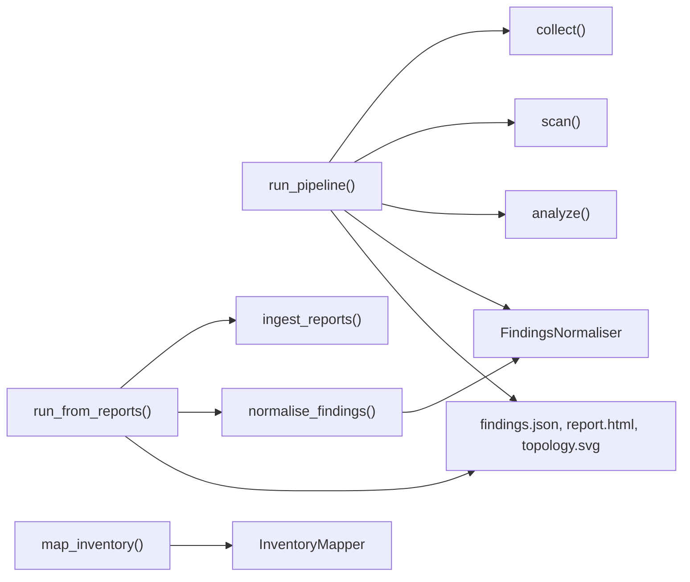

## Which method to call

`CloudGEngine` takes one argument, a [`CloudGConfig`](/api/cloudgconfig/), and keeps it on `engine.config`. Everything else is a method call. The methods fall into three groups, and they share very little state: the engine holds the config and the six [event hooks](/api/event-hooks/), nothing more. You can call `collect()` twice, or call `analyze()` on assets you built by hand, and nothing on the engine gets in the way.



| You have | Call | Cloud access | Scanner binaries |
|---|---|---|---|
| Credentials, and want everything `cloudg run` produces | `run_pipeline()` | yes | the ones in `scanners.enabled` |
| Prowler, ScoutSuite, Checkov or Trivy output from somewhere else | `run_from_reports()` | no | no |
| Credentials, and only want to know what exists and how it connects | `map_inventory()` | yes | no |
| Your own assets, or a need to stop between phases | `collect()`, `scan()`, `analyze()`, `normalise_findings()` | for `collect()` and the cloud scanners | for `scan()` |

The `*_sync` variants wrap the async method in `asyncio.run()`. Use them from plain scripts. Inside a running event loop (a Jupyter notebook, say) they raise `RuntimeError` with a message naming the async method to `await` instead.

`output_dir` is optional on `scan()`, `analyze()`, `run_from_reports()`, `run_pipeline()` and their sync wrappers. Left out (or `None`), it is `report.output_dir` from the config, `./reports` by default.

### What run_pipeline does, phase by phase

`run_pipeline(output_dir=None)` creates the output directory, then:

1. `collect()` runs the collectors for every provider in `config.providers`, across `aws.regions`, `aws.accounts`, the Azure subscriptions and the GCP projects you configured.
2. `scan()` builds a graph of the collected assets and runs the reachability analysis on it, then starts every scanner in `scanners.enabled` in a thread pool with one worker per job: Prowler and ScoutSuite once per provider, with `aws.profile` and the rest of the configured AWS credentials and regions; Checkov once per IaC directory; Trivy once over `scanners.trivy_images`, or over the IaC directories when there are no images; scanner plugins by name. The IAM policy linter runs when `iam` is in the list and there are assets. Unknown names are logged and skipped.
3. `analyze()` rebuilds the graph and records node and edge counts, reachability findings and lateral movement paths. It then writes the ontology (`ontology.enabled`), the RAG chunks (`rag.enabled`) and the Terraform recreation (`terraform.enabled`).
4. The scanner findings and the reachability findings go through [`FindingsNormaliser`](/api/findingsnormaliser/): deduplication, cross-scanner merging, CVSS rescoring and compliance mapping. The reachability analysis ran in both step 2 and step 3. Both runs produce the same check on the same resource, so the deduplication pass folds the copies into one.
5. The reports in `report.formats` are written: `findings.json` and `report.html` with the D3 graph embedded, and `topology.svg`.

Everything ends up in one [`PipelineResult`](/api/results/).

### IaC targets for Checkov

`scan()` picks the directories Checkov scans in this order: the `iac_dir` argument, then `scanners.iac_directories`, then a Terraform recreation of the live assets (generated on the spot when `terraform.enabled` is true). When none of these exists Checkov is skipped with a warning. cloudg no longer falls back to the current directory, because scanning whatever happens to be in your working directory says nothing about the cloud. The same logic is public as `cloudg.api.resolve_iac_dirs(iac_dir, config_dirs, terraform_dir=None)`, which returns the directories together with their source: `"cli"`, `"config"`, `"terraform"`, or `None` when nothing qualifies.

## Examples

### Full pipeline

This needs read access to the account (any method from [Authentication](/guides/authentication/) works) and the scanner binaries you enable. Missing binaries are skipped.

```python title="nightly_pipeline.py"
import asyncio
import json

from cloudg import CloudGConfig, CloudGEngine


async def main() -> None:
    config = CloudGConfig(providers=["aws"])
    config.aws.profile = "security-audit"
    config.aws.regions = ["eu-west-1", "eu-central-1"]
    config.scanners.enabled = ["prowler", "trivy"]
    config.scanners.trivy_images = [
        "123456789012.dkr.ecr.eu-west-1.amazonaws.com/orders-worker:latest"
    ]

    engine = CloudGEngine(config)
    result = await engine.run_pipeline(output_dir="./reports")

    print(json.dumps(result.to_summary(), indent=2))
    print(result.report_paths)  # {'json': ..., 'html': ..., 'svg': ...}

    # Collection failures don't raise; they are recorded per service
    for cov in result.coverage:
        if cov.failed_services:
            print("incomplete:", cov.to_summary())


asyncio.run(main())
```

### Ingest only

No credentials and no scanners: point the engine at reports produced elsewhere. Keys are tool names (`prowler`, `scoutsuite`, `checkov`, `trivy`); values are lists of files or directories.

```python title="ingest_only.py"
from cloudg import CloudGConfig, CloudGEngine

engine = CloudGEngine(CloudGConfig())
engine.on_phase_start = lambda phase: print("phase:", phase)

result = engine.run_from_reports_sync(
    {
        "prowler": ["./prowler-output/"],
        "checkov": ["./results_json.json"],
        "trivy": ["./trivy.json"],
    },
    output_dir="./reports",
)

print(result.total_findings, result.severity_breakdown)
print(result.report_paths)
for f in result.findings:
    print(f.severity.value, f.risk_score, f.source_tool, f.title)
```

With one failing Prowler check, one Checkov failure and one Trivy CVE, it prints:

```console
$ python ingest_only.py
phase: ingest
phase: normalisation
phase: reporting
3 {'CRITICAL': 1, 'HIGH': 2}
{'json': PosixPath('reports/findings.json'), 'html': PosixPath('reports/report.html')}
CRITICAL 9.5 trivy [Trivy] CVE-2024-0001: openssl (alpine)
HIGH 7.5 prowler S3 bucket default encryption
HIGH 7.5 checkov [Checkov/terraform] Ensure S3 bucket has server-side encryption enabled
```

The result has no assets, so `graph_nodes`, `ontology_triples` and `attack_paths` stay empty. To get them as well, collect live assets and pass the ingested findings to `analyze()` (next examples).

### Map only

`map_inventory()` runs the deep inventory collectors and the [relationship linker](/api/relationshiplinker/). No scanner is involved. Passing `output_dir` writes the map files; passing `findings` as well writes `asset-map.json` and `compliance-map.json`.

```python title="map_only.py"
from cloudg import CloudGConfig, CloudGEngine

config = CloudGConfig(providers=["aws"])
config.aws.regions = ["ALL"]
config.inventory.exclude_services = ["kubernetes"]

engine = CloudGEngine(config)
inventory = engine.map_inventory_sync(output_dir="./inventory", tagging_sweep=False)

summary = inventory.summary
print(summary["total_assets"], "assets,", summary["total_edges"], "edges")
print("internet exposed:", summary["internet_exposed"])
print("top services:", list(summary["assets_by_service"].items())[:5])
```

The return value is an [`InventoryResult`](/api/inventoryresult/). Unlike `collect()`, this method re-raises when the mapping fails, after calling `on_error("inventory_mapping", exc)`.

### Phases by hand

Driving the phases yourself lets you swap one out. This script runs offline: two hand-built assets stand in for `collect()`, an existing Trivy report stands in for `scan()`, and the graph, ontology and RAG outputs are produced from them.

```python title="phases_offline.py"
import asyncio

from cloudg import CloudGConfig, CloudGEngine
from cloudg.schema.models import AssetType, CloudAsset, CloudProvider, EdgeType, NetworkEdge

# Two assets and two edges, as a collector or a CMDB export would supply them
sg = CloudAsset(
    arn="arn:aws:ec2:eu-west-1:123456789012:security-group/sg-0a1b2c3d4e5f60718",
    name="bastion-sg",
    asset_type=AssetType.SECURITY_GROUP,
    provider=CloudProvider.AWS,
    region="eu-west-1",
    account_id="123456789012",
)
vm = CloudAsset(
    arn="arn:aws:ec2:eu-west-1:123456789012:instance/i-0b1c2d3e4f5061728",
    name="bastion",
    asset_type=AssetType.EC2,
    provider=CloudProvider.AWS,
    region="eu-west-1",
    account_id="123456789012",
)
edges = [
    NetworkEdge(
        source_id="0.0.0.0/0",
        target_id=sg.id,
        edge_type=EdgeType.SECURITY_GROUP_RULE,
        cidr="0.0.0.0/0",
        port_range="22",
        protocol="TCP",
    ),
    NetworkEdge(source_id=sg.id, target_id=vm.id, edge_type=EdgeType.ATTACHED_TO),
]


async def main() -> None:
    engine = CloudGEngine(CloudGConfig(providers=["aws"]))
    engine.on_phase_start = lambda phase: print("phase:", phase)

    findings = engine.ingest_reports({"trivy": ["./trivy.json"]})
    analysis = await engine.analyze([sg, vm], edges, findings, output_dir="./reports")
    scan_result = engine.normalise_findings(
        findings + analysis.reachability_findings, assets=[sg, vm]
    )

    print(analysis.graph_nodes, "nodes,", analysis.graph_edges, "edges")
    for f in analysis.reachability_findings:
        print(f.severity.value, f.title)
    print("ontology:", analysis.ontology_triples, "triples, last file", analysis.ontology_path)
    print("RAG chunks:", analysis.rag_chunks_path)
    print(scan_result.summary["severity_breakdown"])


asyncio.run(main())
```

```console
$ python phases_offline.py
phase: ingest
phase: analysis
3 nodes, 2 edges
CRITICAL Security group allows SSH (port 22) from 0.0.0.0/0
ontology: 670 triples, last file reports/ontology.jsonld
RAG chunks: reports/rag_chunks.jsonl
{'CRITICAL': 2}
```

The graph has three nodes for two assets: `0.0.0.0/0` becomes a node of its own. With credentials, replace the hand-built lists with `collection = await engine.collect()` and pass `collection.assets` and `collection.edges`, and replace the ingest with `await engine.scan(...)` if you want the scanners to run.

### Hooks

Hooks are plain attributes. Set them before calling a method; each one is optional.

```python title="hooks.py"
from cloudg import CloudGConfig, CloudGEngine

engine = CloudGEngine(CloudGConfig())
engine.on_phase_start = lambda phase: print(f"-> {phase}")
engine.on_finding = lambda f: print(f"   {f.severity.value:8} {f.title}")
engine.on_error = lambda phase, exc: print(f"!! {phase}: {exc}")

engine.run_from_reports_sync({"trivy": ["./trivy.json"]}, output_dir="./reports")
```

[Event hooks](/api/event-hooks/) lists every hook, when it fires and what it receives, with longer examples.

## Notes

`PipelineResult.errors` is the run's full error list, one `"<phase>: <message>"` string per failure. It holds everything reported through `on_error` during the run (scanners, scanner credentials, graph, ontology, RAG, Terraform, normalisation, reporting) plus one `collection: ...` line per provider, account or region that could not be collected. An empty list means the run was complete. `result.coverage` still has the per-service detail.

`collect()` never raises for a collection problem. When the collector itself throws, the engine calls `on_error("collection", exc)` and returns an empty `CollectionResult`, and `run_pipeline()` carries on with no assets.

`on_finding` fires once per finding as each scanner finishes in `scan()` (and when `ingest_reports()` returns); `on_scan_complete` fires once at the end. Both run before normalisation, so the findings have not been deduplicated or rescored yet. They receive deep copies, which normalisation does not change later. For the final list, read `result.findings` after the run.

`map_inventory(findings=...)` stores the overlay on the returned result as `result.asset_map` and `result.compliance_map`, with or without `output_dir`. With `output_dir` set, it also writes `asset-map.json` and `compliance-map.json` there. To overlay findings on a map you already hold, call [`InventoryMapper.export_merged()`](/api/inventorymapper/) yourself.

The Terraform recreation goes to `<output_dir>/terraform`, following the `output_dir` you pass to `run_pipeline()`, `analyze()` or `scan()`. A `terraform.output_dir` set in the config replaces it, except the old default `./reports/terraform`, which counts as unset.

`scanners.timeout_seconds` (default 3600) is the subprocess timeout of each scanner job: each Prowler or ScoutSuite run, each Checkov directory, each Trivy image or directory. A job that runs over is killed and reported through `on_error` under its job name, and the findings it produced before that are kept. A scanner that fails to launch is reported the same way.

## Related

:::links
- [Event hooks](/api/event-hooks/) The six callbacks and when each one fires.
- [Result objects](/api/results/) PipelineResult, CollectionResult and AnalysisResult.
- [CloudGConfig](/api/cloudgconfig/) Building the config the engine runs on.
- [The pipeline](/guides/pipeline/) The same phases from the CLI side.
- [Python recipes](/guides/python-recipes/) Longer integration examples.
- [cloudg run](/cli/run/) The command that wraps `run_pipeline()`.
:::
