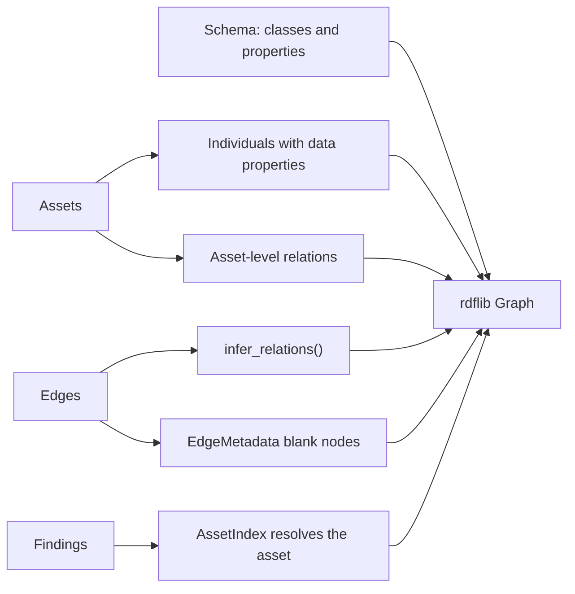

The ontology is the semantic view of an inventory. Where [GraphBuilder](/api/graphbuilder/) keeps the collector's edge types (`SECURITY_GROUP_RULE`, `ATTACHED_TO`), `CloudOntology` reads each edge together with its endpoint types, ports and CIDR and turns it into relations that say what the edge means: `INTERNET_REACHABLE`, `ONLY_SSH`, `PROTECTED_BY_SG`, `VPC_CONTAINS_SUBNET`. `cloudg run` builds it after the scanners finish, so findings are part of the graph, and writes `ontology.ttl` and `ontology.jsonld` by default.

## What build() writes



Three namespaces are bound on the graph, so they appear as prefixes in every serialisation and in your SPARQL:

| Prefix | IRI | Holds |
|---|---|---|
| `cm:` | `https://cloudg.io/ontology#` | classes such as `cm:RelationalDatabase` and `cm:SecurityFinding` |
| `cmr:` | `https://cloudg.io/resource/` | individuals, keyed by asset id (`cmr:orders-db`), plus `cmr:finding_<id>`, `cmr:compliance_<framework>` and tag nodes |
| `cmp:` | `https://cloudg.io/property/` | the 64 relations and the data properties (`cmp:hasName`, `cmp:hasARN`) |

In order, `build()` adds:

1. The schema. An OWL class for every asset type (EC2, VIRTUAL_MACHINE and GCE_INSTANCE all map to `cm:ComputeInstance`; types without a hand-picked name get the CamelCase of the enum name), each a subclass of `cm:CloudResource`. Every `RelationType` becomes an `owl:ObjectProperty` with an `rdfs:label` and a `cm:relationGroup` literal. This part alone is 636 triples, so an empty inventory still produces a sizeable file.
2. One individual per asset: `rdf:type`, `cmp:hasName`, `cmp:hasProvider`, `cmp:hasRegion`, `cmp:isInternetExposed` (an `xsd:boolean`), and `cmp:hasARN` and `cmp:hasAccountId` when set. Each tag adds a `cmp:TAGGED_WITH` link to a `cm:TagValue` node named `tag_<key>_<value>`. With `CloudOntology(include_raw_metadata=True)` (the `ontology.include_raw_metadata` key, read by `cloudg run` and `CloudGEngine.analyze()`), each asset's `metadata` dict is added too, as one JSON string literal under `cmp:hasRawMetadata`.
3. For each edge, the relations from `infer_relations()`, as `source relation target`. Endpoints that are not assets (`0.0.0.0/0`) become `cm:CloudResource` individuals named after the id. An edge with a CIDR, port or protocol also gets a blank node of type `cm:EdgeMetadata` with `cm:fromNode`, `cm:toNode`, `cmp:hasCIDR`, `cmp:hasPort` and `cmp:hasProtocol`.
4. Asset-level relations from metadata: `OWNED_BY`, `COST_ALLOCATED_TO` and `MONITORED_BY` from tags such as `owner`, `team`, `costcenter` and `monitoring`; `VPC_CONTAINS_SUBNET` and `CONTAINS` from a VPC to the assets that share its `vpc_id`; `ENCRYPTED_BY_KMS` from an encrypted asset to its key; `ROTATES_SECRET`; and `PROTECTED_BY_SG` from an EC2 instance's `security_groups` metadata.
5. Each finding as a `cm:SecurityFinding` with `cmp:hasName` (the title), `cmp:hasSeverity` and `cmp:hasRiskScore`, linked by `cmp:FINDING_AFFECTS` to the asset it resolves to. Each compliance framework on the finding becomes `cmr:compliance_<name>` with a `cmp:COMPLIANCE_GOVERNS` link to the same asset.

Findings are matched to assets through `AssetIndex`: by asset id, then ARN (from `resource_id` or `resource_arn`), then a unique name, then a unique ARN tail. Scanner findings that name a resource by ARN therefore attach to the real asset instead of a dangling `cmr:arn:aws:...` node. Only when nothing matches does the raw `resource_id` become the object.

### Edge types and the relations they produce

| Edge | Relations |
|---|---|
| `SECURITY_GROUP_RULE`, `NACL_RULE` | `INGRESS_ALLOWED` or `EGRESS_ALLOWED`; `INTERNET_REACHABLE` when the source is `0.0.0.0/0`, `::/0` or an Azure `Internet`, `Any` or `*` tag; `CIDR_RESTRICTED` for any other CIDR; then `ALL_TRAFFIC` for an all-ports rule, else `ONLY_SSH`, `ONLY_HTTP`, `ONLY_HTTPS`, `ONLY_RDP` for each of 22, 80, 443, 3389 inside the ranges, else `PORT_RESTRICTED` |
| `ATTACHED_TO` | `PROTECTED_BY_SG` when the target is a security group or NSG, `PROTECTED_BY_NACL` for a NACL, `DEPENDS_ON` otherwise |
| `CONTAINS` | `VPC_CONTAINS_SUBNET`, `SUBNET_CONTAINS_INSTANCE`, `CLUSTER_CONTAINS_SERVICE` or `ORG_CONTAINS_ACCOUNT` when both endpoint types fit, plain `CONTAINS` otherwise |
| `IAM_TRUST` | `ROLE_ASSUMES_ROLE`, plus `CROSS_ACCOUNT_TRUST` when the two accounts differ |
| `IAM_POLICY_ATTACHMENT` | `USER_HAS_POLICY`, `ROLE_HAS_POLICY` or `GROUP_HAS_POLICY` by target type |
| `LOAD_BALANCER_TARGET` | `LB_TARGETS_INSTANCE` and `LOAD_BALANCED_BY` |
| `PEERING`, `ROUTE`, `INTERNET_EXPOSED` | `VPC_PEERED`, `TRANSIT_ROUTED`, `INTERNET_REACHABLE` |
| `INVOKES`, `LOGS_TO` | the relation of the same name |
| `USES_IMAGE`, `ASSUMES_ROLE` | `RUNS_ON` |
| `GRANTS_ACCESS`, `PROTECTS`, `MONITORS`, `MANAGES`, `GOVERNS`, `REFERENCES` | `POLICY_ALLOWS_ACTION`, `PROTECTED_BY_WAF`, `MONITORED_BY`, `OWNED_BY`, `COMPLIANCE_GOVERNS`, `DEPENDS_ON` |

A `relationship` declared on the edge (any `RelationType` name, as the linker writes them) changes this. On `CONTAINS`, `ATTACHED_TO` and the typed inventory edges it replaces the inferred relation. On the network and IAM edges it comes first and the inferred ones follow.

### The 64 relation types

| Group | Relations |
|---|---|
| `NETWORK` (16) | `INGRESS_ALLOWED`, `INGRESS_DENIED`, `EGRESS_ALLOWED`, `EGRESS_DENIED`, `ONLY_HTTP`, `ONLY_HTTPS`, `ONLY_SSH`, `ONLY_RDP`, `ALL_TRAFFIC`, `PORT_RESTRICTED`, `CIDR_RESTRICTED`, `INTERNET_REACHABLE`, `VPC_PEERED`, `TRANSIT_ROUTED`, `NAT_TRANSLATED`, `DNS_RESOLVED` |
| `CONTAINMENT` (8) | `CONTAINS`, `VPC_CONTAINS_SUBNET`, `SUBNET_CONTAINS_INSTANCE`, `REGION_CONTAINS_VPC`, `ACCOUNT_CONTAINS_REGION`, `ORG_CONTAINS_ACCOUNT`, `CLUSTER_CONTAINS_SERVICE`, `LB_TARGETS_INSTANCE` |
| `IAM` (10) | `ROLE_ASSUMES_ROLE`, `USER_HAS_POLICY`, `ROLE_HAS_POLICY`, `GROUP_HAS_POLICY`, `POLICY_ALLOWS_ACTION`, `POLICY_DENIES_ACTION`, `CROSS_ACCOUNT_TRUST`, `SERVICE_LINKED_ROLE`, `PERMISSION_BOUNDARY_LIMITS`, `SCP_RESTRICTS` |
| `DATA_FLOW` (9) | `READS_FROM`, `WRITES_TO`, `ENCRYPTS_WITH`, `DECRYPTS_WITH`, `LOGS_TO`, `STREAMS_TO`, `REPLICATES_TO`, `BACKUP_TO`, `CACHE_FOR` |
| `SECURITY` (9) | `PROTECTED_BY_SG`, `PROTECTED_BY_NACL`, `PROTECTED_BY_WAF`, `ENCRYPTED_BY_KMS`, `ROTATES_SECRET`, `CERTIFICATE_SECURES`, `FINDING_AFFECTS`, `VULNERABILITY_EXPLOITS`, `COMPLIANCE_GOVERNS` |
| `COMPUTE` (8) | `RUNS_ON`, `TRIGGERED_BY`, `INVOKES`, `SCALES_WITH`, `LOAD_BALANCED_BY`, `SCHEDULED_BY`, `DEPENDS_ON`, `SERVES_TRAFFIC_TO` |
| `GOVERNANCE` (4) | `TAGGED_WITH`, `COST_ALLOCATED_TO`, `OWNED_BY`, `MONITORED_BY` |

Several of these, `TRIGGERED_BY` and `READS_FROM` among them, are never inferred from edges and appear only when a collector declares them as an edge's `relationship`. `RelationType`, `RelationGroup`, `get_relation_group()` and `get_relations_for_group()` are importable from `cloudg.graph.ontology`.

### Serialisation formats

| `fmt` passed to `save()` | rdflib format | File `cloudg run` and `CloudGEngine.analyze()` write |
|---|---|---|
| `turtle`, `ttl` | Turtle | `ontology.ttl` |
| `json-ld`, `jsonld` | JSON-LD | `ontology.jsonld` |
| `xml`, `rdfxml`, `rdf` | RDF/XML | `ontology.rdf` |
| `nt`, `ntriples`, `n-triples` | N-Triples | `ontology.nt` |

Names are matched without regard to case. `save()` writes Turtle, with a warning, for any other value instead of raising, and creates missing parent directories. `cloudg run` and `analyze()` write one file per entry in `ontology.export_formats` (default `["turtle", "json-ld"]`), and `--no-ontology` or `ontology.enabled: false` skips the phase. The table is `ONTOLOGY_FORMATS` in `cloudg.graph.ontology`; `ontology_format(name)` gives the rdflib format and extension of a name, and `ontology_extension(name)` the extension alone.

## Examples

### Build, query and save

Four assets, two edges and one scanner finding that names the database by ARN. The query lists every relation in the graph with readable names on both ends, skipping the data properties.

```python title="ontology_demo.py"
"""Build the RDF ontology for a small estate, save it and query it with SPARQL."""

from pathlib import Path

from rdflib import Graph

from cloudg.graph.ontology import CloudOntology, RelationGroup
from cloudg.schema.models import (
    AssetType,
    CloudAsset,
    CloudProvider,
    EdgeType,
    Finding,
    NetworkEdge,
    Severity,
)

ACCOUNT = "123456789012"
REGION = "eu-west-1"
KEY_ARN = f"arn:aws:kms:{REGION}:{ACCOUNT}:key/1111aaaa-22bb-33cc-44dd-555555eeeeee"


def asset(asset_id: str, asset_type: AssetType, arn: str, **extra) -> CloudAsset:
    return CloudAsset(
        id=asset_id,
        name=asset_id,
        asset_type=asset_type,
        provider=CloudProvider.AWS,
        region=REGION,
        account_id=ACCOUNT,
        arn=arn,
        **extra,
    )


assets = [
    asset("sg-web", AssetType.SECURITY_GROUP, f"arn:aws:ec2:{REGION}:{ACCOUNT}:security-group/sg-web"),
    asset("web-1", AssetType.EC2, f"arn:aws:ec2:{REGION}:{ACCOUNT}:instance/i-0web1",
          tags={"owner": "payments"}),
    asset("orders-key", AssetType.KMS_KEY, KEY_ARN),
    asset("orders-db", AssetType.RDS_INSTANCE, f"arn:aws:rds:{REGION}:{ACCOUNT}:db:orders-db",
          metadata={"storage_encrypted": True, "kms_key_id": KEY_ARN}),
]

edges = [
    NetworkEdge(source_id="0.0.0.0/0", target_id="sg-web", edge_type=EdgeType.SECURITY_GROUP_RULE,
                port_range="22", protocol="TCP", cidr="0.0.0.0/0", direction="ingress"),
    NetworkEdge(source_id="web-1", target_id="sg-web", edge_type=EdgeType.ATTACHED_TO),
]

# A scanner finding that names the database by ARN, not by asset id
findings = [
    Finding(
        resource_id=f"arn:aws:rds:{REGION}:{ACCOUNT}:db:orders-db",
        severity=Severity.HIGH,
        title="RDS instance has no deletion protection",
        description="Deletion protection is disabled.",
        source_tool="prowler",
        compliance_frameworks=["CIS"],
    )
]

onto = CloudOntology()
onto.build(assets, edges, findings)
stats = onto.stats()
print(stats["total_triples"], "triples,", stats["classes_used"], "classes,",
      stats["individuals"], "individuals")
print("groups:", dict(sorted(stats["relation_group_counts"].items())))

# The graph binds the cm:, cmr: and cmp: prefixes, so queries can use them
rows = onto.query("""
    SELECT ?subject ?relation ?object WHERE {
        ?s ?p ?o .
        FILTER(STRSTARTS(STR(?p), STR(cmp:)))
        FILTER(!STRSTARTS(STR(?p), STR(cmp:has)))
        FILTER(?p != cmp:isInternetExposed)
        ?s cmp:hasName ?subject .
        OPTIONAL { ?o cmp:hasName ?oname }
        BIND(STRAFTER(STR(?p), STR(cmp:)) AS ?relation)
        BIND(COALESCE(?oname, STR(?o)) AS ?object)
    } ORDER BY ?subject ?relation
""")
for row in rows:
    print(f"  {row['subject']} {row['relation']} {row['object']}")

print("internet reachable:", [r["name"] for r in onto.query_internet_exposed()])
print("security group:", len(onto.query_by_relation_group(RelationGroup.SECURITY)), "triples")
print("compliance gaps:", [(r["severity"], r["resourceName"]) for r in onto.query_compliance_gaps()])

out = Path("ontology-out")
for fmt, name in [("turtle", "ontology.ttl"), ("json-ld", "ontology.jsonld"),
                  ("xml", "ontology.rdf"), ("nt", "ontology.nt")]:
    onto.save(out / name, fmt=fmt)

# Any RDF tool can read the files back; here rdflib itself
reloaded = Graph().parse(out / "ontology.ttl", format="turtle")
print("reloaded", len(reloaded), "triples from", sorted(p.name for p in out.iterdir()))
```

```console
$ python ontology_demo.py
689 triples, 9 classes, 9 individuals
groups: {'GOVERNANCE': 2, 'NETWORK': 3, 'SECURITY': 4}
  0.0.0.0/0 INGRESS_ALLOWED sg-web
  0.0.0.0/0 INTERNET_REACHABLE sg-web
  0.0.0.0/0 ONLY_SSH sg-web
  RDS instance has no deletion protection FINDING_AFFECTS orders-db
  orders-db ENCRYPTED_BY_KMS orders-key
  web-1 OWNED_BY https://cloudg.io/resource/tag_payments
  web-1 PROTECTED_BY_SG sg-web
  web-1 TAGGED_WITH https://cloudg.io/resource/tag_owner_payments
internet reachable: ['sg-web']
security group: 4 triples
compliance gaps: [('HIGH', 'orders-db')]
reloaded 689 triples from ['ontology.jsonld', 'ontology.nt', 'ontology.rdf', 'ontology.ttl']
```

Things to notice:

- 636 of the 689 triples are schema. The `stats()` counts cover classes and individuals actually used.
- `ENCRYPTED_BY_KMS` points at `orders-key` because the database's `kms_key_id` matched the key asset's ARN. With no collected key, the object would be the raw key reference.
- The finding attached to `orders-db` although its `resource_id` was an ARN.
- `query_internet_exposed()` lists the objects of `INTERNET_REACHABLE` triples, which here is the security group. It reads the rule edges, not the reachability walk; for "which workloads can the internet reach" use [ReachabilityAnalyzer](/api/reachabilityanalyzer/).
- The `OWNED_BY` object is a tag node (`tag_payments`) with no `cmp:hasName`, so the query printed its IRI.

Saving N-Triples prints a harmless `UserWarning: NTSerializer always uses UTF-8 encoding` from rdflib.

### Query a saved file without cloudg

The exported files are plain RDF. This needs only rdflib and the `ontology.ttl` from the previous example (or from `cloudg run`).

```python title="query_saved.py"
from rdflib import Graph, Namespace

CMP = Namespace("https://cloudg.io/property/")

g = Graph().parse("ontology-out/ontology.ttl")
rows = g.query(
    """
    SELECT ?resource ?finding ?severity WHERE {
        ?f cmp:FINDING_AFFECTS ?r ;
           cmp:hasName ?finding ;
           cmp:hasSeverity ?severity .
        ?r cmp:hasName ?resource .
    }
    """,
    initNs={"cmp": CMP},
)
for resource, finding, severity in rows:
    print(f"{severity}: {resource}: {finding}")
```

```console
$ python query_saved.py
HIGH: orders-db: RDS instance has no deletion protection
```

The same query works against `ontology.jsonld` with `Graph().parse("ontology.jsonld", format="json-ld")`, and the Turtle file loads unchanged into a triple store such as GraphDB or Jena Fuseki.

## Notes

- `query()` returns every value as a string, including literals such as `"false"` and `"9.5"`. An `OPTIONAL` variable that stays unbound comes back as Python `None`. `query(sparql, bindings={"asset": URIRef(...)})` passes initial variable bindings to rdflib, which is the safe way to put an IRI or a value into a query.
- `query_asset_neighbourhood(asset_id)` binds the asset's IRI as a value instead of writing it into the query text, so ids holding `:`, `/` or spaces (`0.0.0.0/0`, an ARN) work. The one-hop result has `predicate`, `neighbour` and `neighbourName` per triple, and includes data properties (`hasName`, `hasRegion`) next to the relations.
- With `hops` greater than 1, `query_asset_neighbourhood()` walks hop by hop in Python, forwards over the network and containment relations in `NEIGHBOURHOOD_RELATIONS` (`INGRESS_ALLOWED`, `EGRESS_ALLOWED`, `CONTAINS`, `VPC_CONTAINS_SUBNET`, `SUBNET_CONTAINS_INSTANCE`, `INTERNET_REACHABLE`, `PROTECTED_BY_SG`, `LB_TARGETS_INSTANCE`). It returns each resource reached once as `{"neighbour", "neighbourName", "hops"}`, nearest first, with `hops` the shortest distance. In the example above, `query_asset_neighbourhood("web-1", hops=2)` gives `[{'neighbour': 'https://cloudg.io/resource/sg-web', 'neighbourName': 'sg-web', 'hops': 1}]`.
- The tag node name is `tag_<key>_<value>` with spaces and `/` replaced by `_`. Other characters pass through into the IRI as they are.
- Each `build()` call adds to the same graph. Create a new `CloudOntology` per inventory.
- The JSON-LD output uses rdflib's serialiser without a framing context, so it is a flat list of nodes.

## Related

:::links
- [Graph, ontology and RAG](/guides/graph-ontology-rag/) When to use which view of the inventory.
- [RAGExporter](/api/ragexporter/) Relation-group chunks built from the same inference rules.
- [GraphBuilder](/api/graphbuilder/) The NetworkX view of the same edges.
- [cloudg run](/cli/run/) The `--ontology/--no-ontology` switch and the files it writes.
- [Output files](/reference/output-files/) Every file the pipeline writes, ontology included.
:::
