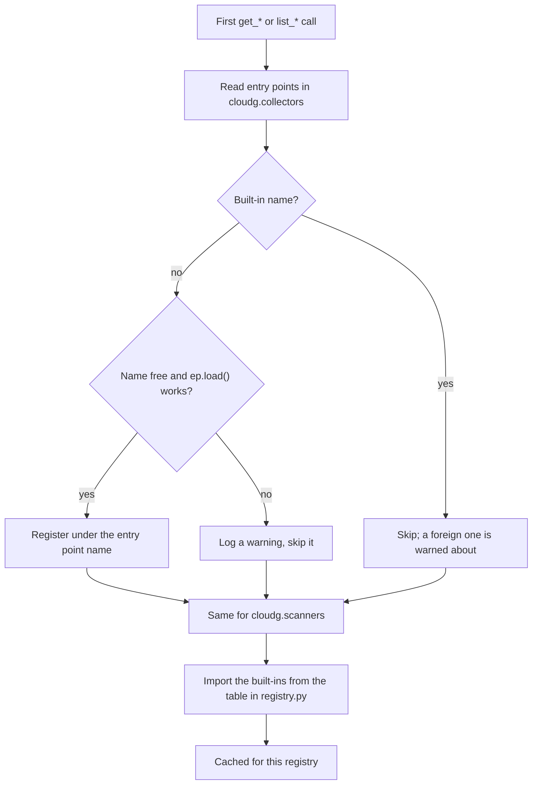

cloudg looks for plugins in two entry point groups, `cloudg.collectors` and `cloudg.scanners`. A package that declares an entry point in one of them becomes visible to `PluginRegistry` as soon as it is installed in the same environment, with no change to cloudg. cloudg registers its own built-ins the same way in its `pyproject.toml`:

```toml title="pyproject.toml"
[project.entry-points."cloudg.collectors"]
aws = "cloudg.collectors.aws:AsyncAWSCollector"
azure = "cloudg.collectors.azure:AzureCollector"
gcp = "cloudg.collectors.gcp:GCPCollector"

[project.entry-points."cloudg.scanners"]
prowler = "cloudg.scanners.prowler:ProwlerScanner"
scoutsuite = "cloudg.scanners.scoutsuite:ScoutSuiteScanner"
checkov = "cloudg.scanners.checkov:CheckovScanner"
trivy = "cloudg.scanners.trivy:TrivyScanner"
iam = "cloudg.scanners.iam_linter:IAMLinter"
```

Scanner plugins run wherever the built-in scanners run. Name one in `scanners.enabled` or `--scanners`, and `cloudg run`, `cloudg scan` and `CloudGEngine.scan()` (so `run_pipeline()` too) start it in the scanner thread pool next to the built-ins, normalise its findings with theirs and report its failures the same way. A name that is neither a built-in nor an installed plugin is skipped with a warning. Collector plugins are not wired into the CLI: `-p` accepts only `aws`, `azure` and `gcp`, so drive a collector plugin from Python, as in the example below.

## How discovery works

Discovery is lazy and happens once per `PluginRegistry` instance, on the first `get_*` or `list_*` call.



The built-ins always come from the table in `cloudg/registry.py`, which maps the same eight names as the entry points above to the same classes, so they load the same way from an installed package and from a source checkout that was never installed. A built-in whose import fails (a missing optional SDK, say) is left out quietly, at debug log level.

What the registry returns is the class itself. It does not instantiate anything and does not check the class's interface, so constructor arguments are between you and the plugin.

Two more behaviours to know before you name a plugin:

- Don't reuse a built-in name. Built-ins always win: an entry point from another package named `prowler` (or any other built-in name) is ignored, with a warning on the `cloudg.registry` logger. When two packages register the same new name, the first one found is kept and the others are ignored with a warning.
- A registry instance never looks again. After installing a plugin into a running process, create a new `PluginRegistry`.

## Writing a plugin

### The interfaces

Collectors subclass `cloudg.collectors.base.BaseCollector`, an abstract class with two coroutines to implement and one convenience method:

| Method | Returns | Notes |
|---|---|---|
| `async collect()` | `list[CloudAsset]` | abstract |
| `async collect_edges()` | `list[NetworkEdge]` | abstract |
| `async run()` | `(assets, edges)` | calls the two above in order |

Scanners have no base class in cloudg. The built-ins share an informal shape, and following it keeps your scanner interchangeable with them: a static `is_available()` that says whether the tool can run, `run()` returning `list[Finding]`, and a class method `parse_report(path)` that turns saved output back into findings (what `cloudg ingest` relies on for the built-ins). `IAMLinter` and `TrivyScanner` deviate from it (`analyze_policies(assets)`, `scan_images(images)`), so code that drives scanners generically should not assume more than the shape you define.

When the CLI or the engine runs a scanner plugin, it builds the class with only the keyword arguments its constructor declares, out of `config` (the `CloudGConfig`), `provider` (the first configured provider), `profile`, `output_dir` (`<output>/<plugin name>`), `assets`, `iac_dirs`, `images` and `timeout_seconds`; a constructor that takes `**kwargs` gets all of them. Parameters with defaults that are not on that list keep their defaults. It then calls `run()`, which may return `Finding` objects or dicts in the same shape, validated into findings.

Every asset needs a `provider` from `CloudProvider`, which has three values: `AWS`, `AZURE` and `GCP`. A collector for another platform has to file its assets under one of them.

### A complete plugin package

The package below adds a `cmdb` collector, which reads assets from a CMDB export file instead of a cloud API, and a `tagpolicy` scanner that flags assets without an `owner` tag. Both run offline.

```text
cloudg-cmdb/
├── pyproject.toml
└── src/
    └── cloudg_cmdb/
        ├── __init__.py
        ├── collector.py
        └── scanner.py
```

```toml title="cloudg-cmdb/pyproject.toml"
[build-system]
requires = ["setuptools>=68"]
build-backend = "setuptools.build_meta"

[project]
name = "cloudg-cmdb"
version = "0.1.0"
description = "cloudg plugins: a CMDB export collector and a tag policy scanner"
requires-python = ">=3.11"
dependencies = ["cloudg>=0.6.0"]

[project.entry-points."cloudg.collectors"]
cmdb = "cloudg_cmdb.collector:CMDBCollector"

[project.entry-points."cloudg.scanners"]
tagpolicy = "cloudg_cmdb.scanner:TagPolicyScanner"
```

```python title="cloudg-cmdb/src/cloudg_cmdb/__init__.py"
"""cloudg plugins for a CMDB export."""
```

The collector does not build edges between assets itself. It declares what each asset talks to in `metadata["relations"]` and lets cloudg's `RelationshipLinker` resolve those references into typed edges, the way the built-in collectors do.

```python title="cloudg-cmdb/src/cloudg_cmdb/collector.py"
"""Collector that reads assets from a CMDB export instead of a cloud API."""

from __future__ import annotations

import asyncio
import json
from pathlib import Path

from cloudg.collectors.base import BaseCollector
from cloudg.inventory.linker import RelationshipLinker
from cloudg.schema.models import AssetType, CloudAsset, CloudProvider, NetworkEdge


class CMDBCollector(BaseCollector):
    """Turns a CMDB JSON export into CloudAssets and linked edges."""

    def __init__(self, export_path: str | Path) -> None:
        self._path = Path(export_path)
        self._assets: list[CloudAsset] | None = None

    async def collect(self) -> list[CloudAsset]:
        rows = await asyncio.to_thread(self._read)
        self._assets = [
            CloudAsset(
                name=row["name"],
                arn=row["arn"],
                asset_type=AssetType(row["type"]),
                provider=CloudProvider(row.get("provider", "AWS")),
                region=row.get("region", "global"),
                account_id=row.get("account"),
                tags=row.get("tags", {}),
                metadata={
                    # The linker turns these into typed edges
                    "relations": [
                        {"target": target, "edge": edge}
                        for edge, targets in row.get("links", {}).items()
                        for target in targets
                    ],
                },
            )
            for row in rows
        ]
        return self._assets

    async def collect_edges(self) -> list[NetworkEdge]:
        if self._assets is None:
            await self.collect()
        return RelationshipLinker(self._assets or []).link()

    def _read(self) -> list[dict]:
        return json.loads(self._path.read_text())["assets"]
```

```python title="cloudg-cmdb/src/cloudg_cmdb/scanner.py"
"""Scanner that flags assets missing required tags."""

from __future__ import annotations

import json
from pathlib import Path

from cloudg.schema.models import CloudAsset, Finding, Severity

CHECK_ID = "TAGPOLICY_001"


class TagPolicyScanner:
    """Follows the built-in scanners' shape: is_available, run, parse_report."""

    def __init__(self, assets: list[CloudAsset], required: tuple[str, ...] = ("owner",)) -> None:
        self._assets = assets
        self._required = required

    @staticmethod
    def is_available() -> bool:
        return True  # pure Python, nothing to install

    def run(self) -> list[Finding]:
        findings = []
        for asset in self._assets:
            missing = [t for t in self._required if t not in asset.tags]
            if missing:
                findings.append(
                    Finding(
                        resource_id=asset.id,
                        resource_arn=asset.arn,
                        severity=Severity.LOW,
                        title=f"Missing required tags: {', '.join(missing)}",
                        description=f"{asset.name} has no {', '.join(missing)} tag.",
                        remediation="Tag the resource with an owning team.",
                        source_tool="tagpolicy",
                        source_finding_id=CHECK_ID,
                    )
                )
        return findings

    @classmethod
    def parse_report(cls, path: str) -> list[Finding]:
        """Read back findings this scanner wrote earlier as JSON."""
        return [Finding.model_validate(item) for item in json.loads(Path(path).read_text())]
```

Install it into the environment cloudg runs in, editable while you work on it:

```bash tab="pip"
pip install -e ./cloudg-cmdb
```

```bash tab="uv"
uv pip install -e ./cloudg-cmdb
```

### Use the plugins

A CMDB export with three assets, one of which declares that it runs as a role:

```json title="cmdb-export.json"
{
  "assets": [
    {"name": "billing-vm", "type": "EC2", "region": "eu-west-1", "account": "123456789012",
     "arn": "arn:aws:ec2:eu-west-1:123456789012:instance/i-0billing",
     "tags": {"owner": "billing"},
     "links": {"ASSUMES_ROLE": ["arn:aws:iam::123456789012:role/billing-app"]}},
    {"name": "billing-app", "type": "IAM_ROLE", "region": "global", "account": "123456789012",
     "arn": "arn:aws:iam::123456789012:role/billing-app"},
    {"name": "invoices", "type": "S3_BUCKET", "region": "eu-west-1", "account": "123456789012",
     "arn": "arn:aws:s3:::invoices"}
  ]
}
```

The driver finds both plugins by name, collects, scans, runs the findings through the same normaliser `cloudg run` uses, and writes a `findings.json`:

```python title="run_plugins.py"
"""Discover the plugins, collect, scan, normalise and write findings.json."""

import asyncio

from cloudg.normaliser import FindingsNormaliser
from cloudg.registry import PluginRegistry
from cloudg.renderers.json_export import JSONExporter

registry = PluginRegistry()
print("collectors:", registry.list_collectors())
print("scanners:", registry.list_scanners())

collector = registry.get_collector("cmdb")("cmdb-export.json")
assets, edges = asyncio.run(collector.run())
for e in edges:
    print("edge:", e.edge_type.value, e.description or "")

scanner = registry.get_scanner("tagpolicy")(assets, required=("owner",))
findings = scanner.run() if scanner.is_available() else []
result = FindingsNormaliser().normalise(findings, assets=assets)
result.edges = edges
for f in result.findings:
    print(f"{f.severity.value:4} {f.title} ({f.resource_arn})")

path = JSONExporter(output_dir="reports").export(result)
print("wrote", path)
```

```console
$ python run_plugins.py
collectors: ['cmdb', 'aws', 'azure', 'gcp']
scanners: ['tagpolicy', 'prowler', 'scoutsuite', 'checkov', 'trivy', 'iam']
edge: ASSUMES_ROLE 
LOW  Missing required tags: owner (arn:aws:iam::123456789012:role/billing-app)
LOW  Missing required tags: owner (arn:aws:s3:::invoices)
wrote reports/findings.json
$ cloudg report -i reports/findings.json -o reports/html --format html
```

Plugins are listed first, in entry point discovery order, then the built-ins. The last command renders `report.html` from the plugin's findings; `cloudg report` reads any `findings.json` in this shape, whoever wrote it.

`TagPolicyScanner` declares `assets`, so the CLI can run it as it is, against the assets it collected:

```bash
cloudg run -p aws --regions us-east-1 --scanners prowler,tagpolicy
```

To merge your scanner's findings with an equivalent check from Prowler, Checkov or Trivy, add your `source_tool` and `source_finding_id` to a `check_equivalence.yaml` and point the normaliser at it with `FindingsNormaliser(rules_dir=...)` (or `rulesets.rules_dir` in `config.yaml`). That directory replaces the bundled `cloudg/rules` rather than adding to it, so start from a copy of it.

## Notes

- A plugin that fails to import is logged as a warning (`Failed to load scanner plugin ...`) and skipped; the others still load. It goes to the `cloudg.registry` logger, so configure `logging` in your script to see it.
- `get_collector()` and `get_scanner()` raise `KeyError` for an unknown name, and the message lists the names that are registered.
- The relation format the linker reads (`target`, `edge`, `relationship`, `reverse`, `properties`) is specified in section 7 of the inventory reference, and the [RelationshipLinker](/api/relationshiplinker/) page shows the linker itself. Unknown `edge` values are linked as `REFERENCES`.
- Assets from a plugin collector work with everything downstream: [GraphBuilder](/api/graphbuilder/), the reachability analysis, the ontology, and `InventoryResult(assets=..., edges=...).export(dir)` for an `inventory-map.json` that `cloudg deps` can read.

## Related

:::links
- [FindingsNormaliser](/api/findingsnormaliser/) Dedupe, scoring and compliance mapping for any findings list.
- [Data models](/api/models/) `CloudAsset`, `NetworkEdge` and `Finding`, field by field.
- [RelationshipLinker](/api/relationshiplinker/) How declared relations become edges.
- [Python recipes](/guides/python-recipes/) More ways to combine the pipeline phases from code.
- [cloudg report](/cli/report/) Render HTML and SVG from a `findings.json`.
:::
