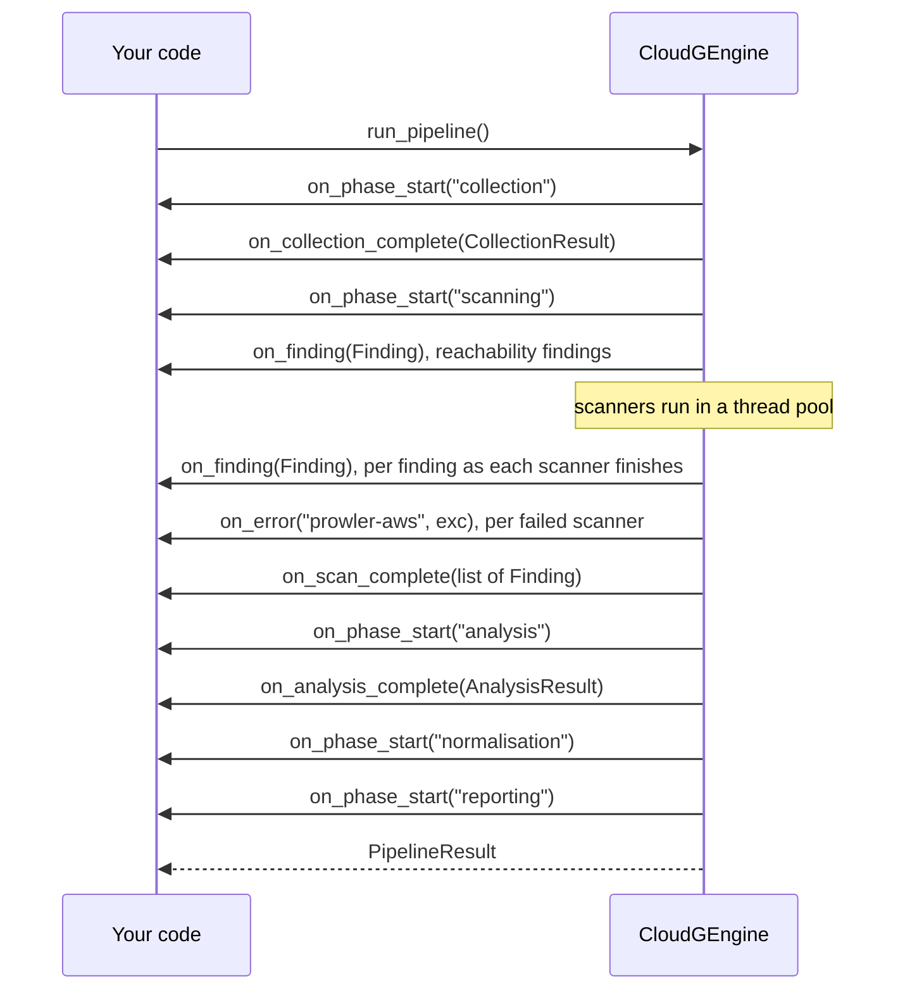

## The six hooks

Every hook starts as `None` in `CloudGEngine.__init__`. Assign a callable before you call a method, and reassign or reset it to `None` between runs as you like. The callback types are defined in `cloudg.api` as `typing.Callable` aliases, so you can annotate your own handlers with them.

| Hook | Type alias | Signature | Fires when |
|---|---|---|---|
| `on_phase_start` | `OnPhaseStart` | `(phase: str) -> None` | a phase begins: `collection`, `inventory_mapping`, `scanning`, `ingest`, `analysis`, `normalisation`, `reporting` |
| `on_collection_complete` | `OnCollectionComplete` | `(result: CollectionResult) -> None` | `collect()` finished without the collector raising |
| `on_finding` | `OnFinding` | `(finding: Finding) -> None` | once per finding, as each scanner finishes in `scan()`; at the end of `ingest_reports()` |
| `on_scan_complete` | `OnScanComplete` | `(findings: list[Finding]) -> None` | once, after the last `on_finding` call of `scan()` or `ingest_reports()` |
| `on_analysis_complete` | `OnAnalysisComplete` | `(result: AnalysisResult) -> None` | at the end of every `analyze()`, including one where every step failed |
| `on_error` | `OnError` | `(phase: str, exc: Exception) -> None` | a phase, a scanner or an analysis step failed and the engine carried on |

```python
from cloudg.api import OnError, OnFinding

def forward(finding) -> None: ...
def alert(phase: str, exc: Exception) -> None: ...

on_finding: OnFinding = forward
on_error: OnError = alert
```

## When each one fires

The diagram follows `run_pipeline()`, the one method that can call all six.



Other entry points use a subset:

| Method | Phases announced | Other hooks it can call |
|---|---|---|
| `run_pipeline()` | collection, scanning, analysis, normalisation, reporting | all six |
| `run_from_reports()` | ingest, normalisation, reporting | `on_finding`, `on_scan_complete`, `on_error` |
| `collect()` | collection | `on_collection_complete`, `on_error` |
| `scan()` | scanning | `on_finding`, `on_scan_complete`, `on_error` |
| `ingest_reports()` | ingest | `on_finding`, `on_scan_complete` |
| `analyze()` | analysis | `on_analysis_complete`, `on_error` |
| `map_inventory()` | inventory_mapping | `on_error`, then the exception is raised again |
| `normalise_findings()` | none | none |

`InventoryMapper`, `FindingsNormaliser` and the other classes you can use without the engine have no hooks at all.

### What the phase argument of on_error can be

`on_error` receives a phase name that tells you which part failed, which is more specific than the names `on_phase_start` announces:

| `phase` | Raised by |
|---|---|
| `collection` | the multi-provider collector itself (a single provider that fails is recorded in `coverage` instead) |
| `inventory_mapping` | `map_inventory()` |
| `graph_analysis` | the reachability pass at the start of `scan()` |
| `terraform` | generating the Terraform recreation, in `scan()` (for Checkov) or in `analyze()` |
| `scanner_auth` | resolving the AWS credentials for Prowler and ScoutSuite (an `aws.role_arn` that cannot be assumed, say); both are then skipped |
| `prowler-<provider>`, `scoutsuite-<provider>` | one scanner run per provider, such as `prowler-aws`, including a run killed at `scanners.timeout_seconds` |
| `checkov-<directory>` | one Checkov run per IaC directory |
| `trivy`, `trivy-fs`, `iam` | the Trivy image scan, the Trivy filesystem scan, the IAM policy linter |
| a plugin's name | a [scanner plugin](/api/entry-points/) run |
| `graph_build`, `ontology`, `rag_export` | the steps of `analyze()` |
| `normalisation`, `reporting` | the last two pipeline phases |

During `run_pipeline()` and `run_from_reports()`, every `on_error` call is also recorded in `PipelineResult.errors` as `"<phase>: <message>"`.

### Timing

All hooks run synchronously, on the thread that runs the engine method, and the engine waits for each one to return. A slow callback slows the run down by exactly that much.

`on_finding` follows the scanners. `scan()` first calls it for the reachability findings, then, as each scanner in its thread pool finishes, once for each of that scanner's findings, so a fast Checkov run reaches you while ScoutSuite is still going. `on_scan_complete` comes once at the end with every finding of the scan. The findings at that point are raw: not yet deduplicated, rescored or mapped to compliance frameworks. Each hook call gets a deep copy, so normalisation, which updates the engine's own objects in place, never changes a finding you kept. Forward `result.findings` after the run if you want the final, merged list.

### Exceptions inside a hook

The engine wraps every hook call in `try/except Exception`. An exception your callback raises is logged and dropped, and the run continues. For `on_finding` that happens per finding, so a handler that fails on every finding is called, and fails, once for each of them.

The log record is a DEBUG message, `Event hook raised; ignoring`, with the traceback attached, on the `cloudg.api` logger (or `cloudg.api_scanners` for `on_finding` and `on_scan_complete` during a scan). At the default log level you will not see it. While you develop a hook, turn it on:

```python
import logging

logging.basicConfig()
logging.getLogger("cloudg.api").setLevel(logging.DEBUG)
logging.getLogger("cloudg.api_scanners").setLevel(logging.DEBUG)
```

This also means raising from a hook cannot stop a run. The fail-fast example below shows what to do instead.

## Examples

### Progress bar with rich

`rich` is already a cloudg dependency. Each phase start advances the bar past the previous phase; `console.log` prints above the bar without breaking it.

```python title="pipeline_progress.py"
from rich.progress import Progress

from cloudg import CloudGConfig, CloudGEngine

PHASES = ["collection", "scanning", "analysis", "normalisation", "reporting"]

engine = CloudGEngine(CloudGConfig(providers=["aws"]))

with Progress() as progress:
    task = progress.add_task("starting", total=len(PHASES))
    seen = []

    def on_phase_start(phase):
        if seen:  # the previous phase has finished
            progress.advance(task)
        seen.append(phase)
        progress.update(task, description=phase)

    engine.on_phase_start = on_phase_start
    engine.on_collection_complete = lambda c: progress.console.log(
        f"collected {len(c.assets)} assets, {len(c.edges)} edges in {c.duration_ms} ms"
    )
    engine.on_scan_complete = lambda findings: progress.console.log(f"{len(findings)} raw findings")
    engine.on_error = lambda phase, exc: progress.console.log(f"[red]{phase} failed:[/] {exc}")

    result = engine.run_pipeline_sync(output_dir="./reports")
    progress.update(task, completed=len(PHASES), description="done")

print(result.to_summary())
```

For `run_from_reports()` use `PHASES = ["ingest", "normalisation", "reporting"]`.

### Forward findings to a SIEM

The hook only puts each finding on a queue; a background thread does the writing, so a slow sink never holds up the engine. Here the sink is a JSON Lines spool file that a log shipper tails. Swap `writer()` for an HTTP client if your SIEM takes events directly. This example runs offline against existing Prowler and Trivy output.

```python title="siem_forward.py"
import json
import queue
import threading

from cloudg import CloudGConfig, CloudGEngine

SPOOL = "./cloudg-findings.jsonl"   # tailed by the SIEM agent (Fluent Bit, Splunk UF, ...)
STOP = object()
outbox: queue.Queue = queue.Queue()


def writer() -> None:
    with open(SPOOL, "a", encoding="utf-8") as spool:
        while (item := outbox.get()) is not STOP:
            spool.write(json.dumps(item) + "\n")
            spool.flush()


thread = threading.Thread(target=writer, daemon=True)
thread.start()

engine = CloudGEngine(CloudGConfig())
engine.on_finding = lambda f: outbox.put({"kind": "finding", **f.model_dump(mode="json")})
engine.on_error = lambda phase, exc: outbox.put(
    {"kind": "error", "phase": phase, "error": f"{type(exc).__name__}: {exc}"}
)

result = engine.run_from_reports_sync(
    {"prowler": ["./prowler-output/"], "trivy": ["./trivy.json"]},
    output_dir="./reports",
)

outbox.put(STOP)
thread.join(timeout=30)
print(f"forwarded {result.total_findings} findings to {SPOOL}")
```

Each line is one finding as `Finding.model_dump(mode="json")` produces it (see [Data models](/api/models/) for the fields), plus `"kind": "finding"`.

### Fail fast

Raising inside `on_error` does nothing, because the engine swallows it. Record the failure instead, and check between phases you drive yourself. `run_pipeline()` has no such checkpoints, so this uses the individual phase methods.

```python title="fail_fast.py"
import asyncio
import sys

from cloudg import CloudGConfig, CloudGEngine


class PhaseFailed(RuntimeError):
    pass


async def main() -> int:
    engine = CloudGEngine(CloudGConfig(providers=["aws"]))
    failures: list[tuple[str, Exception]] = []
    engine.on_error = lambda phase, exc: failures.append((phase, exc))

    def checkpoint(step: str) -> None:
        if failures:
            phase, exc = failures[0]
            raise PhaseFailed(f"{phase} failed during {step}: {exc}")

    collection = await engine.collect()
    checkpoint("collection")
    broken = [c.to_summary() for c in collection.coverage if c.failed_services]
    if broken or not collection.assets:
        raise PhaseFailed(f"collection incomplete: {broken or 'no assets'}")

    findings = await engine.scan(collection.assets, collection.edges, output_dir="./reports")
    checkpoint("scanning")

    analysis = await engine.analyze(collection.assets, collection.edges, findings, "./reports")
    checkpoint("analysis")

    scan_result = engine.normalise_findings(
        findings + analysis.reachability_findings, assets=collection.assets
    )
    print(scan_result.summary)
    return 0


try:
    sys.exit(asyncio.run(main()))
except PhaseFailed as exc:
    print(f"cloudg: {exc}", file=sys.stderr)
    sys.exit(2)
```

A failed provider never reaches `on_error`; it is a `FAILED` entry in `collection.coverage`. That is why the script checks coverage as well as the failure list after collecting. On a failure the script prints one line in the form `cloudg: <phase> failed during <step>: <error>` to stderr and exits with status 2, so a CI job or a scheduler sees the run as failed.

## Notes

Hooks are per engine instance. Two engines in one process do not share them, and there is no global registry.

`on_collection_complete` does not fire when `collect()` fails as a whole; you get `on_error("collection", exc)` and an empty `CollectionResult` instead. `on_analysis_complete` fires even when every analysis step failed, with whatever was filled in.

Nothing fires for findings produced by `analyze()`. Its reachability findings reach you through `AnalysisResult.reachability_findings` and, after `run_pipeline()`, through `PipelineResult.findings`.

## Related

:::links
- [CloudGEngine](/api/cloudgengine/) The methods that call the hooks.
- [Result objects](/api/results/) What `on_collection_complete` and `on_analysis_complete` receive.
- [Data models](/api/models/) The `Finding` that `on_finding` receives.
- [CI and automation](/guides/ci-automation/) Running cloudg unattended.
:::
