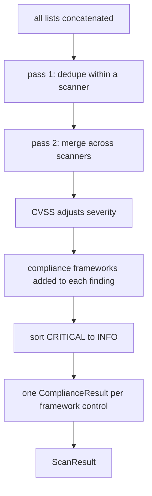

## What normalise does

`FindingsNormaliser(rules_dir=None, load_external=True)` loads its rules once, at construction: every `*.yaml` file under `rules_dir` (searched recursively) as a compliance ruleset, and `check_equivalence.yaml` from the top of `rules_dir` as the cross-scanner equivalence map. With `rules_dir=None` it uses the directory shipped inside the package, `cloudg/rules/`, which holds CIS, NIST 800-53, PCI DSS, SOC 2, ISO 27001, HIPAA and GDPR rulesets plus the per-provider framework mappings under `frameworks/`. `load_external=False` (the `rulesets.load_external` key) skips the rulesets and keeps only the equivalence map.

`normalise(*finding_lists, assets=None, passed_checks=None)` accepts any number of lists, one per source, and runs them through one pass:



### Deduplication

The first pass works inside one scanner. Findings with the same `source_tool`, the same check ID and the same resource (`resource_arn`, or `resource_id` when there is no ARN) are one finding reported twice, for example once per output format. The check ID is the scanner's own: the check name embedded in a Prowler finding ID (`s3_bucket_default_encryption` out of `prowler-aws-s3_bucket_default_encryption-123456789012-...` or `prowler-s3_bucket_default_encryption-123456789012-...`), or `source_finding_id` as it is for Checkov, Trivy and ScoutSuite. A finding without a check ID is keyed on its normalised title instead, so two different checks that happen to share a generic title are not collapsed.

The second pass works across scanners, and it is deliberately strict. Two findings from different tools merge only when they are about the same resource, their titles are equal after normalisation (lower case, leading `[Checkov/terraform]`-style tags removed, punctuation collapsed), and both check IDs map to the same canonical ID in `check_equivalence.yaml`. Findings without check IDs merge with each other on title alone. A finding with a check ID never merges with one without. When in doubt, cloudg keeps both: a visible duplicate is better than a scanner's result quietly disappearing.

A merge keeps the finding with the higher severity, joins the tool names into `source_tool` (`"trivy, prowler"`) and unions `compliance_frameworks`. The survivor keeps its own `id`, title and `source_finding_id`, and the normaliser remembers the source IDs of every finding merged into it for the compliance step.

### Scoring

A `cvss_score` of 9.0 or more sets the severity to `CRITICAL`. A score from 7.0 to 8.9 raises anything below `HIGH` to `HIGH`. Severity never goes down. `risk_score` on the finding is computed from severity and CVSS whenever you read it; see [Data models](/api/models/).

### Compliance mapping

Frameworks are added to `finding.compliance_frameworks` from four sources, in this order:

1. what the scanner reported itself (Prowler's `RelatedRequirements`, for example), already on the finding when it arrives
2. an exact match of the check ID against the `checks` lists in the rulesets, which also yields the real control ID and title. The source IDs of every finding merged into this one are matched too
3. only if the finding still has no framework: the `patterns` regexes in the rulesets, matched against title and description
4. only if that found nothing either: a small built-in regex table for CIS, NIST 800-53, PCI DSS, GDPR, SOC 2 and HIPAA

Then each (framework, control) pair becomes one `ComplianceResult` with the ids of the findings behind it. For exact matches the control ID and title come from the ruleset. Otherwise the control ID is built from the finding: `<framework>/CKV_...` for Checkov, `<framework>/CVE-...` for Trivy CVEs, `<framework>/<check name>` for Prowler (`CIS/s3_bucket_default_encryption`), or `<framework>-aggregate` when nothing better exists. Pattern matches always land in the aggregate control.

These results have status `FAIL`. Passing checks add `PASS` results: a ruleset control that a passed check name maps to through `checks`, and that no finding fails, gets a `PASS` result with an empty `finding_ids`. The passed checks come from the `passed_checks` argument and from the `passed_checks` attribute of each list you pass. Prowler's parser returns a `FindingList`, a `list` subclass that carries the checks that passed (ASFF `PASSED`, OCSF `PASS` records), so `normalise(parse_report("prowler", path))` picks them up with no extra argument. Controls with neither a finding nor a passing check are not listed: the absence of a control means it was not assessed.

## Examples

### What merging and scoring do

Five findings about one bucket and one image, constructed by hand so each rule shows. Runs offline.

```python title="normalise_demo.py"
from cloudg.normaliser import FindingsNormaliser
from cloudg.schema.models import Finding, Severity

BUCKET = "arn:aws:s3:::orders-archive"


def finding(tool, check, title, severity, **extra):
    return Finding(resource_id=BUCKET, resource_arn=BUCKET, source_tool=tool,
                   source_finding_id=check, title=title, description=title,
                   severity=severity, **extra)


prowler = [
    finding("prowler", "prowler-aws-s3_bucket_default_encryption-123456789012-eu-west-1-orders-archive",
            "S3 bucket default encryption", Severity.MEDIUM),
    # the same check reported twice (two output formats, say): a within-scanner duplicate
    finding("prowler", "prowler-aws-s3_bucket_default_encryption-123456789012-eu-west-1-orders-archive",
            "S3 bucket default encryption", Severity.MEDIUM),
]
trivy = [
    # equivalent check (AVD-AWS-0088), same resource, same normalised title
    finding("trivy", "AVD-AWS-0088", "[Trivy] S3 bucket default encryption", Severity.HIGH),
    # a CVE with a CVSS score of 9.8 reported as MEDIUM
    finding("trivy", "CVE-2024-0001", "openssl: buffer overflow", Severity.MEDIUM, cvss_score=9.8),
]
untagged = [finding("custom", None, "CloudTrail logging disabled in eu-west-1", Severity.LOW)]

result = FindingsNormaliser().normalise(prowler, trivy, untagged)
for f in result.findings:
    print(f"{f.severity.value:8} {f.risk_score:4} {f.source_tool:16} {f.title} {f.compliance_frameworks[:4]}")
print(len(result.compliance), "compliance results")
```

```console
$ python normalise_demo.py
CRITICAL  9.7 trivy            openssl: buffer overflow ['HIPAA', 'NIST-800-53', 'PCI-DSS', 'SOC2']
HIGH      7.5 trivy, prowler   [Trivy] S3 bucket default encryption ['GDPR-AWS', 'HIPAA-AWS', 'ISO27001-AWS', 'MITRE-ATTACK-AWS']
LOW       2.5 custom           CloudTrail logging disabled in eu-west-1 ['GDPR', 'HIPAA', 'ISO-27001', 'NIST-800-53']
38 compliance results
```

Five findings in, three out. The two Prowler copies collapsed in pass 1. The result merged with the Trivy check in pass 2, because `s3_bucket_default_encryption` and `AVD-AWS-0088` share the canonical ID `aws-s3-default-encryption` and the titles match once `[Trivy]` is dropped. The Trivy finding survived because it was `HIGH`, and it still carries the ruleset frameworks that Prowler's check name maps to, such as `HIPAA-AWS`. The CVE went from `MEDIUM` to `CRITICAL` on its CVSS score.

### Add your own framework

`rules_dir` replaces the packaged rules; it does not extend them. To keep the built-in rulesets and the equivalence map, copy them and add your file to the copy:

```python title="custom_rules.py"
import shutil
from pathlib import Path

import cloudg
from cloudg import CloudGConfig, CloudGEngine
from cloudg.ingest import parse_report

# Start from the rules cloudg ships, then add one file of your own
rules = Path("./rules")
shutil.copytree(Path(cloudg.__file__).parent / "rules", rules, dirs_exist_ok=True)
(rules / "acme_baseline.yaml").write_text(
    """\
framework: ACME-BASELINE
controls:
  - id: ACME-ENC-01
    title: Data at rest is encrypted with a managed key
    checks: [s3_bucket_default_encryption, CKV_AWS_19, AVD-AWS-0088]
  - id: ACME-LOG-02
    title: Audit logging is enabled
    patterns: ["cloudtrail", "audit log"]
"""
)

config = CloudGConfig()
config.rulesets.rules_dir = str(rules)
engine = CloudGEngine(config)

findings = parse_report("prowler", "./prowler-output/") + parse_report("checkov", "./results_json.json")
scan_result = engine.normalise_findings(findings)

for c in scan_result.compliance:
    if c.framework == "ACME-BASELINE":
        print(c.control_id, "|", c.control_title, "|", c.status.value, len(c.finding_ids), "findings")
```

```console
$ python custom_rules.py
ACME-ENC-01 | Data at rest is encrypted with a managed key | FAIL 2 findings
```

A ruleset file has a `framework` name (the file name is used when it is missing) and a list of `controls`, each with an `id`, an optional `title`, and `checks` (exact scanner check IDs), `patterns` (regexes) or both. Several files may name the same framework; their controls are combined. `CloudGEngine.normalise_findings()` builds the normaliser from `config.rulesets.rules_dir`, so setting the config is enough; standalone, pass `FindingsNormaliser(rules_dir="./rules")`.

To teach the merger that two checks are the same, add an entry to `check_equivalence.yaml` in your copy:

```yaml title="rules/check_equivalence.yaml"
equivalences:
  - id: aws-s3-default-encryption
    title: S3 bucket default encryption at rest
    checks:
      prowler: [s3_bucket_default_encryption]
      checkov: [CKV_AWS_19]
      trivy: [AVD-AWS-0088]
```

Scanner names are the lower-case `source_tool` values.

## Notes

`normalise()` changes the findings you pass in. Severity, `source_tool` and `compliance_frameworks` are updated on the original objects, and the duplicates that lost a merge are simply left out of the result. Pass copies (`[f.model_copy(deep=True) for f in findings]`) if you need the originals untouched.

The merge keeps the survivor's `source_finding_id`, but the exact check-ID mapping looks up the source IDs of every merged finding. When a Trivy finding survives over a Prowler one, Prowler's check name still maps its controls.

A `FindingList` keeps its own `passed_checks` when you `+=` or `extend()` it, but does not take over those of the list you add, and `a + b` or `list(a)` gives a plain list without any. Simplest is to pass each parsed list to `normalise()` as a separate argument; otherwise collect the passed checks yourself and pass `normalise(..., passed_checks=...)`.

A `rules_dir` that does not exist is not an error. The normaliser then has no rulesets and no equivalence map, and only the built-in regex table maps frameworks. Check the path when compliance results look thin.

Merging across scanners needs the same resource identifier on both sides. Checkov reports Terraform addresses (`aws_s3_bucket.data`) and Prowler reports ARNs, so an equivalent Checkov and Prowler finding normally stay two findings.

The normaliser keeps the last result on the instance, but nothing reads it back; treat `normalise()` as a function and use its return value. One instance can normalise any number of batches.

## Related

:::links
- [Compliance frameworks](/guides/compliance/) Which frameworks cloudg maps and how to read the results.
- [parse_report](/api/parse-report/) Getting findings out of scanner output.
- [Data models](/api/models/) Finding, ComplianceResult and ScanResult.
- [Ingesting existing output](/guides/ingesting/) The CLI path through the same normaliser.
:::
