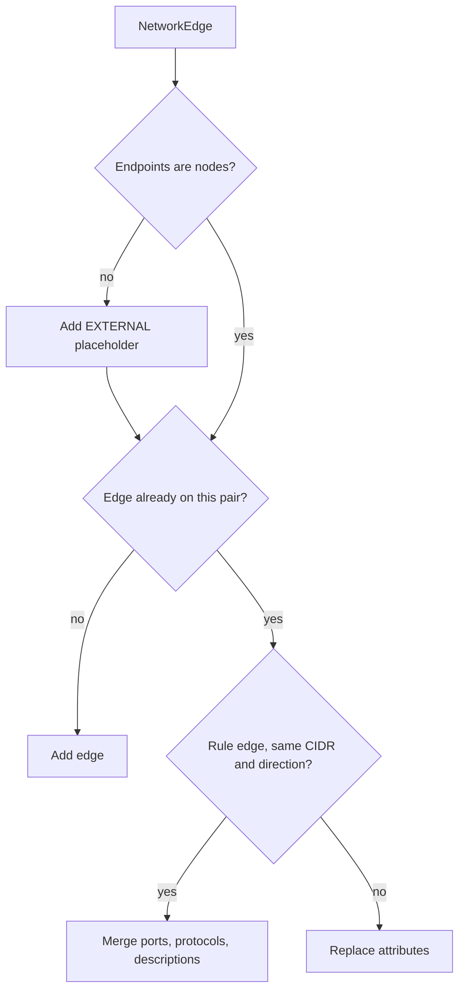

`GraphBuilder` is the first thing `cloudg run` does after collection, and `InventoryResult.export()` uses it to write `inventory-map.graphml` and `inventory-graph.json`. It needs no credentials and no network: hand it assets and edges from a collector, a saved `inventory-map.json` or your own code, and it gives you a plain `networkx.DiGraph` you can keep working on with the whole NetworkX library.

## What build() does

Each asset becomes a node keyed by `asset.id`. The node carries `name`, `asset_type`, `provider`, `region`, `arn` (an empty string when the asset has none), `account_id`, `tags` (the tag dict serialised as a JSON string, so GraphML can store it) and `is_internet_exposed`. Metadata and `raw_data` stay behind.

Each edge then joins `source_id` to `target_id`. Collectors write edges whose endpoints are not assets at all: a CIDR such as `0.0.0.0/0`, an Azure service tag or an unresolved reference. For those, `build()` creates a placeholder node with `asset_type` and `provider` set to `EXTERNAL` and `is_external=True`.



A `DiGraph` holds one edge per ordered pair. Collectors often emit several rules for one pair (two ingress rules from `0.0.0.0/0` to the same security group, for 22 and 443), so since 0.6.0 `SECURITY_GROUP_RULE`, `NACL_RULE` and `INTERNET_EXPOSED` edges on the same pair are merged when their `cidr` and `direction` match:

| Attribute | After merging rules for 22/TCP and 443/TCP | After merging 22/TCP and an ICMP rule |
|---|---|---|
| `port_range` | `"22,443"` | `"22"` (ICMP adds no ports) |
| `protocol` | `"TCP"` | `"TCP,ICMP"` |
| `description` | both descriptions joined with `"; "` | the same |

An empty port list on a TCP, UDP or all-protocol filter rule (GCP writes these) means every port, so it adds `0-65535` to the union. With mixed protocols the merged `port_range` says which ports are open from the source, but not which protocol each one is open for. Any other edge type that lands on an occupied pair replaces the earlier edge's attributes, which is what NetworkX does by default. Count edges in the `NetworkEdge` list, not in the graph, when you need the collector's numbers.

`NetworkEdge.ports` and `properties` are not copied onto the graph. Every edge attribute is a string (`""` when unset), which keeps the graph GraphML-safe.

## Examples

### Build, search and export a small estate

The script builds eight assets and eleven edges by hand, so it runs offline. It also groups the nodes into communities with python-louvain, which cloudg installs; the [RAG exporter](/api/ragexporter/) runs the same `best_partition` call for its community chunks.

```python title="build_graph.py"
"""Build a graph from a hand-made estate and look at it from a few angles."""

import json
from pathlib import Path

import community as community_louvain  # python-louvain, a cloudg dependency

from cloudg.graph.builder import GraphBuilder
from cloudg.schema.models import AssetType, CloudAsset, CloudProvider, EdgeType, NetworkEdge

ACCOUNT = "123456789012"


def asset(asset_id: str, name: str, asset_type: AssetType, arn_suffix: str, **extra) -> CloudAsset:
    return CloudAsset(
        id=asset_id,
        name=name,
        asset_type=asset_type,
        provider=CloudProvider.AWS,
        region="eu-west-1",
        account_id=ACCOUNT,
        arn=f"arn:aws:{arn_suffix}",
        **extra,
    )


assets = [
    asset("sg-alb", "sg-alb", AssetType.SECURITY_GROUP, f"ec2:eu-west-1:{ACCOUNT}:security-group/sg-alb"),
    asset("sg-web", "sg-web", AssetType.SECURITY_GROUP, f"ec2:eu-west-1:{ACCOUNT}:security-group/sg-web"),
    asset("alb", "web-alb", AssetType.LOAD_BALANCER, f"elasticloadbalancing:eu-west-1:{ACCOUNT}:loadbalancer/app/web-alb/1"),
    asset("tg", "web-tg", AssetType.TARGET_GROUP, f"elasticloadbalancing:eu-west-1:{ACCOUNT}:targetgroup/web-tg/1"),
    asset("web-1", "web-1", AssetType.EC2, f"ec2:eu-west-1:{ACCOUNT}:instance/i-0web1", is_internet_exposed=True),
    asset("web-2", "web-2", AssetType.EC2, f"ec2:eu-west-1:{ACCOUNT}:instance/i-0web2"),
    asset("app-role", "app-role", AssetType.IAM_ROLE, f"iam::{ACCOUNT}:role/app-role"),
    asset("orders-db", "orders-db", AssetType.RDS_INSTANCE, f"rds:eu-west-1:{ACCOUNT}:db:orders-db"),
]


def rule(source: str, target: str, port: str, cidr: str = "", description: str = "") -> NetworkEdge:
    return NetworkEdge(
        source_id=source,
        target_id=target,
        edge_type=EdgeType.SECURITY_GROUP_RULE,
        port_range=port,
        protocol="TCP",
        cidr=cidr or None,
        direction="ingress",
        description=description or None,
    )


edges = [
    # Two rules on the same pair: GraphBuilder merges them into one edge
    rule("0.0.0.0/0", "sg-alb", "443", "0.0.0.0/0", "HTTPS from anywhere"),
    rule("0.0.0.0/0", "sg-alb", "80", "0.0.0.0/0", "HTTP redirect"),
    rule("sg-alb", "sg-web", "8080", description="ALB to web tier"),
    NetworkEdge(source_id="alb", target_id="sg-alb", edge_type=EdgeType.ATTACHED_TO, relationship="PROTECTED_BY_SG"),
    NetworkEdge(source_id="web-1", target_id="sg-web", edge_type=EdgeType.ATTACHED_TO, relationship="PROTECTED_BY_SG"),
    NetworkEdge(source_id="web-2", target_id="sg-web", edge_type=EdgeType.ATTACHED_TO, relationship="PROTECTED_BY_SG"),
    NetworkEdge(source_id="alb", target_id="tg", edge_type=EdgeType.LOAD_BALANCER_TARGET),
    NetworkEdge(source_id="tg", target_id="web-1", edge_type=EdgeType.LOAD_BALANCER_TARGET),
    NetworkEdge(source_id="tg", target_id="web-2", edge_type=EdgeType.LOAD_BALANCER_TARGET),
    NetworkEdge(source_id="web-1", target_id="app-role", edge_type=EdgeType.IAM_TRUST),
    NetworkEdge(source_id="app-role", target_id="orders-db", edge_type=EdgeType.GRANTS_ACCESS),
]

builder = GraphBuilder()
graph = builder.build(assets, edges)
print(f"{graph.number_of_nodes()} nodes, {graph.number_of_edges()} edges from {len(edges)} NetworkEdges")

merged = graph.edges["0.0.0.0/0", "sg-alb"]
print("merged rule:", merged["port_range"], "|", merged["description"])
print("placeholder:", graph.nodes["0.0.0.0/0"]["asset_type"], graph.nodes["0.0.0.0/0"]["is_external"])


def names(path: list[str]) -> str:
    return " -> ".join(graph.nodes[n]["name"] for n in path)


# Paths follow edges in their stored direction
for path in builder.find_attack_paths("0.0.0.0/0", "sg-web"):
    print("internet path:", names(path))
for path in builder.find_attack_paths("web-1", "orders-db"):
    print("identity path:", names(path))
for path in builder.find_lateral_movement_paths():
    print("lateral path:", names(path))

centrality = builder.compute_centrality()
top = sorted(centrality.items(), key=lambda kv: kv[1]["betweenness"], reverse=True)[:3]
for node_id, scores in top:
    print(f"betweenness {scores['betweenness']:.3f}  {graph.nodes[node_id]['name']}")

# Louvain works on undirected graphs; the RAG exporter does the same
partition = community_louvain.best_partition(graph.to_undirected(), random_state=42)
groups: dict[int, list[str]] = {}
for node_id, community_id in partition.items():
    groups.setdefault(community_id, []).append(graph.nodes[node_id]["name"])
for community_id, members in sorted(groups.items()):
    print(f"community {community_id}: {sorted(members)}")

out = Path("graph-out")
builder.save_graphml(out / "estate.graphml")
(out / "estate-d3.json").write_text(builder.to_json_str())
(out / "estate-cytoscape.json").write_text(json.dumps(builder.to_cytoscape_json(), indent=2))
print("wrote", sorted(p.name for p in out.iterdir()))
```

Output with cloudg 0.6.0 and python-louvain 0.16:

```console
$ python build_graph.py
9 nodes, 10 edges from 11 NetworkEdges
merged rule: 443,80 | HTTPS from anywhere; HTTP redirect
placeholder: EXTERNAL True
internet path: 0.0.0.0/0 -> sg-alb -> sg-web
identity path: web-1 -> app-role -> orders-db
lateral path: web-1 -> app-role
betweenness 0.080  web-1
betweenness 0.071  web-tg
betweenness 0.054  app-role
community 0: ['0.0.0.0/0', 'sg-alb']
community 1: ['sg-web', 'web-2']
community 2: ['app-role', 'orders-db', 'web-1']
community 3: ['web-alb', 'web-tg']
wrote ['estate-cytoscape.json', 'estate-d3.json', 'estate.graphml']
```

Eight assets plus the `0.0.0.0/0` placeholder make nine nodes, and the two rules into `sg-alb` became one edge. There is no internet path to `web-1` here even though the load balancer targets it: `alb -> sg-alb` is an `ATTACHED_TO` edge pointing from the resource to its group, and `find_attack_paths` walks edges only in the direction they are stored. The [reachability analysis](/api/reachabilityanalyzer/) knows which way traffic actually moves; walk `network_flow_graph(graph)` instead when you want flow-aware paths.

Leave out `random_state` and Louvain may number and split the communities differently from one run to the next.

### Graph a saved inventory map

`cloudg map` already writes `inventory-map.graphml`, but you can rebuild the graph from `inventory-map.json` to filter it first. `InventoryResult.load()` accepts the file or the directory holding it.

```python title="graph_from_map.py"
from cloudg.graph.builder import GraphBuilder
from cloudg.inventory import InventoryResult

result = InventoryResult.load("./reports")
aws_eu = [a for a in result.assets if a.region.startswith("eu-")]
keep = {a.id for a in aws_eu}
edges = [e for e in result.edges if e.source_id in keep or e.target_id in keep]

builder = GraphBuilder()
graph = builder.build(aws_eu, edges)
builder.save_graphml("./reports/eu-only.graphml")
print(graph.number_of_nodes(), "nodes,", graph.number_of_edges(), "edges")
```

Edges whose other end lies outside the filter bring that end back as an `EXTERNAL` placeholder, because `build()` adds a node for every endpoint it sees.

## Notes

- `build()` clears the graph first, so one builder can be reused, but `builder.graph` always holds the last build.
- Past `max_nodes_warn` assets (default 10,000) `build()` logs a warning about memory. `cloudg run` and `CloudGEngine` pass `graph.max_nodes_warn` from `config.yaml`; `GraphBuilder(max_nodes_warn=0)` turns the warning off.
- `find_attack_paths()` runs `nx.all_simple_paths` with a `cutoff` of `max_depth` (default 10). On a large, dense graph the number of simple paths explodes; pick specific endpoints and keep the depth low. An unknown node id gives `[]`, not an exception.
- `find_lateral_movement_paths()` collects paths of at most 8 hops from every node with `is_internet_exposed` or `is_external` set to the target of each `IAM_TRUST` edge, over every edge type, and stops after about 100 paths. Every placeholder counts as a starting point, private CIDRs included. `cloudg run` calls it when `graph.compute_attack_paths` is on and prints only the count.
- `compute_centrality()` returns normalised degree, in-degree, out-degree and betweenness per node. Betweenness is exact (`nx.betweenness_centrality`), so it is slow on graphs of tens of thousands of nodes.
- `subgraph(node_ids)` returns an independent copy, so changes to it do not touch `builder.graph`.
- `save_graphml()` creates missing parent directories and writes with `nx.write_graphml_xml` through `graphml_safe()`, a copy of the graph without `None` attributes and with lists and dicts stored as JSON strings. `builder.graph` itself is not changed. `load_graphml()` reads back through `nx.read_graphml`, which returns a `DiGraph` with string attributes; booleans such as `is_internet_exposed` come back as Python booleans because GraphML stores their type.
- The D3 export (`to_d3_json`, `to_json_str`) has `nodes` and `links`. Cytoscape's has `elements.nodes` and `elements.edges` with a smaller attribute set (no ARN or CIDR). The field reference for the D3 form is [inventory-graph.json](/reference/inventory/inventory-graph-json/).

## Related

:::links
- [ReachabilityAnalyzer](/api/reachabilityanalyzer/) Internet exposure, flow-aware walks and blast radius over this graph.
- [CloudOntology](/api/cloudontology/) The same assets and edges as RDF triples.
- [RAGExporter](/api/ragexporter/) Chunks built from the graph's communities.
- [Graph, ontology and RAG](/guides/graph-ontology-rag/) How the three analyses fit together.
- [inventory-map.graphml](/reference/inventory/inventory-map-graphml/) Node and edge attributes, field by field.
:::
