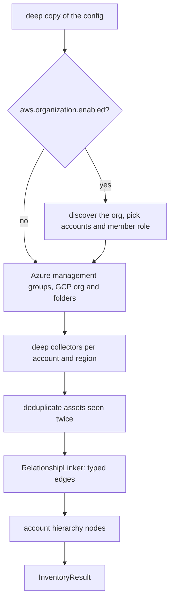

## What a mapping run does

`InventoryMapper(config, tagging_sweep=None)` stores the config and reads the `inventory` section from it. `tagging_sweep` overrides `config.inventory.tagging_sweep` for this mapper only. Nothing touches the cloud until you call `map_inventory()`.



In more detail:

1. The config is deep-copied. Organization discovery rewrites `aws.accounts`, `aws.role_name` and, with `aws.regions: [ALL]` and Control Tower, `aws.regions`. Those changes stay inside the run; the object you passed in is never modified.
2. With `aws.organization.enabled`, the mapper reads the OU tree, the member accounts, SCPs and, if present, the Control Tower landing zone. The selected accounts become the collection targets, reached by assuming `aws.organization.role_name` (falling back to `aws.role_name`, then `AWSControlTowerExecution`). The topology is kept on `mapper.organization` after the run. When discovery fails, the error is logged, an `organizations` coverage record is marked `FAILED`, and only the caller's account is mapped.
3. With Azure in `providers` and `azure.map_management_groups` on, the management group and Azure Policy hierarchy is read. With GCP, `gcp.organization_id` set and `gcp.map_hierarchy` on, the organization, folders, org policies and VPC Service Controls perimeters are read.
4. The deep collectors run per account and region (AWS), per subscription (Azure) and per project or organization (GCP), with the `inventory` options applied: service families, exclusions, Kubernetes, the tagging and Cloud Control sweeps, IAM resource edges and the rest.
5. Assets that share an ARN (the same resource seen from two regions or from a collector and a sweep) collapse into one. The detailed copy wins over a sweep or placeholder copy, and their declared relations are merged.
6. The [`RelationshipLinker`](/api/relationshiplinker/) resolves declared relations and applies its provider rules, with `inventory.link_references` deciding whether the generic reference scan runs. Placeholder `CLOUD_ACCOUNT` nodes are added for accounts that were referenced but not mapped.
7. With `inventory.account_hierarchy` on (the default), account nodes are added and linked to the top-level resources they contain.

Cloud API throttling does not fail a map. Calls are rate limited and retried according to `config.ratelimit`; a service that is still throttled after its retries is recorded as `FAILED` or `PARTIAL` in `coverage`, and the run's throttling telemetry lands in `result.throttling`, with each message also logged as a warning. If the code that calls `map_inventory()` already runs inside a `cloudg.resilience.stats_scope()`, the mapper reports into that scope.

`map_inventory()` returns an [`InventoryResult`](/api/inventoryresult/). Calling the engine's `map_inventory()` instead gets you the same result plus an `on_phase_start("inventory_mapping")` hook and optional export.

## Merging findings into a map

The last three methods never call a cloud API or a scanner. They take a finished `InventoryResult` and a list of findings from anywhere: `CloudGEngine.scan()`, `ingest_reports()`, a saved findings file.

`build_asset_map(result, findings)` returns one entry per asset in the map: `id`, `arn`, `name`, `type`, `provider`, `region`, `account_id`, `internet_exposed`, `finding_count`, `severity_breakdown` and `finding_ids`, sorted with the most findings first, plus `total_assets` and `assets_with_findings` at the top level. A finding belongs to an asset when its `resource_arn` or its `resource_id` equals the asset's `id`, `arn` or `name`.

`build_compliance_map(result, findings)` groups by compliance framework. Each framework gets `findings`, `severity_breakdown`, `affected_assets` (the asset's ARN, or the finding's own `resource_arn` when no asset matched) and `affected_asset_count`. It reads `finding.compliance_frameworks` as it is, so run the findings through [`FindingsNormaliser`](/api/findingsnormaliser/) first if you want the framework mapping cloudg adds on top of what the scanner reported.

`export_merged(result, findings, output_dir)` writes both: `asset-map.json` and `compliance-map.json`, and returns their paths under the keys `asset_map` and `compliance_map`.

## Examples

### Map an AWS organization

Run this from the management account or a delegated administrator. The member role must exist in every target account; a read-only role deployed with a StackSet is the usual choice.

```python title="map_org.py"
from cloudg import CloudGConfig
from cloudg.inventory import InventoryMapper

config = CloudGConfig(providers=["aws"])
config.aws.regions = ["ALL"]                           # Control Tower governed regions, if any
config.aws.organization.enabled = True
config.aws.organization.role_name = "cloudg-readonly"
config.aws.organization.include_ous = ["Workloads"]    # nested OUs included
config.aws.organization.exclude_accounts = ["111111111111"]

mapper = InventoryMapper(config)
inventory = mapper.map_inventory_sync()

topology = mapper.organization                         # OrganizationTopology, or None
if topology is not None:
    print("governed regions:", topology.governed_regions)

summary = inventory.summary
print(summary["accounts"], "accounts,", summary["total_assets"], "assets")
print("cross-account edges:", summary["cross_account_edges"])
print("security service gaps:", summary["security_service_gaps"])

for cov in inventory.coverage:
    if cov.failed_services:
        print("failed:", cov.to_summary()["failures"])

inventory.export("./inventory")
```

[AWS Organizations](/guides/aws-organizations/) covers the role, the account selection and Control Tower in detail.

### Overlay findings that arrive later

Mapping and scanning often run on different schedules or different hosts. This script runs offline: it loads a map exported earlier, ingests Prowler and Trivy output, normalises it, and writes the merged maps next to the inventory.

```python title="overlay_findings.py"
from cloudg import CloudGConfig, InventoryMapper, InventoryResult
from cloudg.ingest import ingest_reports
from cloudg.normaliser import FindingsNormaliser

# A map written earlier by `cloudg map -o ./inventory` or InventoryResult.export()
inventory = InventoryResult.load("./inventory")

# Scanner output that arrived later, normalised so compliance mapping is filled in
raw = ingest_reports({"prowler": ["./prowler-output/"], "trivy": ["./trivy.json"]})
findings = FindingsNormaliser().normalise(raw).findings

mapper = InventoryMapper(CloudGConfig(providers=["aws"]))
paths = mapper.export_merged(inventory, findings, "./inventory")
print({name: str(path) for name, path in paths.items()})

compliance = mapper.build_compliance_map(inventory, findings)
for framework, entry in list(compliance["frameworks"].items())[:3]:
    print(framework, entry["findings"], entry["affected_assets"])

asset_map = mapper.build_asset_map(inventory, findings)
print(asset_map["total_assets"], "assets,", asset_map["assets_with_findings"], "with findings")
```

```console
$ python overlay_findings.py
{'asset_map': 'inventory/asset-map.json', 'compliance_map': 'inventory/compliance-map.json'}
CIS 1 ['arn:aws:s3:::my-bucket']
CVE 1 ['myrepo/app:latest']
GDPR-AWS 1 ['arn:aws:s3:::my-bucket']
6 assets, 0 with findings
```

The map in this run holds six assets of an orders service, and the findings are about a bucket and a container image that are not in it. `asset-map.json` therefore shows no asset with findings, while `compliance-map.json` still lists both findings under their own identifiers. A finding about something the map contains is counted against that asset.

The mapper needs a config only to exist; the merge methods ignore it. `InventoryMapper(CloudGConfig())` is enough here.

## Notes

Asset matching in `build_asset_map()` includes the asset's `name`, and it checks `resource_id` even when the finding carries a `resource_arn` that points elsewhere. Two assets with the same name (an SQS queue and a DynamoDB table both called `orders`) can therefore both receive a finding meant for one of them. `build_compliance_map()` resolves by ARN first and does not have this problem. When names repeat in your estate, prefer findings with `resource_arn` set and check `asset-map.json` for duplicates.

`map_inventory()` and the sync wrapper keep no state between calls except `mapper.organization`, which is overwritten by every run. One mapper can map several times.

`map_inventory_sync()` uses `asyncio.run()`. In a notebook or any code that already runs an event loop, `await mapper.map_inventory()` instead.

`InventoryResult.coverage` is not written to any export file. Read it from the returned object if you want the failure list; the CLI prints the failed collectors after a `cloudg map` run.

## Related

:::links
- [InventoryResult](/api/inventoryresult/) What `map_inventory()` returns.
- [RelationshipLinker](/api/relationshiplinker/) The linking step on its own.
- [DependencyGraph](/api/dependencygraph/) Blast radius and dependency walks over the map.
- [Inventory mapping](/guides/inventory-mapping/) The guide, with the CLI side.
- [cloudg map](/cli/map/) The command that wraps this class.
:::
