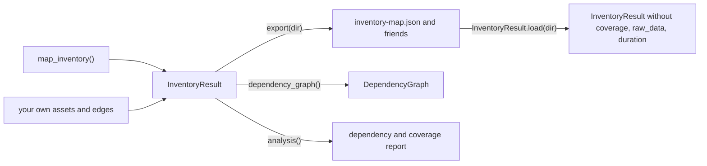

## Where it comes from

`InventoryResult` is a dataclass defined in `cloudg/inventory/mapper_result.py` and importable from `cloudg`, `cloudg.inventory` and `cloudg.inventory.mapper`. You get one from `InventoryMapper.map_inventory()`, from `CloudGEngine.map_inventory()`, or from `InventoryResult.load()` on a map saved earlier. You can also build one yourself from any list of `CloudAsset` and `NetworkEdge` objects; every field has a default, and the methods work the same on a hand-built result.



## The parts that need explaining

`summary` is a property, not a stored field, and it is recomputed from `assets` and `edges` on every access. On a map with tens of thousands of assets that is a noticeable amount of work, so read it once into a variable. Its keys are counts and breakdowns: `total_assets`, `total_edges`, `providers`, `assets_by_type`, `assets_by_service`, `assets_by_region`, `assets_by_account`, `edges_by_type`, `edges_by_relationship`, `unlinked_assets`, `internet_exposed`, `accounts`, `cross_account_edges`, `external_accounts`, `security_service_gaps`, `unresolved_references`, and `organization` and `throttling` when those exist. The [summary reference](/reference/inventory/summary/) says how each one is computed. `assets_by_service` is derived from the identifier: the service field of an ARN, the provider namespace of an Azure ID, the API host of a GCP name.

`dependency_graph(include_hierarchy=False)` builds a new [`DependencyGraph`](/api/dependencygraph/) on each call. With the default, `CONTAINS` edges into organization, OU and account nodes are left out, so "everything in this account depends on the account" does not dominate every blast radius.

`analysis(top=25)` runs the dependency graph and the coverage checks and returns a dict with five keys: `shared_dependencies` (assets many others directly depend on), `largest_blast_radius`, `cross_account_edges` (one entry per edge between two accounts, with `external` true when one side is an unmapped account), `security_coverage` (which security services run in which account and region, the gaps, workloads no vulnerability scanner covers, internet-facing entry points without a WAF) and `unresolved_references`. This is what `export()` saves as `inventory-dependencies.json`.

`export(output_dir)` creates the directory and writes `inventory-map.json` (summary, providers, regions, assets, edges, unresolved references and throttling), `inventory-map.graphml`, `inventory-graph.json` (D3 format, for viewers), `inventory-dependencies.json` and, when an organization was mapped, `inventory-organization.json`. It returns the paths keyed `map`, `graphml`, `graph`, `dependencies` and `organization`. JSON is written with `indent=2` and `default=str`, so datetimes come out as strings.

`load(path)` takes `inventory-map.json` or the directory that holds it. It re-validates every asset and edge into models and reads `inventory-organization.json` from the same directory when it exists. Some data does not survive the trip:

| Field | After `load()` |
|---|---|
| `coverage` | empty: coverage is never written to a file |
| `duration_ms` | `0` |
| `CloudAsset.raw_data` | empty on every asset, because the model excludes it from serialisation |
| everything else | as exported |

The missing `raw_data` matters if you link a loaded map again: a few linker rules (instance profiles, Lambda execution roles taken from the raw `Role` field) read the raw payload, so they only fire on a fresh collection. Declared relations in `metadata["relations"]` are kept and still link.

## Examples

### Build, export, reload, analyse

Runs offline. Four assets of an orders service are linked by the [`RelationshipLinker`](/api/relationshiplinker/), one of them points at a role in an account that was never mapped, and the result goes through a full save and load.

```python title="inventory_roundtrip.py"
from cloudg import InventoryResult
from cloudg.inventory import RelationshipLinker
from cloudg.schema.models import AssetType, CloudAsset, CloudProvider

ACCOUNT = "123456789012"
REGION = "eu-west-1"
KEY = f"arn:aws:kms:{REGION}:{ACCOUNT}:key/1111aaaa-22bb-33cc-44dd-555555eeeeee"
QUEUE = f"arn:aws:sqs:{REGION}:{ACCOUNT}:orders-inbound"
TABLE = f"arn:aws:dynamodb:{REGION}:{ACCOUNT}:table/orders"
FUNCTION = f"arn:aws:lambda:{REGION}:{ACCOUNT}:function:orders-worker"


def aws(arn, name, asset_type, **metadata):
    return CloudAsset(arn=arn, name=name, asset_type=asset_type, provider=CloudProvider.AWS,
                      region=REGION, account_id=ACCOUNT, metadata=metadata)


assets = [
    aws(KEY, "orders-key", AssetType.KMS_KEY),
    aws(QUEUE, "orders-inbound", AssetType.MESSAGE_QUEUE, kms_key_id=KEY),
    aws(TABLE, "orders", AssetType.DYNAMODB_TABLE, kms_key_id=KEY),
    aws(FUNCTION, "orders-worker", AssetType.LAMBDA_FUNCTION, kms_key_id=KEY, relations=[
        {"target": QUEUE, "edge": "INVOKES", "relationship": "TRIGGERED_BY", "reverse": True},
        {"target": TABLE, "edge": "REFERENCES", "relationship": "WRITES_TO"},
        {"target": "arn:aws:iam::999999999999:role/partner-reader", "edge": "ASSUMES_ROLE"},
    ]),
]

linker = RelationshipLinker(assets)
edges = linker.link()
inventory = InventoryResult(
    assets=assets + linker.external_assets,
    edges=edges,
    providers=["aws"],
    regions={"aws": [REGION]},
    unresolved_references=linker.unresolved,
)

paths = inventory.export("./inventory")
print(sorted(paths))

again = InventoryResult.load("./inventory")      # the directory or inventory-map.json
s = again.summary
print(s["total_assets"], s["total_edges"], s["edges_by_type"])
print("external accounts:", s["external_accounts"], "cross-account edges:", s["cross_account_edges"])

analysis = again.analysis(top=5)
print(list(analysis))
print([(d["name"], d["direct_dependents"]) for d in analysis["shared_dependencies"]])
print(analysis["cross_account_edges"])
```

```console
$ python inventory_roundtrip.py
['dependencies', 'graph', 'graphml', 'map']
5 6 {'INVOKES': 1, 'REFERENCES': 4, 'ASSUMES_ROLE': 1}
external accounts: 1 cross-account edges: 1
['shared_dependencies', 'largest_blast_radius', 'cross_account_edges', 'security_coverage', 'unresolved_references']
[('orders-key', 3)]
[{'source': 'arn:aws:lambda:eu-west-1:123456789012:function:orders-worker', 'source_account': '123456789012', 'target': 'arn:aws:iam::999999999999:root', 'target_account': '999999999999', 'edge_type': 'ASSUMES_ROLE', 'relationship': None, 'external': True}]
```

Five assets, not four: the role in account `999999999999` was not mapped, so the linker created an external `CLOUD_ACCOUNT` placeholder (ARN `arn:aws:iam::999999999999:root`) and pointed the `ASSUMES_ROLE` edge at it. The three `kms_key_id` values became `REFERENCES` edges to the key, which is why the key tops `shared_dependencies`.

### Answer a question from a saved map

Any map exported by `cloudg map -o ./inventory` loads the same way. No credentials are needed.

```python title="whats_exposed.py"
from cloudg import InventoryResult

inventory = InventoryResult.load("./inventory")
summary = inventory.summary

print(f"{summary['internet_exposed']} of {summary['total_assets']} assets face the internet")
for asset in inventory.assets:
    if asset.is_internet_exposed:
        print(f"  {asset.asset_type.value:16} {asset.account_id or '-':14} {asset.display_id}")

print("unresolved references:", summary["unresolved_references"])
for ref in inventory.unresolved_references[:10]:
    print(f"  {ref['source_name']} -> {ref['target']} ({ref['edge_type']})")
```

## Notes

`unresolved_references` holds at most 2000 entries per run. A count of exactly 2000 in the summary means the cap was hit and more are missing.

`providers` comes back from `load()` even for maps written by older cloudg versions, which kept it only inside `summary`.

`export()` overwrites files of the same name without asking. Export each run into its own directory if you want to compare maps over time.

Building an `InventoryResult` yourself does not deduplicate or link anything. Pass assets that are already unique by ARN and edges you produced (with the linker or otherwise), or the summary counts will include the duplicates.

## Related

:::links
- [InventoryMapper](/api/inventorymapper/) The class that produces this result.
- [DependencyGraph](/api/dependencygraph/) What `dependency_graph()` returns.
- [InventoryResult reference](/reference/inventory/inventoryresult/) Every field and file, specified.
- [Output files](/reference/output-files/) All files cloudg writes, side by side.
:::
