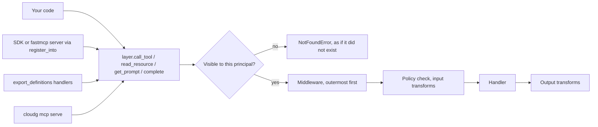

`cloudg mcp serve` is a thin wrapper around this class. Everything the server does, from the 74 tools to the policy that hides, redacts and pseudonymises, lives in `CloudGMCPLayer`, so you can embed the same catalog wherever your agent or server already runs. Importing `cloudg.mcp` pulls in nothing beyond cloudg's own dependencies; the official `mcp` SDK (the `cloudg[mcp]` extra) or `fastmcp` is imported only when you mount into one of them.

There are three ways in, and all of them end at the same four methods:

| You have | Use | You get |
|---|---|---|
| Python code, an agent loop, a test | `await layer.call_tool(...)`, `read_resource`, `get_prompt`, `complete` | `ToolResult`, resource contents, `PromptResult` objects |
| An MCP server built on the SDK or fastmcp | `layer.register_into(server)` | cloudg's tools, resources and prompts next to the host's own |
| A gateway or framework that speaks neither | `export_definitions(layer)` | MCP wire dicts plus async handlers, for one principal |



A tool the policy hides from the caller is indistinguishable from one that does not exist. Every other failure of a tool call (bad arguments, access denied, a handler exception, a timeout) comes back as a `ToolResult` with `is_error=True` that a model can read and recover from, rather than as an exception. Resources and prompts raise `MCPLayerError` subclasses instead.

## Building a layer

`CloudGMCPLayer(config=None, *, options=None, **kwargs)` takes every setting as a keyword or as one `LayerOptions` object (`from cloudg.mcp.layer import LayerOptions`); keywords next to `options` override its fields, and an unknown keyword raises `TypeError`. The settings people change most:

| Keyword | Default | Effect |
|---|---|---|
| `workspace` | `Workspace(config)` | The datasets the tools query, and the directories they may read and write. Pass your own to control both |
| `policy` | `$CLOUDG_MCP_POLICY`, else `"standard"` | A profile name, a policy file path, inline JSON, a dict or a `Policy` |
| `prefix` | `""` | Prepended to tool and prompt names (`cloudg_find_assets`); up to 64 of `A-Za-z0-9_.-` |
| `include_categories`, `exclude_tools` and the other filters | none | Build a filtered copy of the registry |
| `middleware` | `()` | Middleware callables, outermost first; `layer.use(mw)` appends one |
| `default_timeout` | 300 seconds | Per tool call; a tool's own `timeout_seconds` wins |
| `max_output_chars` | 200,000 | Cap on a result's text block |

The datasets come from the workspace. `workspace.load(path, name)` reads an `inventory-map.json`, a `findings.json` or a directory holding them, but only under the workspace's `allowed_roots`; with none given, those are the working directory and the report directory. A relative path is resolved against the first allowed root, not the current directory, so with `allowed_roots=["./reports"]` you load `"inventory-map.json"`, not `"./reports/inventory-map.json"`. `workspace.add_inventory(result, name)` adds an `InventoryResult` you already have in memory, with no files involved.

### Policies

The seven built-in profiles are `open`, `standard`, `strict`, `read_only`, `airgapped`, `audit` and `soc-analyst` (`cloudg.mcp.available_profiles()` lists them). The policy decides which tools each principal sees, whether calls are rate limited, and which transforms run over arguments and results: redaction, pseudonymisation of ARNs and account ids, projection, annotation. A call made without a `principal` runs as `Principal.local()` (id `local`, roles `default` and `local`), which is what a desktop client on stdio gets too. Pass `principal=Principal(id=..., roles={...})` to see what a remote caller would.

The same layer object can only have one policy. To serve two audiences from one process, build two layers over one shared `Workspace`, as the first example does.

## Examples

### Call the catalog in-process

No SDK, no server and no files: the inventory is built in memory, and the script calls tools and reads a resource as the local user, then again under the `strict` profile as a remote guest. An audit log middleware records each call with its argument values hashed.

```python title="mcp_inprocess.py"
"""Call the cloudg MCP layer in-process, as two different principals."""

import asyncio

from cloudg.inventory import InventoryResult
from cloudg.mcp import CloudGMCPLayer, Principal, Workspace
from cloudg.mcp.middleware import AuditLogMiddleware
from cloudg.schema.models import AssetType, CloudAsset, CloudProvider, EdgeType, NetworkEdge

ACCOUNT = "123456789012"


def asset(asset_id: str, asset_type: AssetType, arn: str, **extra) -> CloudAsset:
    return CloudAsset(id=asset_id, name=asset_id, asset_type=asset_type, provider=CloudProvider.AWS,
                      region="eu-west-1", account_id=ACCOUNT, arn=arn, **extra)


inventory = InventoryResult(
    assets=[
        asset("sg-web", AssetType.SECURITY_GROUP, f"arn:aws:ec2:eu-west-1:{ACCOUNT}:security-group/sg-web"),
        asset("web-1", AssetType.EC2, f"arn:aws:ec2:eu-west-1:{ACCOUNT}:instance/i-0web1",
              is_internet_exposed=True),
        asset("orders-db", AssetType.RDS_INSTANCE, f"arn:aws:rds:eu-west-1:{ACCOUNT}:db:orders-db"),
    ],
    edges=[
        NetworkEdge(source_id="0.0.0.0/0", target_id="sg-web", edge_type=EdgeType.SECURITY_GROUP_RULE,
                    port_range="22", protocol="TCP", cidr="0.0.0.0/0", direction="ingress"),
        NetworkEdge(source_id="web-1", target_id="sg-web", edge_type=EdgeType.ATTACHED_TO),
    ],
    providers=["aws"],
)


async def main() -> None:
    workspace = Workspace(allowed_roots=["."])
    workspace.add_inventory(inventory, "demo")
    audit = AuditLogMiddleware("mcp-audit.jsonl")  # argument values are hashed
    layer = CloudGMCPLayer(policy="standard", workspace=workspace, middleware=[audit])

    print(len(layer.list_tools()), "tools visible to the local user")

    result = await layer.call_tool("count_assets", {"group_by": "type"})
    print("count_assets:", result.structured["groups"])

    result = await layer.call_tool("find_assets", {"internet_exposed": True})
    print("exposed:", [(a["name"], a["arn"]) for a in result.structured["items"]])

    contents = await layer.read_resource("cloudg://datasets/demo/summary")
    print("summary resource:", contents[0].mime_type, len(contents[0].text), "chars")

    # A tool error comes back as an isError result, not an exception
    result = await layer.call_tool("get_asset", {"ref": "no-such-asset"})
    print("missing asset:", result.is_error, result.content[0].text)

    # The same layer under a stricter policy, for a remote caller
    strict = CloudGMCPLayer(policy="strict", workspace=workspace)
    guest = Principal(id="guest", roles={"default"})
    print(len(strict.list_tools(guest)), "tools visible to guest under strict")
    result = await strict.call_tool("find_assets", {"internet_exposed": True}, principal=guest)
    print("guest sees:", [(a["name"], a["arn"]) for a in result.structured["items"]])

    audit.close()
    with open("mcp-audit.jsonl") as fh:
        print("audit:", fh.readline().strip())


asyncio.run(main())
```

```console
$ python mcp_inprocess.py
73 tools visible to the local user
count_assets: {'EC2': 1, 'RDS_INSTANCE': 1, 'SECURITY_GROUP': 1}
exposed: [('web-1', 'arn:aws:ec2:eu-west-1:123456789012:instance/i-0web1')]
summary resource: application/json 734 chars
missing asset: True No asset matches the reference in this dataset. Use find_assets(query=...) to search by name, ARN or tag.
61 tools visible to guest under strict
guest sees: [('res-528c2a8001', 'arn:aws:ec2:eu-west-1:724607639135:instance/res-8a639d2144')]
audit: {"argument_hashes":{"group_by":"4653d2e6f4d67e7d"},"argument_keys":["group_by"],"duration_ms":1.59,"event":"mcp.call","kind":"tool","name":"count_assets","outcome":"ok","principal":{"id":"local","roles":["default","local"]},"request_id":null,"sensitivity":"internal","transforms":{...},"ts":"2026-10-09T16:42:45.339+00:00"}
```

The `transforms` object in the audit line is shortened here. What the run shows:

- Under `standard`, the local user sees 73 of the 74 tools. `reveal_token`, which reverses pseudonyms, stays hidden.
- `strict` hides 13 tools from the guest, among them the live tools (`map_inventory`, `run_pipeline`), the file exports and `sparql_query`, and it replaces names, account ids and ARN resource parts with format-preserving pseudonyms. The pseudonyms change on every run unless `CLOUDG_MCP_VAULT_KEY` is set; with the key they are stable across restarts.
- `get_asset` for a missing reference did not raise. The error text is fixed and does not echo the value the caller sent.

### Mount into an MCP server you already run

With mcp 2.x installed (`pip install "cloudg[mcp]"`), `register_into` adds the catalog to an `MCPServer` next to its own tools. Mount after the host has registered its own handlers. The second half of the script uses `export_definitions`, which needs no framework at all.

```python title="mcp_embed.py"
"""Mount cloudg's catalog next to a host server's own tool (mcp 2.x)."""

import asyncio

from mcp import Client
from mcp.server.mcpserver import MCPServer

from cloudg.inventory import InventoryResult
from cloudg.mcp import CloudGMCPLayer, Workspace, export_definitions
from cloudg.schema.models import AssetType, CloudAsset, CloudProvider

server = MCPServer("platform-tools")


@server.tool()
def ticket_count(team: str) -> int:
    """How many open tickets a team has (the host's own tool)."""
    return 7


inventory = InventoryResult(
    assets=[
        CloudAsset(id=f"vm-{i}", name=f"vm-{i}", asset_type=AssetType.EC2,
                   provider=CloudProvider.AWS, region="eu-west-1", account_id="123456789012")
        for i in range(3)
    ],
    providers=["aws"],
)
workspace = Workspace(allowed_roots=["."])
workspace.add_inventory(inventory, "demo")

layer = CloudGMCPLayer(policy="standard", workspace=workspace)
binding = layer.register_into(server, prefix="cloudg_")  # mount after the host's own tools


async def main() -> None:
    async with Client(server) as client:
        names = [t.name for t in (await client.list_tools()).tools]
        print(len(names), "tools:", names[:3], "...")
        res = await client.call_tool("cloudg_count_assets", {"group_by": "provider"})
        print("cloudg tool:", res.structured_content["groups"])
        res = await client.call_tool("ticket_count", {"team": "sec"})
        print("host tool:", res.content[0].text)

    # The same catalog without any MCP framework
    defs = export_definitions(layer)
    print(sorted(defs.handlers))
    reply = await defs.dispatch("tools/call", {"name": "cloudg_count_assets",
                                               "arguments": {"group_by": "type"}})
    print("dispatch:", reply["structuredContent"]["groups"], reply["isError"])


asyncio.run(main())
```

```console
$ python mcp_embed.py
74 tools: ['ticket_count', 'cloudg_workspace_status', 'cloudg_list_datasets'] ...
cloudg tool: {'AWS': 3}
host tool: 7
['completion/complete', 'prompts/get', 'prompts/list', 'resources/list', 'resources/read', 'resources/templates/list', 'tools/call', 'tools/list']
dispatch: {'EC2': 3} False
```

The host's `ticket_count` plus cloudg's 73 visible tools make 74. Run the server with its own runner (`server.run()`, `server.streamable_http_app()`); cloudg adds no transport of its own here. Verified with mcp 2.3.0; `register_into` also accepts an mcp 1.x `FastMCP`, a low-level `Server` and a `fastmcp.FastMCP` (2.x to 4.x).

With a prefix set, only prefixed names resolve, in-process too: `layer.call_tool("count_assets")` on this layer raises `NotFoundError`, and `cloudg_count_assets` works. That is what keeps cloudg from answering for a host tool that happens to share a name. Resource URIs are never prefixed; they already start with `cloudg://`.

### Run it as its own server from Python

`layer.serve()` is the same server `cloudg mcp serve` starts, with your layer:

```python title="serve_layer.py"
from cloudg.mcp import CloudGMCPLayer, Workspace

workspace = Workspace(allowed_roots=["./reports"])
workspace.load("inventory-map.json", "prod")  # relative to the first allowed root
layer = CloudGMCPLayer(policy="strict", workspace=workspace, prefix="cloudg_")
layer.serve("stdio")  # blocks until the client disconnects
```

For HTTP, `layer.serve("http", host="127.0.0.1", port=8765, auth_tokens=["env:MCP_TOKEN:analyst:ci"])` takes the same options as the CLI. The token spec format and the other transport settings are on the [cloudg mcp serve](/cli/mcp-serve/) page.

## Notes

- `register_into(server, prefix=...)` changes the layer's own prefix. Mounting one layer into two servers with different prefixes leaves both on the last one, with a warning; build one layer per prefix.
- On the low-level SDK servers, `register_into` wraps whichever handlers exist when it runs, so a host handler registered afterwards replaces cloudg's. Mount last.
- `cloudg.mcp.build_server(layer, flavor)` takes only the flavor (`auto`, `sdk`/`lowlevel`, `mcpserver`, `fastmcp`, `native`). `cloudg.mcp.adapters.build_server` also takes `name`, `principal_resolver`, `include` and native server keywords.
- `export_definitions(layer, principal)` snapshots the definitions for one principal. Its handlers dispatch through the layer, so the policy still applies per call; pass `principal=` to `dispatch()` to call as someone else.
- `cloudg.mcp.adapters` also has `to_openai_tools(layer)`, `to_anthropic_tools(layer)` and `to_langchain_tools(layer)` for function-calling APIs. Execute the model's tool calls with `await layer.call_tool(name, arguments, principal=...)`.
- Sync tool handlers run in a worker thread, so a slow graph build does not block the event loop. `notify_change()` is safe to call from those threads.
- A policy with `vault.path` set persists its pseudonym vault: `serve()` saves it when serving ends, and any process saves a changed vault at interpreter exit. Call `layer.policy.save_vault()` to save at a moment you choose, for example before a long-running worker is killed.

## Related

:::links
- [MCP server overview](/mcp/) What the catalog covers and how clients connect.
- [In-process use](/mcp/server/in-process-use/) Every layer method and the `ToolContext` handlers receive.
- [Built-in profiles](/mcp/privacy/built-in-profiles/) What each of the seven policies allows and transforms.
- [Tool index](/mcp/tools/tool-index/) All 74 tools by category.
- [cloudg mcp serve](/cli/mcp-serve/) The same layer behind stdio or HTTP.
:::
