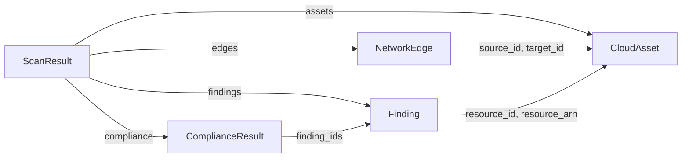

## How the models fit together

Every collector produces `CloudAsset` and `NetworkEdge` objects, every scanner parser produces `Finding` objects, and the normaliser bundles findings and their `ComplianceResult` entries into a `ScanResult`. The links between them are plain string ids, not object references:



Those references are not checked. An edge may point at an id no asset has (cloudg's own security group rules use the CIDR `0.0.0.0/0` as `source_id`, and the graph builder turns it into a node of its own), and a finding's `resource_id` is often an ARN or a Terraform address instead of an asset id. [`AssetIndex`](/api/dependencygraph/) is the matcher cloudg uses to resolve such references.

All five models are configured with `extra="allow"`: a field the model does not define is kept on the instance and written back out by `model_dump()`. That makes it easy to carry your own data (`CloudAsset(..., owner="team-orders")`) through cloudg's pipeline, and it also means a typo in a keyword argument is not an error.

## Enums and the big taxonomies

`Severity` has five members: `CRITICAL`, `HIGH`, `MEDIUM`, `LOW`, `INFO`. The normaliser sorts in that order. `CloudProvider` is `AWS`, `AZURE` or `GCP`, upper case, unlike `CloudGConfig.providers`, which uses lower-case strings. `ComplianceStatus` is `PASS`, `FAIL`, `NOT_APPLICABLE` or `MANUAL`.

All of them are `str` enums, so `Severity.HIGH == "HIGH"` is true, and pydantic accepts the plain string wherever the enum is expected. Values outside the enum raise a `ValidationError`.

`AssetType` has 156 values, from `EC2` and `S3_BUCKET` to `K8S_WORKLOAD`, `LANDING_ZONE` and `AI_GUARDRAIL`, plus `OTHER` for anything without a better fit. The [asset types by category](/reference/catalog/asset-types-by-category/) page lists them all, grouped, with the metadata each type carries.

`EdgeType` has 20 values. Eleven describe network and identity structure (`SECURITY_GROUP_RULE`, `NACL_RULE`, `ROUTE`, `IAM_TRUST`, `IAM_POLICY_ATTACHMENT`, `CONTAINS`, `PEERING`, `LOAD_BALANCER_TARGET`, `INTERNET_EXPOSED`, `ATTACHED_TO`, `REFERENCES`) and nine are the typed inventory relationships (`INVOKES`, `USES_IMAGE`, `ASSUMES_ROLE`, `GRANTS_ACCESS`, `LOGS_TO`, `PROTECTS`, `MONITORS`, `MANAGES`, `GOVERNS`), always read "source verb target". The finer `relationship` label on an edge comes from a separate vocabulary, documented under [relationship vocabulary](/reference/catalog/relationship-vocabulary/).

## Serialised forms

`model_dump(mode="json")` gives the shape cloudg writes to its JSON files. These two were produced by the script in the examples; only the random `id` values will differ on your machine.

```json title="CloudAsset"
{
  "id": "5a9456d0-7a28-4be8-b9c3-68b0675fc9b1",
  "arn": "arn:aws:s3:::orders-archive",
  "name": "orders-archive",
  "asset_type": "S3_BUCKET",
  "provider": "AWS",
  "region": "eu-west-1",
  "account_id": "123456789012",
  "tags": {
    "team": "orders"
  },
  "metadata": {
    "versioning": "Enabled",
    "kms_key_id": null
  },
  "collected_at": "2026-10-09T08:30:00",
  "is_internet_exposed": false,
  "display_id": "arn:aws:s3:::orders-archive"
}
```

`raw_data` is missing on purpose: the field is declared with `exclude=True`, so the provider's raw API response never leaves the process. `display_id` is a computed field, the ARN when there is one and the internal `id` otherwise.

```json title="Finding"
{
  "id": "dd17c2f7-6f95-47c4-960f-5d5b455c5035",
  "resource_id": "5a9456d0-7a28-4be8-b9c3-68b0675fc9b1",
  "resource_arn": "arn:aws:s3:::orders-archive",
  "severity": "HIGH",
  "title": "S3 bucket default encryption",
  "description": "Bucket has no default encryption",
  "evidence": null,
  "remediation": "Enable default encryption",
  "source_tool": "prowler",
  "source_finding_id": "prowler-aws-s3_bucket_default_encryption-123456789012-eu-west-1-orders-archive",
  "compliance_frameworks": [
    "CIS"
  ],
  "cvss_score": 7.2,
  "detected_at": "2026-10-09T08:31:00",
  "is_suppressed": false,
  "risk_score": 7.3
}
```

`risk_score` is computed on every read. Each severity has a base value (CRITICAL 9.5, HIGH 7.5, MEDIUM 5.0, LOW 2.5, INFO 0.5). Without a `cvss_score` the risk score is that base; with one, it is the mean of the base and the CVSS score, rounded to one decimal. Here that is (7.5 + 7.2) / 2 = 7.35, which Python's `round()` turns into 7.3. `cvss_score` itself must lie between 0 and 10.

`source_tool` holds one tool name, or several joined with `", "` after the normaliser merged findings from different scanners (`"trivy, prowler"`).

## Examples

### Build, inspect and round-trip the models

Runs offline.

```python title="models_tour.py"
import json
from datetime import datetime

from cloudg.schema.models import (
    AssetType, CloudAsset, CloudProvider, ComplianceResult, ComplianceStatus,
    EdgeType, Finding, NetworkEdge, ScanResult, Severity,
)

bucket = CloudAsset(
    arn="arn:aws:s3:::orders-archive",
    name="orders-archive",
    asset_type=AssetType.S3_BUCKET,
    provider=CloudProvider.AWS,
    region="eu-west-1",
    account_id="123456789012",
    tags={"team": "orders"},
    metadata={"versioning": "Enabled", "kms_key_id": None},
    raw_data={"Name": "orders-archive"},          # never serialised
    collected_at=datetime(2026, 10, 9, 8, 30),
)
public = NetworkEdge(
    source_id="0.0.0.0/0",                          # a CIDR, not an asset id
    target_id=bucket.id,
    edge_type=EdgeType.INTERNET_EXPOSED,
    port_range="443",
    protocol="TCP",
    cidr="0.0.0.0/0",
)
finding = Finding(
    resource_id=bucket.id,
    resource_arn=bucket.arn,
    severity=Severity.HIGH,
    title="S3 bucket default encryption",
    description="Bucket has no default encryption",
    remediation="Enable default encryption",
    source_tool="prowler",
    source_finding_id="prowler-aws-s3_bucket_default_encryption-123456789012-eu-west-1-orders-archive",
    compliance_frameworks=["CIS"],
    cvss_score=7.2,
    detected_at=datetime(2026, 10, 9, 8, 31),
)
control = ComplianceResult(
    framework="CIS",
    control_id="CIS/s3_bucket_default_encryption",
    status=ComplianceStatus.FAIL,
    finding_ids=[finding.id],
    resource_arn=bucket.arn,
)
result = ScanResult(assets=[bucket], findings=[finding], edges=[public], compliance=[control])

print(json.dumps(bucket.model_dump(mode="json"), indent=2))
print(json.dumps(finding.model_dump(mode="json"), indent=2))
print(result.summary)
print(finding.risk_score, bucket.display_id)

# Round trip: computed fields are dumped, so drop them before validating again
data = finding.model_dump(mode="json")
data.pop("risk_score")
assert Finding.model_validate(data) == finding
print("round trip ok")
```

The last lines of its output:

```console
$ python models_tour.py | tail -3
{'total_assets': 1, 'total_findings': 1, 'total_edges': 1, 'severity_breakdown': {'HIGH': 1}, 'compliance_frameworks': ['CIS']}
7.3 arn:aws:s3:::orders-archive
round trip ok
```

`ScanResult.summary` is computed too: totals of assets, findings and edges, the severity breakdown (only severities that occur), and the distinct compliance frameworks, in no particular order.

### Read a findings file back

```python title="load_findings.py"
import json

from cloudg.schema.models import Finding, Severity

COMPUTED = {"risk_score"}

with open("./reports/raw-findings.json") as f:
    raw = json.load(f)

findings = [
    Finding.model_validate({k: v for k, v in item.items() if k not in COMPUTED})
    for item in raw
]
urgent = [f for f in findings if f.severity in (Severity.CRITICAL, Severity.HIGH)]
for f in sorted(urgent, key=lambda f: f.risk_score, reverse=True):
    print(f"{f.risk_score:4} {f.severity.value:8} {f.resource_arn or f.resource_id}  {f.title}")
```

[parse_report](/api/parse-report/) shows how to write such a file from scanner output.

## Notes

Ids are random. `CloudAsset.id`, `Finding.id` and the others default to a fresh `uuid4` on every construction, so the same bucket collected twice gets two different ids. Use `arn` (or `display_id`) to match assets across runs, and `source_tool` plus `source_finding_id` plus the resource to match findings.

Computed fields come back as extras. Because of `extra="allow"`, validating a dump that still contains `display_id`, `risk_score` or `summary` does not fail; the value is stored as an extra attribute and ignored, and the property keeps computing the real one. `InventoryResult.load()` strips `display_id` for this reason, and the `load_findings.py` example does the same for `risk_score`.

Timestamps are naive. `collected_at`, `detected_at`, `started_at` and `completed_at` default to `datetime.utcnow()`, which has no timezone, and they serialise without an offset (`2026-10-09T08:30:00`). Treat them as UTC.

Assignment is not validated. `finding.severity = "SEVERE"` succeeds, and the plain string then fails later in code that reads `finding.severity.value`, such as `ScanResult.summary`, `PipelineResult.severity_breakdown` and the reports. Build a new model, or use `Finding.model_validate({**finding.model_dump(), "severity": ...})`, when values come from outside.

`is_suppressed` is honoured by the MCP findings tools, which hide suppressed findings unless asked. The normaliser, the reports and `PipelineResult.severity_breakdown` count them like any other finding.

`NetworkEdge.direction` defaults to `"ingress"` and `ports` to an empty list; most collectors fill `port_range` (`"80-443"`, `"22"`) instead of `ports`. Parallel security group rules between the same two nodes are separate edges in the data and are merged into one edge only inside the graph builder.

## Related

:::links
- [Asset types by category](/reference/catalog/asset-types-by-category/) All 156 `AssetType` values, grouped.
- [Relationship vocabulary](/reference/catalog/relationship-vocabulary/) The `relationship` labels on edges.
- [Result objects](/api/results/) The dataclasses that carry these models out of the engine.
- [FindingsNormaliser](/api/findingsnormaliser/) Where findings get merged, rescored and mapped.
- [Output files](/reference/output-files/) The JSON files these models are written to.
:::
