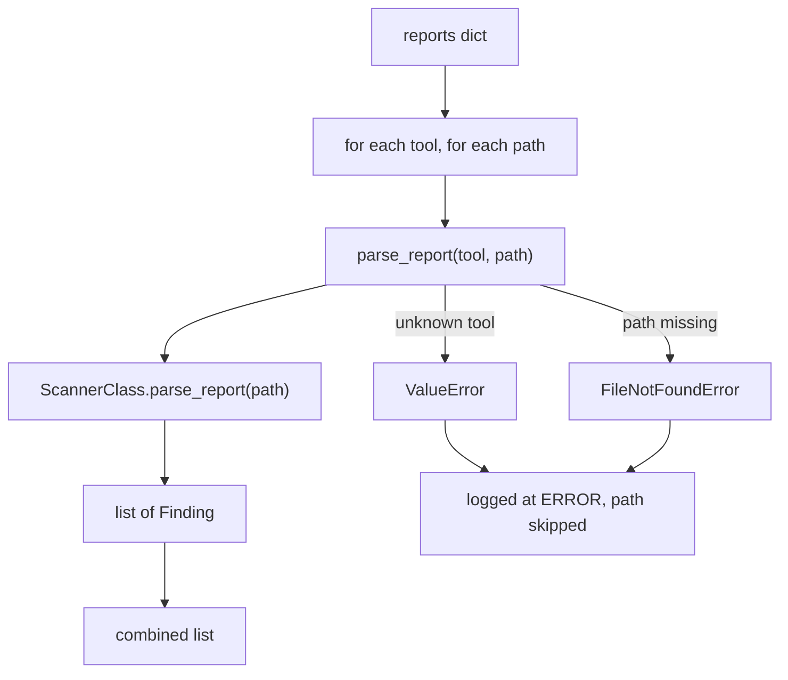

## Two functions, one dispatcher

`cloudg.ingest` is a small module with two public functions and one constant. `SUPPORTED_TOOLS` is the tuple `("prowler", "scoutsuite", "checkov", "trivy")`.

`parse_report(tool, path)` handles one report. It lower-cases and strips the tool name, checks that the path exists, and hands the path to the `parse_report` classmethod of the matching scanner wrapper: `ProwlerScanner`, `ScoutSuiteScanner`, `CheckovScanner` or `TrivyScanner` in `cloudg.scanners`. Those classmethods are public too, if you prefer to call one directly.

`ingest_reports(reports)` takes a dict of tool name to a list of paths and calls `parse_report` for each pair, collecting everything into one list. It is what `CloudGEngine.ingest_reports()` and `cloudg ingest` use underneath.



`parse_report` raises both errors. `ingest_reports` catches exactly those two, logs them on the `cloudg.ingest` logger at ERROR level, and carries on with the next path. A file that exists but does not parse (truncated JSON, the wrong tool's output) is handled one level down: the scanner wrapper logs a warning and returns what it could read, often an empty list. Neither function raises for bad content.

## What each tool accepts

| Tool | A file | A directory | Produce it with |
|---|---|---|---|
| `prowler` | an OCSF or ASFF JSON array or JSONL file | searched recursively for `*.json` | `prowler aws -o ./prowler-output` (OCSF) or `prowler aws -M json-asff -o ./prowler-output` |
| `scoutsuite` | `scoutsuite_results*.js` | searched recursively for `scoutsuite_results*.js` | `scout aws --report-dir ./scoutsuite-report --no-browser` |
| `checkov` | the JSON report | `results_json.json` anywhere below it, else every `*.json` | `checkov -d ./iac --output json > results_json.json` |
| `trivy` | an `image` or `fs` JSON report | every `*.json` below it | `trivy image --format json myrepo/app:latest > trivy-image.json` |

A few rules per tool decide what becomes a finding. Prowler records are read as OCSF or ASFF, record by record. Passing checks (ASFF `Compliance.Status` of `PASSED`, OCSF `status_code` of `PASS`) give no finding, and the check name inside the finding id (`prowler-<check>-...` or `prowler-<provider>-<check>-...`) becomes the deduplication key. ScoutSuite yields one finding per flagged item, with `danger`, `warning` and `caution` mapped to CRITICAL, HIGH and MEDIUM. Checkov findings come from `results.failed_checks`, whether the report is one object or a list of them (several frameworks). Trivy reports are split by their `ArtifactType`: `container_image` reports give vulnerability and secret findings, anything else also gives misconfigurations. [Input requirements](/guides/ingesting/#input-requirements) lists every field read.

The findings come back raw. Their severities are what the scanner said, duplicates are still there, and only scanner-native compliance tags are set. Pass them through [`FindingsNormaliser`](/api/findingsnormaliser/) (or `CloudGEngine.normalise_findings()`) before you count or report on them.

For Prowler, the list returned is a `FindingList`: a plain `list` subclass with a `passed_checks` set naming the checks that passed. `ingest_reports` returns a `FindingList` too, with the passed checks of every Prowler report in it. Hand the list to `FindingsNormaliser.normalise()` as it is and the compliance controls those checks map to get PASS results. `+=` keeps the left list's attribute (as in the example below), but `a + b` and `list(a)` build a plain list without it; pass `passed_checks=` to `normalise()` yourself in that case.

## Examples

### Parse first, decide later

Runs offline against one Prowler directory, one Checkov file and one Trivy file. Logging is on so the skipped paths are visible.

```python title="parse_first.py"
import logging

from cloudg.ingest import SUPPORTED_TOOLS, ingest_reports, parse_report
from cloudg.normaliser import FindingsNormaliser

logging.basicConfig(level=logging.INFO, format="%(levelname)s %(name)s: %(message)s")

print(SUPPORTED_TOOLS)
findings = parse_report("prowler", "./prowler-output/")
findings += parse_report("checkov", "./results_json.json")
print(len(findings), "findings from two reports")

# A typo'd tool name or a missing path is skipped by ingest_reports, not raised
more = ingest_reports({"trivy": ["./trivy.json", "./missing.json"], "trivvy": ["./trivy.json"]})
print(len(more), "findings from the batch")

try:
    parse_report("grype", "./trivy.json")
except ValueError as exc:
    print("ValueError:", exc)

scan_result = FindingsNormaliser().normalise(findings, more)
print(scan_result.summary["severity_breakdown"], len(scan_result.compliance), "control results")
```

```console
$ python parse_first.py
INFO cloudg.scanners.prowler: Parsed 1 findings from Prowler (1 passed checks)
INFO cloudg.scanners.checkov: Parsed 1 findings from Checkov
INFO cloudg.scanners.trivy: Parsed 1 findings from Trivy for myrepo/app:latest
INFO cloudg.ingest: [trivy] 1 findings ingested from ./trivy.json
ERROR cloudg.ingest: Skipping trivy report ./missing.json: Report path does not exist: ./missing.json
ERROR cloudg.ingest: Skipping trivvy report ./trivy.json: Unsupported tool 'trivvy'. Supported: prowler, scoutsuite, checkov, trivy
INFO cloudg.normaliser: Normalising 3 total findings from 2 sources
INFO cloudg.normaliser: After deduplication: 3 findings
('prowler', 'scoutsuite', 'checkov', 'trivy')
2 findings from two reports
1 findings from the batch
ValueError: Unsupported tool 'grype'. Supported: prowler, scoutsuite, checkov, trivy
{'CRITICAL': 1, 'HIGH': 2} 31 control results
```

The log lines appear first because logging writes to stderr and `print` to stdout. Without `logging.basicConfig()`, the two ERROR lines still reach stderr through Python's last-resort handler, but the INFO lines do not.

### Save findings for cloudg map

`cloudg map --findings` reads a JSON list of findings. This writes one from scanner output collected in CI, so a later map run on another host can overlay it.

```python title="export_findings.py"
import json
from pathlib import Path

from cloudg.ingest import ingest_reports

findings = ingest_reports(
    {
        "prowler": ["./prowler-output/"],
        "checkov": ["./results_json.json"],
        "trivy": ["./trivy.json"],
    }
)
out = Path("./reports/raw-findings.json")
out.parent.mkdir(parents=True, exist_ok=True)
out.write_text(json.dumps([f.model_dump(mode="json") for f in findings], indent=2))
print(f"wrote {len(findings)} findings to {out}")
```

```bash
cloudg map -p aws --regions all -o ./reports --findings ./reports/raw-findings.json
```

### One tool, no dispatcher

```python title="trivy_only.py"
from cloudg.scanners.trivy import TrivyScanner

for f in TrivyScanner.parse_report("./trivy.json"):
    print(f.severity.value, f.source_finding_id, f.resource_id, f.cvss_score)
```

## Notes

A misspelt tool name in `ingest_reports` costs you that tool's findings and one ERROR log line, nothing more. If you build the dict from user input, validate the keys against `SUPPORTED_TOOLS` first.

Directories are searched recursively, and for Prowler and Trivy every `*.json` file below the path is a candidate. Point them at the scanner's own output directory, not at a parent that also holds other JSON (a `reports/` folder with cloudg's own `findings.json`, say), or unrelated files are read as scanner output and mostly produce warnings.

`parse_report` passes the path to the scanner wrappers as a string. A `pathlib.Path` is fine as input to both functions.

The `resource_id` of a finding is whatever the scanner identified: an ARN for Prowler, a Terraform address such as `aws_s3_bucket.data` for Checkov, an image name for Trivy image scans. Matching those to collected assets is the job of [`AssetIndex`](/api/dependencygraph/) and of the asset map in [`InventoryMapper`](/api/inventorymapper/).

## Related

:::links
- [Ingesting existing output](/guides/ingesting/) The guide, with the CLI and the input formats in detail.
- [cloudg ingest](/cli/ingest/) The command built on these functions.
- [FindingsNormaliser](/api/findingsnormaliser/) The step that should follow parsing.
- [CloudGEngine](/api/cloudgengine/) `ingest_reports()` and `run_from_reports()` with hooks.
:::
