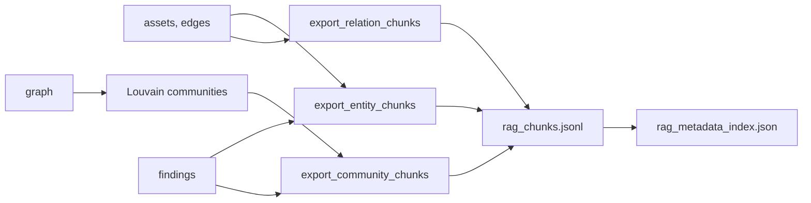

A language model answering questions about your cloud needs the right slice of the inventory in its context window, not the whole `inventory-map.json`. `RAGExporter` writes three kinds of chunk, each aimed at a different kind of question, as one JSON object per line. Embed the `content` field, keep `metadata` for filtering, and you have a retrieval corpus. Nothing in the exporter calls a model or an embedding API.

## Chunk kinds

| Kind | `chunk_id` | One chunk per | Good for |
|---|---|---|---|
| `entity` | `entity::<asset id>` | asset | "tell me about `orders-db`" |
| `community` | `community::<n>` | cluster of two or more tightly connected nodes (Louvain) | "what sits around this subnet?", blast-radius style questions |
| `relation_group` | `relation_group::<GROUP>` | relation group present (`NETWORK`, `IAM`, `SECURITY` and so on) | "list every rule open to the internet", "show the IAM grants" |

Every chunk has the same five keys: `chunk_id`, `chunk_type`, `content` (the text to embed), `metadata` (a flat-ish dict for filtering) and `relations` (a list of dicts).

| Kind | `metadata` keys | `relations` |
|---|---|---|
| `entity` | `asset_type`, `provider`, `region`, `account_id`, `arn`, `is_internet_exposed`, `relation_types`, `severity_max`, `compliance_frameworks`, `neighbour_count`, `finding_count` | every inferred relation of the asset's edges, with `predicate`, `direction` (`outgoing` or `incoming`), `object`, `object_id`, `evidence` |
| `community` | `community_id`, `member_count`, `asset_types`, `internal_edges`, `external_edges`, `internet_exposed_count`, `finding_count`, `severity_max`, `compliance_frameworks`, `risk_score` | empty |
| `relation_group` | `relation_group`, `total_relations`, `relation_type_counts`, `unique_subjects`, `unique_objects` | the first 50 triples, with `predicate`, `object`, `evidence` |

`severity_max` is the worst severity among the matched findings, or `"NONE"`. A community's `risk_score` is `0.3` per member plus `0.5` per finding plus `2.0` per internet-exposed member, capped at 10.

The relations are the ones the [ontology](/api/cloudontology/) uses: `infer_relations()` on each edge (so a security group rule from `0.0.0.0/0` on port 443 becomes `INGRESS_ALLOWED`, `INTERNET_REACHABLE` and `ONLY_HTTPS`), plus the asset-level relations from metadata (`ENCRYPTED_BY_KMS`, VPC containment from `vpc_id`, tag ownership, key rotation, EC2 security group membership). Relation-group chunks carry both; entity chunks carry the edge relations only.

Findings attach to assets through `AssetIndex`, so a finding whose `resource_id` is an ARN or a unique name still counts toward the right entity and community.

## Output files

`export_all()` writes two files into `output_dir` (created if missing) and returns their paths as `{"chunks": Path, "index": Path}`.

| File | Contents |
|---|---|
| `rag_chunks.jsonl` | one chunk per line: entity chunks first, then community, then relation-group |
| `rag_metadata_index.json` | `total_chunks`, `entity_chunks`, `community_chunks`, `relation_group_chunks`, `chunk_ids` (in file order) and `chunk_types` |



`cloudg run` writes these files twice. Phase 2c exports right after the graph is built, when the only findings are the reachability ones. After the scanners finish, a silent second pass rewrites both files with every finding. If that second pass fails, the files from phase 2c stay, with only reachability findings in them. `--no-rag-export` or `rag.enabled: false` turns the export off.

## Examples

### Export and reshape for a vector store

The script needs nothing beyond cloudg. It exports the chunks, then turns every chunk into an `{id, text, metadata}` record with plain-text content and scalar metadata, which is the shape most vector stores accept.

```python title="rag_demo.py"
"""Export RAG chunks for a small estate and reshape them for a vector store."""

import json
from pathlib import Path

from cloudg.graph.builder import GraphBuilder
from cloudg.graph.rag_export import RAGExporter
from cloudg.schema.models import (
    AssetType,
    CloudAsset,
    CloudProvider,
    EdgeType,
    Finding,
    NetworkEdge,
    Severity,
)

ACCOUNT = "123456789012"
REGION = "eu-west-1"


def asset(asset_id: str, asset_type: AssetType, arn: str, **extra) -> CloudAsset:
    return CloudAsset(
        id=asset_id,
        name=asset_id,
        asset_type=asset_type,
        provider=CloudProvider.AWS,
        region=REGION,
        account_id=ACCOUNT,
        arn=arn,
        **extra,
    )


assets = [
    asset("sg-web", AssetType.SECURITY_GROUP, f"arn:aws:ec2:{REGION}:{ACCOUNT}:security-group/sg-web"),
    asset("web-1", AssetType.EC2, f"arn:aws:ec2:{REGION}:{ACCOUNT}:instance/i-0web1",
          is_internet_exposed=True),
    asset("web-2", AssetType.EC2, f"arn:aws:ec2:{REGION}:{ACCOUNT}:instance/i-0web2"),
    asset("app-role", AssetType.IAM_ROLE, f"arn:aws:iam::{ACCOUNT}:role/app-role"),
    asset("orders-db", AssetType.RDS_INSTANCE, f"arn:aws:rds:{REGION}:{ACCOUNT}:db:orders-db"),
]
edges = [
    NetworkEdge(source_id="0.0.0.0/0", target_id="sg-web", edge_type=EdgeType.SECURITY_GROUP_RULE,
                port_range="443", protocol="TCP", cidr="0.0.0.0/0", direction="ingress"),
    NetworkEdge(source_id="web-1", target_id="sg-web", edge_type=EdgeType.ATTACHED_TO),
    NetworkEdge(source_id="web-2", target_id="sg-web", edge_type=EdgeType.ATTACHED_TO),
    NetworkEdge(source_id="web-1", target_id="app-role", edge_type=EdgeType.ASSUMES_ROLE),
    NetworkEdge(source_id="app-role", target_id="orders-db", edge_type=EdgeType.GRANTS_ACCESS),
]
findings = [
    Finding(
        resource_id="web-1",
        severity=Severity.HIGH,
        title="Instance metadata service v1 enabled",
        description="IMDSv2 is not enforced.",
        source_tool="prowler",
        compliance_frameworks=["CIS"],
    )
]

graph = GraphBuilder().build(assets, edges)
paths = RAGExporter().export_all(assets, edges, graph, findings, output_dir="rag-out")
print({kind: path.name for kind, path in paths.items()})

index = json.loads(paths["index"].read_text())
print({k: v for k, v in index.items() if k.endswith("chunks")})

chunks = [json.loads(line) for line in paths["chunks"].read_text().splitlines()]

# The content uses a few symbols; plain words embed and display more reliably
MARKERS = {
    "\N{WARNING SIGN}": "WARNING:",
    "\N{RIGHTWARDS ARROW}": "->",
    "\N{LEFTWARDS ARROW}": "<-",
    "\N{BULLET}": "-",
}


def clean(text: str) -> str:
    for symbol, word in MARKERS.items():
        text = text.replace(symbol, word)
    return text


def scalar(value):
    """Most vector stores accept only str, int, float and bool metadata."""
    if isinstance(value, (str, int, float, bool)):
        return value
    if isinstance(value, list):
        return ",".join(map(str, value))
    return json.dumps(value, sort_keys=True)


records = [
    {
        "id": c["chunk_id"],
        "text": clean(c["content"]),
        "metadata": {"chunk_type": c["chunk_type"],
                     **{k: scalar(v) for k, v in c["metadata"].items()}},
    }
    for c in chunks
]
out = Path("rag-out") / "vector-records.jsonl"
out.write_text("".join(json.dumps(r) + "\n" for r in records))
print(len(records), "records ->", out)

web_1 = next(r for r in records if r["id"] == "entity::web-1")
print(web_1["text"])
print(web_1["metadata"])

# Pre-filter on metadata before any similarity search
urgent = [r["id"] for r in records if r["metadata"].get("severity_max") in ("CRITICAL", "HIGH")]
print("high or critical:", urgent)
```

```console
$ python rag_demo.py
{'chunks': 'rag_chunks.jsonl', 'index': 'rag_metadata_index.json'}
{'total_chunks': 11, 'entity_chunks': 5, 'community_chunks': 2, 'relation_group_chunks': 4}
11 records -> rag-out/vector-records.jsonl
Resource: web-1
Type: EC2
Provider: AWS
Region: eu-west-1
ARN: arn:aws:ec2:eu-west-1:123456789012:instance/i-0web1
Account: 123456789012
WARNING: INTERNET EXPOSED

Relations (2):
  -> PROTECTED_BY_SG: sg-web
  -> RUNS_ON: app-role

Findings (1):
  [HIGH] Instance metadata service v1 enabled
{'chunk_type': 'entity', 'asset_type': 'EC2', 'provider': 'AWS', 'region': 'eu-west-1', 'account_id': '123456789012', 'is_internet_exposed': True, 'relation_types': 'PROTECTED_BY_SG,RUNS_ON', 'severity_max': 'HIGH', 'compliance_frameworks': 'CIS', 'neighbour_count': 2, 'finding_count': 1, 'arn': 'arn:aws:ec2:eu-west-1:123456789012:instance/i-0web1'}
high or critical: ['entity::web-1', 'community::1']
```

The community number can differ on your run (see the notes). Each line of `vector-records.jsonl` looks like this, wrapped here for reading:

```json title="rag-out/vector-records.jsonl"
{"id": "community::1",
 "text": "Community 1 (3 resources):\n  - web-1 (EC2)\n  - app-role (IAM_ROLE)\n  - orders-db (RDS_INSTANCE)\n\nAsset types: {'EC2': 1, 'IAM_ROLE': 1, 'RDS_INSTANCE': 1}\nInternal edges: 2, External edges: 1\nWARNING: 1 internet-exposed resources\nFindings: 1 (max severity: HIGH)",
 "metadata": {"chunk_type": "community", "community_id": 1, "member_count": 3,
              "asset_types": "{\"EC2\": 1, \"IAM_ROLE\": 1, \"RDS_INSTANCE\": 1}",
              "internal_edges": 2, "external_edges": 1, "internet_exposed_count": 1,
              "finding_count": 1, "severity_max": "HIGH", "compliance_frameworks": "CIS",
              "risk_score": 3.4}}
```

From here, loading into a store is a few lines in that store's own client: pass `id`, `text` (or your embedding of it) and `metadata` to its add or upsert call. Use the `chunk_type` and `severity_max` fields as filters so a question about one asset retrieves entity chunks first.

### Only one kind of chunk

The three `export_*` methods return `RAGChunk` objects without writing anything. Call one directly when you only want, say, the relation groups:

```python title="relation_chunks.py"
from cloudg.graph.rag_export import RAGExporter
from cloudg.inventory import InventoryResult

result = InventoryResult.load("./reports")
assets_by_id = {a.id: a for a in result.assets}
for chunk in RAGExporter().export_relation_chunks(result.edges, assets_by_id):
    data = chunk.to_dict()
    print(data["chunk_id"], data["metadata"]["total_relations"])
```

## Notes

- All three kinds are always written. The `rag.chunk_strategy` key in `config.yaml` (`entity`, `community`, `relation_group` or `hybrid`) is validated but not read by the exporter, and `max_chunk_tokens` (the constructor argument and `rag.max_chunk_tokens`) is stored but not applied. Chunk size is bounded by fixed caps instead: 30 relations and 10 findings in an entity chunk's text, 50 triples in a relation-group chunk. A community chunk lists every member, so a very large community makes a very long chunk; split such chunks yourself before embedding.
- Community numbers come from python-louvain's `best_partition` without a fixed seed, so `community::3` in one run is not the same cluster as `community::3` in the next. Key on members, not on the id. Without python-louvain installed, the exporter logs a warning and uses connected components instead.
- Communities are found on the undirected version of the graph, and nodes left alone in a community (singletons) produce no chunk. Placeholder nodes such as `0.0.0.0/0` take part in clustering like any other node.
- Entity chunks are built from the `NetworkEdge` list, so two rules on the same pair appear separately there. Community chunks read the graph, where `GraphBuilder` has merged them, and take `is_internet_exposed` from the graph's node attributes.
- `content` uses four non-ASCII symbols: a warning sign (U+26A0) before exposure lines, arrows (U+2192, U+2190) before outgoing and incoming relations, and a bullet (U+2022) before community members. `rag_chunks.jsonl` stores them as `\u` escapes, and they come back as the symbols when parsed. The example swaps them for words before embedding.
- `chunk_types` in the index comes from a set, so its order varies between runs.

## Related

:::links
- [CloudOntology](/api/cloudontology/) The same relations as RDF.
- [GraphBuilder](/api/graphbuilder/) Builds the graph the community chunks are cut from.
- [Graph, ontology and RAG](/guides/graph-ontology-rag/) The analysis phase end to end.
- [cloudg run](/cli/run/) The `--rag-export` switch.
- [Output files](/reference/output-files/) Where `rag_chunks.jsonl` sits among the other outputs.
:::
