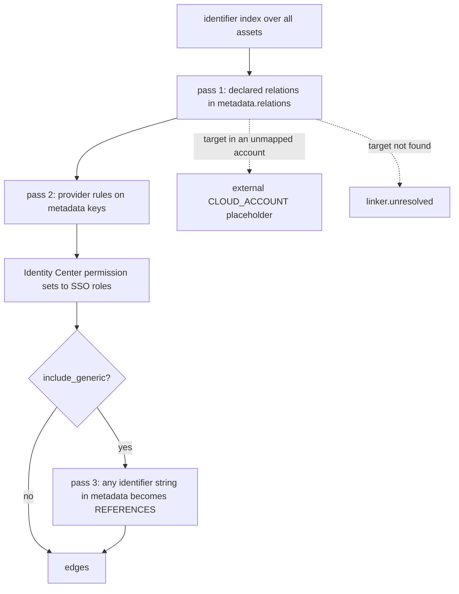

## How linking works

`RelationshipLinker(assets, materialize_external=True)` indexes every asset by the identifiers other resources use to point at it: ARN or resource ID, name, the short ID at the end of the ARN (`i-0b1c...`, `sg-0a1b...`), metadata keys such as `queue_url`, `repository_uri` or `zone_id`, every entry in `metadata["aliases"]`, and a few derived forms (an S3 bucket's `<name>.s3.amazonaws.com`, a load balancer's DNS name). Building the index makes no API calls and keeps no reference to a cloud session.

`link()` then makes three passes and returns the new edges:



Pass 1 reads `metadata["relations"]`, the list each collector fills with what an asset talks to. Pass 2 applies provider-aware rules to well-known metadata keys: `security_groups` and `nsg_id` (attachment), `subnet_id` and `vpc_config` (containment), `role_arn` (execution roles), `kms_key_id` (encryption), `origins` and `web_acl_id` (CloudFront and WAF), route table routes, ENI and volume attachments, VPC peering, Azure NIC wiring and the GCP `parent_full_resource_name`. Pass 3 walks every other string in the metadata, up to six levels deep, and links anything that looks like an ARN, an Azure resource ID, a GCP full resource name or an AWS short ID and resolves to another asset. Pairs already joined in either direction are skipped, so the generic pass only adds links nothing else found.

An edge is added once per `(source, target, edge_type)`. Every pass checks that key, and so does anything you register with `seed_existing()`.

### The relation object

Each entry in `metadata["relations"]` is a dict:

| Key | Required | Meaning |
|---|---|---|
| `target` | yes | Any identifier of the other asset: ARN, resource ID, name, short ID, alias. |
| `edge` | no | An [`EdgeType`](/api/models/) value such as `INVOKES` or `ASSUMES_ROLE`. Missing or unknown values become `REFERENCES`. |
| `relationship` | no | A finer label, copied to the edge's `relationship` (`TRIGGERED_BY`, `ENCRYPTED_BY_KMS`, `RUNS_ON`). The [relationship vocabulary](/reference/catalog/relationship-vocabulary/) lists the names cloudg's collectors use. |
| `reverse` | no | When true, the edge runs from the target to the declaring asset. Use it when the declaring side is the passive one: "my queue triggers me", "this account is trusted by me". |
| `description` | no | Copied to the edge's `description`. |
| `properties` | no | Copied to the edge's `properties`. |

Edges always read "source verb target": a queue `INVOKES` a function, a function `ASSUMES_ROLE` a role, a WAF `PROTECTS` an API.

### Resolving an identifier

`resolve(identifier, context=None)` returns the internal asset `id` an identifier points at, or `None`. When several assets share an identifier (two accounts each with a security group called `default`), the referencing asset passed as `context` decides: a candidate in the same account and region wins, then one in the same account, then a single global one. If it is still ambiguous, the answer is `None`; the linker would rather leave a reference unresolved than guess across accounts. Real assets win over placeholder nodes. When the exact string misses, normalised variants are tried (trailing dots and slashes stripped, among others), and a role ARN built from a bare name falls back to the role with that name in that account.

### External accounts and unresolved references

When a declared target does not resolve but its identifier names another AWS account, Azure subscription or GCP project, the linker creates a `CLOUD_ACCOUNT` placeholder with `metadata.external` set to `true` and points the edge at it. The original target is kept in the edge's `properties.external_reference`. The placeholders accumulate in `linker.external_assets`; add them to your asset list, or the new edges point at ids your list does not contain. Pass `materialize_external=False` to turn this off, and such references are reported as unresolved instead.

Declared relations that resolve to nothing at all go to `linker.unresolved`, one dict per reference with `source`, `source_name`, `target` and `edge_type`, capped at 2000 entries. A deleted dead-letter queue that is still configured, or a log group that was never created, typically shows up here.

## Examples

### Link a CMDB export

Five records from a hypothetical CMDB, with one edge the CMDB already had. Runs offline.

```python title="link_cmdb.py"
from cloudg.graph.builder import GraphBuilder
from cloudg.inventory import RelationshipLinker
from cloudg.schema.models import AssetType, CloudAsset, CloudProvider, EdgeType, NetworkEdge

ACCOUNT = "123456789012"
REGION = "eu-west-1"
KEY = f"arn:aws:kms:{REGION}:{ACCOUNT}:key/1111aaaa-22bb-33cc-44dd-555555eeeeee"
ROLE = f"arn:aws:iam::{ACCOUNT}:role/orders-worker-role"
QUEUE = f"arn:aws:sqs:{REGION}:{ACCOUNT}:orders-inbound"
TABLE = f"arn:aws:dynamodb:{REGION}:{ACCOUNT}:table/orders"
FUNCTION = f"arn:aws:lambda:{REGION}:{ACCOUNT}:function:orders-worker"


def cmdb_row(arn, name, asset_type, region=REGION, **metadata):
    """One record from a CMDB export, turned into a CloudAsset."""
    return CloudAsset(arn=arn, name=name, asset_type=asset_type, provider=CloudProvider.AWS,
                      region=region, account_id=ACCOUNT, metadata=metadata)


assets = [
    cmdb_row(KEY, "orders-key", AssetType.KMS_KEY),
    cmdb_row(ROLE, "orders-worker-role", AssetType.IAM_ROLE, region="global", relations=[
        # the role trusts an outside account; reverse: the edge runs account -> role
        {"target": "arn:aws:iam::999999999999:root", "edge": "IAM_TRUST",
         "relationship": "CROSS_ACCOUNT_TRUST", "reverse": True},
    ]),
    cmdb_row(QUEUE, "orders-inbound", AssetType.MESSAGE_QUEUE, kms_key_id=KEY),
    cmdb_row(TABLE, "orders", AssetType.DYNAMODB_TABLE, kms_key_id=KEY),
    cmdb_row(FUNCTION, "orders-worker", AssetType.LAMBDA_FUNCTION, role_arn=ROLE, relations=[
        {"target": QUEUE, "edge": "INVOKES", "relationship": "TRIGGERED_BY", "reverse": True},
        {"target": "orders", "edge": "REFERENCES", "relationship": "WRITES_TO"},
        {"target": f"arn:aws:logs:{REGION}:{ACCOUNT}:log-group:/aws/lambda/orders-worker",
         "edge": "LOGS_TO"},
    ]),
]

# An edge the CMDB already had; seed it so the linker does not add a second one
by_arn = {a.arn: a.id for a in assets}
existing = [NetworkEdge(source_id=by_arn[TABLE], target_id=by_arn[KEY], edge_type=EdgeType.REFERENCES)]

linker = RelationshipLinker(assets)
linker.seed_existing(existing)
edges = existing + linker.link()
assets += linker.external_assets

names = {a.id: a.name for a in assets}
for e in edges:
    print(f"{names[e.source_id]:28} {e.edge_type.value:13} {e.relationship or '-':20} {names[e.target_id]}")
print("unresolved:", [(u["source_name"], u["target"]) for u in linker.unresolved])

graph = GraphBuilder().build(assets, edges)
print(graph.number_of_nodes(), "nodes,", graph.number_of_edges(), "edges")
```

```console
$ python link_cmdb.py
orders                       REFERENCES    -                    orders-key
external account 999999999999 IAM_TRUST     CROSS_ACCOUNT_TRUST  orders-worker-role
orders-inbound               INVOKES       TRIGGERED_BY         orders-worker
orders-worker                REFERENCES    WRITES_TO            orders
orders-inbound               REFERENCES    ENCRYPTED_BY_KMS     orders-key
orders-worker                ASSUMES_ROLE  RUNS_ON              orders-worker-role
unresolved: [('orders-worker', 'arn:aws:logs:eu-west-1:123456789012:log-group:/aws/lambda/orders-worker')]
6 nodes, 6 edges
```

Reading the output line by line:

- The first edge is the seeded one. The table's `kms_key_id` would have produced the same `(table, key, REFERENCES)` edge, so the linker skipped it; the queue's `kms_key_id` had no seeded twin and became an `ENCRYPTED_BY_KMS` reference.
- The trust relation names account `999999999999`, which is not in the list, so a placeholder account node was created and the edge, reversed, runs from it to the role.
- `"orders"` resolved by name, because exactly one asset has that name.
- `role_arn` on the function produced `ASSUMES_ROLE` / `RUNS_ON` through a pass 2 rule, with no declared relation.
- The log group is not in the export, so that relation is in `unresolved`.

To feed the result into the rest of cloudg, wrap it in an [`InventoryResult`](/api/inventoryresult/) and call `export()`, or hand `assets` and `edges` to [`CloudGEngine.analyze()`](/api/cloudgengine/).

### Link only what was declared

For a strict view without the heuristic passes, switch off the generic scan and the placeholders:

```python title="declared_only.py"
from cloudg.inventory import RelationshipLinker
from cloudg.schema.models import AssetType, CloudAsset, CloudProvider

function = CloudAsset(
    arn="arn:aws:lambda:eu-west-1:123456789012:function:thumbnailer",
    name="thumbnailer",
    asset_type=AssetType.LAMBDA_FUNCTION,
    provider=CloudProvider.AWS,
    region="eu-west-1",
    account_id="123456789012",
    metadata={
        "relations": [{"target": "uploads", "edge": "INVOKES", "reverse": True}],
        "notes": {"previous_bucket": "arn:aws:s3:::uploads-legacy"},
    },
)
bucket = CloudAsset(
    arn="arn:aws:s3:::uploads",
    name="uploads",
    asset_type=AssetType.S3_BUCKET,
    provider=CloudProvider.AWS,
    account_id="123456789012",
)
legacy = CloudAsset(
    arn="arn:aws:s3:::uploads-legacy",
    name="uploads-legacy",
    asset_type=AssetType.S3_BUCKET,
    provider=CloudProvider.AWS,
    account_id="123456789012",
)

assets = [function, bucket, legacy]
strict = RelationshipLinker(assets, materialize_external=False).link(include_generic=False)
full = RelationshipLinker(assets).link()
print(len(strict), "declared edge(s);", len(full), "with the generic scan")
```

```console
$ python declared_only.py
1 declared edge(s); 2 with the generic scan
```

The generic scan found the ARN of `uploads-legacy` inside `metadata["notes"]` and added a `REFERENCES` edge for it. That is usually what you want for a map, and usually not what you want when you need every edge to be explainable by a declared relation.

## Notes

A linker instance is built for one asset list. `link()` starts from scratch on every call, so calling it again returns the same edges and leaves the same `linker.unresolved` list. Only edges registered with `seed_existing()` are left out of every call, and account placeholders are created once and reused.

The linker never modifies the assets you pass in. It only reads `metadata`, `arn`, `name`, `account_id`, `region` and `asset_type`, plus `raw_data` for a few AWS rules (instance profiles, the raw Lambda `Role` field). Assets loaded from an exported map have empty `raw_data`, so those rules do not fire on them.

`resolve()` without a `context` returns the first candidate for an ambiguous identifier instead of `None`. Pass the referencing asset when you call it yourself.

Errors inside a pass are caught per asset and logged at DEBUG on `cloudg.inventory.linker`, so one malformed asset cannot stop the run. If edges you expect are missing, turn on DEBUG for that logger.

## Related

:::links
- [InventoryMapper](/api/inventorymapper/) Runs the linker as part of every map.
- [DependencyGraph](/api/dependencygraph/) Dependency questions over the linked edges.
- [Relationship vocabulary](/reference/catalog/relationship-vocabulary/) The relationship names and what they mean.
- [Asset types by category](/reference/catalog/asset-types-by-category/) Which types exist and what they carry.
- [Inventory mapping](/guides/inventory-mapping/) The linker in the context of a full map.
:::
