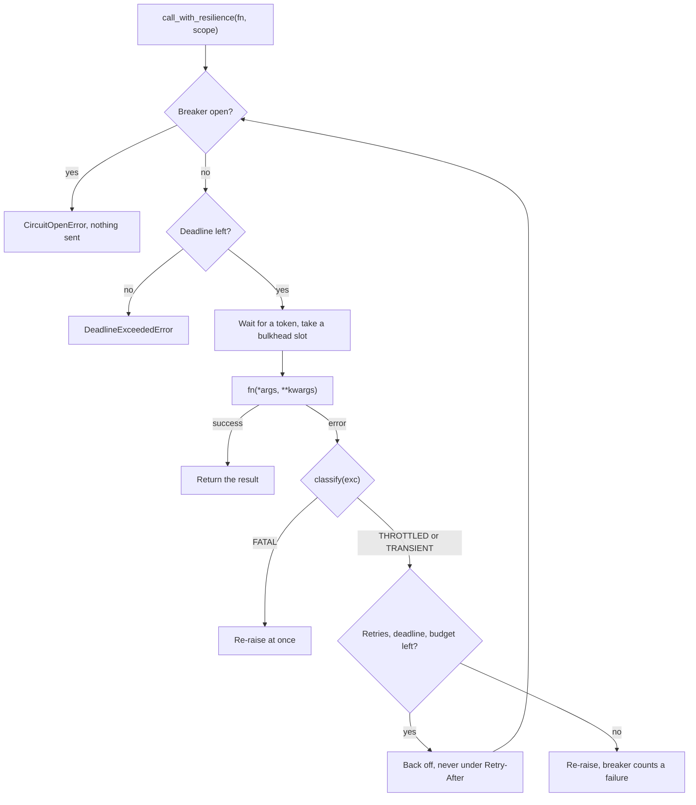

Every cloud call cloudg makes goes through one process-wide governor: adaptive token buckets per provider, account, region and service, a concurrency cap per account, a circuit breaker per bucket and a retry budget per provider. If your own code calls the same APIs in the same process (extra enumeration next to an `InventoryMapper` run, an MCP tool of your own, a CI job that maps and then queries), wrap those calls with `call_with_resilience` and they queue behind cloudg's instead of competing with them. A throttle your call hits slows cloudg's calls to that scope too, and the other way round.

## What happens to one call



A throttling error also halves the scope's rate (at most once per second) and pauses the scope for the server's Retry-After, capped at 300 seconds. After five seconds without a throttle each success gives back 5% of the configured rate. The backoff before a retry is decorrelated jitter, `min(cap, uniform(0.5, 3 x previous))`. Retries stop at the first of `max_retries` (8 by default), the per-call deadline (900 seconds) or an empty retry budget (500 per provider; the first two retries of each call are free, and each success refunds 0.1). When retrying stops, your original exception is re-raised, not a wrapper.

`classify()` decides what is retried. It reads error codes, HTTP statuses, exception class names and `Retry-After` style headers from botocore, azure-core, google-api-core, urllib, aiohttp and httpx errors by duck typing, without importing any SDK. An exception of your own with none of those attributes is FATAL and raised at once, unless its message mentions throttling ("rate exceeded", "throttl", "too many requests"). To make your own errors retryable, give them a `status_code` of 429 or 503 (throttling) or 500, 502, 504 (transient), plus `headers` with a `Retry-After` if you have one.

## Choosing a scope

A `Scope` says where the call goes, and its string form is what the telemetry shows: `aws/123456789012/eu-west-1/ec2/DescribeVpcs`, with `*` for a missing part.

| Part | AWS | Azure | GCP |
|---|---|---|---|
| `provider` | `"aws"` | `"azure"` | `"gcp"` |
| `account` | account id | subscription id, lower-case | `projects/<id>`, `organizations/<id>` or `folders/<id>` |
| `region` | client region | `None` | `None` |
| `service` | botocore service name (`ec2`, `iam`, `sts`) | provider namespace without `Microsoft.` (`network`, `compute`) | `cloudasset` |
| `operation` | API name (`DescribeVpcs`) | `None` | RPC name (`ListAssets`) |

Use the same values cloudg uses, or your calls land in different buckets and protect nothing. A call takes a token from a leaf bucket per account, region and service; the leaf goes down to the operation only for services marked `per_operation` (AWS `ec2` is, out of the box) or with an override keyed `"<service>.<Operation>"`. Breakers have the same granularity as the leaf.

Other provider names work too. `Scope("github", "my-org", None, "rest")` is paced at the generic defaults (20 rps per service, 64 calls in flight, 8 retries), but `config.yaml` can only tune `aws`, `azure` and `gcp`.

## Examples

### Pace, retry and report your own calls

The script needs botocore (a cloudg dependency) and no credentials: `describe_vpcs` raises a real botocore `ClientError` twice before answering, and `describe_secret` stands in for an async SDK call. `configure()` caps one service at 2 requests per second, and six concurrent calls show the limiter queueing them.

```python title="paced_calls.py"
"""Send your own cloud calls through cloudg's shared limiter, breakers and retries."""

import asyncio

from botocore.exceptions import ClientError

from cloudg.config import RateLimitConfig
from cloudg.resilience import (
    RetryPolicy,
    Scope,
    call_with_resilience,
    configure,
    get_governor,
    resilient,
    stats_scope,
)

ACCOUNT = "123456789012"

# 2 rps for this one service; every other AWS service keeps cloudg's defaults
configure(RateLimitConfig.model_validate(
    {"aws": {"services": {"secretsmanager": {"max_rps": 2, "burst": 2}}}}
))

attempts = {"describe": 0}


def describe_vpcs() -> dict:
    """Stands in for ec2.describe_vpcs(): throttled twice, then answers."""
    attempts["describe"] += 1
    if attempts["describe"] <= 2:
        raise ClientError({"Error": {"Code": "RequestLimitExceeded", "Message": "Rate exceeded"},
                           "ResponseMetadata": {"HTTPStatusCode": 503}}, "DescribeVpcs")
    return {"Vpcs": [{"VpcId": "vpc-0a1b2c3d"}]}


@resilient(lambda name, **_: Scope("aws", ACCOUNT, "eu-west-1", "secretsmanager", "DescribeSecret"),
           policy=RetryPolicy(max_retries=2, deadline=30.0))
async def describe_secret(name: str) -> str:
    """Stands in for an async SDK call; the decorator paces every call."""
    return f"arn:aws:secretsmanager:eu-west-1:{ACCOUNT}:secret:{name}"


async def main() -> None:
    ec2 = Scope("aws", ACCOUNT, "eu-west-1", "ec2", "DescribeVpcs")
    loop = asyncio.get_running_loop()
    with stats_scope() as stats:
        vpcs = await call_with_resilience(describe_vpcs, scope=ec2)
        start = loop.time()
        arns = await asyncio.gather(*(describe_secret(f"app-{i}") for i in range(6)))
        elapsed = loop.time() - start
    print(vpcs["Vpcs"], "after", attempts["describe"], "attempts")
    print(len(arns), f"secrets in {elapsed:.1f}s at 2 rps")
    for line in stats.messages():
        print(" ", line)
    summary = get_governor().summary(stats)
    print("totals:", summary["totals"])
    print("slowed:", {k: v["rate_rps"] for k, v in summary["slowed_buckets"].items()})


asyncio.run(main())
```

```console
$ python paced_calls.py
[{'VpcId': 'vpc-0a1b2c3d'}] after 3 attempts
6 secrets in 2.0s at 2 rps
  aws/123456789012/eu-west-1/ec2: throttled 2x, slowed to 5.0 rps, 2 retries
  aws/123456789012/eu-west-1/secretsmanager: waited 5.0s for rate limit
totals: {'calls': 9, 'throttled': 2, 'transient_errors': 0, 'retries': 2, 'gave_up': 0, 'rejected': 0, 'breaker_trips': 0, 'wait_seconds': 4.999}
slowed: {'aws/123456789012/eu-west-1/ec2/DescribeVpcs': 5.0}
```

Reading it:

- `describe_vpcs` is a plain function, so `call_with_resilience` ran it in a worker thread. Two `RequestLimitExceeded` errors classified as THROTTLED, so the call was retried, and the `DescribeVpcs` bucket dropped from its 20 rps ceiling to 10, then to 5. Throttles less than a second apart count as one congestion event, so depending on the backoff your run may stop at 10. Any cloudg collector calling `DescribeVpcs` for that account and region in this process now runs at that rate too, recovering by 1 rps every five seconds of quiet.
- Two of the six secret lookups used the burst; the other four queued at 0.5-second intervals. `wait_seconds` adds up the waits of all six callers, which is why it exceeds the wall-clock 2.0 seconds.
- `stats_scope()` collected this block only. `get_governor().summary()` without an argument reports everything since the process started.
- `summary["slowed_buckets"]` lists buckets below their ceiling or paused. Rates live in the governor, so they outlast the `with` block.

### A real boto3 client

The same call against AWS, which needs credentials. A sync boto3 method is passed as is, and its keyword arguments follow `scope=`:

```python title="describe_vpcs.py"
import asyncio

import boto3

from cloudg.resilience import Scope, call_with_resilience, stats_scope


async def main() -> None:
    ec2 = boto3.client("ec2", region_name="eu-west-1")
    scope = Scope("aws", "123456789012", "eu-west-1", "ec2", "DescribeVpcs")
    with stats_scope() as stats:
        vpcs = await call_with_resilience(ec2.describe_vpcs, scope=scope, MaxResults=50)
    print(len(vpcs["Vpcs"]), stats.messages())


asyncio.run(main())
```

boto3 also retries inside the call, so a throttled request can be retried both by botocore and by `call_with_resilience`. To hand a whole session to the governor instead, so every client created from it is paced with botocore's retries counted against the same budget, call `cloudg.resilience.aws.install_aws_hooks(session, account_id, region)` once and use the clients normally. Azure clients have the equivalent `cloudg.resilience.azure.build_azure_client(ClientClass, credential, subscription_id, ...)`.

## Notes

- `call_with_resilience` awaits coroutine functions and runs everything else with `asyncio.to_thread`. In synchronous code that already runs in a worker thread, use `call_with_resilience_sync`, which blocks with `time.sleep`.
- With `ratelimit.enabled: false`, or `ratelimit.<provider>.enabled: false`, `fn` is called once, directly, with no pacing and no retries.
- `configure()` accepts a `CloudGConfig`, a `RateLimitConfig` or a dict, and ignores anything else. It is idempotent: a provider whose settings did not change keeps its learned rates, breakers, budget and held slots. The settings are process-wide, so the last configuration applied wins for every caller in the process. `InventoryMapper` and `MultiAccountCollector` call it themselves with their config.
- An open breaker raises `CircuitOpenError` without sending the call; it carries `retry_after`. `RetryBudgetExhaustedError` and `DeadlineExceededError` do too. All three subclass `ResilienceError` and have a botocore-shaped `.response`, so error-code helpers that read `response["Error"]["Code"]` keep working.
- A FATAL answer from the provider (`AccessDenied`, a 404) proves the service is up, so it counts like a success for the breaker. An `AccessDenied` storm never opens a circuit.
- `reset_governor()` replaces the governor with a fresh one and forgets every learned rate. It exists for tests. `get_governor().reset()` clears the same learned state on the current governor and keeps its configuration.
- `cloudg.retry.with_retry` is the older decorator. It keeps its signature and also retries provider throttling recognised from codes and statuses, but it does not use the shared buckets or breakers.

## Related

:::links
- [Rate limits and throttling](/guides/rate-limits/) What cloudg does under throttling, and how to tune it.
- [ratelimit settings](/reference/config/ratelimit/) Every `ratelimit` key in `config.yaml`.
- [How one call is paced](/reference/resilience/how-one-call-is-paced/) Buckets, AIMD, breakers and the retry budget in depth.
- [Python API](/reference/resilience/python-api/) `LiveOperationGuard`, the bulkhead and other lower-level pieces.
- [CloudGMCPLayer](/api/mcp-layer/) Live MCP tools run under the same governor.
:::
