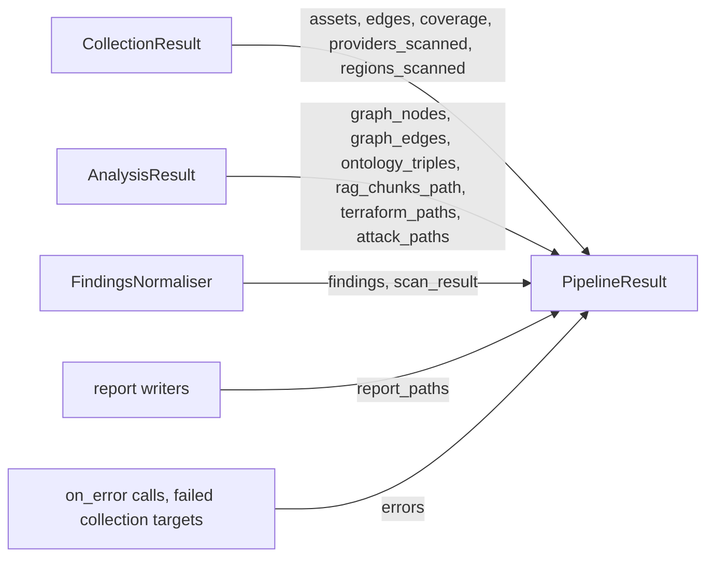

## Which method returns which

| Returned by | Type | Holds |
|---|---|---|
| `run_pipeline()`, `run_from_reports()` and their `_sync` twins | `PipelineResult` | assets, edges, normalised findings, the `ScanResult`, analysis counts, report paths, run metadata |
| `collect()` | `CollectionResult` | what the collectors found, before any scanning |
| `analyze()` | `AnalysisResult` | graph counts, ontology and RAG output paths, Terraform files, attack paths, reachability findings |

All three are `@dataclass` classes with defaults for every field, so you can also build them yourself, for instance in a test that feeds a fake `CollectionResult` to code that expects one. They are not pydantic models: there is no `model_dump()`, and `dataclasses.asdict()` will not turn the `CloudAsset` and `Finding` objects inside them into JSON. Use `to_summary()` for the headline numbers and dump the models yourself for the rest (see the examples).

## How run_pipeline fills a PipelineResult

`run_pipeline()` gets a `CollectionResult` from `collect()` and an `AnalysisResult` from `analyze()`, normalises the findings, writes the reports, and copies a subset of fields into one `PipelineResult`.



Some fields do not make the trip. `AnalysisResult.ontology_path`, `rag_chunk_count` and `reachability_findings` have no counterpart on `PipelineResult` (the reachability findings are merged into `findings` instead), and `duration_ms` on the pipeline result is the whole run, not the collection time. If you need those, drive the phases yourself with `collect()` and `analyze()`.

`run_from_reports()` fills only `findings`, `scan_result`, `report_paths`, `duration_ms` and `errors`. Everything that needs live assets stays at its default: empty lists, empty dicts, zero counts.

## Field notes

`findings` holds the normalised list when normalisation succeeded: deduplicated, rescored, sorted from CRITICAL to INFO. If normalisation failed, it holds the raw findings instead, `scan_result` is `None`, and `errors` says why.

`scan_result` is the [`ScanResult`](/api/models/) the normaliser produced. It is where the compliance mapping lives (`scan_result.compliance`, one `ComplianceResult` per framework control), and its `summary` adds `total_edges` and `compliance_frameworks` to the counts. In `run_pipeline()` its `edges` are set to the collected edges.

`severity_breakdown` counts `finding.severity.value` over `findings`, recomputed on every access. Only severities that occur appear as keys, so read it with `.get("CRITICAL", 0)`. `total_assets` and `total_findings` are `len()` of the lists.

`to_summary()` returns `total_assets`, `total_findings`, `severity_breakdown`, `providers_scanned`, `regions_scanned`, `graph_nodes`, `graph_edges`, `ontology_triples`, `attack_paths_count`, `duration_ms` and `errors`. Every value is a plain JSON type, so `json.dumps(result.to_summary())` works as is. `report_paths`, `rag_chunks_path` and `terraform_paths` hold `pathlib.Path` objects and are not part of the summary.

`regions_scanned` maps a provider to the regions it actually covered after `ALL` was expanded, for example `{"aws": ["eu-west-1", "eu-central-1"]}`.

`coverage` is a list of `CollectionCoverage` records, one per provider, account and region run, each with a `services` list of `SUCCESS`, `FAILED`, `PARTIAL` or `SKIPPED` entries. This is where the detail of a collection failure shows up; `errors` gets one `collection: ...` line per provider, account or region that failed as a whole. `cov.to_summary()` gives the counts and the failed services with their error text.

`attack_paths` is a `list[list[str]]`. Each inner list is a path of graph node ids, starting at an internet-exposed or external node and ending at the target of an `IAM_TRUST` edge, at most eight hops long. Node ids are asset ids, so map them back with `{a.id: a for a in result.assets}`. The search stops after about a hundred paths.

`errors` holds one string of the form `"<phase>: <message>"` per failure of the run: everything reported through the `on_error` hook (scanners, scanner credentials, graph, ontology, RAG, Terraform, normalisation, reporting; see [Event hooks](/api/event-hooks/)), plus, for `run_pipeline()`, one `collection: <provider> <account/region>: <error>` line per target that could not be collected. An empty list means nothing failed.

`AnalysisResult.ontology_path` is the last file the ontology was saved to. With the default `export_formats: [turtle, json-ld]` that is `ontology.jsonld`; `ontology.ttl` is written next to it. `rag_chunk_count` is the number of chunks written to `rag_chunks_path`, one per line.

## Examples

### Save a run and gate a build on it

Runs offline against existing Checkov and Trivy output.

```python title="save_result.py"
import json
import sys
from pathlib import Path

from cloudg import CloudGConfig, CloudGEngine

result = CloudGEngine(CloudGConfig()).run_from_reports_sync(
    {"checkov": ["./results_json.json"], "trivy": ["./trivy.json"]},
    output_dir="./reports",
)

# Headline numbers: plain JSON types only, safe to json.dumps
summary = result.to_summary()
print(json.dumps(summary, indent=2))

# Everything else: dump the pydantic models and stringify the paths yourself
payload = {
    "summary": summary,
    "findings": [f.model_dump(mode="json") for f in result.findings],
    "compliance": [c.model_dump(mode="json") for c in result.scan_result.compliance]
    if result.scan_result
    else [],
    "report_paths": {kind: str(path) for kind, path in result.report_paths.items()},
}
Path("./reports/run-summary.json").write_text(json.dumps(payload, indent=2))

breakdown = result.severity_breakdown            # only severities that occur
blocking = breakdown.get("CRITICAL", 0) + breakdown.get("HIGH", 0)
if blocking:
    print(f"{blocking} critical/high findings, failing the build", file=sys.stderr)
    sys.exit(1)
```

```console
$ python save_result.py
{
  "total_assets": 0,
  "total_findings": 2,
  "severity_breakdown": {
    "CRITICAL": 1,
    "HIGH": 1
  },
  "providers_scanned": [],
  "regions_scanned": {},
  "graph_nodes": 0,
  "graph_edges": 0,
  "ontology_triples": 0,
  "attack_paths_count": 0,
  "duration_ms": 1219,
  "errors": []
}
2 critical/high findings, failing the build
$ echo $?
1
```

### Read attack paths from an AnalysisResult

Four hand-built assets: a public API that invokes a function, the function's role, and an admin role that trusts it. Ontology and RAG export are switched off to keep the run quick.

```python title="attack_paths.py"
import asyncio

from cloudg import CloudGConfig, CloudGEngine
from cloudg.schema.models import AssetType, CloudAsset, CloudProvider, EdgeType, NetworkEdge

ACCOUNT = "123456789012"


def aws(name, asset_type, arn, exposed=False):
    return CloudAsset(name=name, asset_type=asset_type, arn=arn, provider=CloudProvider.AWS,
                      region="eu-west-1", account_id=ACCOUNT, is_internet_exposed=exposed)


api = aws("orders-api", AssetType.API_GATEWAY, "arn:aws:apigateway:eu-west-1::/restapis/a1b2c3d4e5", exposed=True)
fn = aws("orders-worker", AssetType.LAMBDA_FUNCTION, f"arn:aws:lambda:eu-west-1:{ACCOUNT}:function:orders-worker")
role = aws("orders-worker", AssetType.IAM_ROLE, f"arn:aws:iam::{ACCOUNT}:role/orders-worker")
admin = aws("ops-admin", AssetType.IAM_ROLE, f"arn:aws:iam::{ACCOUNT}:role/ops-admin")

assets = [api, fn, role, admin]
edges = [
    NetworkEdge(source_id=api.id, target_id=fn.id, edge_type=EdgeType.INVOKES),
    NetworkEdge(source_id=fn.id, target_id=role.id, edge_type=EdgeType.ASSUMES_ROLE),
    # ops-admin trusts orders-worker: the worker's role can assume it
    NetworkEdge(source_id=role.id, target_id=admin.id, edge_type=EdgeType.IAM_TRUST),
]


async def main() -> None:
    config = CloudGConfig()
    config.ontology.enabled = False
    config.rag.enabled = False
    analysis = await CloudGEngine(config).analyze(assets, edges, [], output_dir="./reports")

    names = {a.id: f"{a.name} ({a.asset_type.value})" for a in assets}
    print(analysis.graph_nodes, "nodes,", analysis.graph_edges, "edges")
    for path in analysis.attack_paths:
        print(" -> ".join(names.get(node, node) for node in path))


asyncio.run(main())
```

```console
$ python attack_paths.py
4 nodes, 3 edges
orders-api (API_GATEWAY) -> orders-worker (LAMBDA_FUNCTION) -> orders-worker (IAM_ROLE) -> ops-admin (IAM_ROLE)
```

### Check collection coverage

```python title="coverage_check.py"
from cloudg import CloudGConfig, CloudGEngine

result = CloudGEngine(CloudGConfig(providers=["aws"])).run_pipeline_sync("./reports")

for cov in result.coverage:
    s = cov.to_summary()
    print(f"{s['provider']:6} {s['account_id'] or '-':14} {s['region'] or '-':14} "
          f"{s['coverage_pct']:5.1f}% ({s['successful']}/{s['total_services']})")
    for failure in s["failures"]:
        print("    failed:", failure["service"], failure["error"])
```

This one needs AWS credentials.

## Notes

The dataclasses are mutable and hold the same objects the engine worked on. Changing `result.findings[0].severity` changes it everywhere that list is referenced, including `result.scan_result.findings`.

`total_assets` counts what was collected, not what was scanned: a scanner like Checkov reports findings against IaC resources that may not be in `assets` at all.

## Related

:::links
- [CloudGEngine](/api/cloudgengine/) The methods that return these objects.
- [Data models](/api/models/) Finding, CloudAsset, ScanResult and the enums.
- [Event hooks](/api/event-hooks/) The `on_error` calls that `errors` records.
- [Output files](/reference/output-files/) What the report paths point at.
:::
