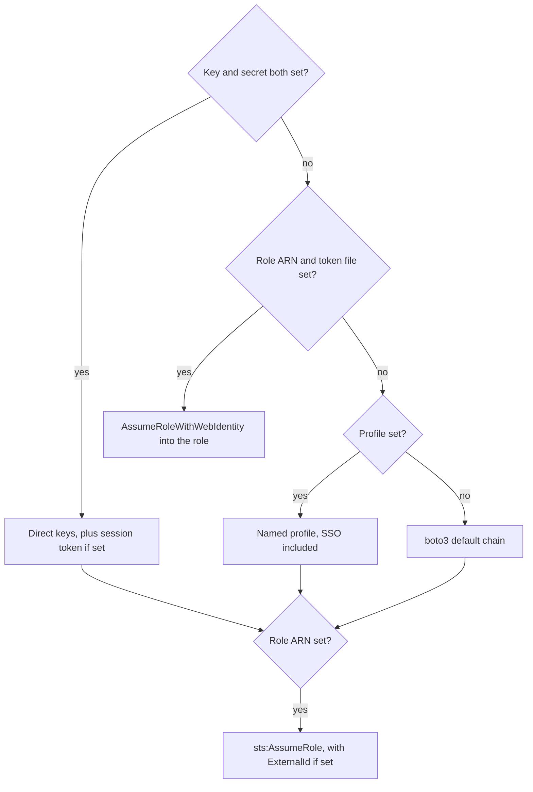

The credential flags exist on `cloudg run` only. Each one writes a single field of the loaded config and changes nothing else, so you can mix flags with values from `config.yaml`. `cloudg map` takes the same settings from `config.yaml` (it has `--profile` and nothing else). `cloudg collect` uses neither and works from the environment and default chains alone. The [Authentication](/guides/authentication/) guide covers the identities, roles and permissions each method needs; this page is about the flags.

:::warning Secrets on the command line
Values passed as flags can be seen in your shell history and, while cloudg runs, in the process list of the machine. Prefer the environment variables or a `config.yaml` with tight file permissions for secrets such as `--aws-secret` and `--azure-client-secret`.
:::

## AWS

| Flag | Config key | Environment fallback |
|---|---|---|
| `--aws-key` | `aws.access_key_id` | `AWS_ACCESS_KEY_ID`, through the boto3 default chain |
| `--aws-secret` | `aws.secret_access_key` | `AWS_SECRET_ACCESS_KEY`, same |
| `--aws-session-token` | `aws.session_token` | `AWS_SESSION_TOKEN`, same |
| `--aws-role-arn` | `aws.role_arn` | none |
| `--aws-external-id` | `aws.external_id` | none |
| `--aws-web-identity-token-file` | `aws.web_identity_token_file` | `AWS_WEB_IDENTITY_TOKEN_FILE`, read by cloudg |
| `--profile` | `aws.profile` | `AWS_PROFILE`, through the boto3 default chain |

cloudg builds the base session from the first method that is complete, then optionally assumes a role on top:



1. Direct keys need both `--aws-key` and `--aws-secret`. One without the other is ignored and the next method is tried. `--aws-session-token` is added when present, for temporary keys.
2. Web identity federation needs a role ARN and a token file. The token file comes from `--aws-web-identity-token-file`, or from `AWS_WEB_IDENTITY_TOKEN_FILE` when the flag is absent. This is the pattern for GitHub Actions, GitLab CI and EKS, with no stored keys.
3. A named profile, from `--profile`.
4. The boto3 default chain: environment keys, the shared credentials file, the SSO cache, container credentials and the instance role.

Then the role hop. If `--aws-role-arn` is set and step 2 did not already use it, cloudg calls `sts:AssumeRole` into it with the session name `aws.role_session_name` (default `cloudg-scan`) for one hour, passing `--aws-external-id` as `ExternalId` when given. Without a role ARN, `aws.accounts` plus `aws.role_name` in the config build a role ARN per account instead.

One interaction catches people on EKS. With IRSA, `AWS_WEB_IDENTITY_TOKEN_FILE` is already set in the pod. If you then pass `--aws-role-arn`, cloudg federates straight into that role with the pod's token, instead of assuming it from the pod's own role. The target role's trust policy must accept the cluster's OIDC provider.

## Azure

| Flag | Config key | Environment fallback |
|---|---|---|
| `--azure-tenant-id` | `azure.tenant_id` | `AZURE_TENANT_ID` |
| `--azure-client-id` | `azure.client_id` | `AZURE_CLIENT_ID` |
| `--azure-client-secret` | `azure.client_secret` | `AZURE_CLIENT_SECRET` |
| `--azure-cert-path` | `azure.certificate_path` | none read by cloudg |
| `--azure-federated-token-file` | `azure.federated_token_file` | `AZURE_FEDERATED_TOKEN_FILE` |
| `--azure-managed-identity` | `azure.use_managed_identity` | none |
| `--subscription-id` | `azure.subscription_ids` | none on `run`; `AZURE_SUBSCRIPTION_ID` on `collect` |

cloudg reads each setting from the config first and from the environment variable second, then tries the methods in this order:

1. Workload identity federation: tenant ID, client ID and a federated token file.
2. Service principal with a client secret: tenant ID, client ID and secret.
3. Service principal with a certificate: tenant ID, client ID and `--azure-cert-path` (PEM or PKCS12).
4. Managed identity, when `--azure-managed-identity` is set. For a user-assigned identity, put its client ID in `azure.managed_identity_client_id`; there is no flag for it.
5. `DefaultAzureCredential`, which covers environment variables, `az login`, Azure PowerShell and managed identity.

Methods 1 to 3 need the tenant ID and client ID. If either is missing, cloudg skips straight to 4 or 5. The order also means that `AZURE_TENANT_ID`, `AZURE_CLIENT_ID` and `AZURE_CLIENT_SECRET` left in the environment beat `--azure-managed-identity`. Unset them if you want the managed identity.

## GCP

| Flag | Config key | Environment fallback |
|---|---|---|
| `--gcp-credentials-file` | `gcp.credentials_file` | `GOOGLE_APPLICATION_CREDENTIALS`, through application default credentials |
| `--gcp-impersonate-sa` | `gcp.impersonate_service_account` | none |
| `--project-id` | `gcp.project_ids` | the credentials' default project |

`--gcp-credentials-file` takes a service account key JSON or a workload identity federation config (`"type": "external_account"`); both load the same way. Without it, cloudg uses application default credentials: the file in `GOOGLE_APPLICATION_CREDENTIALS`, your `gcloud auth application-default login` session, or the metadata server on GCE, GKE and Cloud Run.

`--gcp-impersonate-sa` adds a hop on top of either: cloudg impersonates that service account with the `cloud-platform` scope. The base identity needs `roles/iam.serviceAccountTokenCreator` on it.

## What the scanners get

The flags above configure cloudg's own collection. The scanner subprocesses that `cloudg run` starts receive much less:

| Scanner | Credentials passed |
|---|---|
| Prowler (AWS) | `AWS_ACCESS_KEY_ID` and `AWS_SECRET_ACCESS_KEY` from the direct keys, `AWS_DEFAULT_REGION` set to the first entry of `aws.regions`, and `-p` with the `--profile` flag value. Everything else in cloudg's environment is inherited. |
| ScoutSuite (AWS) | `--profile` with the `--profile` flag value |
| Prowler and ScoutSuite (Azure, GCP) | nothing; they use their own defaults and whatever `*_extra_args` you configure |
| Checkov, Trivy | nothing; they scan files and images |

In particular, `--aws-session-token`, role assumption and web identity federation are not passed on, and `aws.profile` from the config is not either (only the flag is). If temporary keys came in through flags, Prowler gets the key and secret without the token, and its calls fail. When you authenticate any way other than a profile or plain keys, export the credentials in the environment before `cloudg run`, so the scanners inherit them.

With `--regions all`, the first entry of `aws.regions` is the literal `ALL`, and that is what Prowler receives as `AWS_DEFAULT_REGION`. If Prowler then fails on the region, list the regions explicitly instead of using `all`.

## Examples

Keys that your CI secret store already exports as `AWS_ACCESS_KEY_ID`, `AWS_SECRET_ACCESS_KEY` and `AWS_SESSION_TOKEN`. The default chain picks them up, so no flag is needed, and Prowler inherits the same environment:

```bash
cloudg run -p aws --regions us-east-1
```

An auditor assuming a customer's role with an external ID:

```bash
cloudg run -p aws --profile auditor \
  --aws-role-arn arn:aws:iam::123456789012:role/ThirdPartyAudit \
  --aws-external-id 7f3c2a9e-example
```

OIDC federation in CI, with no stored keys:

```bash
cloudg run -p aws --regions all \
  --aws-role-arn arn:aws:iam::123456789012:role/cloudg-ci \
  --aws-web-identity-token-file "$RUNNER_TEMP/oidc-token"
```

An Azure service principal, secret from the environment:

```bash
export AZURE_CLIENT_SECRET="$(cat ./sp-secret)"
cloudg run -p azure \
  --azure-tenant-id 11111111-1111-1111-1111-111111111111 \
  --azure-client-id 22222222-2222-2222-2222-222222222222
```

Azure workload identity on AKS. The webhook sets `AZURE_TENANT_ID`, `AZURE_CLIENT_ID` and `AZURE_FEDERATED_TOKEN_FILE` in the pod, and cloudg reads all three, so no flag is needed:

```bash
cloudg run -p azure
```

The system-assigned managed identity of an Azure VM:

```bash
cloudg run -p azure --azure-managed-identity --subscription-id 00000000-0000-0000-0000-000000000000
```

A GCP service account key, impersonating a read-only account:

```bash
cloudg run -p gcp --project-id my-project \
  --gcp-credentials-file ./sa-key.json \
  --gcp-impersonate-sa cloudg-reader@my-project.iam.gserviceaccount.com
```

The same settings kept in `config.yaml`, which also works for `cloudg map`:

```yaml title="config.yaml"
aws:
  role_arn: arn:aws:iam::123456789012:role/cloudg-ci
  web_identity_token_file: /var/run/secrets/oidc/token
azure:
  tenant_id: 11111111-1111-1111-1111-111111111111
  client_id: 22222222-2222-2222-2222-222222222222
  certificate_path: /etc/cloudg/sp-cert.pem
gcp:
  credentials_file: /etc/cloudg/wif-config.json
  impersonate_service_account: cloudg-reader@my-project.iam.gserviceaccount.com
```

```bash
cloudg -c config.yaml map -p all --regions all
```

## Related

:::links
- [Authentication](/guides/authentication/) Identities, roles and least-privilege permissions per provider.
- [Provider and region flags](/cli/provider-flags/) `--profile`, `--subscription-id` and `--project-id`.
- [cloudg run](/cli/run/) The command these flags belong to.
- [AWS Organizations](/guides/aws-organizations/) Member-account roles for `cloudg map --org`.
:::
