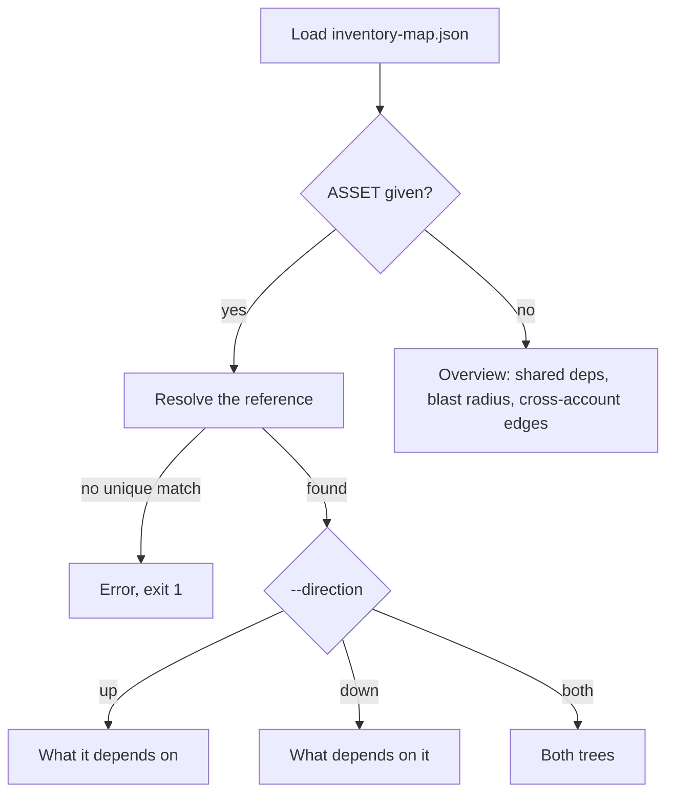

## How it works

The command loads `inventory-map.json` from `-m/--map`. You can pass the file itself or the folder that holds it; the default is `./reports`. If an `inventory-organization.json` sits next to the map, it is loaded too. From the assets and edges it builds a dependency graph in which every edge reads "dependent needs dependency". A Lambda function needs its role, its image, its KMS key and the queue that triggers it. A load balancer needs the WAF in front of it. A resource needs the CloudFormation stack that manages it.

What happens next depends on whether you name an asset.



### With an asset

`ASSET` can be an ARN or cloud resource ID, the internal asset ID, a name that is unique in the map, or a unique ARN tail (the part after the last `/`, such as `i-0bast`). If the reference matches nothing, or matches more than one asset, cloudg prints `No unique asset matches '<ref>'; use its ARN or resource ID` and exits with 1. Names like `default` are often ambiguous in multi-account maps, so ARNs are the safe choice.

`-d/--direction` picks the tree. `up` walks what the asset depends on. `down` walks what depends on it, which is its blast radius. `both` (the default) prints the two trees one after the other. `--depth` stops the walk after that many levels (default 3). Every node shows its name, type, account and region, and the edge that led to it in brackets:

```console
$ cloudg deps bastion --direction up --depth 2
bastion EC2 arn:aws:ec2:us-east-1:111111111111:instance/i-0bast depends on
├── prod-public-a SUBNET · 111111111111/us-east-1 (CONTAINS)
│   └── prod-vpc VPC · 111111111111/us-east-1 (CONTAINS)
├── sg-admin SECURITY_GROUP · 111111111111/us-east-1 (ATTACHED_TO)
└── bastion-admin IAM_ROLE · 111111111111/global (ASSUMES_ROLE)
    └── orders-db-credentials SECRET · 111111111111/us-east-1 (GRANTS_ACCESS)
```

```console
$ cloudg deps app-images --direction down --depth 2
app-images CONTAINER_REGISTRY arn:aws:ecr:eu-west-1:222222222222:repository/app-images needed by
(blast radius)
├── deploy-role IAM_ROLE · 222222222222/global (GRANTS_ACCESS)
│   ├── app-role IAM_ROLE · 111111111111/global (CROSS_ACCOUNT_TRUST)
│   └── vendor-co CLOUD_ACCOUNT · 999999999999/global (CROSS_ACCOUNT_TRUST)
└── api-handler LAMBDA_FUNCTION · 111111111111/us-east-1 (USES_IMAGE)
```

Both captures come from the synthetic estate in `tests/mcp/fixtures/sample_estate.py`, with the banner left out. A tree with no entries prints `nothing`.

### Without an asset

The overview has three tables, each cut to `--top` rows (default 15):

| Table | What it ranks |
|---|---|
| Most shared dependencies | Assets with the most direct dependents. Containment and peering edges are not counted, and an asset needs at least two dependents to appear. |
| Largest blast radius | Assets with the most transitive dependents (up to 10 levels), with the number of accounts affected and how many of those dependents are internet-exposed |
| Cross-account edges | Every edge whose two ends sit in different accounts, with `yes` in the External column when one end is an account that was not mapped |

The blast radius search does not walk every asset. It looks at the `4 x --top` assets with the most direct dependents and ranks those, which keeps the overview fast on big maps.

### JSON output

`--json` prints the same data as JSON: the tree object (`asset`, plus `depends_on` and/or `dependents`, each node with `via`, `relationship` and `children`) when you name an asset, or an object with `shared_dependencies`, `largest_blast_radius` and `cross_account_edges` otherwise. In JSON mode the cross-account list is complete; `--top` only limits the other two.

With `--json` the banner and log lines go to stderr, so stdout holds only the JSON and pipes straight into `jq`:

```bash
cloudg deps --map ./reports --json | jq '.largest_blast_radius[0]'
```

From Python, `InventoryResult.load()` and `dependency_graph()` return the same data (see the Python tab below).

## Examples

See the overview for the map in `./reports`:

```bash
cloudg deps
```

Read a map stored somewhere else and show the 30 biggest items in each table:

```bash
cloudg deps --map ./maps/2026-10-09/inventory-map.json --top 30
```

Check what a role can reach and what uses it, by ARN:

```bash
cloudg deps arn:aws:iam::123456789012:role/app-role
```

Before you delete a queue, see everything that would notice, five levels deep:

```bash
cloudg deps jobs-queue --direction down --depth 5
```

Feed a function's dependencies into another tool:

```bash tab="CLI"
cloudg deps api-handler --direction up --json > api-handler-deps.json
```

```python tab="Python" title="deps_tree.py"
import json

from cloudg.inventory import InventoryResult

result = InventoryResult.load("./reports")
graph = result.dependency_graph()

asset = graph.find("api-handler")
if asset is None:
    raise SystemExit("no unique asset matches 'api-handler'")

tree = graph.tree(asset.id, direction="up", max_depth=3)
print(json.dumps(tree, indent=2, default=str))

for row in graph.blast_radius(top=5):
    print(row["name"], row["transitive_dependents"])
```

## Exit codes

| Code | When |
|---|---|
| 0 | The tree or overview was printed |
| 1 | The map could not be loaded ("Could not load the inventory map"), or `ASSET` matched no single asset |
| 2 | Click rejected an option, for example `--direction sideways` |

## Related

:::links
- [Dependencies and blast radius](/guides/dependencies/) How to read the trees and what the edge types mean.
- [cloudg map](/cli/map/) Produces the inventory map this command reads.
- [DependencyGraph](/api/dependencygraph/) The Python class behind `deps`.
- [InventoryResult](/api/inventoryresult/) Loading and exporting saved maps.
- [MCP server](/mcp/) Ask the same questions from an AI assistant.
:::
