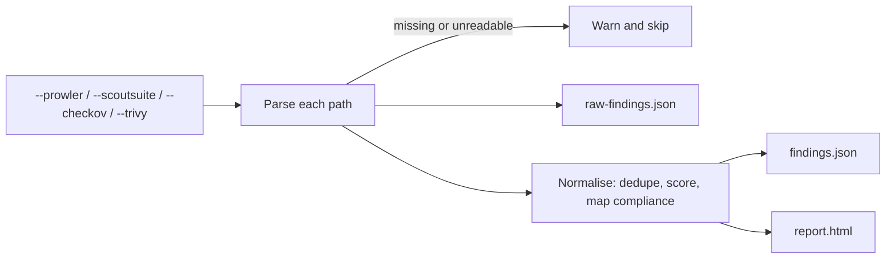

## How it works

You pass each tool's native output with its own flag. Every flag is repeatable, and any mix of tools works, from one Trivy file to all four scanners at once. A path can be a single file or the directory the tool wrote.



1. cloudg groups the paths by tool and prints them in an "Ingest Configuration" panel. With no input flag at all it stops with "No inputs" and exit code 1.
2. Each path goes through that tool's parser. A path that does not exist, or that the parser rejects, is skipped with a warning; the other paths still count. The per-tool totals are printed as they come in.
3. All findings are normalised together. Duplicates within one scanner and across scanners are merged using the check-equivalence rulesets, findings are rescored, and each one is mapped to compliance frameworks. The rulesets come from `rulesets.rules_dir`, so a custom ruleset directory in the config passed with `cloudg -c` takes effect here.
4. The pre-normalisation findings are written to `raw-findings.json`, and the normalised result is rendered in the formats `--format` asks for.

What each flag accepts:

| Flag | Accepts | Produce it with |
|---|---|---|
| `--prowler` | An OCSF or ASFF JSON array or JSONL file, or Prowler's output directory (searched recursively for `*.json`) | `prowler aws -o ./prowler-output` (OCSF, the default since Prowler 4) or `prowler aws -M json-asff -o ./prowler-output` |
| `--scoutsuite` | The `scoutsuite_results_*.js` file, or the report directory | `scout aws --report-dir ./scoutsuite-report --no-browser` |
| `--checkov` | A `checkov --output json` file, or a directory holding `results_json.json` | `checkov -d ./iac --output json > results_json.json` |
| `--trivy` | A `trivy image` or `trivy fs` JSON file, or a directory of them | `trivy image --format json myrepo/app:latest > trivy-image.json` |

[Ingesting existing output](/guides/ingesting/) lists the exact fields cloudg reads from each format.

Prowler's two JSON formats both work. Each record is read as OCSF when it has OCSF keys (`finding_info`, `class_uid` and so on) and as ASFF otherwise, so one directory can hold both. When it does, Prowler reports the same check twice, and normalisation merges the pair into one finding. A muted OCSF finding comes in with `is_suppressed` set. The MCP server's `load_dataset` and `ingest_reports` tools read OCSF the same way.

A run on three small test files (the samples in `tests/test_ingest.py`), with one missing path, prints this:

```console
$ cloudg ingest --prowler prowler.asff.json --checkov results_json.json --trivy trivy-image.json --trivy missing.json -o out
──────────────────────── Ingest Scanner Outputs ────────────────────────
╭────────── Ingest Configuration ───────────╮
│  prowler  prowler.asff.json               │
│  checkov  results_json.json               │
│    trivy  trivy-image.json, missing.json  │
╰───────────────────────────────────────────╯
  prowler: 1 findings
  checkov: 1 findings
  ⚠ trivy: skipping missing.json (Report path does not exist: missing.json)
  trivy: 1 findings
  ✓ JSON: out/findings.json
  ✓ HTML: out/report.html
  ✓ Raw findings: out/raw-findings.json

  ✓ Ingested 3 findings from 3 tool(s), 3 after deduplication
```

The INFO log lines between those rows are left out. The Prowler sample holds two records, but one of them has `Compliance.Status: PASSED`. A passing check gives no finding, which is why it reports 1; cloudg keeps its name, and the compliance controls that only passing checks map to get a PASS result.

## Examples

Turn a single Prowler run into an HTML report:

```bash
prowler aws -o ./prowler-output
cloudg ingest --prowler ./prowler-output/ -o ./reports
```

Combine image and filesystem scans from Trivy:

```bash
cloudg ingest --trivy ./trivy-image.json --trivy ./trivy-fs.json
```

Merge all four scanners from a CI artifact folder, so that the same issue reported by Prowler and ScoutSuite shows up once:

```bash
cloudg ingest \
  --prowler ./artifacts/prowler/ \
  --scoutsuite ./artifacts/scoutsuite-report/ \
  --checkov ./artifacts/results_json.json \
  --trivy ./artifacts/trivy/ \
  -o ./reports
```

Write only `findings.json` for a downstream job, and use your own rulesets:

```bash
cloudg -c config.yaml ingest --checkov ./results_json.json --format json -o ./out
```

Ingest, then overlay the findings on a fresh inventory map:

```bash
cloudg ingest --prowler ./prowler-output/ -o ./reports
cloudg map -p aws --regions all --findings ./reports/raw-findings.json -o ./reports
```

The same aggregation in Python, with no files written:

```bash tab="CLI"
cloudg ingest --prowler ./prowler-output/ --trivy ./trivy-image.json --format json
```

```python tab="Python" title="ingest_reports.py"
from cloudg.ingest import ingest_reports
from cloudg.normaliser import FindingsNormaliser

findings = ingest_reports({
    "prowler": ["./prowler-output/"],
    "trivy": ["./trivy-image.json"],
})
result = FindingsNormaliser().normalise(findings)
print(len(findings), "parsed,", len(result.findings), "after deduplication")
```

## Output files

Written to `-o/--output` (default `./reports`).

| File | Written when | Contents |
|---|---|---|
| `raw-findings.json` | always | Every parsed finding before normalisation, as a JSON list |
| `findings.json` | `--format json` or `all` | The normalised result: metadata, summary, findings, compliance. Its `assets` list and `graph` are empty, since nothing was collected. |
| `report.html` | `--format html` or `all` | The interactive report, without a topology |

There is no SVG format here, because ingest has no inventory to draw. `raw-findings.json` is the file to pass to `cloudg map --findings` later.

## Exit codes

| Code | When |
|---|---|
| 0 | Reports were written. This includes runs where every path was skipped; cloudg then warns "No findings parsed from the given reports" and writes empty reports. |
| 1 | No input flag was given |
| 2 | Click rejected an option, for example `--format svg` |

## Related

:::links
- [Ingesting existing output](/guides/ingesting/) Input formats in detail and how deduplication works.
- [cloudg scan](/cli/scan/) Run the scanners from cloudg instead.
- [cloudg report](/cli/report/) Re-render reports from a `findings.json`.
- [parse_report](/api/parse-report/) The parser behind each flag.
- [FindingsNormaliser](/api/findingsnormaliser/) Deduplication, scoring and compliance mapping.
:::
