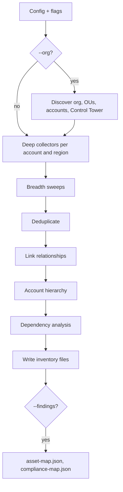

## How it works

Like `cloudg run`, the command starts from the config loaded by the root command (`cloudg -c config.yaml map ...`), or from built-in defaults when there is no `-c`. It then applies three groups of flags. A flag you leave out never clears a value the config set.

Scope flags come first. `-p/--provider` replaces `providers` (default `aws`; `all` means all three). `--regions` replaces the region list of every provider, and `all` turns into the `ALL` sentinel that triggers discovery. `--profile`, `--subscription-id` and `--project-id` work as they do on `run`. `--accounts` sets `aws.accounts` and `--role-name` sets `aws.role_name`.

Organization flags fill `aws.organization`. `--org/--no-org` sets `enabled`, `--org-role` sets `role_name`, `--ou` and `--exclude-account` set `include_ous` and `exclude_accounts`, and `--ct-home-region` sets `home_region`.

Inventory flags fill `inventory`. `--services` and `--exclude-services` take comma-separated family or collector names. `--kubernetes/--no-kubernetes` and `--cloud-control/--no-cloud-control` only change the config when you pass them, so the config file decides otherwise (both default to on).

`--sweep/--no-sweep` is different. It defaults to on and is always passed to the mapper, so it overrides `inventory.tagging_sweep` from the config file every time. To turn the tagging sweep off you have to pass `--no-sweep`.

The command prints the result as a "Map Configuration" panel before it calls any API. For `cloudg map -p aws --org --org-role cloudg-readonly --ou Workloads --regions all --services containers,serverless,security` it shows:

```console
$ cloudg map -p aws --org --org-role cloudg-readonly --ou Workloads --regions all --services containers,serverless,security
╭─────────────────────────── Map Configuration ───────────────────────────╮
│             Providers  aws                                              │
│           AWS regions  ALL                                              │
│              Services  containers, serverless, security                 │
│  Kubernetes workloads  enabled                                          │
│       Catch-all sweep  enabled                                          │
│   Cloud Control sweep  enabled                                          │
│              Scanners  none (inventory mapping is scanner-independent)  │
│          Organization  discover all accounts under Workloads            │
│           Member role  cloudg-readonly                                  │
╰─────────────────────────────────────────────────────────────────────────╯
```

The mapping run itself goes through these steps:



With `--org`, cloudg first lists the Organization from the account your credentials belong to (the management account, or a delegated administrator for the Organizations APIs). It picks the member accounts under `--ou`, drops `--exclude-account` entries, and, if you also passed `--accounts`, keeps only the accounts in both lists. The role assumed in each member account is `--org-role`, else `--role-name`, else `AWSControlTowerExecution`. If Control Tower is present and you asked for `--regions all`, only its governed regions are mapped (`aws.organization.use_governed_regions`, on by default).

Without `--org`, `--accounts` plus `--role-name` gives you the same fan-out over an explicit list. In both cases, if your own account is in the list, cloudg collects it with the base credentials instead of assuming the role, since member roles usually do not exist in the management account.

Deep collection runs per account and region. Account-wide services (IAM, S3, CloudFront, Route 53, Shield and others) run once per account, in the primary region, so `--regions all` does not repeat them. After the deep collectors, the breadth sweeps fill gaps: Cloud Control lists every resource type with a list handler, and the Resource Groups Tagging API finds tagged resources. When the same resource turns up twice, the dedicated collector wins, then Cloud Control, then the tagging API.

The linker then resolves every identifier the collectors recorded into typed edges (`INVOKES`, `USES_IMAGE`, `ASSUMES_ROLE`, `PROTECTS`, `GOVERNS` and so on), adds an account node above each account's top-level resources, and computes the dependency analysis. The [Inventory mapping](/guides/inventory-mapping/) guide lists the edge types.

The command prints an organization table (with `--org`), an inventory summary, the 15 services with the most assets, the 10 most shared dependencies, the 10 largest blast radii and up to 15 security service gaps. Here is the summary part for the synthetic estate in the test suite (`tests/mcp/fixtures/sample_estate.py`), so the numbers are small:

```console
           Inventory Summary
╭──────────────────────────────┬───────╮
│ Metric                       │ Value │
├──────────────────────────────┼───────┤
│ Assets                       │    44 │
│ Interconnections             │    56 │
│ Accounts                     │     5 │
│ Services                     │    23 │
│ Internet-exposed             │     6 │
│ Cross-account edges          │     3 │
│ External accounts referenced │     1 │
│ Security service gaps        │     1 │
│ Unlinked assets              │     2 │
│ Unresolved references        │     1 │
╰──────────────────────────────┴───────╯
```

If some collectors failed (an API you lack permission for, a region that is not enabled), the map is still written. cloudg prints one warning with the count and the first eight failures, as `account region service`. Run with `cloudg -v map ...` to see why each one failed, or look at the coverage records.

### Merging findings

`--findings` takes a cloudg findings file: a `raw-findings.json` from `cloudg scan` or `cloudg ingest`, or a `findings.json` report. Both shapes work, a bare list or an object with a `findings` key. The option is repeatable. Files that cannot be read or validated are skipped with a warning. Findings attach to assets by ARN, resource ID or name.

The merge happens after a fresh mapping run, because `--findings` belongs to `map`. To overlay findings on a map you already saved without calling the cloud again, use `InventoryMapper.export_merged()` from Python (see [InventoryMapper](/api/inventorymapper/)) or load both files into the MCP server.

### Credentials

`map` has no `--aws-key`, `--azure-*` or `--gcp-*` flags. It takes credentials from the config file, the standard environment variables, `--profile`, or the provider's default chain, in the order described under [Auth flags](/cli/auth-flags/). Put role ARNs, service principals and credential files in `config.yaml` when you map with something other than your default identity.

## Examples

Map one AWS account in every enabled region, using your default credentials:

```bash
cloudg map -p aws --regions all
```

Map the regions you care about with a named profile, into a dated folder:

```bash
cloudg map -p aws --profile audit --regions us-east-1,eu-west-1 -o ./maps/2026-10-09
```

Map every account in the Organization, from the management account, with a dedicated read-only role:

```bash
cloudg map -p aws --org --org-role cloudg-readonly --regions all
```

Limit an Organization run to one OU and skip a sandbox account:

```bash
cloudg map -p aws --org --ou Workloads --exclude-account 111122223333 --regions all
```

Map a fixed set of accounts without Organizations access:

```bash
cloudg map -p aws --accounts 111111111111,222222222222 --role-name cloudg-readonly --regions all
```

Narrow a run to containers and serverless, without reaching into the EKS clusters:

```bash
cloudg map -p aws --services containers,serverless --no-kubernetes --regions eu-west-1
```

Map Azure and GCP alongside AWS. Azure covers every enabled subscription unless you pass one:

```bash
cloudg map -p all --regions all --subscription-id 00000000-0000-0000-0000-000000000000 --project-id my-project
```

Map and overlay the findings of an earlier scan in one go:

```bash
cloudg map -p aws --regions all --findings ./reports/raw-findings.json -o ./reports
```

The same mapping from Python:

```bash tab="CLI"
cloudg map -p aws --profile audit --regions all -o ./reports
```

```python tab="Python" title="map_inventory.py"
from cloudg import CloudGConfig, CloudGEngine

config = CloudGConfig(providers=["aws"])
config.aws.profile = "audit"
config.aws.regions = ["ALL"]

engine = CloudGEngine(config)
result = engine.map_inventory_sync("./reports")
print(result.summary["total_assets"], "assets")
```

## Output files

Written to `-o/--output` (default `./reports`). The [output files reference](/reference/output-files/) describes each one in more detail.

| File | Written when | Contents |
|---|---|---|
| `inventory-map.json` | always | Summary, providers, resolved regions, assets, edges, unresolved references, and a `throttling` block when the run was throttled |
| `inventory-map.graphml` | always | The interconnection graph |
| `inventory-graph.json` | always | D3 graph with account and relationship attributes |
| `inventory-dependencies.json` | always | Most shared dependencies, largest blast radius, cross-account edges, security service coverage |
| `inventory-organization.json` | the Organization was mapped | OU tree, accounts, SCPs, Control Tower landing zone and controls |
| `asset-map.json` | `--findings` loaded at least one finding | Per-asset finding counts and severity breakdown, riskiest first |
| `compliance-map.json` | same | Framework to findings and affected assets |

`cloudg deps` and the MCP server's `load_dataset` read `inventory-map.json` and pick up `inventory-organization.json` from the same folder.

## Exit codes

| Code | When |
|---|---|
| 0 | The map was written, even if some collectors failed |
| 1 | Mapping failed as a whole, for example no usable credentials. cloudg prints an "Inventory mapping failed" panel. |
| 2 | Click rejected an option, such as `-p aws2` |

## Related

:::links
- [Inventory mapping](/guides/inventory-mapping/) What the map collects and how relationships are built.
- [AWS Organizations](/guides/aws-organizations/) Roles and permissions for `--org`.
- [cloudg deps](/cli/deps/) Query the saved map: what depends on what.
- [Dependencies and blast radius](/guides/dependencies/) How to read dependency trees.
- [Provider and region flags](/cli/provider-flags/) `--regions all` and discovery.
- [InventoryMapper](/api/inventorymapper/) The Python class behind the command.
:::
