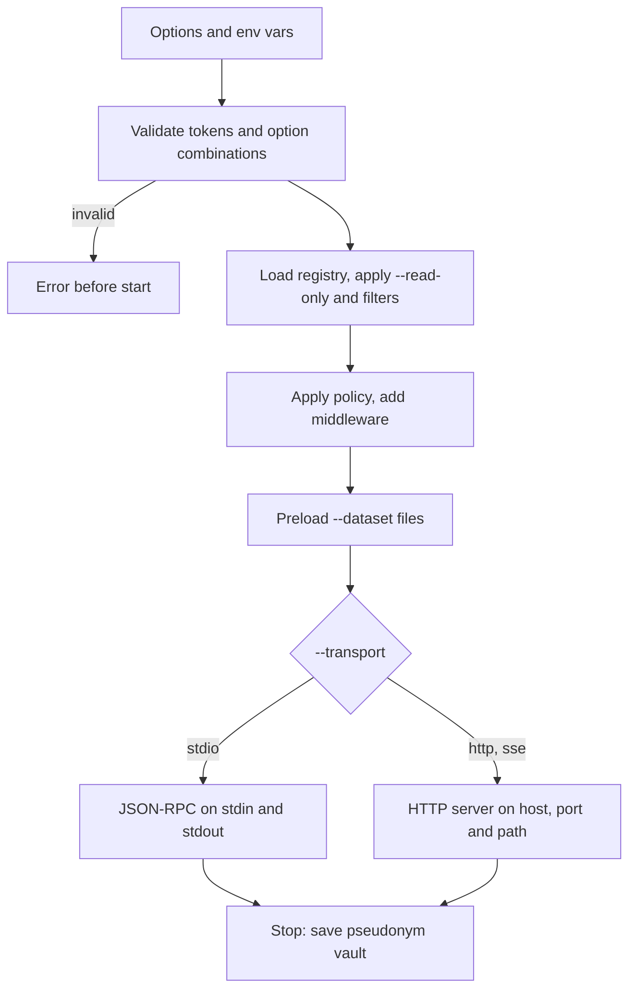

## How it works

The command builds one MCP layer from its options, picks a server implementation, and serves until the transport closes: end of input on stdio, Ctrl+C on HTTP.



### Building the layer

These options are shared with `tools`, `resources`, `prompts`, `call` and `read`, so you can check what a server will expose before you start it.

The registry is the built-in catalog unless `--registry MODULE:ATTR` names your own. `--read-only` then drops every tool that writes files, calls cloud APIs, runs scanners or is marked destructive. `--include-category`, `--exclude-category`, `--include-tool` and `--exclude-tool` narrow it further, and `--prefix` is put in front of every tool and prompt name (at most 64 characters from `A-Z a-z 0-9 _ . -`).

The policy comes from `--policy`, which accepts a profile name (`open`, `standard`, `strict`, `read_only`, `airgapped`, `audit`, `soc-analyst`), a YAML or JSON file, or inline JSON. Without the option, cloudg reads `CLOUDG_MCP_POLICY`, and without that it uses `standard`. The policy decides which tools each principal sees and which privacy transforms run on results. See [Built-in profiles](/mcp/privacy/built-in-profiles/).

Middleware is added from the options. A metrics middleware is always on, which is why `cloudg://metrics` is always listed. `--audit-log` (or `CLOUDG_MCP_AUDIT_LOG`) appends a JSONL record per call with argument values hashed. `--max-concurrency` caps parallel tool calls, and `--cache-ttl` caches results of read-only, idempotent tools for that many seconds. `--timeout` is the default per-call limit, 300 seconds; tools with their own limit, such as the live collection tools, keep theirs.

Each `--dataset [NAME=]PATH` is loaded before the server accepts a connection. Without a name, an `inventory-map.json` is named after its folder and anything else after its file stem. A `findings.json` next to an inventory map is loaded into the same dataset. Dataset paths you give here are trusted and may sit outside the workspace's allowed roots; those roots only limit the paths tools may open.

`-c/--config` points the layer at a cloudg `config.yaml`, which the live tools use for providers and credentials. Without it, the config given to the root `cloudg -c` is used.

### Choosing a flavor

`--flavor auto` uses the official `mcp` SDK when it is installed and the built-in, dependency-free server otherwise. `native`, `sdk` and `fastmcp` force one. Some options only work with some flavors, and the command refuses the combination instead of ignoring the option:

```console
$ cloudg mcp serve --transport http --flavor sdk --cors-origin http://x
Error: --cors-origin is only supported by the native flavor (use --flavor native)
$ cloudg mcp serve --transport sse --flavor fastmcp --json-response
Error: --json-response / --stateless apply to Streamable HTTP; the fastmcp flavor cannot combine them with --transport sse
```

`--page-size` (items per page in list results) only applies to the native flavor. [Flavors](/mcp/server/flavors/) compares them.

### stdio

stdio is the default. The client starts the process and talks newline-delimited JSON-RPC over stdin and stdout. cloudg keeps stdout for protocol messages only: the banner, logs and notices all go to stderr. You can see this by piping requests in by hand. This exchange used the native flavor and a dataset from the test suite's sample estate; output lines are cut:

```console
$ printf '%s\n' \
    '{"jsonrpc":"2.0","id":1,"method":"initialize","params":{"protocolVersion":"2025-06-18","capabilities":{},"clientInfo":{"name":"shell","version":"0"}}}' \
    '{"jsonrpc":"2.0","method":"notifications/initialized"}' \
    '{"jsonrpc":"2.0","id":2,"method":"tools/call","params":{"name":"count_assets","arguments":{"group_by":"provider"}}}' \
  | cloudg mcp serve --flavor native --dataset prod=inventory/inventory-map.json 2>/dev/null
{"jsonrpc":"2.0","id":1,"result":{"protocolVersion":"2025-06-18","capabilities":{"tools":{"listChanged":true},...},"serverInfo":{"name":"cloudg","version":"0.6.0","title":"cloudg"},...}}
{"jsonrpc":"2.0","id":2,"result":{"content":[{"type":"text","text":"{\n  \"dataset\": \"prod\",\n  \"group_by\": \"provider\",\n  \"total\": 44, ..."}],"isError":false,"structuredContent":{...}}}
```

Auth tokens are ignored on stdio. Whoever launched the process is the local user, and the policy treats them that way.

### HTTP

`--transport http` (or its alias `streamable-http`) serves Streamable HTTP at the address built from `--host`, `--port` and `--path`, which is `http://127.0.0.1:8765/mcp` by default. `--transport sse` adds the deprecated `/sse` and `/messages/` endpoints for older clients. When the server is up, it prints one line to stderr:

```console
$ cloudg mcp serve --transport http --port 8799
cloudg MCP server (mcp SDK 2.x, http) listening on http://127.0.0.1:8799/mcp
```

`--json-response` answers POSTs with plain JSON instead of an SSE stream, and `--stateless` drops sessions for clients that cannot keep one.

Three checks protect an HTTP server:

| Check | Default | Change it with |
|---|---|---|
| `Origin` header | Loopback origins only, on every bind and every flavor | `--allowed-origin PATTERN` (repeatable, replaces the default) |
| `Host` header | Loopback names when bound to loopback; not checked on other binds | `--allowed-host PATTERN` (repeatable) |
| Bearer token | None: every HTTP caller is the `anonymous` principal with the `default` role | `--auth-token TOKEN[:ROLES[:ID]]` (repeatable) or `CLOUDG_MCP_AUTH_TOKENS` |

Each token spec maps a bearer token to a principal. `ROLES` is a comma-separated list, and the principal always gets the `default` role as well. `TOKEN` can be `env:VARNAME` so the secret stays out of your shell history and process list. A token that itself contains `:` needs the full three-part form. `CLOUDG_MCP_AUTH_TOKENS` holds several specs separated by whitespace.

The tokens are checked before the server starts. An empty token, given directly or through a variable that is not set, stops the command rather than starting a server without the authentication you asked for:

```console
$ cloudg mcp serve --transport http --auth-token env:CLOUDG_MCP_TOKEN
Error: Invalid value for --auth-token: Environment variable 'CLOUDG_MCP_TOKEN' for an auth token is empty
```

:::warning Binding beyond loopback
Keep `--host 127.0.0.1` unless you also set `--auth-token`. On a non-loopback bind the `Host` header is not checked unless you pass `--allowed-host`, so set that too.
:::

`--cors-origin` grants CORS to a browser origin. Only the native flavor supports it.

### Stopping

When the transport closes, cloudg saves the pseudonym vault if the policy configures a `vault.path`. Without one, pseudonyms live in memory and change on the next start unless `CLOUDG_MCP_VAULT_KEY` is set.

## Examples

Serve over stdio with the default `standard` policy, the way a desktop client starts it:

```bash
cloudg mcp serve
```

Preload yesterday's map and findings and apply the `strict` policy:

```bash
cloudg mcp serve --policy strict --dataset prod=/srv/cloudg/reports/inventory-map.json
```

Expose only inventory and graph tools, with no way to call the cloud or write files:

```bash
cloudg mcp serve --read-only --include-category inventory --include-category graph --dataset ./reports/inventory-map.json
```

Start without the root banner and config handling, through the standalone `cloudg-mcp` entry point (`python -m cloudg.mcp` does the same):

```bash
cloudg-mcp serve --dataset ./reports/inventory-map.json
```

Serve Streamable HTTP on loopback for a local web client:

```bash
cloudg mcp serve --transport http
```

Serve HTTP with two tokens mapped to roles, and keep an audit trail:

```bash
export CLOUDG_ANALYST_TOKEN="$(openssl rand -hex 32)"
export CLOUDG_ADMIN_TOKEN="$(openssl rand -hex 32)"
cloudg mcp serve --transport http \
  --auth-token env:CLOUDG_ANALYST_TOKEN:analyst:alice \
  --auth-token env:CLOUDG_ADMIN_TOKEN:admin,analyst:ops \
  --audit-log ./mcp-audit.jsonl
```

Make the server reachable from other hosts, with tokens and explicit Host and Origin lists:

```bash
cloudg mcp serve --transport http --host 0.0.0.0 \
  --auth-token env:CLOUDG_MCP_TOKEN:analyst \
  --allowed-host 'mcp.internal.example:*' \
  --allowed-origin 'https://console.internal.example'
```

Debug a client that misbehaves, with full logs on stderr:

```bash
cloudg mcp serve --log-level DEBUG 2> ./mcp-server.log
```

## Exit codes

| Code | When |
|---|---|
| 0 | The transport closed normally: end of input on stdio, Ctrl+C on HTTP |
| 1 | The layer could not be built: a dataset path that does not exist, an invalid `--prefix`, a policy file that is missing or fails to load (`Error: Policy file not found: nope.yaml`) |
| 2 | An option was rejected before start: an empty or malformed `--auth-token`, a flavor and option combination that does not work, a `--registry` that does not resolve to a `Registry` |

## Related

:::links
- [Connect a client](/mcp/connect/) Step-by-step setup for each desktop client.
- [cloudg mcp config](/cli/mcp-config/) Generate the client configuration snippet.
- [Transports and protocol versions](/mcp/server/transports-and-protocol-versions/) stdio, Streamable HTTP and SSE in detail.
- [Security model in brief](/mcp/server/security-model-in-brief/) What the policy, tokens and Origin checks protect.
- [Built-in profiles](/mcp/privacy/built-in-profiles/) What each `--policy` profile shows and hides.
- [cloudg mcp tools](/cli/mcp-tools/) Check what a policy exposes before you serve it.
:::
