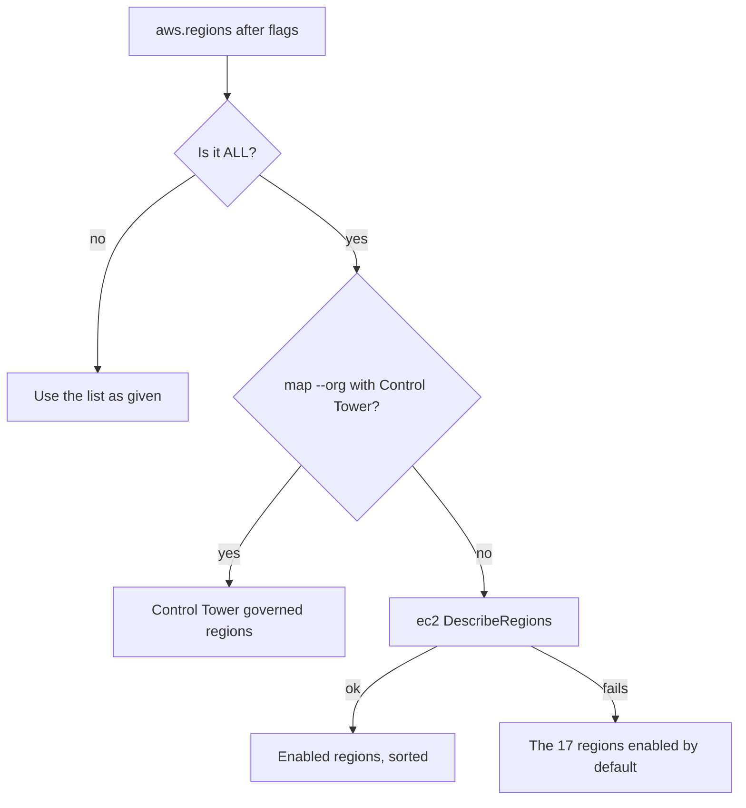

## Which command takes which flag

| Flag | `run` | `map` | `collect` | `scan` |
|---|---|---|---|---|
| `-p/--provider` | required, repeatable, `aws`, `azure`, `gcp` or `all` | repeatable, same choices, default `aws` | required, one of `aws`, `azure`, `gcp` | one of `aws`, `azure`, `gcp`, default `aws` |
| `--region` | AWS only, ignored when `--regions` is set | none | AWS only, default the first of `aws.regions` | none |
| `--regions` | yes | yes | none | none |
| `--subscription-id` | yes | yes | yes | none |
| `--project-id` | yes | yes | yes | none |
| `--profile` | yes | yes | yes | yes |

`deps`, `ingest`, `report` and the `mcp` commands work on files and take none of these. The MCP live tools read providers and regions from the config passed with `-c`, or from their own arguments.

On every command here a flag replaces the matching value from the config passed with `-c`, and a flag you leave out keeps the config value. Below the config come the environment and each SDK's default credential chain.

## -p, --provider

On `run` and `map`, repeat the flag to cover several clouds in one run (`-p aws -p gcp`), or pass `all` for all three. Matching is case-insensitive. The result replaces `providers` in the config. Collection for the selected providers runs concurrently.

`collect` and `scan` take exactly one provider and have no `all`. `scan` passes it to Prowler and ScoutSuite as their provider argument.

## --region and --regions

`--regions` is the flag to reach for. It takes either a comma-separated list or the word `all`:

```bash
cloudg map -p aws --regions us-east-1,eu-west-1,ap-southeast-2
cloudg map -p aws --regions all
```

A list replaces the region list of all three providers at once (`aws.regions`, `azure.regions` and `gcp.regions`). That does no harm in a mixed run, because Azure Resource Graph and GCP Cloud Asset Inventory return resources from every location in one call and don't iterate regions. It does mean the run configuration panel shows AWS region names next to Azure. To keep separate lists, set them in `config.yaml` and leave `--regions` out.

`all` (in any case) becomes the sentinel `["ALL"]`, which starts region discovery when collection begins. You can write `regions: [ALL]` in `config.yaml` for the same effect.

`--region` is older and narrower. On `run` it sets `aws.regions` to one region, and only when `--regions` is absent. On `collect` it is the single AWS region to collect. Without it, `collect` takes the first entry of `aws.regions` from the config, then `AWS_DEFAULT_REGION`, then `us-east-1`; an `aws.regions` of `ALL` counts as unset there.

Without either flag, `run` and `map` use the config: `aws.regions` defaults to `["us-east-1"]`, while `azure.regions` and `gcp.regions` default to `["ALL"]`.

### How discovery works



| Provider | API | Filter | Fallback |
|---|---|---|---|
| AWS | `ec2:DescribeRegions`, with the run's credentials, in the session's region (`AWS_REGION` or `AWS_DEFAULT_REGION`, else `us-east-1`) | `opt-in-status` is `opt-in-not-required` or `opted-in` | the 17 regions enabled by default in every account, no opt-in regions |
| Azure | `SubscriptionClient.subscriptions.list_locations` for the first subscription | none | 47 built-in locations |
| GCP | Compute Engine `regions.list` for the first project | `status == "UP"` | 40 built-in regions |

Discovery never stops a run. When the SDK is missing or the call fails, cloudg logs a warning and uses the built-in list for that provider.

In `cloudg run` and `cloudg map`, the AWS region lookup uses the same credentials as collection: `--profile`, the `--aws-*` flags and the config's keys, role or web identity. When those cannot authenticate or the call fails, cloudg logs a warning and scans the 17 regions every account has enabled (`AWS_DEFAULT_ENABLED_REGIONS` in `cloudg.region_discovery`); opt-in regions are never guessed. Pass `--regions` to pick them yourself.

On `cloudg map --org`, when Control Tower is found and the region list is `ALL`, the governed regions of the landing zone replace discovery. Turn that off with `aws.organization.use_governed_regions: false`.

Account-wide AWS services (IAM, S3, CloudFront, Route 53, Shield and others) are collected once per account in the primary region, so a long region list does not repeat them.

## --subscription-id

Sets `azure.subscription_ids` to that one subscription. For several, list them in `config.yaml`:

```yaml title="config.yaml"
azure:
  subscription_ids:
    - 00000000-0000-0000-0000-000000000000
    - 11111111-1111-1111-1111-111111111111
```

Without it, `run` and `map` collect every subscription the credential can see in the Enabled state, as long as `azure.all_subscriptions` is true (the default). Set that to false to take only the first one. `collect` needs a subscription: the flag, else the first of `azure.subscription_ids` in the config, else `AZURE_SUBSCRIPTION_ID` in the environment.

## --project-id

Sets `gcp.project_ids` to that one project. Without it, cloudg uses the project of the application default credentials. On `collect`, the first of `gcp.project_ids` in the config and then `GOOGLE_CLOUD_PROJECT` are checked before that.

To cover a whole GCP organization in one Cloud Asset Inventory listing, set `gcp.organization_id` in the config; `gcp.project_ids` then filters that listing instead of driving it.

## --profile

An AWS CLI profile name, SSO profiles included. On `run` and `map` it sets `aws.profile`, which sits third in the AWS credential order: direct keys and OIDC federation win over it. See [Auth flags](/cli/auth-flags/).

On `run`, `collect` and `scan` it replaces `aws.profile` the same way. `run` and `scan` also hand the profile to the scanners, for AWS only: Prowler gets `-p <profile>` and ScoutSuite gets `--profile <profile>`, unless direct keys or a `role_arn` win, in which case they get the resulting keys instead. On `collect`, with no profile from the flag or the config, `AWS_PROFILE` and then the default chain apply.

## Examples

Two AWS regions and one GCP project in one run:

```bash
cloudg run -p aws -p gcp --regions us-east-1,eu-west-1 --project-id my-project
```

Every enabled AWS region, with discovery and collection using the same profile:

```bash
cloudg map -p aws --profile audit --regions all
```

All three clouds with discovery everywhere:

```bash
cloudg map -p all --regions all
```

One Azure subscription, mapped on its own:

```bash
cloudg map -p azure --subscription-id 00000000-0000-0000-0000-000000000000
```

A quick single-region credential check:

```bash
cloudg collect -p aws --profile audit --region ap-southeast-2
```

## Related

:::links
- [Auth flags](/cli/auth-flags/) Credentials for each provider and which method wins.
- [Output flags](/cli/output-flags/) Where results go.
- [cloudg map](/cli/map/) Organization-wide AWS mapping with `--org`.
- [Provider settings](/reference/config/providers/) The matching `config.yaml` keys.
:::
