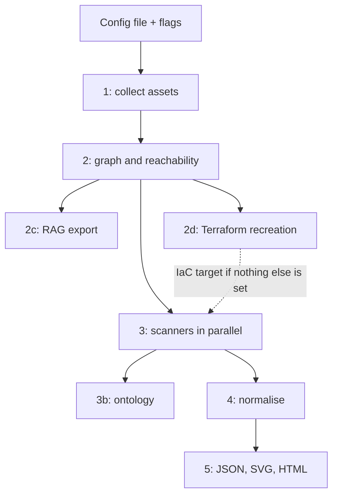

## How it works

`cloudg run` builds one `CloudGConfig` and runs a fixed sequence of phases against it. The config comes from the file you pass to the root command (`cloudg -c config.yaml run ...`). Without `-c`, cloudg uses its built-in defaults. It does not look for a `config.yaml` in the current directory on its own.

On top of that config, the command applies its flags:

1. `-p/--provider` replaces `providers`. `all` expands to `aws`, `azure` and `gcp`.
2. `--regions` replaces the region list of all three providers at once. `all` becomes the `ALL` sentinel, which triggers region discovery. When `--regions` is absent, `--region` sets `aws.regions` to that single region and leaves Azure and GCP alone.
3. `--subscription-id`, `--project-id` and `--profile` set `azure.subscription_ids`, `gcp.project_ids` and `aws.profile`.
4. Every `--aws-*`, `--azure-*` and `--gcp-*` flag you give overwrites the matching credential field. Flags you leave out keep whatever the config file says. See [Auth flags](/cli/auth-flags/).

Then the phases run:



Phase 1 is collection. The multi-provider collector walks every configured account, subscription or project, and every region, concurrently. An `aws.accounts` list in the config needs `aws.role_name` too (unless `aws.organization.enabled` is on); without it the command stops with exit status 2 before collecting anything. If collection throws, cloudg prints a "Collection failed" panel and carries on with an empty inventory, so the scanners still run. Each account, region or provider that could not be collected gets a "Not collected: ..." line at the end of the phase.

In phase 2, assets and edges go into a directed graph. cloudg writes `topology.graphml` (unless `graph.persist_graphml` is off) and, with `graph.export_cytoscape: true`, `topology-cytoscape.json`, runs reachability analysis from the internet node, and turns exposed paths into findings. With `graph.compute_attack_paths` on (the default), it also counts lateral movement paths and prints a warning when it finds any.

Phase 2c, the RAG export, runs when `--rag-export` is on (the default) and `rag.enabled` is true in config. Both have to agree. The chunks are written once here and rewritten silently after the scanners finish, so the final `rag_chunks.jsonl` includes scanner findings.

Phase 2d, the Terraform recreation, runs when you pass `--terraform` or set `terraform.enabled: true`. Either one is enough.

Phase 3 runs the scanners. Every scanner job gets its own thread, so they all start at once. The scanner list comes from `--scanners`, or from `scanners.enabled` in config when the flag is absent. The default config enables all five: `prowler`, `scoutsuite`, `checkov`, `trivy` and `iam`. A [scanner plugin](/api/entry-points/) runs when its name is in the list, and a name that matches nothing is skipped with a warning. Prowler and ScoutSuite run once per provider. Checkov runs once per IaC directory. Trivy scans the images from `--images` (or `scanners.trivy_images`), and falls back to a filesystem scan of the IaC directories when there are no images.

The IaC directory is resolved in this order: `--iac-dir`, then `scanners.iac_directories`, then the Terraform recreation from phase 2d if it produced any `*.tf.json` files. There is no fallback to the current directory. A scan of whatever folder you happened to run cloudg from would report zero findings and look like a clean result, so cloudg warns "nothing to scan" instead.

The built-in IAM linter runs when `iam` is in the scanner list. It reads the IAM policies of the collected assets, so with an empty inventory it is skipped with a warning.

A scanner whose binary is missing is skipped before the others start, with a line such as `Prowler: not installed (pip install prowler)`. A scanner that raises, or runs longer than `scanners.timeout_seconds`, is marked failed in the progress display and its error is printed after the others finish; a scanner that timed out keeps the findings it produced before that. Neither stops the run.

Phase 3b builds the ontology. It runs after the scanners so that findings become part of the RDF graph. It needs `--ontology` (the default) and `ontology.enabled` in config. One file is written per entry in `ontology.export_formats`, which defaults to Turtle and JSON-LD.

Phase 4 normalises. Reachability, scanner and IAM findings are deduplicated within and across scanners using the rulesets in `rulesets.rules_dir`, rescored, and mapped to compliance frameworks.

Phase 5 renders the formats listed in `report.formats`: `findings.json`, `topology.svg` and `report.html` by default. A summary table and, when collection recorded it, a coverage table close the run.

The command prints its resolved settings before phase 1. These two panels come from the code that renders them, for the flags shown:

```console
$ cloudg run -p aws -p azure --regions us-east-1,eu-west-1 --scanners prowler,checkov
╭────────── Run Configuration ──────────╮
│      Providers  aws, azure            │
│       Scanners  prowler, checkov      │
│    AWS regions  us-east-1, eu-west-1  │
│  Azure regions  us-east-1, eu-west-1  │
│         Output  reports               │
╰───────────────────────────────────────╯
```

```console
$ cloudg run -p aws
╭─────────────────── Run Configuration ───────────────────╮
│    Providers  aws                                       │
│     Scanners  prowler, scoutsuite, checkov, trivy, iam  │
│  AWS regions  us-east-1                                 │
│       Output  reports                                   │
╰─────────────────────────────────────────────────────────╯
```

The first panel shows a side effect worth knowing: a comma-separated `--regions` list is copied to every provider, so Azure is shown with AWS region names. That is harmless, because Azure Resource Graph and GCP Cloud Asset Inventory return resources from all locations in one call. If you need different lists per provider, set them in `config.yaml` and leave `--regions` off.

## Examples

Scan one AWS account in one region with your default credentials, to try cloudg out:

```bash
cloudg run -p aws --region us-east-1
```

Use a named profile and discover every enabled region:

```bash
cloudg run -p aws --profile audit --regions all
```

Run only Prowler and Checkov, and point Checkov at your Terraform code:

```bash
cloudg run -p aws --regions us-east-1 --scanners prowler,checkov --iac-dir ./infra/terraform
```

Audit the live cloud with Checkov when you have no IaC repository. `--terraform` writes a recreation of what was collected, and the IaC scanners pick it up:

```bash
cloudg run -p aws --regions us-east-1 --scanners checkov,iam --terraform
```

Scan container images with Trivy alongside the cloud scan:

```bash
cloudg run -p aws --scanners prowler,trivy --images registry.example.com/api:1.4.2,registry.example.com/worker:1.4.2
```

Scan all three clouds at once, with settings for each provider kept in a config file:

```bash
cloudg -c config.yaml run -p all --regions all -o ./reports/$(date +%F)
```

Run in CI with OIDC and no stored keys. Your workflow writes the OIDC token to a file first; pass its path:

```bash
cloudg run -p aws --regions all \
  --aws-role-arn arn:aws:iam::123456789012:role/cloudg-audit \
  --aws-web-identity-token-file "$RUNNER_TEMP/oidc-token"
```

Skip the semantic exports when you only want findings and the HTML report:

```bash
cloudg run -p aws --no-ontology --no-rag-export
```

Drive the pipeline from Python when you want result objects as well as files. `CloudGEngine.run_pipeline_sync()` covers the same ground, though it orders the analysis steps a little differently and writes no `topology.graphml` (see [CloudGEngine](/api/cloudgengine/)):

```bash tab="CLI"
cloudg run -p aws --region us-east-1 --scanners prowler,checkov,iam -o ./reports
```

```python tab="Python" title="run_pipeline.py"
from cloudg import CloudGConfig, CloudGEngine

config = CloudGConfig(providers=["aws"])
config.aws.regions = ["us-east-1"]
config.scanners.enabled = ["prowler", "checkov", "iam"]

engine = CloudGEngine(config)
result = engine.run_pipeline_sync(output_dir="./reports")
print(len(result.findings), "findings")
print(result.report_paths)
```

## Output files

All paths are relative to `-o/--output` (default `./reports`).

| File | Written when | Contents |
|---|---|---|
| `findings.json` | `json` in `report.formats` (default) | Normalised result: metadata, summary, assets, findings, compliance, edges, D3 graph. `cloudg report -i` reads it back. |
| `report.html` | `html` in `report.formats` (default) | Self-contained interactive report, with Chart.js and D3 embedded so it works offline |
| `topology.svg` | `svg` in `report.formats` (default) | Static topology picture |
| `topology.graphml` | `graph.persist_graphml` (default) | The graph for Gephi, yEd or NetworkX |
| `topology-cytoscape.json` | `graph.export_cytoscape: true` | The graph in Cytoscape.js format |
| `ontology.ttl`, `ontology.jsonld` | `--ontology` and `ontology.enabled` | RDF graph, one file per `ontology.export_formats` entry (`xml` gives `ontology.rdf`, `nt` gives `ontology.nt`) |
| `rag_chunks.jsonl`, `rag_metadata_index.json` | `--rag-export` and `rag.enabled` | Retrieval chunks, one JSON object per line, and their index |
| `prowler/<provider>/` | Prowler enabled | Prowler's own ASFF output |
| `scoutsuite/<provider>/` | ScoutSuite enabled | ScoutSuite's own report |
| `terraform/provider.tf.json`, `variables.tf.json`, `main.tf.json`, `import_commands.sh` | `--terraform` or `terraform.enabled` | Terraform recreation |

The Terraform files go to `<output>/terraform`, so `cloudg run -o /tmp/scan --terraform` writes them to `/tmp/scan/terraform`. A `terraform.output_dir` in your config replaces that directory, except the old default `./reports/terraform`, which counts as unset.

`cloudg run` does not write `raw-findings.json`. Use [cloudg scan](/cli/scan/) or [cloudg ingest](/cli/ingest/) when you need the pre-normalisation findings.

## Exit codes

| Code | When |
|---|---|
| 0 | The run reached the end, also when some accounts, regions or scanners failed or every scanner was skipped. Partial collection prints a "Collection was partial" warning. |
| 1 | An unhandled exception, such as a `config.yaml` that fails validation (with a traceback). |
| 2 | A bad flag value (for example `-p aws2`), or `aws.accounts` without `aws.role_name`. |
| 3 | Collection failed for every target. The reports are still written, with scanner findings only, and a "Collection failed for every target" panel lists what failed. |

Exit 3 means no target could be collected at all: a profile that does not exist, a role that cannot be assumed, or no credentials anywhere in the default chain, where every service of the region fails on its own. A run where some services or regions worked exits 0; the coverage table shows what was missed.

To fail a CI job on findings, read `findings.json` after the run. [CI and automation](/guides/ci-automation/) has a severity gate.

## Related

:::links
- [The pipeline](/guides/pipeline/) What each phase does and why it runs in that order.
- [Running scanners](/guides/running-scanners/) Installing Prowler, ScoutSuite, Checkov and Trivy.
- [Auth flags](/cli/auth-flags/) Every credential flag and which one wins.
- [Provider and region flags](/cli/provider-flags/) `-p`, `--region`, `--regions` and discovery.
- [Output flags](/cli/output-flags/) The output directory and what lands in it.
- [cloudg map](/cli/map/) Inventory only, no scanners.
:::
