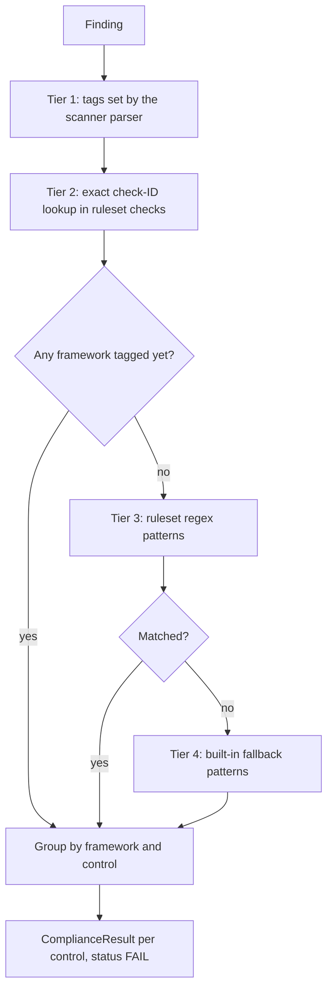

Compliance mapping is the last step of normalisation, so it runs wherever findings are normalised: phase 4 of `cloudg run`, `cloudg ingest`, `CloudGEngine.normalise_findings()` and `run_from_reports()`. Its output is a list of `ComplianceResult` records in `findings.json` and the Compliance tab of `report.html`.

One thing to understand before reading any of that output: a control only appears when at least one finding maps to it. cloudg has no list of the controls you passed, because scanners report failures (Prowler's passing checks are dropped while parsing). Every `ComplianceResult` it writes has status `FAIL`. Read the compliance output as "these controls have open findings", not as a full audit score.

## The rulesets

The rulesets are YAML files in `cloudg/rules/`, installed with the package. They come in two kinds.

The generated rulesets in `cloudg/rules/frameworks/` are converted from Prowler's public compliance data (Apache-2.0) by `scripts/import_prowler_compliance.py`. Each control lists the Prowler check names that assess it, under `checks`. There are 22 of these files, one framework each, with 4,166 controls and 10,236 check mappings over 787 distinct Prowler checks.

The hand-written rulesets at the top of `cloudg/rules/` hold regex `patterns` instead of check lists. There are 9 files with 105 controls. Three of them (`cis_aws_v3.yaml`, `cis_azure_v2.yaml`, `cis_gcp_v3.yaml`) use the same framework names as the generated CIS 5.0 files and are merged into them on load. The other six define frameworks that only exist in pattern form.

Loaded together, that is 28 framework names and 4,271 controls. The README's figures are consistent with this: 28 is the total number of frameworks, while 4,166 controls and 10,236 check mappings describe the generated part only.

| Framework | Controls | Check mappings | Pattern controls | Files |
|---|---|---|---|---|
| `AWS-Foundational-Security-Best-Practices-AWS` | 206 | 226 | 0 | `frameworks/aws_foundational_security_best_practices_aws.yaml` |
| `CIS-AWS` | 81 | 73 | 18 | `frameworks/cis_5.0_aws.yaml`, `cis_aws_v3.yaml` |
| `CIS-AZURE` | 123 | 109 | 16 | `frameworks/cis_5.0_azure.yaml`, `cis_azure_v2.yaml` |
| `CIS-GCP` | 87 | 71 | 16 | `frameworks/cis_5.0_gcp.yaml`, `cis_gcp_v3.yaml` |
| `GDPR` | 5 | 0 | 5 | `gdpr.yaml` |
| `GDPR-AWS` | 3 | 70 | 0 | `frameworks/gdpr_aws.yaml` |
| `HIPAA` | 8 | 0 | 8 | `hipaa_security_rule.yaml` |
| `HIPAA-AWS` | 32 | 307 | 0 | `frameworks/hipaa_aws.yaml` |
| `HIPAA-AZURE` | 34 | 340 | 0 | `frameworks/hipaa_azure.yaml` |
| `HIPAA-GCP` | 23 | 95 | 0 | `frameworks/hipaa_gcp.yaml` |
| `ISO-27001` | 9 | 0 | 9 | `iso_27001_2022.yaml` |
| `ISO27001-AWS` | 37 | 627 | 0 | `frameworks/iso27001_2022_aws.yaml` |
| `ISO27001-AZURE` | 31 | 339 | 0 | `frameworks/iso27001_2022_azure.yaml` |
| `ISO27001-GCP` | 30 | 108 | 0 | `frameworks/iso27001_2022_gcp.yaml` |
| `MITRE-ATTACK-AWS` | 36 | 380 | 0 | `frameworks/mitre_attack_aws.yaml` |
| `MITRE-ATTACK-AZURE` | 31 | 231 | 0 | `frameworks/mitre_attack_azure.yaml` |
| `MITRE-ATTACK-GCP` | 26 | 142 | 0 | `frameworks/mitre_attack_gcp.yaml` |
| `NIST-800-53` | 13 | 0 | 13 | `nist_800_53.yaml` |
| `NIST-800-53-Revision-5-AWS` | 287 | 1944 | 0 | `frameworks/nist_800_53_revision_5_aws.yaml` |
| `NIST-CSF-AWS` | 50 | 645 | 0 | `frameworks/nist_csf_2.0_aws.yaml` |
| `PCI-AWS` | 1507 | 1513 | 0 | `frameworks/pci_4.0_aws.yaml` |
| `PCI-AZURE` | 756 | 756 | 0 | `frameworks/pci_4.0_azure.yaml` |
| `PCI-DSS` | 11 | 0 | 11 | `pci_dss_v4.yaml` |
| `PCI-GCP` | 755 | 1530 | 0 | `frameworks/pci_4.0_gcp.yaml` |
| `SOC2` | 9 | 0 | 9 | `soc2_tsc.yaml` |
| `SOC2-AWS` | 27 | 251 | 0 | `frameworks/soc2_aws.yaml` |
| `SOC2-AZURE` | 26 | 313 | 0 | `frameworks/soc2_azure.yaml` |
| `SOC2-GCP` | 28 | 166 | 0 | `frameworks/soc2_gcp.yaml` |

The merged CIS frameworks mix two benchmark versions under one name: the generated controls use CIS 5.0 numbering (`1.4`) and the hand-written ones CIS 3.0 or 2.0 numbering with a prefix (`CIS-1.4`). They don't collide, but don't expect one numbering scheme inside `CIS-AWS`.

`rules/check_equivalence.yaml` sits in the same directory but isn't a ruleset. It tells the deduplicator which checks from different scanners mean the same thing; see [Ingesting existing output](/guides/ingesting/#normalisation-and-deduplication).

## How a finding gets its controls

Mapping works in four tiers, most precise first. Each finding carries a list of framework names, `compliance_frameworks`, which the tiers add to.



### Tier 1: what the scanner said

Each parser sets `compliance_frameworks` while it reads the native output. These tags are coarse framework names, not controls:

| Source | Tags |
|---|---|
| Prowler | From `Compliance.RelatedRequirements`: `CIS`, `NIST-800-53`, `PCI-DSS`, `GDPR`, `HIPAA`, `SOC2` (substring match) |
| ScoutSuite | The rule's `references` list, copied as is |
| Checkov | `CIS` always; `NIST-800-53` or `PCI-DSS` when the check ID contains those strings |
| Trivy | `CVE` for vulnerabilities, `CIS` for misconfigurations, none for secrets |
| IAM linter | `CIS`, `NIST-800-53` and, for wildcard actions, `SOC2` |
| Reachability | `CIS` and `NIST-800-53` (plus `PCI-DSS` for some), none for unexpected internet exposure |

### Tier 2: exact check IDs

This tier always runs. cloudg splits the finding's `source_finding_id` on `-`, `/`, `:` and whitespace, then looks every piece up in the `checks` lists of all loaded rulesets. A Prowler ASFF ID such as `prowler-aws-s3_bucket_default_encryption-123456789012-eu-west-1-abc` yields the piece `s3_bucket_default_encryption`, which appears in 28 controls across eight AWS frameworks. Each hit adds the framework and records the exact control ID and title.

Prowler check names never contain dashes, so they survive the split intact. A Checkov ID such as `CKV_AWS_19` does too, which means you can list Checkov IDs in your own rulesets. Trivy IDs (`AVD-AWS-0088`, `CVE-2024-0001`) and ScoutSuite rule names (`s3-bucket-no-encryption`) are split into fragments, so they can't be matched by this tier.

### Tier 3: ruleset patterns

Only for findings that still have no framework at all after tiers 1 and 2. cloudg joins the title and description, lowercases them, and runs every `patterns` regex of every ruleset against that text (`re.search`, case-insensitive). A match adds the framework name. It does not record which control matched.

In practice few findings get this far, since Checkov, Trivy vulnerabilities and misconfigurations, and the IAM linter always tag something in tier 1. The usual candidates are ScoutSuite findings with an empty `references` list, Prowler findings whose requirements match none of the six prefixes, Trivy secrets, and reachability findings for unexpected internet exposure.

### Tier 4: built-in fallback

When tier 3 matches nothing, a small table in `cloudg/normaliser.py` tries a few broad patterns (`encryption`, `cloudtrail`, `mfa`, `logging` and so on) for `CIS`, `NIST-800-53`, `PCI-DSS`, `GDPR`, `SOC2` and `HIPAA`. A finding that matches nothing here keeps an empty framework list and appears in no `ComplianceResult`.

## ComplianceResult

After tagging, cloudg groups findings by framework and control ID and writes one `ComplianceResult` per group. The model lives in `cloudg.schema.models`:

| Field | Type | Value written by the normaliser |
|---|---|---|
| `id` | `str` | A new UUID |
| `framework` | `str` | The framework name, such as `NIST-CSF-AWS` or `CIS` |
| `control_id` | `str` | See below |
| `control_title` | `str \| None` | The ruleset's control title for exact matches, otherwise `"<framework> <control_id>"` |
| `status` | `ComplianceStatus` | Always `FAIL` |
| `finding_ids` | `list[str]` | IDs of every finding mapped to this control |
| `resource_arn` | `str \| None` | Always `None` |

`ComplianceStatus` defines four values: `PASS`, `FAIL`, `NOT_APPLICABLE` and `MANUAL`. The normaliser in 0.6.0 only produces `FAIL`. The other values are there for your own code, or for results you build yourself.

The `control_id` depends on how the framework was attached:

| How the framework was attached | `control_id` | Example |
|---|---|---|
| Tier 2 exact match | The ruleset control ID | `ds_1` (NIST-CSF-AWS), `3.5.1.30` (PCI-AWS) |
| Tier 1, 3 or 4, Prowler finding | `<framework>/` plus the third and fourth tokens of the ASFF ID | `CIS/s3_bucket_default_encryption-123456789012` |
| Tier 1, 3 or 4, Checkov finding | `<framework>/<check_id>` | `CIS/CKV_AWS_19` |
| Tier 1, 3 or 4, Trivy CVE | `<framework>/<CVE id>` | `CVE/CVE-2024-0001` |
| Anything else | `<framework>-aggregate` | `GDPR-aggregate` |

Two details follow from that table. For Prowler, the fourth token of the ASFF ID is usually the account ID, so the same check in two accounts gives two control IDs under the coarse `CIS` tag. And the `-aggregate` buckets collect every finding that reached a framework without a specific control: ScoutSuite findings, pattern matches and Trivy misconfigurations.

## Reading the output

### findings.json

`compliance` is a list of the records above, and `summary.compliance_frameworks` lists the framework names that have at least one record. Join `finding_ids` against `findings[].id` to see what is behind each control. This script works on any `findings.json` from `cloudg run`, `cloudg ingest` or `run_from_reports()`:

```python title="compliance_summary.py"
import json
from collections import defaultdict
from pathlib import Path

report = json.loads(Path("./reports/findings.json").read_text())
findings = {f["id"]: f for f in report["findings"]}

controls = defaultdict(list)
for result in report["compliance"]:
    controls[result["framework"]].append(result)

print(f"{'framework':32} {'controls':>8} {'findings':>8}")
for framework, results in sorted(controls.items()):
    finding_ids = {fid for r in results for fid in r["finding_ids"]}
    print(f"{framework:32} {len(results):8} {len(finding_ids):8}")

print()
for result in controls.get("CIS-AWS", []) + controls.get("NIST-CSF-AWS", []):
    print(result["framework"], result["control_id"], "-", (result["control_title"] or "")[:60])
    for fid in result["finding_ids"]:
        f = findings[fid]
        print("   ", f["severity"], f["source_tool"], f["resource_arn"])
```

Against the [sample reports from the ingest guide](/guides/ingesting/#try-it-without-any-scanner), the start of the output is:

```console
$ python compliance_summary.py
framework                        controls findings
CIS                                     3        3
CIS-AWS                                 1        1
CVE                                     1        1
GDPR                                    1        1
GDPR-AWS                                1        1
HIPAA                                   1        1
HIPAA-AWS                               6        1
...
NIST-CSF-AWS ds_1 - Data-at-rest is protected.
    HIGH prowler arn:aws:s3:::my-bucket
```

The coarse tier 1 tags and the ruleset frameworks appear side by side: `CIS` next to `CIS-AWS`, `HIPAA` next to `HIPAA-AWS`. They are separate keys. Prowler findings usually carry both, with the precise controls under the ruleset name; Checkov and Trivy findings land mostly under the coarse ones.

### report.html {#report-html}

The Compliance tab shows one card per framework with Pass and Fail counts and a percentage bar. Fail is the number of distinct controls with findings. Since every result is `FAIL`, Pass is always 0 and the bar reads 0%; treat the card as a count of affected controls. The Analytics tab charts the same counts, and the detail panel of each finding lists its frameworks. [Reports](/guides/reports/) covers the rest of the page.

### compliance-map.json

`cloudg map --findings` (and `InventoryMapper.export_merged()`) writes a different, framework-level view: for each framework, how many findings, their severities, and which resources are affected. It is built from each finding's `compliance_frameworks` list, not from `ComplianceResult` records, so it has no control IDs. Pass it the normalised `findings.json`, not `raw-findings.json`, or the tier 2 to 4 frameworks will be missing.

```python title="compliance_map_demo.py"
import json
from pathlib import Path

from cloudg import CloudGConfig, InventoryMapper, InventoryResult
from cloudg.schema.models import AssetType, CloudAsset, CloudProvider, Finding

report = json.loads(Path("./reports/findings.json").read_text())
findings = [Finding.model_validate(f) for f in report["findings"]]

bucket = CloudAsset(
    name="my-bucket",
    arn="arn:aws:s3:::my-bucket",
    asset_type=AssetType.S3_BUCKET,
    provider=CloudProvider.AWS,
    region="eu-west-1",
    account_id="123456789012",
)
inventory = InventoryResult(assets=[bucket])

compliance_map = InventoryMapper(CloudGConfig()).build_compliance_map(inventory, findings)
print(json.dumps(compliance_map["frameworks"]["CIS"], indent=2))
```

```console
$ python compliance_map_demo.py
{
  "findings": 3,
  "severity_breakdown": {
    "HIGH": 3
  },
  "affected_assets": [
    "./iac",
    "arn:aws:s3:::my-bucket",
    "aws_s3_bucket.data"
  ],
  "affected_asset_count": 3
}
```

`affected_assets` holds inventory ARNs where a finding matched an inventory asset, and the finding's own `resource_arn` where it didn't. That is why a Terraform address and a Trivy directory show up next to the bucket. The top level also has `total_frameworks` and `total_inventory_assets`.

## Adding a custom ruleset {#adding-a-custom-ruleset}

A ruleset is a YAML file with a `framework` name and a list of `controls`. Each control has an `id`, a `title`, and either `checks` (tier 2), `patterns` (tier 3) or both. `version`, `source` and a per-control `severity` are accepted and ignored by the normaliser.

```yaml title="my-rules/acme_baseline.yaml"
framework: ACME-BASELINE
version: "2026.1"
controls:
  - id: "ACME-S3-01"
    title: "Buckets encrypt data at rest"
    checks:
      - s3_bucket_default_encryption   # Prowler check name
      - CKV_AWS_19                     # Checkov check ID
    patterns:
      - "bucket.*(encrypt|sse)"
    severity: HIGH
  - id: "ACME-IMG-01"
    title: "Container images carry no secrets"
    patterns:
      - "secret found in container image"
```

cloudg loads every `*.yaml` under `rulesets.rules_dir`, recursively. That directory replaces the packaged one, it doesn't add to it, so start from a copy of the shipped rules or you lose all 28 frameworks and the check-equivalence map:

```bash
cp -r "$(python -c 'import cloudg, pathlib; print(pathlib.Path(cloudg.__file__).parent / "rules")')" ./my-rules
cp acme_baseline.yaml ./my-rules/
```

Then point cloudg at it.

```yaml tab="CLI" title="config.yaml"
rulesets:
  rules_dir: ./my-rules
```

```python tab="Python" title="custom_rules.py"
from cloudg.ingest import ingest_reports
from cloudg.normaliser import FindingsNormaliser

findings = ingest_reports(
    {
        "prowler": ["./prowler-output/"],
        "checkov": ["./results_json.json"],
        "scoutsuite": ["./scoutsuite-report/"],
    }
)
scan_result = FindingsNormaliser(rules_dir="./my-rules").normalise(findings)

for result in scan_result.compliance:
    if result.framework == "ACME-BASELINE":
        print(result.control_id, result.control_title, len(result.finding_ids))
```

With the CLI, pass the config with `-c`: `cloudg -c config.yaml ingest ...` or `cloudg -c config.yaml run ...`. From `CloudGEngine`, set `config.rulesets.rules_dir`. On the sample reports, the result is:

```console
$ python custom_rules.py
ACME-BASELINE-aggregate ACME-BASELINE ACME-BASELINE-aggregate 1
ACME-S3-01 Buckets encrypt data at rest 2
```

The Prowler and Checkov findings matched `ACME-S3-01` exactly through `checks`. The ScoutSuite finding had no frameworks, so tier 3 ran, the pattern matched, and it was filed under `ACME-BASELINE-aggregate`.

A few rules of thumb for writing them:

- Prefer `checks` over `patterns`. Exact matches give real control IDs and titles in the output; pattern matches only give the framework.
- Use Prowler check names and Checkov `CKV_*` IDs in `checks`. Trivy and ScoutSuite IDs contain dashes and won't match.
- Several files may use the same `framework` name; their controls are combined. That is how the hand-written and generated CIS files share `CIS-AWS`.
- A file that fails to parse is logged as a warning and skipped, and the rest still load. Run with `cloudg -v` to see `Loaded N rules from <file>` for each one.

`rulesets.load_external` is present in the config model but nothing reads it in 0.6.0; rulesets always load.

### Refreshing the generated rulesets

From a repository checkout, the import script rebuilds `cloudg/rules/frameworks/` against a newer Prowler release:

```bash
git clone --depth 1 https://github.com/prowler-cloud/prowler /tmp/prowler
python scripts/import_prowler_compliance.py /tmp/prowler
python scripts/import_prowler_compliance.py /tmp/prowler --out ./my-rules/frameworks
```

The list of frameworks it imports is the `FRAMEWORKS` constant at the top of the script. Add a `(provider, file stem)` pair there to import another of Prowler's compliance files.

## Next

:::links
- [Ingesting existing output](/guides/ingesting/) Deduplication and the check-equivalence map.
- [Reports](/guides/reports/) The Compliance tab and the rest of `report.html`.
- [Data models](/api/models/) `ComplianceResult`, `ComplianceStatus` and `ScanResult`.
- [FindingsNormaliser](/api/findingsnormaliser/) The class that does the mapping.
:::
