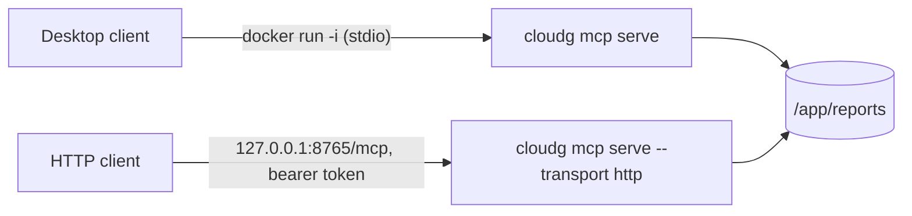

The image is the quickest route to a full `cloudg run`, because the scanners are the hard part of a local install and the image has them preinstalled. It is also a clean way to run the MCP server on a host where you would rather not install Python packages.

## What is in the image

The Dockerfile has three stages. The first installs the scanners, each Python one in its own virtualenv so their dependencies cannot collide. The second installs cloudg's Python dependencies with uv. The third copies both into a fresh `python:3.12-slim` and installs the cloudg source on top, so a code change rebuilds only the last few layers.

| Component | Where | Notes |
|---|---|---|
| cloudg | `/usr/local/bin/cloudg`, `/usr/local/bin/cloudg-mcp` | installed with the `aws`, `azure` and `gcp` extras |
| Prowler | `/opt/prowler`, symlinked into `/usr/local/bin` | own venv |
| Checkov | `/opt/checkov`, symlinked into `/usr/local/bin` | own venv |
| Trivy | `/usr/local/bin/trivy` | from Aqua's install script |
| Parliament | system site-packages | used by the IAM linter |
| Graphviz | system package | not needed by cloudg itself |

Some things are deliberately or incidentally absent, and each one changes how you use the image:

- ScoutSuite is not installed. The default `scanners.enabled` still lists it, so every run logs that ScoutSuite is not installed and skips it. Pass `--scanners prowler,checkov,trivy,iam` to keep the log clean.
- The `mcp` extra is not installed. `cloudg mcp serve` works anyway, because the default `--flavor auto` falls back to the native server, which has no dependencies.
- The AWS, Azure and gcloud CLIs are not installed. Anything that relies on a CLI login (Azure's `az login` session in particular) does not work inside the container. Use keys, a service principal, a credentials file or an instance identity instead, as shown below.

At run time the container works like this:

| Setting | Value |
|---|---|
| `ENTRYPOINT` | `["cloudg"]`, so arguments after the image name are cloudg arguments |
| `CMD` | `["--help"]` |
| `WORKDIR` | `/app`, so the default `-o ./reports` means `/app/reports` |
| `USER` | `cloudg`, a non-root user created with `useradd` (normally UID 1000) |
| `HOME` | `/home/cloudg`, where credential files and scanner caches go |
| `HEALTHCHECK` | `cloudg --version` every 5 minutes |

## Get the image

```bash tab="Pull"
docker pull ghcr.io/morpheuslord/cloudg:latest
docker tag ghcr.io/morpheuslord/cloudg:latest cloudg:latest
```

```bash tab="Build"
git clone https://github.com/morpheuslord/cloudg.git
cd cloudg
docker build -t cloudg:latest .
```

Releases are tagged with their version (`ghcr.io/morpheuslord/cloudg:0.6.0`) as well as `latest`. The examples on this page use the local name `cloudg:latest`, which is what `docker compose` builds too.

A build needs the full source checkout, not just `cloudg/`: the package build force-includes `docs/DOCUMENTATION.md` and `docs/INVENTORY_REFERENCE.md` (the MCP server serves them as `cloudg://docs/...` resources), and hatchling refuses to build without them. The first build takes a while because of the scanner stage; after that, edits to `cloudg/` rebuild in seconds.

Check it:

```console
$ docker run --rm cloudg:latest --version
cloudg, version 0.6.0
```

## The reports volume

Everything cloudg writes goes to `/app/reports` unless you pass `-o`. Mount a host directory there:

```bash
mkdir -p reports
docker run --rm -v "$PWD/reports:/app/reports" cloudg:latest report -i /app/reports/findings.json -o /app/reports/rerendered
```

Create the directory before the first run. If Docker creates it for you, it belongs to root, and the `cloudg` user inside the container cannot write to it. On Linux the host directory must also be writable by the container's UID. If your own UID is not 1000, either make the directory writable for UID 1000 or run as yourself and point `HOME` somewhere writable:

```bash
docker run --rm --user "$(id -u):$(id -g)" -e HOME=/tmp \
  -v "$PWD/reports:/app/reports" \
  cloudg:latest ingest --trivy /app/reports/trivy.json
```

Docker Desktop on macOS and Windows maps file ownership for you, so this only comes up on Linux.

## Credentials

The container sees no credentials until you give it some. Each provider has a few ways in.

### AWS

```bash tab="Profile"
docker run --rm \
  -v "$HOME/.aws:/home/cloudg/.aws:ro" \
  -e AWS_PROFILE=audit \
  -v "$PWD/reports:/app/reports" \
  cloudg:latest run -p aws --regions us-east-1
```

```bash tab="Environment"
docker run --rm \
  -e AWS_ACCESS_KEY_ID -e AWS_SECRET_ACCESS_KEY -e AWS_SESSION_TOKEN \
  -v "$PWD/reports:/app/reports" \
  cloudg:latest run -p aws --regions us-east-1
```

```bash tab="Instance role"
# on EC2 or ECS: credentials come from the instance or task role
docker run --rm -v "$PWD/reports:/app/reports" cloudg:latest run -p aws --regions all
```

Mount `~/.aws` at `/home/cloudg/.aws`, not `/root/.aws`; the container does not run as root. With SSO profiles, run `aws sso login` on the host first. A read-only mount can use the cached token but cannot store a refreshed one, so log in again on the host when it expires.

`-e AWS_ACCESS_KEY_ID` with no value copies the variable from your shell, which keeps keys out of your shell history. Prowler inside the container reads the same variables or profile, so the scanners and the collectors use the same identity.

On EC2 with IMDSv2, a container on Docker's default bridge network is one network hop further from the metadata service than the host. If the instance's metadata hop limit is 1, the container gets no credentials; raise the hop limit to 2 or run with `--network host`.

### Azure

The usual container setup is a service principal in environment variables. cloudg reads `AZURE_TENANT_ID`, `AZURE_CLIENT_ID` and `AZURE_CLIENT_SECRET` when the matching flags are not given:

```bash tab="Client secret"
docker run --rm \
  -e AZURE_TENANT_ID -e AZURE_CLIENT_ID -e AZURE_CLIENT_SECRET \
  -v "$PWD/reports:/app/reports" \
  cloudg:latest run -p azure --subscription-id 00000000-0000-0000-0000-000000000000
```

```bash tab="Certificate"
docker run --rm \
  -e AZURE_TENANT_ID -e AZURE_CLIENT_ID \
  -v "$PWD/sp-cert.pem:/secrets/sp-cert.pem:ro" \
  -v "$PWD/reports:/app/reports" \
  cloudg:latest run -p azure --azure-cert-path /secrets/sp-cert.pem
```

```bash tab="Managed identity"
# on an Azure VM or container host with a managed identity
docker run --rm -v "$PWD/reports:/app/reports" \
  cloudg:latest run -p azure --azure-managed-identity
```

Without `--subscription-id`, cloudg collects every enabled subscription the identity can see.

### GCP

Mount a key file (or a workload identity federation config) and point `GOOGLE_APPLICATION_CREDENTIALS` at the path inside the container:

```bash tab="Key file"
docker run --rm \
  -v "$PWD/scanner-sa.json:/secrets/gcp.json:ro" \
  -e GOOGLE_APPLICATION_CREDENTIALS=/secrets/gcp.json \
  -v "$PWD/reports:/app/reports" \
  cloudg:latest run -p gcp --project-id my-project
```

```bash tab="gcloud ADC"
# after `gcloud auth application-default login` on the host
docker run --rm \
  -v "$HOME/.config/gcloud/application_default_credentials.json:/home/cloudg/.config/gcloud/application_default_credentials.json:ro" \
  -v "$PWD/reports:/app/reports" \
  cloudg:latest run -p gcp --project-id my-project
```

google-auth finds the application default credentials file at its standard path under `HOME` without needing gcloud in the container.

## Running each command

The commands below assume the reports mount from above and AWS credentials in environment variables; swap in whichever credential mount you use. Paths in arguments are paths inside the container.

The full pipeline:

```bash
docker run --rm \
  -e AWS_ACCESS_KEY_ID -e AWS_SECRET_ACCESS_KEY -e AWS_SESSION_TOKEN \
  -v "$PWD/reports:/app/reports" \
  cloudg:latest run -p aws --regions us-east-1 --scanners prowler,checkov,trivy,iam --terraform
```

`--terraform` gives Checkov and Trivy a target (the Terraform recreation of what was collected). To scan your own IaC, mount it and pass `--iac-dir`:

```bash
docker run --rm \
  -e AWS_ACCESS_KEY_ID -e AWS_SECRET_ACCESS_KEY -e AWS_SESSION_TOKEN \
  -v "$PWD/infra:/app/infra:ro" \
  -v "$PWD/reports:/app/reports" \
  cloudg:latest run -p aws --iac-dir /app/infra
```

Inventory mapping, and the dependency explorer on its output:

```bash
docker run --rm \
  -e AWS_ACCESS_KEY_ID -e AWS_SECRET_ACCESS_KEY -e AWS_SESSION_TOKEN \
  -v "$PWD/reports:/app/reports" \
  cloudg:latest map -p aws --regions all
docker run --rm -v "$PWD/reports:/app/reports" \
  cloudg:latest deps arn:aws:iam::123456789012:role/app-role
```

Ingest needs no credentials, only the scanner files. Mount them read-only:

```bash
docker run --rm \
  -v "$PWD/scan-output:/app/input:ro" \
  -v "$PWD/reports:/app/reports" \
  cloudg:latest ingest --prowler /app/input/prowler/ --trivy /app/input/trivy.json
```

Re-render a report from an earlier run:

```bash
docker run --rm -v "$PWD/reports:/app/reports" \
  cloudg:latest report -i /app/reports/findings.json --format all -o /app/reports/rerendered
```

`cloudg report` refuses to write `findings.json` over its own input, so give it another `-o` (or pass `--overwrite`).

### Using a config file

cloudg reads `config.yaml` only when you pass `-c`, and `-c` is a global option, so it goes before the subcommand:

```bash
docker run --rm \
  -v "$PWD/config.yaml:/app/config.yaml:ro" \
  -e AWS_ACCESS_KEY_ID -e AWS_SECRET_ACCESS_KEY \
  -v "$PWD/reports:/app/reports" \
  cloudg:latest -c /app/config.yaml run -p aws
```

Relative paths in the config, such as `scanners.iac_directories` or a `terraform.output_dir` you set, are relative to `/app`, the container's working directory. Without `terraform.output_dir`, the Terraform files go to `terraform/` under the `-o` directory, `/app/reports/terraform` by default.

## docker compose

The repository ships a `docker-compose.yml` with one service, `cloudg`. It builds the image from the checkout, mounts `./reports` and `./config.yaml`, and passes the common credential variables through from your shell:

```yaml title="docker-compose.yml"
services:
  cloudg:
    build: .
    image: cloudg:latest
    container_name: cloudg
    volumes:
      - ./reports:/app/reports
      - ./config.yaml:/app/config.yaml:ro
    environment:
      - AWS_ACCESS_KEY_ID=${AWS_ACCESS_KEY_ID:-}
      - AWS_SECRET_ACCESS_KEY=${AWS_SECRET_ACCESS_KEY:-}
      - AWS_SESSION_TOKEN=${AWS_SESSION_TOKEN:-}
      - AWS_DEFAULT_REGION=${AWS_DEFAULT_REGION:-us-east-1}
      - AZURE_SUBSCRIPTION_ID=${AZURE_SUBSCRIPTION_ID:-}
      - AZURE_TENANT_ID=${AZURE_TENANT_ID:-}
      - AZURE_CLIENT_ID=${AZURE_CLIENT_ID:-}
      - AZURE_CLIENT_SECRET=${AZURE_CLIENT_SECRET:-}
      - GOOGLE_APPLICATION_CREDENTIALS=${GOOGLE_APPLICATION_CREDENTIALS:-}
    entrypoint: ["cloudg"]
    command: ["--help"]
```

Use it with `docker compose run`, which replaces `command` with your arguments:

```bash
mkdir -p reports
docker compose build
docker compose run --rm cloudg run -p aws --regions us-east-1
docker compose run --rm cloudg -c /app/config.yaml run -p aws
```

Three things to know about this file:

- `./config.yaml` must exist on the host. If it does not, Docker creates an empty directory with that name and mounts it, and `-c /app/config.yaml` then fails. The repository's own `config.yaml` is a commented template you can edit.
- The mounted config is not used unless you pass `-c /app/config.yaml`, as in the last command above.
- `GOOGLE_APPLICATION_CREDENTIALS` is passed through as a host path, which does not exist inside the container. Mount the key file and set the variable to the container path, for example in an override file.

An override file is the tidy way to add mounts without editing the shipped one. Compose merges `docker-compose.override.yml` automatically:

```yaml title="docker-compose.override.yml"
services:
  cloudg:
    volumes:
      - ~/.aws:/home/cloudg/.aws:ro
      - ./scanner-sa.json:/secrets/gcp.json:ro
      - ./infra:/app/infra:ro
    environment:
      - AWS_PROFILE=audit
      - GOOGLE_APPLICATION_CREDENTIALS=/secrets/gcp.json
```

```bash
docker compose run --rm cloudg run -p aws -p gcp --project-id my-project --iac-dir /app/infra
```

## The MCP server in Docker

The MCP server runs from the same image. Over stdio, the AI client starts the container itself; over HTTP, the container runs as a long-lived service.



### stdio for a desktop client

Map once on the host or in a container, then serve the map read-only:

```bash
docker run -i --rm \
  -v "$PWD/reports:/app/reports:ro" \
  cloudg:latest mcp serve --dataset prod=/app/reports/inventory-map.json
```

Use `-i` and never `-t`. stdio needs stdin open, and a TTY would mix terminal control codes into the JSON-RPC stream. The banner goes to stderr when the subcommand is `mcp`, so stdout stays clean.

In the client configuration the command is `docker` and the arguments are the rest of that line. For Claude Desktop, in `claude_desktop_config.json`:

```json title="claude_desktop_config.json"
{
  "mcpServers": {
    "cloudg": {
      "command": "docker",
      "args": [
        "run", "-i", "--rm",
        "-v", "/home/me/cloudg/reports:/app/reports:ro",
        "cloudg:latest",
        "mcp", "serve", "--policy", "strict",
        "--dataset", "prod=/app/reports/inventory-map.json"
      ]
    }
  }
}
```

Desktop clients do not run commands through a shell, so use absolute host paths in `-v`. The workspace's allowed roots default to the working directory and the report directory, which inside the container are `/app` and `/app/reports`; tools that load datasets by path can reach files you mount under either.

### HTTP as a service

For a shared server, bind to all interfaces inside the container, publish the port on the host's loopback, and require a token:

```bash
export CLOUDG_MCP_TOKEN="$(openssl rand -hex 32)"
docker run -d --name cloudg-mcp \
  -p 127.0.0.1:8765:8765 \
  -e CLOUDG_MCP_TOKEN \
  -v "$PWD/reports:/app/reports:ro" \
  cloudg:latest mcp serve --transport http --host 0.0.0.0 \
    --auth-token env:CLOUDG_MCP_TOKEN:analyst:shared \
    --allowed-host 'localhost:*' --allowed-host '127.0.0.1:*' \
    --dataset prod=/app/reports/inventory-map.json
curl -s http://127.0.0.1:8765/healthz
```

`--host 0.0.0.0` is needed because the default `127.0.0.1` inside the container is not reachable through a published port. Binding to a non-loopback address turns off the default `Host` check, which is why the example sets `--allowed-host` explicitly; if clients reach the server through a reverse proxy, list the proxy's public name instead. The endpoint is `http://127.0.0.1:8765/mcp`, and `/healthz` answers `{"status":"ok"}` without a token, which suits a container health probe.

### Live tools in a container

The MCP live tools (`map_inventory`, `collect_assets`, `run_scanners`, `run_pipeline`) call cloud APIs with the server's credentials, whoever is asking. With no credentials mounted, their credential preflight (at most 25 seconds) fails and nothing is collected. If you do mount credentials, restrict who can use them: the `strict`, `read_only`, `airgapped`, `audit` and `soc-analyst` policies hide those tools, and `--read-only` drops them along with anything that writes files. A server that only answers questions about saved maps should run with `--read-only` and a read-only reports mount, as above.

[Connect a client](/mcp/connect/) has configuration for the other MCP clients, and [cloudg mcp serve](/cli/mcp-serve/) lists every server option.
