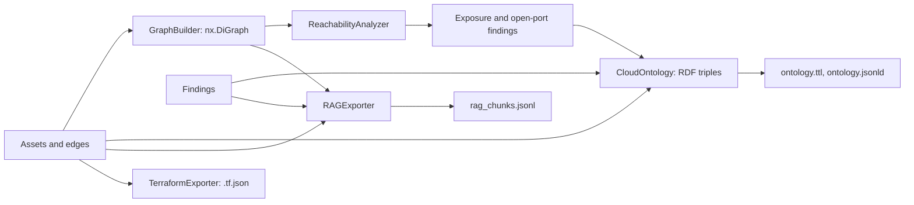

Every collection ends with two lists: `CloudAsset` objects and directed `NetworkEdge` objects between their ids. Everything on this page is derived from those two lists, plus findings when you have them. Nothing here calls a cloud API, so you can rebuild any of it offline from a saved map or a `findings.json`.



`cloudg run` does all of it in order: graph and reachability in phase 2, RAG export in 2c, Terraform in 2d, then after the scanners the ontology and a second RAG pass so both include the scanner findings. `CloudGEngine.analyze()` does the graph, ontology, RAG and Terraform steps for assets you collected yourself. The sections below use a small hand-built estate so every output is reproducible; the full script is at the end.

## The graph

`GraphBuilder().build(assets, edges)` returns an `nx.DiGraph`. Each asset becomes a node keyed by its `id`, carrying `name`, `asset_type`, `provider`, `region`, `arn` (empty when the asset has none), `account_id`, `tags` (as a JSON string) and `is_internet_exposed`. Each edge becomes a graph edge with `edge_type`, `relationship`, `port_range`, `protocol`, `cidr`, `direction` and `description`. An edge whose endpoint is not a collected asset, such as the CIDR `0.0.0.0/0` or an Azure service tag, gets a placeholder node with `asset_type` and `provider` set to `EXTERNAL` and `is_external` true.

A `DiGraph` holds one edge per ordered pair, and collectors often emit several rules for one pair: two ingress rules from `0.0.0.0/0` into the same security group, one for 443 and one for 22. Since 0.6.0 `SECURITY_GROUP_RULE`, `NACL_RULE` and `INTERNET_EXPOSED` edges on the same pair are merged into one graph edge when their CIDR and direction match, and the merged `port_range` lists every port:

```console
$ python graph_tour.py
graph: 9 nodes, 10 edges
merged rule: 443,22
```

Eleven `NetworkEdge` objects became ten graph edges. Any other edge type sharing a pair with an earlier edge replaces it, which is NetworkX's normal behaviour, so a pair with both a `CONTAINS` and a `REFERENCES` edge keeps the second.

Other methods on the builder:

| Method | Returns |
|---|---|
| `find_attack_paths(source, target, max_depth=10)` | every simple path between two node ids, over all edge types |
| `find_lateral_movement_paths()` | paths of up to 8 hops from internet-exposed or external nodes to the target of any `IAM_TRUST` edge, capped at about 100 |
| `compute_centrality()` | per node: degree, betweenness, in-degree and out-degree centrality |
| `to_d3_json()`, `to_cytoscape_json()` | the dicts behind the HTML report's topology view and `topology-cytoscape.json` |
| `save_graphml(path)`, `load_graphml(path)` | GraphML round trip |
| `subgraph(node_ids)` | a copy restricted to those nodes |

## Reachability and internet exposure

`ReachabilityAnalyzer(graph).find_internet_exposed()` is a breadth-first walk from the internet. It starts at nodes named `0.0.0.0/0` or `::/0`, plus the source of every non-egress edge whose CIDR stands for the internet (`0.0.0.0/0`, `::/0`, and the Azure tags `Internet`, `Any` and `*` in any letter case).

Since 0.6.0 the walk follows network-flow edges only. Earlier releases followed every edge type, so a database whose only link to the internet was an IAM role granted access to it came out as a CRITICAL "Internet-exposed RDS_INSTANCE". The rules now:

| Edge | Followed |
|---|---|
| `INTERNET_EXPOSED`, `LOAD_BALANCER_TARGET`, `ROUTE`, `PEERING` | source to target |
| `SECURITY_GROUP_RULE`, `NACL_RULE` | source to target for ingress rules; egress rules carry nothing inbound |
| `ATTACHED_TO` | backwards from a security group, NSG or NACL (or an edge declaring `PROTECTED_BY_SG` / `PROTECTED_BY_NACL`) to the resource attached to it; forwards from a network interface or Elastic IP |
| `CONTAINS` | from a VPC, VNet or subnet to what is placed in it; never organization, account, cluster or resource group containment |
| `GRANTS_ACCESS`, `ASSUMES_ROLE`, `IAM_TRUST`, `IAM_POLICY_ATTACHMENT`, `INVOKES`, `REFERENCES`, `LOGS_TO`, ... | never |

Not following `INVOKES` means a Lambda function behind a public API Gateway is not flagged. The gateway is the exposed resource; the function is only invoked by it.

Every node reached is marked `is_internet_exposed` in the graph (not on the `CloudAsset`). `generate_findings()` then turns the walk into findings:

| Rule | Severity | When |
|---|---|---|
| `internet-exposed-sensitive-asset` | CRITICAL | a reached RDS instance, Aurora cluster, Azure SQL, Cloud SQL or DynamoDB table |
| `internet-exposed-unexpected-asset` | HIGH | any other reached resource, except load balancers, CloudFront, CDNs and internet gateways, where exposure is expected |
| `internet-open-sensitive-port` | CRITICAL | an ingress rule from an internet source whose ports include one of 22, 3389, 3306, 5432, 1433, 27017, 6379, 9200, 5601, 8080, 8443 |

Security groups, NSGs, NACLs and target groups are hops on the walk. They get marked but get no exposure finding of their own: a group's open rules show up as open-port findings, and a target group's exposure is reported on its targets. Ports are parsed as numbers, so `0-65535`, `*` and comma lists such as `443,3380-3390` match the ports inside them and `2200-2300` no longer matches 22.

Finding ids are deterministic: a UUID5 of the rule and the asset's ARN (or its id when it has no ARN), so the same exposure keeps its id from scan to scan. `cloudg.graph.reachability.finding_id()` and `asset_key()` give you the scheme.

On the sample estate:

```console
internet-exposed: ['alb-1', 'db-1', 'i-web', 'sg-db', 'sg-web']
  CRITICAL Internet-exposed RDS_INSTANCE: orders-db  id=e0b159a9
  HIGH     Unexpected internet-exposed resource: web-1  id=8dcf38d8
  CRITICAL Security group allows SSH (port 22) from 0.0.0.0/0  id=17cd5168
```

Only `sg-web` admits the internet, yet the database is flagged. That is because the walk is an over-approximation: it follows the `sg-web -> sg-db` rule like any other ingress rule and does not intersect ports across hops, so traffic that entered on 443 is treated as able to continue on 5432. The IAM path from `app-role` to the database played no part in it. Treat a CRITICAL exposure finding behind a group-to-group rule as a path worth checking, not as proof.

`flow_hops(node)`, `flow_successors(node)`, `internet_entry_points()` and the module function `network_flow_graph(graph)` expose the same walk, so your own code can follow the network exactly the way the analysis does.

## Blast radius

`compute_blast_radius(node_id)` answers the opposite question: if this node is compromised, what can it reach? Unlike exposure it follows every edge type, identity included, because a stolen role reaches whatever the role is granted. It stops at the internet placeholders `0.0.0.0/0` and `::/0`: an egress rule to the internet means the node can send traffic out, not that everything the internet reaches is in its blast radius. Only a walk that starts at a placeholder goes through it.

```console
blast radius of web-1: {'reachable_nodes': ['sg-web', 'role-app', 'sg-db', 'db-1'], 'depth': 2, 'risk_score': 4.0}
```

The score is `0.5` per reachable node plus `2.0` per sensitive data store, capped at 10. It is a quick ranking signal. For dependency questions on a full inventory (what breaks if this KMS key goes, which shared resources have the most dependents) use `DependencyGraph` and `cloudg deps`, described in [dependencies and blast radius](/guides/dependencies/).

## The ontology

`CloudOntology().build(assets, edges, findings)` writes an RDF graph with rdflib. Three namespaces:

| Prefix | IRI | Holds |
|---|---|---|
| `cm:` | `https://cloudg.io/ontology#` | OWL classes (`cm:ComputeInstance`, `cm:RelationalDatabase`, `cm:SecurityFinding`, ...) |
| `cmp:` | `https://cloudg.io/property/` | relations (`cmp:INGRESS_ALLOWED`) and data properties (`cmp:hasName`, `cmp:hasARN`, `cmp:hasSeverity`) |
| `cmr:` | `https://cloudg.io/resource/` | individuals: `cmr:<asset id>`, `cmr:finding_<id>`, `cmr:compliance_<framework>` |

Each asset becomes an individual of the class for its type, with `hasName`, `hasProvider`, `hasRegion`, `isInternetExposed` (the asset's own flag, not the reachability result), `hasARN` and `hasAccountId` when set, and a `TAGGED_WITH` link per tag. Each finding becomes a `cm:SecurityFinding` with `hasSeverity`, `hasRiskScore` and `FINDING_AFFECTS` pointing at its asset. The asset is resolved by id, then ARN, then unique name, then unique ARN tail, so a Prowler finding keyed by an ARN lands on the right node. Each compliance framework a finding names becomes a `cm:ComplianceControl` that `COMPLIANCE_GOVERNS` the asset.

### Relation types

Edges are not copied as-is. `infer_relations()` derives typed relations from the edge type, the endpoint asset types, the CIDR and the ports. There are 64 relation types in 7 groups:

| Group | Count | Examples |
|---|---|---|
| NETWORK | 16 | `INGRESS_ALLOWED`, `EGRESS_ALLOWED`, `INTERNET_REACHABLE`, `ONLY_SSH`, `ONLY_HTTPS`, `ALL_TRAFFIC`, `PORT_RESTRICTED`, `CIDR_RESTRICTED`, `VPC_PEERED`, `TRANSIT_ROUTED` |
| CONTAINMENT | 8 | `CONTAINS`, `VPC_CONTAINS_SUBNET`, `SUBNET_CONTAINS_INSTANCE`, `CLUSTER_CONTAINS_SERVICE`, `ORG_CONTAINS_ACCOUNT`, `LB_TARGETS_INSTANCE` |
| IAM | 10 | `ROLE_ASSUMES_ROLE`, `CROSS_ACCOUNT_TRUST`, `ROLE_HAS_POLICY`, `POLICY_ALLOWS_ACTION`, `SCP_RESTRICTS` |
| DATA_FLOW | 9 | `READS_FROM`, `WRITES_TO`, `LOGS_TO`, `STREAMS_TO`, `REPLICATES_TO` |
| SECURITY | 9 | `PROTECTED_BY_SG`, `PROTECTED_BY_NACL`, `PROTECTED_BY_WAF`, `ENCRYPTED_BY_KMS`, `FINDING_AFFECTS`, `COMPLIANCE_GOVERNS` |
| COMPUTE | 8 | `RUNS_ON`, `TRIGGERED_BY`, `INVOKES`, `LOAD_BALANCED_BY`, `DEPENDS_ON` |
| GOVERNANCE | 4 | `TAGGED_WITH`, `COST_ALLOCATED_TO`, `OWNED_BY`, `MONITORED_BY` |

A few inference rules worth knowing, several of them changed in 0.6.0:

- A security group rule or NACL rule yields `INGRESS_ALLOWED` or `EGRESS_ALLOWED`, `INTERNET_REACHABLE` for an internet source, `CIDR_RESTRICTED` for any other CIDR, and port relations from the parsed ranges: `ALL_TRAFFIC` for every port, else `ONLY_SSH` / `ONLY_HTTP` / `ONLY_HTTPS` / `ONLY_RDP` for 22, 80, 443 and 3389 inside the ranges, else `PORT_RESTRICTED`. A rule edge describes allowed traffic, so it never yields `PROTECTED_BY_NACL`.
- `PROTECTED_BY_SG` and `PROTECTED_BY_NACL` come from `ATTACHED_TO` edges, so the triple reads `web-alb PROTECTED_BY_SG sg-web`. Other attachments are `DEPENDS_ON`.
- `CONTAINS` edges get a specific relation only when both endpoint types fit it; organization to OU, account to VPC or resource group to resource stay plain `CONTAINS`.
- A relationship declared on the edge (`NetworkEdge.relationship`, such as the linker's `TRIGGERED_BY`) replaces the inferred one on containment, attachment and the typed inventory edges, and comes first on the others.
- Asset metadata adds relations of its own: a VPC `CONTAINS` everything sharing its `vpc_id`, an encrypted asset is `ENCRYPTED_BY_KMS` its key (matched against collected KMS keys by id, ARN, key id or alias), and `owner`, `team`, `costcenter` or `monitoring` tags become governance relations.

Ports, protocol and CIDR of an edge are kept on a blank node of type `cm:EdgeMetadata` with `cm:fromNode`, `cm:toNode`, `cmp:hasPort`, `cmp:hasProtocol` and `cmp:hasCIDR`.

### Querying with SPARQL

The exported Turtle file is self-contained. Load it with rdflib in any process, no cloudg import needed:

```python title="query_ontology.py"
"""Run SPARQL against the ontology.ttl that cloudg wrote."""

import sys

from rdflib import Graph

PREFIXES = """
PREFIX cm:   <https://cloudg.io/ontology#>
PREFIX cmp:  <https://cloudg.io/property/>
PREFIX cmr:  <https://cloudg.io/resource/>
PREFIX rdfs: <http://www.w3.org/2000/01/rdf-schema#>
"""

FINDINGS_BY_ASSET = PREFIXES + """
SELECT ?assetName ?type ?severity ?title WHERE {
    ?finding a cm:SecurityFinding ;
             cmp:hasSeverity ?severity ;
             cmp:hasName ?title ;
             cmp:FINDING_AFFECTS ?asset .
    ?asset cmp:hasName ?assetName ;
           a ?type .
    FILTER(?type != cm:CloudResource)
}
ORDER BY ?severity ?assetName
"""

OPEN_FROM_INTERNET = PREFIXES + """
SELECT ?groupName (GROUP_CONCAT(DISTINCT ?port; separator=", ") AS ?ports) WHERE {
    ?src cmp:INTERNET_REACHABLE ?group .
    ?group cmp:hasName ?groupName .
    ?meta a cm:EdgeMetadata ;
          cm:fromNode ?src ;
          cm:toNode ?group ;
          cmp:hasPort ?port .
}
GROUP BY ?groupName
"""

WHO_CAN_TOUCH_DATABASES = PREFIXES + """
SELECT ?principalName ?dbName WHERE {
    ?db a cm:RelationalDatabase ;
        cmp:hasName ?dbName .
    ?principal cmp:POLICY_ALLOWS_ACTION ?db ;
               cmp:hasName ?principalName .
}
"""

path = sys.argv[1] if len(sys.argv) > 1 else "reports/ontology.ttl"
g = Graph()
g.parse(path, format="turtle")
print(f"{len(g)} triples loaded from {path}\n")

for title, query in [
    ("Findings by asset", FINDINGS_BY_ASSET),
    ("Security groups open to the internet", OPEN_FROM_INTERNET),
    ("Principals granted access to a database", WHO_CAN_TOUCH_DATABASES),
]:
    print(title)
    for row in g.query(query):
        print("  " + " | ".join(str(v) for v in row))
    print()
```

```console
$ python query_ontology.py graph-out/ontology.ttl
757 triples loaded from graph-out/ontology.ttl

Findings by asset
  orders-db | https://cloudg.io/ontology#RelationalDatabase | CRITICAL | Internet-exposed RDS_INSTANCE: orders-db
  sg-web | https://cloudg.io/ontology#SecurityGroup | CRITICAL | Security group allows SSH (port 22) from 0.0.0.0/0
  orders-db | https://cloudg.io/ontology#RelationalDatabase | HIGH | RDS instance is not encrypted
  web-1 | https://cloudg.io/ontology#ComputeInstance | HIGH | Unexpected internet-exposed resource: web-1

Security groups open to the internet
  sg-web | 22, 443

Principals granted access to a database
  app-role | orders-db
```

The `FILTER` in the first query drops the generic `cm:CloudResource` type that placeholder nodes carry. On a live `cloudg run` the asset ids in `cmr:` IRIs are random UUIDs that change every collection, so join on `cmp:hasARN` when you compare two runs.

Without leaving Python, `CloudOntology` has the same entry point plus canned queries: `query(sparql)` returns a list of dicts and accepts the `cm:`, `cmp:` and `cmr:` prefixes without declarations, and `query_internet_exposed()`, `query_by_relation_group(RelationGroup.IAM)`, `query_asset_neighbourhood(asset_id, hops=2)` and `query_compliance_gaps()` cover the common questions. `stats()` returns triple, class and individual counts and per-relation and per-group totals.

## RAG export

`RAGExporter().export_all(assets, edges, graph, findings, output_dir)` writes `rag_chunks.jsonl` (one chunk per line, the usual vector-store input) and `rag_metadata_index.json` (counts and every `chunk_id`). Each chunk has `chunk_id`, `chunk_type`, `content` (plain text to embed), `metadata` (to filter on) and `relations`. There are three kinds.

Entity chunks, `entity::<asset id>`, one per asset: a header with name, type, provider, region, ARN, account and tags, the relations from its one-hop neighbourhood, and its findings, most severe first. The metadata carries `asset_type`, `provider`, `region`, `account_id`, `is_internet_exposed`, `relation_types`, `severity_max`, `compliance_frameworks`, `neighbour_count`, `finding_count` and `arn`. This is the chunk for "tell me about orders-db":

```json title="rag_chunks.jsonl (one line, formatted)"
{
  "chunk_id": "entity::db-1",
  "chunk_type": "entity",
  "content": "Resource: orders-db\nType: RDS_INSTANCE\nProvider: AWS\nRegion: eu-west-1\nARN: arn:aws:rds:eu-west-1:123456789012:db:orders-db\nAccount: 123456789012\n\nRelations (2):\n  → PROTECTED_BY_SG: sg-db\n  ← POLICY_ALLOWS_ACTION: app-role\n\nFindings (2):\n  [CRITICAL] Internet-exposed RDS_INSTANCE: orders-db\n  [HIGH] RDS instance is not encrypted",
  "metadata": {
    "asset_type": "RDS_INSTANCE", "provider": "AWS", "region": "eu-west-1",
    "account_id": "123456789012", "is_internet_exposed": false,
    "relation_types": ["POLICY_ALLOWS_ACTION", "PROTECTED_BY_SG"],
    "severity_max": "CRITICAL", "compliance_frameworks": ["CIS", "NIST-800-53"],
    "neighbour_count": 2, "finding_count": 2,
    "arn": "arn:aws:rds:eu-west-1:123456789012:db:orders-db"
  },
  "relations": [
    {"predicate": "PROTECTED_BY_SG", "direction": "outgoing", "object": "sg-db", "object_id": "sg-db", "evidence": ""},
    {"predicate": "POLICY_ALLOWS_ACTION", "direction": "incoming", "object": "app-role", "object_id": "role-app", "evidence": ""}
  ]
}
```

Community chunks, `community::<n>`: Louvain communities of the undirected graph (python-louvain is a core dependency; without it cloudg falls back to connected components), singletons skipped. They list members, type counts, internal and external edge counts, internet-exposed members and findings, with a `risk_score` of `0.3` per member plus `0.5` per finding plus `2.0` per exposed member, capped at 10. These answer "what is around this subnet" questions. Their `internet_exposed_count` reads the graph's flags, so it reflects the reachability walk when that ran on the same graph.

Relation-group chunks, `relation_group::<GROUP>`: one per relation group, holding the distribution of relation types and the triples with port, protocol and CIDR as evidence, for "list every network path" questions. They include the asset-level relations as well as the edge relations, so they match what the ontology holds.

`rag.max_chunk_tokens` (default 2000) caps the size of each chunk's text at about 4 characters per token. A list that does not fit (relations, findings, community members, triples) is cut, and its last line says how many were left out, such as `  ... and 12 more`. `rag.chunk_strategy` picks the kinds written: `entity`, `community`, `relation_group`, or `hybrid` (the default) for all three.

`finding_count` is the field to filter on when you want only chunks with problems. Since 0.6.0 both exporters resolve findings to assets the same way the ontology does, so findings keyed by ARN or display name count against the right asset; before, they left `finding_count` at 0. The sample exports 8 entity, 3 community and 5 relation-group chunks.

## Terraform export

`TerraformExporter(output_dir).export(assets, edges)` writes a Terraform recreation of what was collected in JSON syntax: `provider.tf.json`, `variables.tf.json`, `main.tf.json` and `import_commands.sh`, a script of `terraform import` commands, one per mapped resource. `preview(assets)` reports what maps before you write anything:

```console
terraform preview: {'aws_vpc': 1, 'aws_subnet': 1, 'aws_security_group': 2, 'aws_lb': 1, 'aws_instance': 1, 'aws_db_instance': 1, 'aws_iam_role': 1}
{'provider': 'provider.tf.json', 'variables': 'variables.tf.json', 'main': 'main.tf.json', 'import_commands': 'import_commands.sh'}
```

Asset types without a Terraform mapping are counted under `unmapped_asset_types` and skipped. The output is a starting point for codifying click-ops infrastructure, not a faithful plan: review every resource before `terraform plan`. `cloudg run --terraform` has a second use for it. When no IaC directory is configured, Checkov scans the generated files, so it audits the live estate instead of whatever directory you ran from.

## Configuration keys

| Key | Default | Effect |
|---|---|---|
| `graph.compute_attack_paths` | `true` | `cloudg run` computes lateral movement paths and prints their count |
| `graph.persist_graphml` | `true` | `cloudg run` writes `topology.graphml` |
| `graph.export_cytoscape` | `false` | `cloudg run` also writes `topology-cytoscape.json` |
| `graph.max_nodes_warn` | `10000` | the builder logs a memory warning above this many assets; `0` turns it off |
| `ontology.enabled` | `true` | builds the ontology (`run` also needs `--ontology`, the default) |
| `ontology.export_formats` | `[turtle, json-ld]` | one file per format: `turtle` to `ontology.ttl`, `json-ld` to `ontology.jsonld`, `xml` to `ontology.rdf`, `nt` to `ontology.nt` |
| `ontology.include_raw_metadata` | `false` | adds each asset's metadata dict as a JSON string (`cmp:hasRawMetadata`); read by `cloudg run` and `analyze()` |
| `rag.enabled` | `true` | writes the chunks (`run` also needs `--rag-export`, the default) |
| `rag.chunk_strategy` | `hybrid` | the chunk kinds written: `entity`, `community`, `relation_group`, or `hybrid` for all three |
| `rag.max_chunk_tokens` | `2000` | size budget of one chunk's text, at about 4 characters per token |
| `terraform.enabled` | `false` | writes the Terraform files (`run --terraform` does the same) |
| `terraform.output_dir` | `./reports/terraform` | left at this value, the files go to `<output dir>/terraform` and follow `-o`; any other value is used as given |

```yaml title="config.yaml"
graph:
  compute_attack_paths: true
ontology:
  enabled: true
  export_formats: [turtle, json-ld, xml]
rag:
  enabled: true
terraform:
  enabled: true
```

## Output files

| File | Written by | Contents |
|---|---|---|
| `topology.graphml` | `cloudg run` (`graph.persist_graphml`) | the graph, for Gephi, yEd or `GraphBuilder.load_graphml` |
| `topology-cytoscape.json` | `cloudg run` with `graph.export_cytoscape: true` | Cytoscape.js elements |
| `topology.svg` | `cloudg run` | static topology diagram |
| `findings.json` (`graph` key) | `cloudg run`, `run_pipeline` | D3 nodes and links, used by `report.html` |
| `inventory-map.graphml`, `inventory-graph.json` | `cloudg map` | the same graph built from the inventory map |
| `ontology.ttl`, `ontology.jsonld`, `ontology.rdf`, `ontology.nt` | `cloudg run`, `analyze()` | RDF, one file per entry in `ontology.export_formats` |
| `rag_chunks.jsonl`, `rag_metadata_index.json` | `cloudg run`, `analyze()` | the chunks and their index |
| `terraform/*.tf.json`, `terraform/import_commands.sh` | `cloudg run --terraform`, `analyze()` with `terraform.enabled` | Terraform recreation |

## The whole example

The script behind every output on this page. It needs only `pip install cloudg`.

```python title="graph_tour.py"
"""Build a small estate by hand and run the graph, ontology, RAG and Terraform exports."""

import json
from pathlib import Path

from cloudg.graph.builder import GraphBuilder
from cloudg.graph.ontology import CloudOntology
from cloudg.graph.rag_export import RAGExporter
from cloudg.graph.reachability import ReachabilityAnalyzer
from cloudg.renderers.terraform_export import TerraformExporter
from cloudg.schema.models import (
    AssetType,
    CloudAsset,
    CloudProvider,
    EdgeType,
    Finding,
    NetworkEdge,
    Severity,
)

ACCOUNT, REGION = "123456789012", "eu-west-1"
OUT = Path("./graph-out")


def aws(asset_id: str, name: str, kind: AssetType, arn_tail: str, **metadata) -> CloudAsset:
    service = arn_tail.split(":", 1)[0]
    return CloudAsset(
        id=asset_id,
        name=name,
        asset_type=kind,
        provider=CloudProvider.AWS,
        region=REGION,
        account_id=ACCOUNT,
        arn=f"arn:aws:{service}:{REGION}:{ACCOUNT}:{arn_tail.split(':', 1)[1]}",
        metadata=metadata,
    )


def edge(src: str, dst: str, kind: EdgeType, **attrs) -> NetworkEdge:
    return NetworkEdge(source_id=src, target_id=dst, edge_type=kind, **attrs)


assets = [
    aws("vpc-1", "prod-vpc", AssetType.VPC, "ec2:vpc/vpc-1", vpc_id="vpc-1"),
    aws("subnet-a", "public-a", AssetType.SUBNET, "ec2:subnet/subnet-a", vpc_id="vpc-1"),
    aws("sg-web", "sg-web", AssetType.SECURITY_GROUP, "ec2:security-group/sg-web"),
    aws("sg-db", "sg-db", AssetType.SECURITY_GROUP, "ec2:security-group/sg-db"),
    aws("alb-1", "web-alb", AssetType.LOAD_BALANCER,
        "elasticloadbalancing:loadbalancer/app/web-alb/1"),
    aws("i-web", "web-1", AssetType.EC2, "ec2:instance/i-0web"),
    aws("db-1", "orders-db", AssetType.RDS_INSTANCE, "rds:db:orders-db"),
    aws("role-app", "app-role", AssetType.IAM_ROLE, "iam:role/app-role"),
]

edges = [
    # Internet -> web security group, two rules on the same pair
    edge("0.0.0.0/0", "sg-web", EdgeType.SECURITY_GROUP_RULE,
         port_range="443", protocol="tcp", cidr="0.0.0.0/0"),
    edge("0.0.0.0/0", "sg-web", EdgeType.SECURITY_GROUP_RULE,
         port_range="22", protocol="tcp", cidr="0.0.0.0/0"),
    # Load balancer and instance sit behind sg-web; the ALB targets the instance
    edge("alb-1", "sg-web", EdgeType.ATTACHED_TO),
    edge("i-web", "sg-web", EdgeType.ATTACHED_TO),
    edge("alb-1", "i-web", EdgeType.LOAD_BALANCER_TARGET),
    # The database group admits the web group on 5432
    edge("sg-web", "sg-db", EdgeType.SECURITY_GROUP_RULE, port_range="5432", protocol="tcp"),
    edge("db-1", "sg-db", EdgeType.ATTACHED_TO),
    # Identity: the instance runs as app-role, which is granted the database
    edge("i-web", "role-app", EdgeType.ASSUMES_ROLE),
    edge("role-app", "db-1", EdgeType.GRANTS_ACCESS),
    # Placement
    edge("vpc-1", "subnet-a", EdgeType.CONTAINS),
    edge("subnet-a", "i-web", EdgeType.CONTAINS),
]

scanner_findings = [
    Finding(
        resource_id=f"arn:aws:rds:{REGION}:{ACCOUNT}:db:orders-db",   # an ARN, not an asset id
        severity=Severity.HIGH,
        title="RDS instance is not encrypted",
        description="Storage encryption is disabled",
        source_tool="prowler",
        source_finding_id="rds_instance_storage_encrypted",
        compliance_frameworks=["CIS"],
    )
]

# 1. Graph
builder = GraphBuilder()
graph = builder.build(assets, edges)
print(f"graph: {graph.number_of_nodes()} nodes, {graph.number_of_edges()} edges")
print("merged rule:", graph.edges["0.0.0.0/0", "sg-web"]["port_range"])

# 2. Reachability and blast radius
analyzer = ReachabilityAnalyzer(graph)
print("internet-exposed:", sorted(analyzer.find_internet_exposed()))
reachability = analyzer.generate_findings()
for f in reachability:
    print(f"  {f.severity.value:<8} {f.title}  id={f.id[:8]}")
print("blast radius of web-1:", analyzer.compute_blast_radius("i-web"))

# 3. Ontology
findings = scanner_findings + reachability
ontology = CloudOntology()
ontology.build(assets, edges, findings)
stats = ontology.stats()
print(f"ontology: {stats['total_triples']} triples, groups {stats['relation_group_counts']}")
ontology.save(OUT / "ontology.ttl", fmt="turtle")
ontology.save(OUT / "ontology.jsonld", fmt="json-ld")
builder.save_graphml(OUT / "topology.graphml")

# 4. RAG chunks
paths = RAGExporter().export_all(assets, edges, graph, findings, output_dir=OUT)
index = json.loads(paths["index"].read_text())
print("rag:", {k: index[k] for k in ("entity_chunks", "community_chunks", "relation_group_chunks")})

# 5. Terraform
terraform = TerraformExporter(output_dir=OUT / "terraform")
print("terraform preview:", terraform.preview(assets)["resource_types"])
print({name: path.name for name, path in terraform.export(assets, edges).items()})
```

:::links
- [Dependencies and blast radius](/guides/dependencies/) `DependencyGraph` and `cloudg deps` on a full inventory.
- [GraphBuilder](/api/graphbuilder/) Every method of the builder.
- [ReachabilityAnalyzer](/api/reachabilityanalyzer/) The walk and its helpers.
- [CloudOntology](/api/cloudontology/) and [RAGExporter](/api/ragexporter/) The exporters' APIs.
:::
