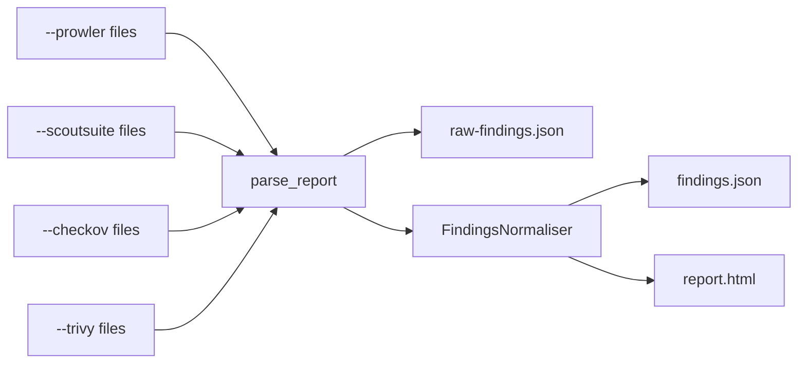

Ingest exists for the common case where the scanners already run somewhere you don't control from cloudg: a CI job that runs Checkov on every pull request, a nightly Prowler container in the security account, a Trivy step in the image build. Those jobs produce files. `cloudg ingest` reads the files and does the rest. Nothing is executed and no cloud API is called, so it runs on a laptop with no AWS profile, in an air-gapped review environment, or in a CI step after the scan step.

## What ingest does



Each path goes through `cloudg.ingest.parse_report(tool, path)`, which hands it to that scanner's own parser (the same code `cloudg run` uses on fresh output). Every parsed `Finding` is collected into one list and written, unchanged, to `raw-findings.json`. The list then goes through the same `FindingsNormaliser` that `cloudg run` uses: two-pass deduplication, CVSS-based rescoring and compliance mapping. The result is written as `findings.json` and `report.html`.

What ingest doesn't do is anything that needs live assets. There is no collection, so no graph, no reachability findings, no IAM linting, no ontology, no RAG chunks and no `topology.svg`. If you want those as well, see [Combining with a live inventory](#combining-with-a-live-inventory).

## Running it

Every input flag is repeatable, and any combination of tools works.

```bash tab="CLI"
cloudg ingest \
  --prowler ./prowler-output/ \
  --scoutsuite ./scoutsuite-report/ \
  --checkov ./results_json.json \
  --trivy ./trivy-image.json \
  --trivy ./trivy-fs.json \
  -o ./reports
```

```python tab="Python" title="ingest_reports_demo.py"
from cloudg import CloudGConfig, CloudGEngine

engine = CloudGEngine(CloudGConfig())
result = engine.run_from_reports_sync(
    {
        "prowler": ["./prowler-output/"],
        "scoutsuite": ["./scoutsuite-report/"],
        "checkov": ["./results_json.json"],
        "trivy": ["./trivy-image.json", "./trivy-fs.json"],
    },
    output_dir="./reports",
)

print(result.total_findings, result.severity_breakdown)
print(result.report_paths)
print(result.errors)
```

```bash tab="Docker"
docker run --rm \
  -v "$PWD:/data" \
  ghcr.io/morpheuslord/cloudg:latest ingest \
  --prowler /data/prowler-output/ \
  --checkov /data/results_json.json \
  --trivy /data/trivy-image.json \
  -o /data/reports
```

| Flag | Accepts |
|---|---|
| `--prowler` | An ASFF JSON or JSONL file, or a directory searched recursively for `*.json` |
| `--scoutsuite` | A `scoutsuite_results*.js` file, or a report directory searched recursively for one |
| `--checkov` | A Checkov JSON report, or a directory containing `results_json.json` |
| `--trivy` | A `trivy image` or `trivy fs` JSON report, or a directory searched recursively for `*.json` |
| `--format` | `html`, `json` or `all` (default). `raw-findings.json` is written in every case. |
| `-o, --output` | Output directory, `./reports` by default |

The global `-c` option matters here for one reason: `rulesets.rules_dir` decides which compliance rulesets the normaliser loads. See [Compliance frameworks](/guides/compliance/#adding-a-custom-ruleset).

```bash
cloudg -c config.yaml ingest --prowler ./prowler-output/ -o ./reports
```

### Try it without any scanner {#try-it-without-any-scanner}

The script below writes one small file per tool in each tool's native shape, the same shapes the test suite uses. Run it in an empty directory, then run the `cloudg ingest` command above.

```python title="make_sample_reports.py"
"""Write one small native report per scanner, shaped like the real tools' output."""
import json
from pathlib import Path

Path("prowler-output").mkdir(exist_ok=True)
Path("prowler-output/prowler-output-123456789012.asff.json").write_text(json.dumps([
    {
        "Id": "prowler-aws-s3_bucket_default_encryption-123456789012-eu-west-1-abc",
        "Title": "S3 bucket default encryption",
        "Description": "Bucket has no default encryption",
        "Severity": {"Label": "HIGH"},
        "Resources": [{"Id": "arn:aws:s3:::my-bucket"}],
        "Compliance": {"Status": "FAILED", "RelatedRequirements": ["CIS 2.1.1"]},
        "Remediation": {"Recommendation": {"Text": "Enable default encryption"}},
    }
]))

results = Path("scoutsuite-report/scoutsuite-results")
results.mkdir(parents=True, exist_ok=True)
(results / "scoutsuite_results_aws-123456789012.js").write_text(
    "scoutsuite_results =\n" + json.dumps({
        "services": {"s3": {"findings": {"s3-bucket-no-encryption": {
            "description": "Bucket without encryption",
            "rationale": "Data at rest should be encrypted",
            "remediation": "Enable encryption",
            "level": "danger",
            "flagged_items": 1,
            "items": ["s3.buckets.my-bucket"],
            "references": [],
        }}}}
    })
)

Path("results_json.json").write_text(json.dumps({
    "check_type": "terraform",
    "results": {"failed_checks": [{
        "check_id": "CKV_AWS_19",
        "check_name": "Ensure S3 bucket has server-side encryption enabled",
        "severity": "HIGH",
        "resource": "aws_s3_bucket.data",
        "file_path": "/main.tf",
        "file_line_range": [1, 10],
        "guideline": "https://docs.example/ckv-aws-19",
    }]},
}))

Path("trivy-image.json").write_text(json.dumps({
    "ArtifactName": "myrepo/app:latest",
    "ArtifactType": "container_image",
    "Results": [{
        "Target": "myrepo/app:latest (alpine 3.19)",
        "Type": "alpine",
        "Vulnerabilities": [{
            "VulnerabilityID": "CVE-2024-0001",
            "PkgName": "openssl",
            "InstalledVersion": "3.1.0",
            "FixedVersion": "3.1.1",
            "Severity": "CRITICAL",
            "Description": "Example vulnerability",
            "CVSS": {"nvd": {"V3Score": 9.8}},
        }],
    }],
}))

Path("trivy-fs.json").write_text(json.dumps({
    "ArtifactName": "./iac",
    "ArtifactType": "filesystem",
    "Results": [{
        "Target": "main.tf",
        "Type": "terraform",
        "Misconfigurations": [{
            "ID": "AVD-AWS-0088",
            "Title": "S3 bucket encryption not enabled",
            "Description": "Bucket does not have encryption enabled",
            "Severity": "HIGH",
            "Resolution": "Enable encryption",
        }],
    }],
}))
print("sample reports written")
```

```console
$ python make_sample_reports.py
sample reports written
$ cloudg ingest --prowler ./prowler-output/ --scoutsuite ./scoutsuite-report/ --checkov ./results_json.json --trivy ./trivy-image.json --trivy ./trivy-fs.json -o ./reports
  prowler: 1 findings
  scoutsuite: 1 findings
  checkov: 1 findings
  trivy: 2 findings
  ✓ JSON: reports/findings.json
  ✓ HTML: reports/report.html
  ✓ Raw findings: reports/raw-findings.json

  ✓ Ingested 5 findings from 4 tool(s), 5 after deduplication
```

## Input requirements {#input-requirements}

Each parser expects one specific output format. Feed it anything else and the result ranges from zero findings to findings full of placeholders, so this section is worth reading before you wire up a CI job.

### Prowler

Produce ASFF:

```bash
prowler aws -M json-asff -o ./prowler-output
prowler azure --az-cli-auth -M json-asff -o ./prowler-output-azure
```

cloudg accepts a single file or a directory. A directory is searched recursively for `*.json`, and every match is parsed as ASFF. Each file may be a JSON array or JSONL (one ASFF object per line). From each finding cloudg reads:

| ASFF field | Becomes |
|---|---|
| `Id` | `source_finding_id`; the check name inside it (third dash-separated token) is the dedupe key |
| `Title`, `Description` | `title`, `description` |
| `Severity.Label` (or `ProductFields.Severity`) | `severity`; `informational` maps to INFO, unknown labels to MEDIUM |
| `Resources[0].Id` | `resource_arn` and `resource_id` |
| `Compliance.RelatedRequirements` | Coarse framework tags (`CIS`, `NIST-800-53`, `PCI-DSS`, `GDPR`, `HIPAA`, `SOC2`) |
| `Compliance.Status` | `PASSED` findings are dropped |
| `Remediation.Recommendation.Text` | `remediation` |
| `ProductFields` | `evidence` (first 1000 characters of the JSON) |

:::warning Only ASFF in the Prowler directory
Prowler's other JSON format, OCSF (`*.ocsf.json`), also ends in `.json`. If the directory holds OCSF files, cloudg parses them as ASFF and produces one `Unknown Prowler Finding` at MEDIUM severity with no resource for every record, passing checks included. Run Prowler with `-M json-asff` only, or pass the `.asff.json` file itself.
:::

### ScoutSuite

Produce a report directory:

```bash
scout aws --profile audit --report-dir ./scoutsuite-report --no-browser
```

cloudg accepts the report directory (searched recursively for `scoutsuite_results*.js`, which ScoutSuite puts in `scoutsuite-results/`) or the `.js` file itself. That file is JavaScript, one JSON object assigned to a variable; cloudg strips everything up to the first `=` and parses the rest.

Findings come from `services.<service>.findings.<rule>`. A rule with `flagged_items` of 0 is skipped. Otherwise every entry in `items` becomes one finding, with the item string as the resource ID. ScoutSuite items are its own object paths, not ARNs, so ScoutSuite findings rarely merge with other tools' findings for the same resource.

| ScoutSuite `level` | Severity |
|---|---|
| `danger` | CRITICAL |
| `warning` | HIGH |
| `caution` | MEDIUM |
| `good` | INFO |
| anything else | MEDIUM |

The rule's `references` list is copied into `compliance_frameworks` as is. If your ScoutSuite rules put documentation URLs there, those URLs appear as framework names in the compliance output.

### Checkov

Produce JSON, either redirected from stdout or written by Checkov:

```bash
checkov -d ./infra --output json > results_json.json
checkov -d ./infra --output json --output-file-path ./checkov-out
```

The second form writes `./checkov-out/results_json.json`. cloudg accepts a file or a directory; a directory is searched for `results_json.json` first, then for any `*.json`. Both shapes Checkov emits parse: a single `{check_type, results}` object, or a list of them when several frameworks ran.

Only `results.failed_checks[]` is read. From each entry: `check_id` (dedupe key), `check_name` (the title, prefixed with `[Checkov/<check_type>]`), `severity`, `resource` (Checkov's resource address, such as `aws_s3_bucket.data`), `file_path`, `file_line_range` and `guideline`. When `severity` is empty, as it usually is in plain open-source Checkov output, the finding is MEDIUM. Every Checkov finding is tagged `CIS`, plus `NIST-800-53` or `PCI-DSS` when the check ID contains those strings.

### Trivy

Produce either or both:

```bash
trivy image --format json --output trivy-image.json 123456789012.dkr.ecr.us-east-1.amazonaws.com/api:1.4.2
trivy fs --format json --scanners vuln,misconfig,secret --output trivy-fs.json ./infra
```

cloudg accepts a file or a directory of them (searched recursively for `*.json`). The top-level `ArtifactType` decides the parser:

| `ArtifactType` | Parser | Reads |
|---|---|---|
| `container_image` | Image | `Vulnerabilities`, `Secrets` |
| anything else (`filesystem`, `repository`) | Filesystem | `Vulnerabilities`, `Misconfigurations`, `Secrets` |

`ArtifactName` becomes the resource ID of every finding in that file. Vulnerabilities use `VulnerabilityID` as the check ID and read `PkgName`, `InstalledVersion`, `FixedVersion`, `Severity`, `Description` and the first `V3Score` found under `CVSS`. Misconfigurations use `ID` (the `AVD-*` identifier), `Title`, `Description`, `Severity` and `Resolution`. Secrets are always HIGH. Trivy's `UNKNOWN` severity maps to INFO.

A `trivy fs` scan only reports misconfigurations when `misconfig` is in `--scanners`, which is why the command above lists it. Leave out `--include-non-failures`: cloudg doesn't look at a misconfiguration's status, so passing checks would come through as findings.

## Several files per scanner

Repeat the flag, point it at a directory, or both. In Python, the value for each tool is a list.

```bash
cloudg ingest \
  --prowler ./prowler/account-111111111111/ \
  --prowler ./prowler/account-222222222222/ \
  --trivy ./trivy-results/ \
  -o ./reports
```

Paths are handled one at a time. A path that doesn't exist is reported (`trivy: skipping ./nope.json (Report path does not exist: ./nope.json)`) and skipped, and a file that isn't valid JSON is logged and skipped by the parser. Neither stops the other inputs. If nothing parses at all, cloudg warns `No findings parsed from the given reports` and still writes empty reports, with exit code 0. The only hard failure is calling `cloudg ingest` with no input flag, which exits 1.

If you feed the same report twice, or two overlapping directories, the duplicates collapse during normalisation: within one scanner, findings with the same check ID on the same resource are merged into one.

## Normalisation and deduplication {#normalisation-and-deduplication}

The normaliser runs two deduplication passes, then rescoring, then compliance mapping. Compliance mapping has [its own page](/guides/compliance/); this is what happens to the findings themselves.

Pass 1 works inside each scanner. The key is the tool, the check ID (or the normalised title when there is no check ID) and the resource. Two different checks that happen to share a title on the same bucket stay separate.

Pass 2 works across scanners. Two findings from different tools merge only when all three of these hold: they're on the same resource string, their titles match after normalisation (lowercased, leading `[Tool]` tags removed, punctuation collapsed), and both check IDs map to the same canonical ID in `rules/check_equivalence.yaml`. The shipped file defines 7 canonical checks covering 18 scanner check IDs, such as Prowler `s3_bucket_default_encryption`, Checkov `CKV_AWS_19` and Trivy `AVD-AWS-0088` for S3 default encryption. A merged finding keeps the highest severity and lists every tool in `source_tool`, comma-separated.

```python title="dedupe_demo.py"
from cloudg.normaliser import FindingsNormaliser
from cloudg.schema.models import Finding, Severity

bucket = "arn:aws:s3:::my-bucket"
prowler = Finding(
    resource_id=bucket,
    resource_arn=bucket,
    severity=Severity.HIGH,
    title="S3 bucket default encryption",
    description="Bucket has no default encryption",
    source_tool="prowler",
    source_finding_id="prowler-aws-s3_bucket_default_encryption-123456789012-eu-west-1-abc",
)
checkov = Finding(
    resource_id=bucket,
    resource_arn=bucket,
    severity=Severity.CRITICAL,
    title="[Checkov/terraform] S3 bucket default encryption",
    description="S3 bucket default encryption",
    source_tool="checkov",
    source_finding_id="CKV_AWS_19",
)

result = FindingsNormaliser().normalise([prowler, checkov])
for f in result.findings:
    print(f.severity.value, "|", f.source_tool, "|", f.title)
```

```console
$ python dedupe_demo.py
CRITICAL | checkov, prowler | [Checkov/terraform] S3 bucket default encryption
```

Expect that to be the exception with real reports. Prowler reports an ARN, Checkov a Terraform address and Trivy a directory or image name, and their titles are worded differently, so the sample reports above produce three separate S3 encryption findings. cloudg chooses visible duplicates over silently dropping one tool's result.

Rescoring comes after deduplication. A finding with a CVSS score of 9.0 or more becomes CRITICAL; 7.0 or more raises it to at least HIGH. Every finding also carries `risk_score`, the severity's base score (9.5, 7.5, 5.0, 2.5 or 0.5), averaged with the CVSS score when there is one. The Trivy sample CVE above has CVSS 9.8, so its risk score is 9.7.

## Parse first, normalise later

`parse_report` and `ingest_reports` give you findings without running the normaliser or writing anything, which is useful when you want to filter or enrich first.

```python title="parse_then_normalise.py"
from cloudg.ingest import parse_report, ingest_reports
from cloudg.normaliser import FindingsNormaliser

# One tool at a time
prowler = parse_report("prowler", "./prowler-output/")
trivy = parse_report("trivy", "./trivy-image.json")
print(len(prowler), "prowler,", len(trivy), "trivy")

# Or every tool in one call; bad paths are logged and skipped
findings = ingest_reports(
    {
        "prowler": ["./prowler-output/"],
        "checkov": ["./results_json.json"],
        "trivy": ["./trivy-image.json", "./trivy-fs.json"],
    }
)

scan_result = FindingsNormaliser().normalise(findings)
print(scan_result.summary["severity_breakdown"])
for f in scan_result.findings:
    print(f"{f.severity.value:8} {f.risk_score:4} {f.source_tool:10} {f.title}")
```

```console
$ python parse_then_normalise.py
1 prowler, 1 trivy
{'CRITICAL': 1, 'HIGH': 3}
CRITICAL  9.7 trivy      [Trivy] CVE-2024-0001: openssl (alpine)
HIGH      7.5 prowler    S3 bucket default encryption
HIGH      7.5 checkov    [Checkov/terraform] Ensure S3 bucket has server-side encryption enabled
HIGH      7.5 trivy      [Trivy/IaC] AVD-AWS-0088: S3 bucket encryption not enabled
```

The functions differ in how they fail. `parse_report` raises `ValueError` for a tool name it doesn't know (only `prowler`, `scoutsuite`, `checkov` and `trivy` are accepted, case-insensitive) and `FileNotFoundError` for a missing path. `ingest_reports` catches both, logs them and moves on. The per-scanner parsers are public too, as class methods: `ProwlerScanner.parse_report(path)`, `ScoutSuiteScanner.parse_report(path)`, `CheckovScanner.parse_report(path)` and `TrivyScanner.parse_report(path)`.

On the engine, `CloudGEngine.ingest_reports()` wraps `ingest_reports` and fires the `on_phase_start("ingest")`, `on_finding` and `on_scan_complete` [event hooks](/api/event-hooks/). `run_from_reports()` and its sync wrapper go further and write `findings.json` and `report.html` (not `raw-findings.json`), returning a `PipelineResult` whose `report_paths` holds both paths and whose `errors` lists any phase that failed.

## What comes out

| File | Contents |
|---|---|
| `raw-findings.json` | A JSON list of every parsed `Finding`, before deduplication and compliance mapping (CLI only) |
| `findings.json` | `metadata`, `summary`, `findings`, `compliance` and an empty `assets` list and `graph` |
| `report.html` | The interactive report: findings table, analytics, compliance cards |

With no assets, the report's Infrastructure Map tab falls back to a force graph of finding nodes linked to compliance framework nodes. The [Reports](/guides/reports/) guide covers both files in detail, and the field-level layout of `findings.json` is on [Output files](/reference/output-files/).

## Combining with a live inventory {#combining-with-a-live-inventory}

Ingest needs no credentials; mapping needs read-only ones. Run them separately, at different times if you like, and merge at the end. [`cloudg map`](/guides/inventory-mapping/) accepts a cloudg findings file and writes `asset-map.json` (each asset with its findings) and `compliance-map.json` (each framework with its affected assets):

```bash
cloudg ingest --prowler ./ci/prowler-output/ --checkov ./ci/results_json.json -o ./reports
cloudg map -p aws --regions us-east-1 --findings ./reports/findings.json -o ./reports
```

From Python, ingest and normalise against collected assets so findings sit next to the inventory in one `ScanResult`:

```python title="collect_and_ingest.py"
import asyncio

from cloudg import CloudGConfig, CloudGEngine


async def main() -> None:
    engine = CloudGEngine(CloudGConfig(providers=["aws"]))

    collection = await engine.collect()  # needs AWS credentials
    ingested = engine.ingest_reports({"prowler": ["./ci/prowler-output/"]})
    scan_result = engine.normalise_findings(ingested, assets=collection.assets)
    print(len(scan_result.assets), "assets,", len(scan_result.findings), "findings")


asyncio.run(main())
```

## Next

:::links
- [Compliance frameworks](/guides/compliance/) How findings are tagged with controls, and how to add your own.
- [Reports](/guides/reports/) Reading `findings.json` and `report.html`, and re-rendering them.
- [cloudg ingest](/cli/ingest/) The command reference.
- [parse_report](/api/parse-report/) The Python parser entry point.
:::
