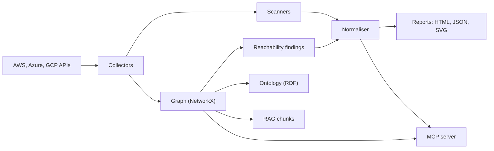

cloudg is a Python command-line tool and a library. You point it at one or more cloud accounts and it builds an inventory of what is deployed there: instances, buckets, roles, security groups, load balancers, functions, key vaults, projects. Those assets and the network edges between them go into a directed graph. From the graph cloudg works out what the internet can reach, which paths an attacker could take sideways, and how much of the estate each node could touch if it were compromised.

The same inventory then goes to the security scanners you already know (Prowler, ScoutSuite, Checkov and Trivy), plus a built-in IAM policy linter. Each scanner reports the same problem in its own words, so cloudg normalises every finding into one model, merges duplicates within and across tools, rescores them against CVSS, and maps them onto controls from 28 compliance frameworks. What you open at the end is a single HTML report, not four.

None of that requires the whole pipeline. Each half of cloudg works without the other.

## Three ways in

Most people arrive with one of three questions, and cloudg has a command for each.

:::cells
### cloudg run
"What is wrong with my cloud?" Collects every configured provider, builds the graph, runs the scanners in parallel, normalises the findings and renders the reports. Needs credentials and, for full coverage, the scanner binaries.
### cloudg ingest
"I already ran the scanners, can you make sense of the output?" Reads native Prowler, ScoutSuite, Checkov and Trivy files, then deduplicates, maps compliance and renders reports. No cloud credentials and no scanner binaries.
### cloudg map
"What do I have, and how is it wired?" A scanner-free inventory mapper: deep collectors, a sweep across every service, typed relationships and dependency analysis. No scanner runs or needs to be installed.
:::

They are independent but they compose. You can `cloudg map` an account today, run Prowler in CI next week, and merge that output into the map later with `cloudg map --findings`. You can collect live assets from Python and normalise findings you ingested from someone else's pipeline in the same script. The [quickstart](/guides/quickstart/) walks through all three.

### Choosing between them

| You have | You want | Use |
|---|---|---|
| Read-only cloud credentials and the scanners installed | A full security picture with a topology graph | `cloudg run` |
| Scanner output files from CI or another team, no cloud access | One deduplicated report with compliance mapping | `cloudg ingest` |
| Read-only credentials, no interest in scanners right now | A complete asset map with dependencies and blast radius | `cloudg map` |
| A management account in AWS Organizations | Every member account mapped in one run | `cloudg map --org` |
| An AI assistant that speaks MCP | Questions answered from your inventory and findings | `cloudg mcp serve` |

`cloudg run` and `cloudg map` collect differently. The pipeline uses a fixed set of service collectors per provider (on AWS that is EC2, S3, RDS, VPCs, subnets, security groups, IAM users and roles, Lambda, ELBv2, ECS, DynamoDB, CloudFront, Secrets Manager and KMS), which is what the scanners and the reachability analysis need. The inventory mapper goes much further: 133 AWS collector tasks, a Cloud Control API sweep over every listable resource type, Azure Resource Graph across subscriptions and GCP Cloud Asset Inventory across the organization. If you want to know everything that exists, use `map`. If you want to know what is exposed and misconfigured, use `run`.

## How the pieces fit



Collectors talk to the provider APIs through a shared rate limiter, so a big account slows down instead of failing. In the NetworkX graph, edge endpoints that are not assets (the `0.0.0.0/0` on a security group rule, for example) become external nodes, and a breadth-first search from the internet sources `0.0.0.0/0` and `::/0` over network-flow edges is how cloudg decides what is internet-reachable. Scanners run as separate processes, each in its own worker thread, and anything not installed is skipped with a warning. The normaliser is the meeting point: scanner findings, the graph's reachability findings and the IAM linter's results all go through the same deduplication and compliance mapping.

The MCP server sits beside all of this. It loads the files a run or a map produced (or runs collection itself, when you allow the live tools) and exposes them to an AI client as tools, resources and prompts, behind a privacy policy that redacts secrets by default.

## Providers

| Provider | Install extra | How cloudg reads it | Default regions |
|---|---|---|---|
| AWS | `cloudg[aws]` (boto3, aioboto3) | Per account and region, with STS role assumption for multi-account fan-out | `us-east-1` |
| Azure | `cloudg[azure]` (azure-identity and the management SDKs) | Per subscription; every enabled subscription the credential can see when none is set | all locations |
| GCP | `cloudg[gcp]` (google-cloud-asset, google-auth) | Cloud Asset Inventory, per project or once at organization scope | all regions |

Every provider supports several authentication methods, resolved in a fixed order: direct keys, OIDC federation, profiles and service principals, managed identities, and finally each SDK's default chain. The same configuration works on a laptop, in CI and on cloud compute. [Authentication](/guides/authentication/) has the details.

## Scanners

| Scanner | What it checks | Executable cloudg looks for |
|---|---|---|
| Prowler | Live cloud configuration against its check library, once per provider | `prowler` |
| ScoutSuite | Live cloud configuration, once per provider | `scout` |
| Checkov | Infrastructure-as-code in a directory, or the Terraform cloudg generates from the live estate | `checkov` |
| Trivy | Container images, or a filesystem when no images are given | `trivy` |
| IAM linter | IAM policies on collected roles and policies, using Parliament | built in |

The scanners are executables, not Python dependencies. cloudg checks `PATH` when it runs each one and skips the missing ones. [Installation](/guides/installation/#scanner-binaries) shows how to install each, and [Running scanners](/guides/running-scanners/) covers what cloudg passes to them.

## What you get

A `cloudg run` writes everything into `./reports` (change it with `-o`):

| File | What it is |
|---|---|
| `report.html` | Interactive report in one file: D3 topology, findings table, compliance matrix. The data is embedded; Chart.js and D3 load from a CDN. |
| `findings.json` | Machine-readable result: metadata, summary, assets, findings, compliance and graph data. `cloudg report -i` reads it back. |
| `topology.svg`, `topology.graphml`, `topology-cytoscape.json` | The graph as an image, for Gephi or yEd, and for Cytoscape |
| `ontology.ttl`, `ontology.jsonld` | RDF ontology with 64 inferred relation types, queryable with SPARQL |
| `rag_chunks.jsonl`, `rag_metadata_index.json` | Retrieval-ready chunks of the infrastructure for LLM pipelines |
| `terraform/*.tf.json` | Terraform recreation of the live infrastructure, with `--terraform` |

`cloudg ingest` writes `findings.json`, `report.html` and `raw-findings.json`. `cloudg map` writes `inventory-map.json`, `inventory-map.graphml`, `inventory-graph.json` and `inventory-dependencies.json`, plus `inventory-organization.json` with `--org` and `asset-map.json` and `compliance-map.json` with `--findings`. [Output files](/reference/output-files/) describes each one field by field.

## Using it from Python

The CLI is a thin layer. `CloudGEngine` runs the whole pipeline or any single phase, with hooks that fire as findings arrive:

```python title="first_run.py"
from cloudg import CloudGConfig, CloudGEngine

engine = CloudGEngine(CloudGConfig(providers=["aws"]))
engine.on_phase_start = lambda phase: print("phase:", phase)

result = engine.run_pipeline_sync(output_dir="./reports")
print(result.to_summary())
```

The graph builder, ontology, RAG exporter, scanner parsers, normaliser, inventory mapper and MCP layer are all importable on their own. [The pipeline](/guides/pipeline/) shows the phases from both the CLI and Python, and the [Python API](/api/) tab documents every class.

## Where to go next

:::links
- [Installation](/guides/installation/) pip, uv or Docker, the provider extras, and the scanner binaries.
- [Quickstart](/guides/quickstart/) A first report in a few minutes, with or without credentials.
- [The pipeline](/guides/pipeline/) What each phase of cloudg run reads, writes and does when something fails.
- [Inventory mapping](/guides/inventory-mapping/) The scanner-free map of everything deployed.
- [Ingesting existing output](/guides/ingesting/) Reports from scanner files you already have.
- [MCP server](/mcp/) Hand the inventory and findings to an AI assistant.
:::
