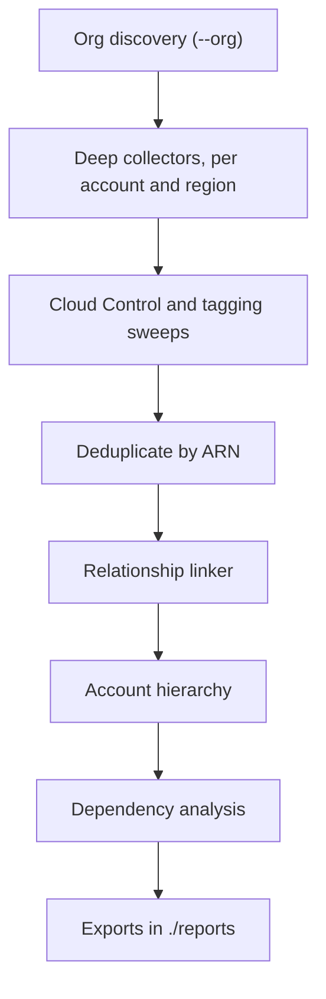

`cloudg map` reads your cloud accounts and writes down everything it finds, deployed resources and defaults alike, then links them into one graph of typed relationships. A Lambda function points at the role it runs as, the queue that triggers it, the image it was built from and the KMS key that encrypts its environment. A WAF points at the load balancer it protects. An SCP points at the accounts it restricts.

No scanner runs during a map, and none needs to be installed. The command only needs read access to the cloud APIs.

:::note
The map doesn't depend on the scanners. You can map today and pull in next week's scan findings with `--findings ./reports/raw-findings.json`. On the CLI that flag belongs to `cloudg map`, so it maps again; to overlay findings onto a map you already saved without calling the cloud, use the Python call in [Overlay scanner findings](#overlay-scanner-findings).
:::

## Map an account

The smallest useful run maps one AWS account in every enabled region:

```bash tab="CLI"
cloudg map -p aws --profile audit --regions all
```

```python tab="Python" title="map_account.py"
from cloudg import CloudGConfig, CloudGEngine

config = CloudGConfig(providers=["aws"])
config.aws.profile = "audit"
config.aws.regions = ["ALL"]

engine = CloudGEngine(config)
inventory = engine.map_inventory_sync(output_dir="./reports")

summary = inventory.summary
print(summary["total_assets"], "assets,", summary["total_edges"], "edges")
print("internet-exposed:", summary["internet_exposed"])
print("unlinked:", summary["unlinked_assets"])
```

```bash tab="Docker"
docker run --rm \
  -v ~/.aws:/home/cloudg/.aws:ro \
  -v "$PWD/reports:/app/reports" \
  ghcr.io/morpheuslord/cloudg:latest \
  map -p aws --profile audit --regions all
```

The image runs as the user `cloudg` with its home at `/home/cloudg`, which is why the AWS config directory is mounted there. Reports land in `/app/reports`, the container's `./reports`.

While it runs, the CLI prints a "Map Configuration" panel (providers, regions, selected services, whether the Kubernetes, Cloud Control and catch-all sweeps are on) and then an "Inventory Summary" table: assets, interconnections, accounts, services, internet-exposed assets, cross-account edges, external accounts referenced, security service gaps, unlinked assets and unresolved references. Two ranked tables follow, "Most shared dependencies" and "Largest blast radius", and a warning line for each security service that is not enabled. [Dependencies and blast radius](/guides/dependencies/) explains how to read them.

Pass a config file with the group option, before the subcommand: `cloudg -c config.yaml map ...`. Without `-c`, cloudg uses its built-in defaults and does not look for a `config.yaml` on its own.

## Regions

`--regions` takes `all` or a comma-separated list such as `us-east-1,eu-west-1`. The same value is applied to AWS, Azure and GCP. Leave it out and AWS maps `us-east-1` only, because that is the default of `aws.regions`.

With `all`, cloudg discovers the enabled regions first and runs one collection unit per account and region. Account-wide services (IAM, Route 53, ECR Public, Direct Connect gateways and the other global tasks) run once per account, in the primary region: `us-east-1` when it is part of the run, otherwise the first region in the list. So `--regions all` doesn't collect IAM once per region.

With `--org` and Control Tower, `--regions all` is replaced by the landing zone's governed regions. An explicit list is always used as given. The [AWS Organizations](/guides/aws-organizations/) guide covers that case.

## Many accounts

`--accounts 111122223333,444455556666 --role-name cloudg-readonly` maps a fixed list of accounts by assuming that role in each one. `--org` discovers the accounts instead, from the management account, and maps the OU tree, SCPs and Control Tower with them:

```bash
cloudg map -p aws --org --org-role cloudg-readonly --regions all
```

:::warning AWSControlTowerExecution has admin rights
Without `--org-role` (or `--role-name`), cloudg assumes `AWSControlTowerExecution` in every member account. That role exists wherever Control Tower enrolled an account, but it carries administrator permissions. Deploy a read-only role to every account and pass it with `--org-role`. [AWS Organizations](/guides/aws-organizations/) has a StackSet template for it.
:::

Always pair `--accounts` with `--role-name`. Without a role name cloudg doesn't assume anything and maps your own account once per listed ID, labelled with each of those IDs.

## What gets collected

Coverage comes in layers. Each one catches what the previous one missed.

:::cells
### Deep collectors
131 dedicated AWS collector tasks in 19 service families, each reading one service in depth and declaring what every asset talks to. Azure goes through Resource Graph, GCP through Cloud Asset Inventory.
### Breadth sweep
On AWS, a Cloud Control sweep lists every CloudFormation resource type that has a list handler, tagged or not, so services without a dedicated collector still show up. The tagging API sweep adds tagged resources on top.
### Every account
Every account gets a `CLOUD_ACCOUNT` node that contains its top-level resources. With `--org`, accounts hang under the OU tree next to SCPs and Control Tower controls.
:::

When the same resource turns up twice, the copy from a dedicated collector wins over a Cloud Control hit, which wins over a tagging API hit. Their declared relationships and aliases are merged into the copy that is kept.

Values that could be secret are never collected: SSM parameter values, environment variable values, passwords, VPN pre-shared keys, Direct Connect auth keys. The Cloud Control sweep strips secret-looking properties at any depth before it stores a resource model.

Security services that are switched off still appear. GuardDuty, Security Hub, Inspector, Macie, Config, Access Analyzer, Detective, CloudTrail, WAF, Network Firewall and Shield each produce a node per account and region; when one is not enabled (or access to it is denied) the node carries `enabled: false`. That is how detection gaps end up on the map instead of being silently absent.

## Choose service families

`--services` and `--exclude-services` take family names or individual task names, comma-separated. The exclusion always wins.

| Family | What it covers |
|---|---|
| `network` | VPCs, subnets, security groups, route tables, gateways, ENIs, NACLs, peering, transit gateways, endpoints and PrivateLink, load balancers and listeners, CloudFront, Global Accelerator, VPC Lattice |
| `hybrid` | site-to-site VPN, customer and virtual private gateways, Direct Connect, Cloud WAN |
| `compute` | EC2, Auto Scaling, launch templates, AMIs and their sharing, Batch, App Runner, Elastic Beanstalk |
| `containers` | ECR, ECS, Cloud Map, EKS clusters, nodegroups, Fargate profiles, addons, access entries |
| `serverless` | Lambda, API Gateway (REST and HTTP), authorizers, VPC links, custom domains, Step Functions |
| `integration` | SQS, SNS, EventBridge, Scheduler, Pipes, Kinesis, Firehose, MSK, Amazon MQ |
| `storage` | S3, access points, EBS volumes and snapshots, EFS, FSx, Transfer Family, DataSync |
| `data` | RDS, Aurora, proxies, DynamoDB, ElastiCache, MemoryDB, DAX, OpenSearch, Redshift |
| `analytics`, `ml` | Glue, Lake Formation, EMR, Athena; SageMaker and Bedrock |
| `identity` | the IAM graph, IAM Identity Center, Roles Anywhere, Cognito, KMS, Secrets Manager, ACM |
| `governance` | RAM shares, Service Catalog, CloudFormation StackSets |
| `security` | GuardDuty, Security Hub, Inspector, Macie, Config, Access Analyzer, Detective, WAF, Network Firewall, Shield |
| `logging`, `operations`, `backup` | CloudTrail, flow logs, log groups and subscriptions, OAM; CloudWatch alarms, Systems Manager; AWS Backup |
| `dns`, `iac`, `cicd` | Route 53 and Resolver; CloudFormation stacks; CodePipeline, CodeBuild, CodeDeploy, CodeConnections |
| `sweep` | the two breadth sweeps, `cloud_control` and `tagging_sweep` |

That makes 133 AWS tasks in all. The task-by-task list, with each task's family and whether it runs once per account, is in the [inventory internals](https://github.com/morpheuslord/cloudg/blob/main/docs/INVENTORY_INTERNALS.md#53-service-families-and-tasks) document.

```bash
# containers and serverless wiring only
cloudg map -p aws --regions all --services containers,serverless,sweep
# everything except the data stores and one noisy task
cloudg map -p aws --regions all --exclude-services data,cloudformation
```

:::warning The sweeps are a family too
The two sweeps belong to the family `sweep`. Once you pass `--services`, only what you listed runs, so `--services containers,serverless` also drops the Cloud Control and tagging API sweeps. Add `sweep` to the list if you want them. A family name that matches nothing (a typo, say) is not an error; it selects no tasks.
:::

Narrowing the run has a side effect on the links. A function whose role lives in the `identity` family can't be linked to that role when `identity` is excluded, so the reference shows up under `unresolved_references` instead of as an edge.

## Kubernetes inside EKS

With the `containers` family selected (or `eks`, or `kubernetes`), cloudg also reads the objects inside every `ACTIVE` EKS cluster that has an endpoint: namespaces, Deployments, StatefulSets, DaemonSets, CronJobs, Services, Ingresses and ServiceAccounts. Workloads are linked to the ECR repositories their images come from and to the IAM role their service account maps to (IRSA or Pod Identity). Services are linked to the workloads their selector matches and to the load balancer behind their hostname.

It authenticates the way `aws eks get-token` does, with a presigned STS request, and only issues `GET`s. Secrets are never read. The identity cloudg runs as needs network reach to the cluster endpoint and read access inside the cluster. An access entry with the `AmazonEKSViewPolicy` is enough:

```bash
aws eks create-access-entry \
  --cluster-name prod-eks \
  --principal-arn arn:aws:iam::123456789012:role/cloudg-readonly
aws eks associate-access-policy \
  --cluster-name prod-eks \
  --principal-arn arn:aws:iam::123456789012:role/cloudg-readonly \
  --policy-arn arn:aws:eks::aws:cluster-access-policy/AmazonEKSViewPolicy \
  --access-scope type=cluster
```

A cluster that can't be reached (a private endpoint, a missing access entry) records `kubernetes:<cluster>` as `FAILED` in coverage. The rest of the EKS collection is unaffected. Turn in-cluster mapping off with `--no-kubernetes`; the default timeout per API call is 10 seconds (`inventory.kubernetes_timeout`).

## Breadth sweeps

Two sweeps catch what no deep collector reads. They are separate flags.

`--cloud-control / --no-cloud-control` (on by default) controls the AWS Cloud Control API sweep. cloudg lists every CloudFormation resource type with a list handler (more than 800), skips the ones a deep collector already maps, runs account-wide types once per account and lists the rest with six types in parallel per region. Each hit becomes an asset with `discovered_via: "cloud-control"` and its redacted resource model under `properties`. The list of listable types is discovered once and cached for a week in `$CLOUDG_CACHE_DIR` (default `~/.cache/cloudg`). Types that need a parent identifier are skipped, and types that fail to list are counted per error code in the `cloud_control_skipped_types` coverage entry. To narrow it from config, set `inventory.cloud_control_types` or `inventory.cloud_control_exclude` to type names or prefixes such as `AWS::Glue::`.

`--sweep / --no-sweep` (on by default) controls the Resource Groups Tagging API sweep. AWS only returns resources that have been tagged at some point, so this sweep mostly enriches; the Cloud Control sweep is the one that finds untagged resources. Hits carry `discovered_via: "tagging-api"`.

:::note
`cloudg map` always hands the value of `--sweep` to the mapper, and that value defaults to on, so the CLI overrides `inventory.tagging_sweep: false` from your config file even when you don't type the flag. Use `--no-sweep` on the command line to turn the tagging sweep off.
:::

## Azure and GCP

Azure is read through Azure Resource Graph, which returns every resource with its full properties in one query per subscription. That is what lets PaaS services get real relationships: managed identities and their role assignments, private endpoints, AKS node pools and ACR pulls, App Service VNet integration, Application Gateway and Front Door backends, Key Vault access policies and Defender for Cloud plans. Resource Graph needs `azure-mgmt-resourcegraph`, which comes with the `azure` extra (`pip install "cloudg[azure]"`). Without it cloudg falls back to the per-service SDK collectors and the ARM resource sweep.

Pass one subscription with `--subscription-id`. With none configured and `azure.all_subscriptions: true` (the default), every Enabled subscription the credential can see is mapped. `azure.map_management_groups` adds the management group tree, Azure Landing Zone archetypes and Azure Policy assignments. The identity needs Reader at the tenant root management group.

GCP is read through Cloud Asset Inventory `list_assets` with the full resource JSON. When `gcp.organization_id` is set, the listing runs once at the organization scope; otherwise once per project (`--project-id` for a single one). Relations cover instances, firewall semantics, the load-balancing chain down to NEGs and Cloud Armor, GKE with Workload Identity, Cloud Run and Functions v2, Pub/Sub, Eventarc, logging sinks, CMEK keys and Shared VPC. With an organization ID, the organization, folder and project tree, organization policies and VPC Service Controls perimeters are mapped too. The identity needs `roles/cloudasset.viewer` on the organization (or each project), and the Cloud Asset API must be enabled on the quota project.

```bash
cloudg map -p azure --subscription-id 00000000-0000-0000-0000-000000000000
cloudg map -p gcp --project-id prod-platform-381214
cloudg map -p all --regions all
```

## How a run fits together



Collectors never create edges across services themselves. They declare what each asset talks to, by any identifier they have (an ARN, a queue URL, an image URI, a bare `sg-` ID), and the relationship linker resolves those identifiers across services, regions and accounts. It runs three passes: declared relations, provider rules for older metadata conventions, and a generic pass that turns any identifier-looking string in an asset's metadata into a `REFERENCES` edge when it resolves to another asset.

Resolution is scoped. An ambiguous name such as `default` resolves inside the referencing asset's account and region, and is left unresolved rather than guessed when it could belong to several accounts. A reference into an account you didn't map becomes a `CLOUD_ACCOUNT` node with `external: true`, so the vendor account trusted by one of your roles stays visible. A reference that resolves to nothing at all, such as a deleted queue still configured as a DLQ, lands in `unresolved_references` (capped at 2000 per run). Those are worth reading; a missing DLQ or log group is often a real misconfiguration.

## Typed edges

Every edge has a coarse `edge_type` and, when known, a finer `relationship` plus `properties`. Direction always reads "source verb target".

| Edge type | Examples |
|---|---|
| `INVOKES` | S3 bucket to Lambda (notification), SQS to Lambda (`TRIGGERED_BY`), SNS to SQS (`STREAMS_TO`), EventBridge rule to target, API Gateway to Lambda |
| `USES_IMAGE` | task definition, Kubernetes workload or Lambda to an ECR repository |
| `ASSUMES_ROLE` | Lambda, task definition, nodegroup, Kubernetes service account or instance profile to an IAM role |
| `IAM_TRUST` | principal, external account or OIDC provider to a role it may assume (`CROSS_ACCOUNT_TRUST` across accounts) |
| `GRANTS_ACCESS` | principal to a resource its policy names; bucket, queue and repository policy grants |
| `IAM_POLICY_ATTACHMENT` | user, group or role to a managed policy |
| `PROTECTS` | WAF to ALB, API Gateway or CloudFront; Network Firewall to VPC; Shield to resource |
| `MONITORS` | Inspector to each scanned instance, repository or function; GuardDuty, Config and CloudTrail to the account |
| `MANAGES` | CloudFormation stack to resource, ASG to instance, landing zone to OUs |
| `GOVERNS` | SCP, RCP, tag policy or Control Tower control to an OU or account |
| `LOGS_TO` | trail, flow log, load balancer, API stage or function to its log destination |
| `LOAD_BALANCER_TARGET` | load balancer to target group to instance, IP or Lambda; Kubernetes Service to workload |
| `ROUTE` | route table to gateway, DNS record to load balancer, Ingress to Service |
| `CONTAINS`, `ATTACHED_TO`, `PEERING`, `REFERENCES` | containment, attachment, VPC peering, and everything else (KMS keys, secrets, DLQs, layers) |

## Coverage, gaps and throttling

Every collection unit (one account and region on AWS, one subscription on Azure, one scope on GCP) produces a coverage record with one entry per task: `SUCCESS` with an asset count, `FAILED` with the error, `PARTIAL` or `SKIPPED`. One failing task never stops the others. The discovery steps get records too: `organizations`, `controltower`, `management_groups`, `organization_hierarchy`. A member account whose role can't be assumed shows as `sts_assume_role: FAILED` and nothing else is collected there.

After a run the CLI prints one warning line listing the failed entries, for example `3 collectors failed (see inventory coverage / -v): ...`, with the first eight named. Coverage is not written to any of the output files, so read it from Python when you need the details:

```python title="coverage_report.py"
from cloudg import CloudGConfig
from cloudg.inventory import InventoryMapper

config = CloudGConfig(providers=["aws"])
config.aws.regions = ["us-east-1", "eu-west-1"]

inventory = InventoryMapper(config).map_inventory_sync()

for record in inventory.coverage:
    for entry in record.services:
        if entry.status.value != "SUCCESS":
            print(record.provider, record.account_id or "-", record.region or "-",
                  entry.service, entry.status.value, entry.error)

if inventory.throttling:
    for line in inventory.throttling.get("messages", []):
        print("throttled:", line)
```

Throttling never fails a map. Calls are paced and retried; a service that is still throttled after its retries is recorded as `FAILED` or `PARTIAL` with an error starting `throttled:`. The run's throttling telemetry is attached as `inventory.throttling` and, when present, written under a top-level `throttling` key in `inventory-map.json`. The [rate limits guide](/guides/rate-limits/) covers tuning.

## Output files

Everything goes to `-o/--output`, `./reports` by default.

| File | Written when | Contents |
|---|---|---|
| `inventory-map.json` | always | assets, edges, unresolved references, and a summary: totals, per-service, type, region and account counts, relationship counts, cross-account edges, external accounts, security service gaps, internet exposure, unlinked assets |
| `inventory-map.graphml` | always | the same graph for Gephi, yEd, Neo4j import or `networkx.read_graphml` |
| `inventory-graph.json` | always | D3 force-layout nodes and links with account and relationship attributes |
| `inventory-dependencies.json` | always | most shared dependencies, largest blast radius, cross-account edges, security coverage (including workloads no vulnerability scanner covers and internet-facing endpoints without a WAF), unresolved references |
| `inventory-organization.json` | with `--org` | the Organization and Control Tower topology |
| `asset-map.json` | with `--findings` | per-asset finding counts and severity breakdown, riskiest first |
| `compliance-map.json` | with `--findings` | framework to findings and affected assets |

`inventory-map.json` is self-contained, and `cloudg deps` reads it back without cloud access. The graph files merge parallel rule edges, so count edges in `inventory-map.json`. The [output files reference](/reference/output-files/) has the field-level detail.

## Overlay scanner findings

`--findings` takes a cloudg findings file, either `raw-findings.json` or a report with a top-level `findings` list such as `findings.json`. It is repeatable. A file that can't be read is skipped with a warning.

```bash
cloudg map -p aws --regions all --findings ./reports/raw-findings.json
```

That maps again. When the scan output arrives days after the map, overlay it onto the saved map instead, with no cloud calls:

```python title="overlay_findings.py"
import json

from cloudg import CloudGConfig
from cloudg.inventory import InventoryMapper, InventoryResult
from cloudg.schema.models import Finding

inventory = InventoryResult.load("./reports")

with open("./reports/raw-findings.json") as f:
    data = json.load(f)
raw = data if isinstance(data, list) else data.get("findings", [])
findings = [Finding.model_validate(item) for item in raw]

mapper = InventoryMapper(CloudGConfig(providers=["aws"]))
paths = mapper.export_merged(inventory, findings, "./reports")
print(paths["asset_map"], paths["compliance_map"])

asset_map = mapper.build_asset_map(inventory, findings)
for entry in asset_map["assets"][:10]:
    if entry["finding_count"]:
        print(entry["name"], entry["type"], entry["severity_breakdown"])
```

A finding is matched to an asset when its `resource_arn` or `resource_id` equals the asset's internal ID, ARN or name. Names are not checked for uniqueness. A finding whose `resource_id` is `orders` lands on every asset named `orders`, a queue and a DynamoDB table alike, even when its `resource_arn` points at only one of them. Read `severity_breakdown` with that in mind when your names repeat across services.

## Use it as a library

`cloudg.inventory` works without the engine. `InventoryMapper` takes a `CloudGConfig` and never modifies it; it works on a deep copy, because organization discovery rewrites the account list, role and regions.

```python title="map_library.py"
from cloudg import CloudGConfig
from cloudg.inventory import InventoryMapper

config = CloudGConfig(providers=["aws", "azure", "gcp"])
config.aws.regions = ["ALL"]
config.inventory.services = ["network", "containers", "serverless", "identity", "sweep"]
config.inventory.kubernetes = False

mapper = InventoryMapper(config, tagging_sweep=False)
inventory = mapper.map_inventory_sync()

print(inventory.summary["assets_by_service"])
paths = inventory.export("./reports")
print(sorted(paths))
```

`map_inventory()` is the async form. `export()` returns a dict of paths keyed `map`, `graphml`, `graph`, `dependencies` and, for an organization, `organization`. `InventoryResult.load(path)` reads a saved map back from the directory or the JSON file.

The relationship linker also works on assets from any source, such as a plugin collector, a CMDB import or a previous run:

```python title="link_assets.py"
from cloudg.graph.builder import GraphBuilder
from cloudg.inventory import InventoryResult, RelationshipLinker

assets = InventoryResult.load("./reports").assets

linker = RelationshipLinker(assets)
edges = linker.link()
print(len(edges), "edges,", len(linker.unresolved), "unresolved")

graph = GraphBuilder().build(assets + linker.external_assets, edges)
print(graph.number_of_nodes(), "nodes,", graph.number_of_edges(), "edges in the graph")
```

Your own collectors can declare relationships the same way the built-in ones do, by putting entries such as `{"target": "<any identifier>", "edge": "INVOKES", "relationship": "TRIGGERED_BY"}` in `metadata["relations"]`. The [RelationshipLinker](/api/relationshiplinker/) page has the details.

:::links
- [Dependencies and blast radius](/guides/dependencies/) Query the saved map with `cloudg deps`.
- [AWS Organizations](/guides/aws-organizations/) Map every account under the management account.
- [cloudg map](/cli/map/) Every option of the command.
- [InventoryMapper](/api/inventorymapper/) The Python class behind it.
:::
