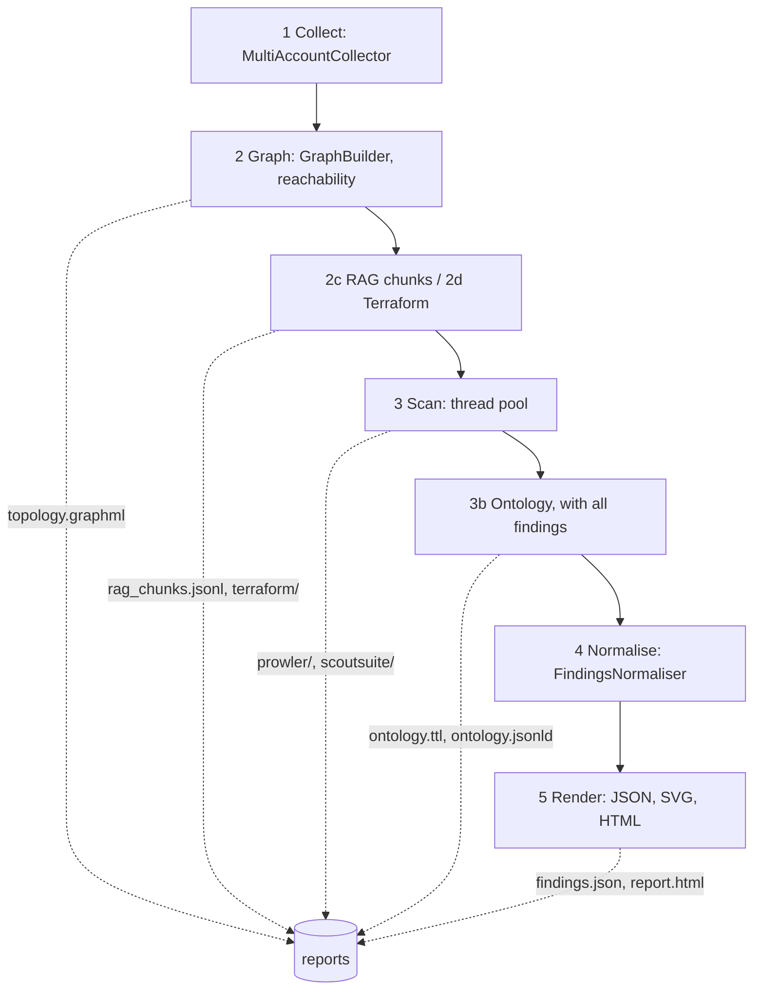
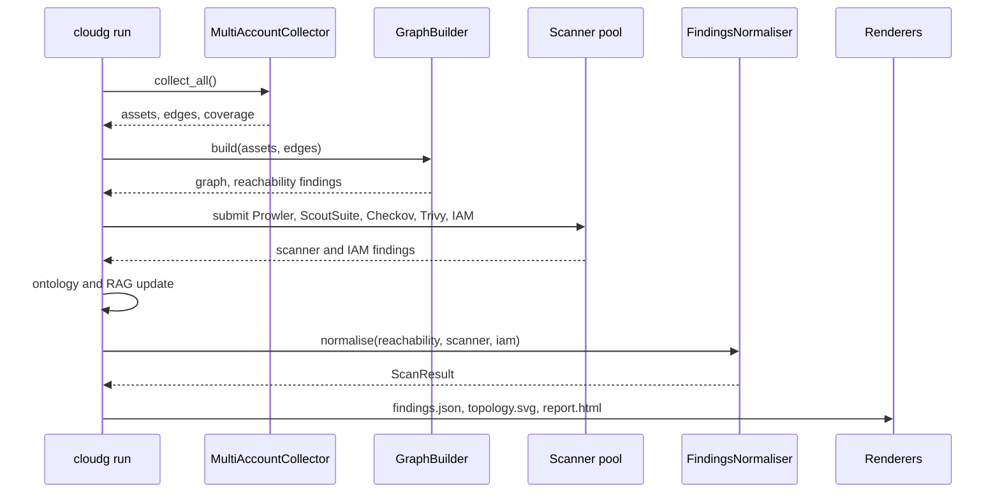

Each phase hands its results to the next in memory. Files are written along the way, but no phase reads back what an earlier one wrote, so you can delete `./reports` between runs without breaking anything. The graph phase and the scan phase both start from the collected inventory; the normaliser is where their findings meet.



The CLI prints each phase as it starts, with the same numbering:

| Banner | Runs when | Writes |
|---|---|---|
| Phase 1 · Asset Collection | always | nothing |
| Phase 2 · Graph Analysis | always | `topology.graphml`, `topology-cytoscape.json` |
| Phase 2c · RAG Export | `--rag-export` (default) and `rag.enabled` | `rag_chunks.jsonl`, `rag_metadata_index.json` |
| Phase 2d · Terraform Recreation | `--terraform` or `terraform.enabled` | `provider.tf.json`, `variables.tf.json`, `main.tf.json`, `import_commands.sh` |
| Phase 3 · Security Scanning | always | each scanner's own output under `prowler/<provider>/` and `scoutsuite/<provider>/` |
| Phase 3b · Semantic Ontology | `--ontology` (default) and `ontology.enabled` | `ontology.ttl`, `ontology.jsonld` |
| Phase 4 · Normalisation | always | nothing |
| Phase 5 · Report Generation | always | `findings.json`, `topology.svg`, `report.html` |

## Phase 1: collect

Collection reads the configuration (providers, regions, accounts, credentials) and returns three lists: assets, network edges and coverage records. It writes nothing to disk. If you want the raw inventory as a file, use `cloudg collect`, which writes `inventory-<provider>.json`, or `cloudg map` for the full inventory map.

`cloudg run` always goes through `MultiAccountCollector`, which starts one task per provider and runs them together with `asyncio.gather`. Inside each provider the fan-out differs:

| Provider | Unit of work | Notes |
|---|---|---|
| AWS | one task per account and region | Each task runs the pipeline's 15 service collectors (EC2, S3, RDS, VPCs, subnets, security groups, IAM users and roles, Lambda, ELBv2, ECS, DynamoDB, CloudFront, Secrets Manager, KMS). With `accounts` and `role_name` in the config, cloudg assumes that role in each account; the caller's own account uses the base credentials. |
| Azure | one task per subscription | List calls return every location at once, so locations are not iterated. With no `subscription_ids`, every enabled subscription the credential can see is collected. |
| GCP | one Cloud Asset Inventory listing per project, or one for the whole organization | Set `gcp.organization_id` for a single organization-scope listing; `project_ids` then filter it. |

`--regions all` turns into `["ALL"]` for all three providers, and region discovery replaces it with the enabled regions before collection starts. Without `--regions`, AWS uses `us-east-1` (or `--region`), while Azure and GCP default to all.

Two limits keep collection polite. An `asyncio.Semaphore` sized by `concurrency_limit` (default 5) caps how many AWS account and region tasks run at once. Below that, every API call passes through the shared rate limiter configured under `ratelimit`, which paces calls per service, honours Retry-After, and opens a circuit breaker on an API that stays throttled. [Rate limits](/guides/rate-limits/) explains the knobs.

### When collection fails

Failures are contained at the smallest unit that can fail:

- A single collector, say Lambda in `eu-west-1`, fails: its coverage record says `FAILED` with the error, and the other services in that region carry on.
- An account or region cannot authenticate: that pair contributes no assets and is recorded as `aws_full` `FAILED`.
- A whole provider raises: the other providers still finish, and a `<provider>_full` coverage record holds the error.
- Collection as a whole raises: the run continues with zero assets.

None of these stop the run or change its exit code. You see them in two places: a log line per failed collector during the run ("Collector ec2 failed: ..."), and the Collection Coverage table after the results, with one row per region and account, a coverage percentage and the names of the services that failed. A run with no credentials at all finishes "successfully" with an empty inventory, so read that table before trusting a quiet report. From Python, the same records are in `result.coverage`, with the error text for each service.

## Phase 2: graph and analysis

`GraphBuilder.build(assets, edges)` turns the inventory into a NetworkX `DiGraph`. Assets become nodes. Edge endpoints that are not assets, such as the `0.0.0.0/0` on a security group rule, become external nodes. The graph is saved straight away as `topology.graphml` and `topology-cytoscape.json`.

`ReachabilityAnalyzer` then runs a breadth-first search from the internet sources (`0.0.0.0/0`, `::/0`) over network-flow edges. Every asset it reaches can produce a finding, for example "Security group allows SSH (port 22) from 0.0.0.0/0", and those findings carry deterministic IDs, so the same exposure keeps its ID from one run to the next. With `graph.compute_attack_paths` (on by default) the builder also looks for lateral movement paths and prints a warning with the count when it finds any.

Two exports hang off the graph:

- RAG export (2c) chunks the infrastructure per asset, per Louvain community and per relation group, and writes `rag_chunks.jsonl` and its index. At this point it only knows the reachability findings. After the scanners finish, a silent second pass rewrites both files with every finding included.
- Terraform recreation (2d) maps the collected assets to `.tf.json` resources. It writes to `terraform.output_dir`, which defaults to `./reports/terraform` and does not follow `-o`. Set `terraform.output_dir` in `config.yaml` if you write reports somewhere else.

An exception in the RAG or Terraform export prints a failure line and the run continues without those files.

## Phase 3: scan

The scanners run in a `ThreadPoolExecutor`. Each one is a subprocess, so threads are enough. The pool is sized at the number of enabled scanners plus the number of providers plus one, which fits every job of a typical run at once. The jobs submitted depend on what is enabled and what there is to scan:

| Job | Submitted | Target |
|---|---|---|
| Prowler | once per provider | the live account, output in `reports/prowler/<provider>/` |
| ScoutSuite | once per provider | the live account, report in `reports/scoutsuite/<provider>/` |
| Checkov | once per IaC directory | the resolved IaC directories |
| Trivy | once | `--images` if given, otherwise a filesystem scan of the IaC directories |
| IAM linter | whenever any assets were collected | IAM roles and policies from the inventory, via Parliament |

The scanner list comes from `--scanners`, or from `scanners.enabled` in `config.yaml` (all five by default).

IaC directories are resolved in this order: `--iac-dir`, then `scanners.iac_directories`, then the Terraform directory from phase 2d if it holds `*.tf.json` files. There is no fallback to the current directory. A clean Checkov scan of whatever folder you happened to run cloudg from would look like a clean bill of health for your cloud, so with nothing to scan, Checkov and Trivy print a warning and are left out. `--terraform` on its own is enough to give them a target: Checkov then audits the Terraform representation of what is really deployed.

### When a scanner fails

A missing executable is not an error: the wrapper logs that the tool is not installed and returns no findings. A scanner that exits badly or produces output cloudg cannot parse is marked failed in the progress display with its error, and the other scanners are unaffected. Each wrapper bounds its own subprocess: 3600 seconds for Prowler and ScoutSuite, 1800 seconds for Checkov and each Trivy invocation.

:::note About scanners.timeout_seconds
The pipeline reads `scanners.timeout_seconds` (default 3600) when it collects each scanner's result, but it only does so after the scanner has finished, so in 0.6.0 it does not cut a slow scanner short. The per-scanner subprocess limits above are what actually apply.
:::

### Phase 3b: ontology

The ontology is built after the scanners, not with the other graph exports, so that the RDF can include every finding: scanner results, IAM linter results and reachability findings. `CloudOntology` infers typed relations (`INTERNET_REACHABLE`, `ROLE_ASSUMES_ROLE`, `ENCRYPTED_BY_KMS` and so on) and saves one file per entry in `ontology.export_formats`: `turtle` as `ontology.ttl`, `json-ld` as `ontology.jsonld`, `xml` as `ontology.rdf`, `nt` as `ontology.nt`. A failure here is printed and skipped.

## Phase 4: normalise

`FindingsNormaliser` gets three lists (reachability findings, scanner findings, IAM linter findings) plus the assets, and returns one `ScanResult`. In order, it:

1. deduplicates within each scanner on scanner, check ID and resource;
2. merges across scanners only when both the normalised title and the check semantics in `cloudg/rules/check_equivalence.yaml` match, so a Prowler and a Checkov finding about the same S3 encryption problem become one finding with `source_tool` "prowler, checkov";
3. rescores severity against CVSS where a score is known;
4. maps every finding to compliance controls, first from what the scanner reported, then by exact check ID from the shipped rulesets, then by regex rules, then from a small built-in table.

Rulesets come from the package unless `rulesets.rules_dir` points elsewhere. The CLI then attaches the collected edges to the result so the renderers can draw them.

## Phase 5: render

Three renderers write the final files:

- `JSONExporter` writes `findings.json`: metadata, summary, assets, findings, compliance and the D3 graph data. `cloudg report -i findings.json` reads it back, so you can re-render without collecting again.
- `SVGRenderer` writes `topology.svg`.
- `HTMLReportGenerator` writes `report.html` with the data embedded. The page loads Chart.js and D3 from cdn.jsdelivr.net when opened.

After that the CLI prints the summary table (assets, findings, severity breakdown, frameworks) and the coverage table, and exits with status 0.

## The whole run, step by step



## Running it from the CLI

The flags map directly onto the phases above:

```bash
# one region, scanners from config.yaml
cloudg run -p aws --regions us-east-1

# two providers, only Prowler and the IAM linter
cloudg run -p aws -p azure --scanners prowler,iam

# give Checkov a target by recreating the estate as Terraform
cloudg run -p aws --regions us-east-1 --terraform

# scan real IaC and two images, skip the ontology
cloudg run -p aws --iac-dir ./infra --images nginx:1.27,myrepo/api:2.3 --no-ontology

# everything, with settings from a config file, into a dated folder
cloudg -c config.yaml run -p all --regions all -o ./reports/2026-10-09
```

`config.yaml` is only read when you pass `-c`; there is no automatic lookup in the current directory. The [cloudg run reference](/cli/run/) lists every flag.

## Running it from Python

`CloudGEngine` implements the same phases. `run_pipeline()` is the async version and `run_pipeline_sync()` wraps it in `asyncio.run` for scripts and notebooks:

```python tab="Sync" title="run_pipeline.py"
from cloudg import CloudGConfig, CloudGEngine

config = CloudGConfig(providers=["aws"])
config.aws.regions = ["us-east-1"]
config.scanners.enabled = ["prowler", "iam"]

engine = CloudGEngine(config)
engine.on_phase_start = lambda phase: print(f"-> {phase}")
engine.on_error = lambda phase, exc: print(f"!! {phase}: {exc}")

result = engine.run_pipeline_sync(output_dir="./reports")

print(result.to_summary())
print(result.report_paths)          # {'json': ..., 'html': ...}
for cov in result.coverage:
    failed = [s.service for s in cov.services if s.status.value == "FAILED"]
    if failed:
        print(cov.provider, cov.region, "failed:", failed)
```

```python tab="Async" title="run_pipeline_async.py"
import asyncio

from cloudg import CloudGConfig, CloudGEngine


async def main() -> None:
    engine = CloudGEngine(CloudGConfig(providers=["aws", "gcp"]))
    result = await engine.run_pipeline(output_dir="./reports")
    print(result.total_assets, "assets,", result.total_findings, "findings")
    print(result.severity_breakdown)


asyncio.run(main())
```

CLI flags become config fields or method arguments:

| CLI | Python |
|---|---|
| `-p aws -p gcp` | `CloudGConfig(providers=["aws", "gcp"])` |
| `--regions us-east-1,eu-west-1` | `config.aws.regions = ["us-east-1", "eu-west-1"]` (and `azure`, `gcp`) |
| `--profile audit` | `config.aws.profile = "audit"` for collection; `scan(profile="audit")` for the scanners |
| `--scanners prowler,iam` | `config.scanners.enabled = ["prowler", "iam"]` |
| `--iac-dir`, `--images` | `config.scanners.iac_directories`, `config.scanners.trivy_images`, or `scan(iac_dir=..., images=[...])` |
| `--terraform` | `config.terraform.enabled = True` |
| `--no-ontology`, `--no-rag-export` | `config.ontology.enabled = False`, `config.rag.enabled = False` |

The engine's pipeline is close to the CLI's but not identical, and the differences matter if you compare outputs:

- The engine order is collect, scan, analyse, normalise, report. Reachability runs inside `scan()`, and `analyze()` builds the graph, ontology, RAG chunks and Terraform together after the scanners.
- `run_pipeline()` writes `findings.json` and `report.html`, plus the ontology and RAG files. It does not write `topology.svg`, `topology.graphml` or `topology-cytoscape.json`; use `GraphBuilder` if you need them.
- `run_pipeline()` calls `scan()` without a profile, so Prowler and ScoutSuite use the default credential chain (for example `AWS_PROFILE`). Collection uses `config.aws.profile`.
- Trivy runs only when there are images. The CLI's filesystem fallback is not in `scan()`.
- When Terraform is enabled and no IaC directory is configured, `scan()` generates the Terraform first so Checkov has a target, the same outcome as `--terraform` on the CLI.
- `PipelineResult.errors` records failures in normalisation and reporting. Collection, scanner, graph, ontology, RAG and Terraform failures go to the `on_error` hook and the log instead, and collection problems also show in `result.coverage`.

### Event hooks

Hooks are plain attributes on the engine. Set them before you call a method; an exception raised inside a hook is logged at debug level and ignored.

| Hook | Called with | When |
|---|---|---|
| `on_phase_start` | phase name | `collection`, `scanning`, `analysis`, `normalisation`, `reporting`; also `ingest` and `inventory_mapping` from those methods |
| `on_collection_complete` | `CollectionResult` | after a successful collection |
| `on_finding` | `Finding` | once per finding when `scan()` or `ingest_reports()` returns |
| `on_scan_complete` | `list[Finding]` | right after the `on_finding` calls |
| `on_analysis_complete` | `AnalysisResult` | at the end of `analyze()` |
| `on_error` | phase name, exception | `collection`, `graph_analysis`, `graph_build`, `ontology`, `rag_export`, `terraform`, `normalisation`, `reporting`, or the scanner job name (`prowler-aws`, `scoutsuite-azure`, `checkov-./infra`, `trivy`, `iam`) |

`on_finding` fires after all scanners have finished, not as each one completes, and it sees findings before normalisation, so duplicates across scanners are still separate at that point. Use `result.findings` from the pipeline if you want the merged set.

### Running the phases yourself

Calling the phases one by one lets you change what flows between them: filter assets before scanning, add findings from somewhere else, skip phases you do not need.

```python title="phases.py"
import asyncio

from cloudg import CloudGConfig, CloudGEngine


async def main() -> None:
    engine = CloudGEngine(CloudGConfig(providers=["aws"]))

    collection = await engine.collect()
    print(len(collection.assets), "assets in", collection.duration_ms, "ms")

    # leave out anything in a sandbox account before scanning
    assets = [a for a in collection.assets if a.account_id != "999999999999"]

    findings = await engine.scan(assets, collection.edges, iac_dir="./infra")
    analysis = await engine.analyze(assets, collection.edges, findings)
    scan_result = engine.normalise_findings(findings, assets=assets)

    print(analysis.graph_nodes, "nodes,", len(analysis.attack_paths), "attack paths")
    print(scan_result.summary)


asyncio.run(main())
```

`normalise_findings()` is the same normaliser the pipeline uses, but it does not write anything. To get the report files, pass its result to the renderers yourself. This example needs no credentials and no scanners: it builds two assets by hand, runs the analysis and normalisation phases, and renders the reports.

```python title="offline_pipeline.py"
import asyncio

from cloudg import CloudGConfig, CloudGEngine
from cloudg.graph.builder import GraphBuilder
from cloudg.renderers.html_report import HTMLReportGenerator
from cloudg.renderers.json_export import JSONExporter
from cloudg.schema.models import AssetType, CloudAsset, CloudProvider, EdgeType, NetworkEdge

# a security group open to the world on port 22, and the instance behind it
sg = CloudAsset(
    name="web",
    asset_type=AssetType.SECURITY_GROUP,
    provider=CloudProvider.AWS,
    region="us-east-1",
    arn="arn:aws:ec2:us-east-1:111111111111:security-group/sg-0web",
)
vm = CloudAsset(
    name="web-1",
    asset_type=AssetType.EC2,
    provider=CloudProvider.AWS,
    region="us-east-1",
    arn="arn:aws:ec2:us-east-1:111111111111:instance/i-0web1",
)
assets = [sg, vm]
edges = [
    NetworkEdge(
        source_id="0.0.0.0/0",
        target_id=sg.id,
        edge_type=EdgeType.SECURITY_GROUP_RULE,
        cidr="0.0.0.0/0",
        port_range="22",
    ),
    NetworkEdge(source_id=sg.id, target_id=vm.id, edge_type=EdgeType.ATTACHED_TO),
]


async def main() -> None:
    engine = CloudGEngine(CloudGConfig(providers=["aws"]))

    # graph, reachability, ontology and RAG chunks
    analysis = await engine.analyze(assets, edges, findings=[], output_dir="./offline")

    # the same normaliser run_pipeline uses
    scan_result = engine.normalise_findings(analysis.reachability_findings, assets=assets)
    scan_result.edges = edges

    # findings.json and report.html, with the topology
    builder = GraphBuilder()
    builder.build(assets, edges)
    graph_json = builder.to_d3_json()
    JSONExporter(output_dir="./offline").export(scan_result, graph_json=graph_json)
    HTMLReportGenerator(output_dir="./offline").generate(scan_result, graph_json=graph_json)

    print(analysis.graph_nodes, "nodes,", analysis.graph_edges, "edges")
    for finding in scan_result.findings:
        print(finding.severity.value, finding.title)


asyncio.run(main())
```

```console
$ python offline_pipeline.py
3 nodes, 2 edges
CRITICAL Security group allows SSH (port 22) from 0.0.0.0/0
$ ls offline
findings.json  ontology.jsonld  ontology.ttl  rag_chunks.jsonl  rag_metadata_index.json  report.html
```

Three nodes for two assets: the third is the external `0.0.0.0/0` node the security group rule points from.

For scanner output that already exists, `run_from_reports()` replaces collection and scanning with ingest and runs normalisation and reporting on top; [Ingesting existing output](/guides/ingesting/) covers it. [Python recipes](/guides/python-recipes/) has more combinations, and [CloudGEngine](/api/cloudgengine/) documents every method.
