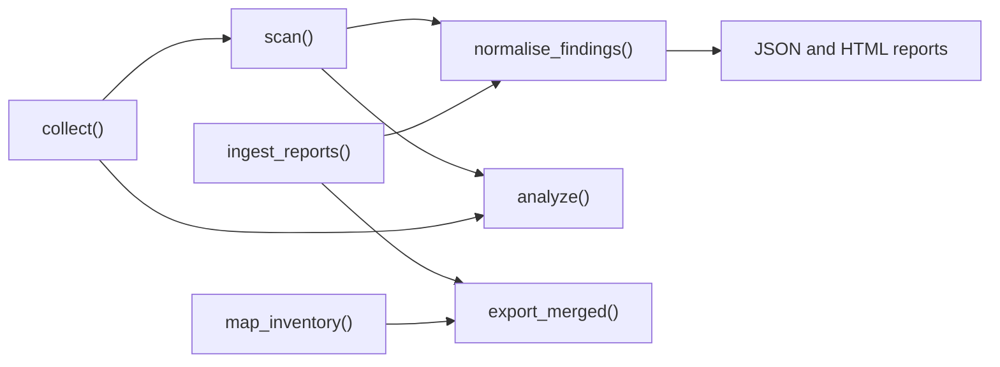

The CLI is a thin layer over a public API, so anything `cloudg run` does you can do from Python, in pieces, with your own decisions in between. Each recipe below is one file you can save and run. The ones that only read scanner output work on any machine with `pip install cloudg`; the ones that collect need the provider extra (`pip install "cloudg[aws]"`) and credentials resolved as described in [authentication](/guides/authentication/).

The sample inputs used in the offline recipes are ordinary scanner output: a Prowler output directory (OCSF or `-M json-asff`), a `checkov --output json` file and `trivy image` / `trivy fs` JSON. [Ingesting existing output](/guides/ingesting/) lists exactly which fields each parser reads.



## 1. Aggregate existing scan results

The scanners already ran somewhere else and you want one deduplicated, compliance-mapped report. `run_from_reports_sync` chains ingest, normalisation and report rendering and touches no cloud API.

```python title="aggregate_reports.py"
"""Aggregate scanner output that already exists into one cloudg report."""

from cloudg import CloudGConfig, CloudGEngine

engine = CloudGEngine(CloudGConfig())
result = engine.run_from_reports_sync(
    {
        "prowler": ["./prowler-output/"],
        "checkov": ["./results_json.json"],
        "trivy": ["./trivy-image.json", "./trivy-fs.json"],
    },
    output_dir="./reports",
)

if result.errors:
    print("phases that failed:", result.errors)

print(f"{result.total_findings} findings after deduplication")
print("by severity:", result.severity_breakdown)
print("reports:", {name: str(path) for name, path in result.report_paths.items()})

for finding in sorted(result.findings, key=lambda f: f.risk_score, reverse=True):
    if finding.severity.value in ("CRITICAL", "HIGH"):
        print(f"{finding.risk_score:4.1f}  {finding.source_tool:<18} {finding.title}")
```

```console
$ python aggregate_reports.py
4 findings after deduplication
by severity: {'CRITICAL': 1, 'HIGH': 3}
reports: {'json': 'reports/findings.json', 'html': 'reports/report.html'}
 9.5  trivy              [Trivy] CVE-2024-0001: openssl (alpine)
 7.5  prowler            S3 bucket default encryption
 7.5  checkov            [Checkov/terraform] Ensure S3 bucket has server-side encryption enabled
 7.5  trivy              [Trivy/IaC] AVD-AWS-0088: S3 bucket encryption not enabled
```

A path that does not parse is logged and skipped rather than raised, so an empty result usually means a wrong path. Prowler records for passing checks give no finding; their check names only mark the compliance controls they cover as PASS. `result.errors` lists every failure of the run as `"<phase>: <message>"`; with no collection, the graph, ontology and Terraform fields stay empty.

## 2. Parse first, decide later

When you want to filter, enrich or route findings before they are merged, parse them into `Finding` objects yourself and normalise afterwards.

```python title="parse_then_decide.py"
"""Parse scanner reports into Finding objects, filter them, then normalise."""

from collections import Counter

from cloudg import CloudGConfig, CloudGEngine
from cloudg.ingest import ingest_reports, parse_report
from cloudg.scanners.trivy import TrivyScanner

# One tool at a time...
findings = parse_report("prowler", "./prowler-output/")
findings += parse_report("checkov", "./results_json.json")

# ...or every tool in one call
findings = ingest_reports(
    {
        "prowler": ["./prowler-output/"],
        "checkov": ["./results_json.json"],
        "trivy": ["./trivy-image.json", "./trivy-fs.json"],
    }
)
print("parsed:", Counter(f.source_tool for f in findings))

# Decide before normalising: here, drop INFO and LOW
kept = [f for f in findings if f.severity.value not in ("INFO", "LOW")]

engine = CloudGEngine(CloudGConfig())
scan_result = engine.normalise_findings(kept)
print("summary:", scan_result.summary)

failed = Counter(c.framework for c in scan_result.compliance if c.status.value == "FAIL")
for framework, count in failed.most_common():
    print(f"{framework}: {count} failed control(s)")

# The per-scanner parsers work without the engine at all
image_findings = TrivyScanner.parse_report("./trivy-image.json")
print("trivy image only:", [f.title for f in image_findings])
```

```console
$ python parse_then_decide.py
parsed: Counter({'trivy': 2, 'prowler': 1, 'checkov': 1})
summary: {'total_assets': 0, 'total_findings': 4, 'total_edges': 0, 'severity_breakdown': {'CRITICAL': 1, 'HIGH': 3}, 'compliance_frameworks': [...]}
NIST-800-53-Revision-5-AWS: 12 failed control(s)
HIPAA-AWS: 6 failed control(s)
CIS: 3 failed control(s)
...
trivy image only: ['[Trivy] CVE-2024-0001: openssl (alpine)']
```

`normalise_findings` is the same pass `cloudg run` uses: dedupe within each scanner, merge across scanners through `check_equivalence.yaml`, rescore with CVSS, map compliance controls. Filtering before it means a dropped finding never contributes to a merged one. Filtering after it, on `scan_result.findings`, keeps the merge intact and lets you decide on the merged view; pick whichever matches your policy.

## 3. Stream findings into a SIEM

`on_finding` is called once per finding, as each scanner finishes during `scan()` (or once the reports are parsed, for ingest), with a copy of the finding. Hooks run inline in the engine and any exception they raise is swallowed, so the shipper below only puts findings on a queue and lets a worker thread batch them to an HTTP collector, keeping a local NDJSON spool either way.

```python title="stream_to_siem.py" hl="35-36,82"
"""Ship every cloudg finding to a SIEM over HTTP while the pipeline runs."""

import asyncio
import json
import logging
import os
import queue
import threading
import urllib.request

from cloudg import CloudGConfig, CloudGEngine
from cloudg.schema.models import Finding

log = logging.getLogger("siem-shipper")

SIEM_URL = os.environ.get("SIEM_URL")              # e.g. https://siem.example.com/ingest
SIEM_TOKEN = os.environ.get("SIEM_TOKEN", "")
SPOOL_FILE = "cloudg-findings.ndjson"              # local copy, also the fallback


class FindingShipper:
    """on_finding callback: queue the finding, send batches from a worker thread.

    The engine calls hooks inline, so a slow HTTP call made directly in the
    callback would hold up the pipeline. Here the callback only enqueues.
    """

    def __init__(self, url: str | None, token: str, batch_size: int = 200) -> None:
        self.url, self.token, self.batch_size = url, token, batch_size
        self.sent = 0
        self._queue: queue.Queue[dict | None] = queue.Queue()
        self._worker = threading.Thread(target=self._drain, daemon=True)
        self._worker.start()

    def __call__(self, finding: Finding) -> None:
        self._queue.put({"source": "cloudg", "event": finding.model_dump(mode="json")})

    def close(self) -> None:
        self._queue.put(None)
        self._worker.join()

    def _drain(self) -> None:
        batch: list[dict] = []
        while True:
            item = self._queue.get()
            if item is not None:
                batch.append(item)
            if batch and (item is None or len(batch) >= self.batch_size):
                self._send(batch)
                batch = []
            if item is None:
                return

    def _send(self, batch: list[dict]) -> None:
        body = "\n".join(json.dumps(e) for e in batch) + "\n"
        with open(SPOOL_FILE, "a") as fh:
            fh.write(body)
        if not self.url:
            self.sent += len(batch)
            return
        request = urllib.request.Request(
            self.url,
            data=body.encode(),
            headers={"Content-Type": "application/x-ndjson",
                     "Authorization": f"Bearer {self.token}"},
            method="POST",
        )
        try:
            with urllib.request.urlopen(request, timeout=30) as resp:
                resp.read()
            self.sent += len(batch)
        except OSError as exc:      # URLError and timeouts; the spool file keeps the batch
            log.warning("SIEM rejected a batch of %d: %s", len(batch), exc)


async def main() -> None:
    config = CloudGConfig(providers=["aws"])
    config.aws.regions = ["us-east-1", "eu-west-1"]

    shipper = FindingShipper(SIEM_URL, SIEM_TOKEN)
    engine = CloudGEngine(config)
    engine.on_finding = shipper
    engine.on_phase_start = lambda phase: log.info("cloudg phase: %s", phase)
    engine.on_error = lambda phase, exc: log.error("cloudg %s failed: %s", phase, exc)

    try:
        result = await engine.run_pipeline(output_dir="./reports")
    finally:
        shipper.close()

    print(f"shipped {shipper.sent} raw findings; {result.total_findings} after normalisation")
    print("summary:", json.dumps(result.to_summary(), default=str))


if __name__ == "__main__":
    logging.basicConfig(level=logging.INFO, format="%(levelname)s %(name)s: %(message)s")
    asyncio.run(main())
```

```bash
SIEM_URL=https://siem.example.com/ingest SIEM_TOKEN="$SIEM_TOKEN" python stream_to_siem.py
```

Two properties of the hook decide how you model events on the SIEM side. The findings it sees are the raw ones, before normalisation, so two scanners reporting the same unencrypted bucket arrive as two events; the merged view is `result.findings` once the run ends. And they arrive in one burst at the end of the scan phase, not one by one as scanners finish. Reachability findings have deterministic ids (a UUID5 of the rule and the asset's ARN), so the SIEM can deduplicate them across daily runs by `event.id`; scanner findings get a fresh id each run, so key those on `source_tool`, `source_finding_id` and `resource_arn`.

The same shipper works on `engine.ingest_reports(...)` or `run_from_reports(...)`, which fire `on_finding` too and need no credentials.

## 4. Run the phases yourself

`run_pipeline` runs collect, scan, analyse, normalise and report in a fixed order. Calling the phases yourself lets you stop early, pick scanners per run, or do something between phases. This one refuses to scan when collection came back empty, which is what expired credentials look like.

```python title="run_phases.py"
"""Run collection, scanning, analysis and normalisation as separate steps."""

import asyncio
from pathlib import Path

from cloudg import CloudGConfig, CloudGEngine
from cloudg.coverage import ServiceStatus
from cloudg.renderers.html_report import HTMLReportGenerator
from cloudg.renderers.json_export import JSONExporter

OUT = Path("./reports")


async def main() -> None:
    config = CloudGConfig(providers=["aws"])
    config.aws.regions = ["us-east-1"]
    config.scanners.enabled = ["prowler", "iam"]   # missing binaries are skipped
    config.terraform.enabled = False

    engine = CloudGEngine(config)
    engine.on_phase_start = lambda phase: print(f"--> {phase}")

    # 1. Collect, then decide whether the rest is worth running
    collection = await engine.collect()
    failed = [
        (c.account_id, c.region, s.service, s.error)
        for c in collection.coverage
        for s in c.services
        if s.status in (ServiceStatus.FAILED, ServiceStatus.PARTIAL)
    ]
    print(f"{len(collection.assets)} assets, {len(collection.edges)} edges, "
          f"{len(failed)} degraded services in {collection.duration_ms} ms")
    if not collection.assets:
        raise SystemExit(f"nothing collected; first problems: {failed[:3]}")

    # 2. Scan: reachability analysis, the IAM linter and any scanner on PATH
    findings = await engine.scan(collection.assets, collection.edges, output_dir=OUT)

    # 3. Graph, ontology and RAG export, written into OUT
    analysis = await engine.analyze(collection.assets, collection.edges, findings, output_dir=OUT)
    print(f"graph: {analysis.graph_nodes} nodes, {analysis.graph_edges} edges, "
          f"{analysis.ontology_triples} triples, {len(analysis.attack_paths)} attack paths")

    # 4. Normalise: scan() already holds the reachability findings
    scan_result = engine.normalise_findings(findings, assets=collection.assets)
    scan_result.edges = collection.edges
    print("severity:", scan_result.summary["severity_breakdown"])

    # 5. Reports
    print(JSONExporter(output_dir=str(OUT)).export(scan_result))
    print(HTMLReportGenerator(output_dir=str(OUT)).generate(scan_result))


asyncio.run(main())
```

```console
$ python run_phases.py
--> collection
11 assets, 13 edges, 0 degraded services in 5981 ms
--> scanning
--> analysis
graph: 12 nodes, 13 edges, 774 triples, 0 attack paths
severity: {'CRITICAL': 1}
reports/findings.json
reports/report.html
```

`scan()` runs the graph reachability analysis itself, and `analyze()` computes the same findings again into `analysis.reachability_findings`. Pass only one of the two lists to the normaliser. Adding both is harmless (the ids are deterministic, so the duplicates merge) but pointless. `analyze()` writes `ontology.ttl`, `ontology.jsonld`, `rag_chunks.jsonl` and `rag_metadata_index.json` into the output directory according to the `ontology` and `rag` config sections; it does not write GraphML, which only `cloudg run` and the inventory export do.

## 5. Combine live collection with ingested reports

Collection needs credentials; ingest does not. A common split is Prowler running in a security account's own pipeline while you want its findings next to cloudg's live graph and reachability findings.

```python title="combine_live_and_ingested.py"
"""Collect live assets, merge in scanner output produced elsewhere, analyse it all."""

import asyncio
from pathlib import Path

from cloudg import CloudGConfig, CloudGEngine
from cloudg.graph.builder import GraphBuilder
from cloudg.renderers.html_report import HTMLReportGenerator
from cloudg.renderers.json_export import JSONExporter

OUT = Path("./reports")


async def main() -> None:
    config = CloudGConfig(providers=["aws"])
    config.aws.regions = ["us-east-1"]
    engine = CloudGEngine(config)

    collection = await engine.collect()                                   # needs credentials
    ingested = engine.ingest_reports({"prowler": ["./prowler-output/"]})  # needs nothing

    # Reachability findings from the live graph, so they sit next to Prowler's
    analysis = await engine.analyze(collection.assets, collection.edges, ingested, output_dir=OUT)
    scan_result = engine.normalise_findings(
        ingested + analysis.reachability_findings, assets=collection.assets
    )
    scan_result.edges = collection.edges

    builder = GraphBuilder()
    builder.build(collection.assets, collection.edges)
    graph_json = builder.to_d3_json()
    JSONExporter(output_dir=str(OUT)).export(scan_result, graph_json=graph_json)
    HTMLReportGenerator(output_dir=str(OUT)).generate(scan_result, graph_json=graph_json)

    by_tool: dict[str, int] = {}
    for finding in scan_result.findings:
        by_tool[finding.source_tool] = by_tool.get(finding.source_tool, 0) + 1
    print(f"{len(collection.assets)} assets, {analysis.ontology_triples} ontology triples")
    print("findings by tool:", by_tool)


asyncio.run(main())
```

```console
$ python combine_live_and_ingested.py
11 assets, 768 ontology triples
findings by tool: {'cloudg-reachability': 1, 'prowler': 1}
```

Passing the ingested findings to `analyze()` puts them into the ontology and the RAG chunks, attached to the live assets. The exporters resolve each finding's asset by id, then ARN, then unique name, so Prowler findings keyed by ARN land on the right node. Passing `graph_json` to the renderers gives the HTML report its topology view; without it the report has findings but no graph.

## 6. Map now, overlay findings later

Inventory mapping needs read credentials and nothing else. Scanners can run elsewhere and on another schedule, and their output merges in whenever it arrives, even in a different process, because the map round-trips through `inventory-map.json`.

```python tab="Map" title="map_inventory.py"
"""Map the inventory now; no scanners involved."""

from cloudg import CloudGConfig, CloudGEngine

config = CloudGConfig(providers=["aws"])
config.aws.regions = ["us-east-1"]           # or ["ALL"]

inventory = CloudGEngine(config).map_inventory_sync(output_dir="./map-reports")

summary = inventory.summary
print(summary["total_assets"], "assets,", summary["total_edges"], "edges")
print("by service:", summary["assets_by_service"])
print("internet exposed:", summary["internet_exposed"])
print("unlinked:", summary["unlinked_assets"])
if inventory.throttling:
    print("throttled:", inventory.throttling["messages"])
```

```python tab="Overlay" title="overlay_findings.py"
"""Overlay scanner findings on an inventory map written earlier."""

import json

from cloudg import CloudGConfig, CloudGEngine
from cloudg.inventory import InventoryMapper, InventoryResult

inventory = InventoryResult.load("./map-reports")   # directory or inventory-map.json
print(len(inventory.assets), "assets in the saved map")

engine = CloudGEngine(CloudGConfig())
findings = engine.ingest_reports({"prowler": ["./prowler-output/"]})

mapper = InventoryMapper(CloudGConfig())
paths = mapper.export_merged(inventory, findings, "./map-reports")
print({name: str(path) for name, path in paths.items()})

asset_map = json.loads(paths["asset_map"].read_text())
for entry in asset_map["assets"]:
    if entry["finding_count"]:
        print(entry["name"], entry["type"], entry["severity_breakdown"])
```

```bash tab="CLI"
cloudg map -p aws --regions all -o ./map-reports
# later, with scanner output that cloudg already normalised:
cloudg map -p aws --regions all -o ./map-reports --findings ./reports/raw-findings.json
```

The overlay step needs no credentials. `asset-map.json` lists every asset with `finding_count`, `severity_breakdown` and `finding_ids`, sorted with the worst first; `compliance-map.json` groups affected assets by framework. Both maps match a finding to an asset by asset id, then ARN, then a name or ARN tail that only one asset has, so scanner output that names resources by ARN (Prowler, ScoutSuite) overlays well, and IaC findings keyed by a Terraform address (Checkov) do not match a live asset at all. The CLI variant re-maps the account before merging; the Python one reuses the saved map.

## 7. Link relationships into someone else's inventory

`RelationshipLinker` is pure post-processing over `CloudAsset` objects, whoever produced them: a plugin collector, a CMDB export, a previous run. Declare what each asset points at in `metadata["relations"]` and the linker resolves the references across services, regions and accounts.

```json title="cmdb_assets.json"
[
  {"id": "cmdb-001", "name": "orders-api", "type": "LAMBDA_FUNCTION",
   "arn": "arn:aws:lambda:eu-west-1:123456789012:function:orders-api",
   "role_arn": "arn:aws:iam::123456789012:role/orders-api-role",
   "queue_arn": "arn:aws:sqs:eu-west-1:123456789012:orders"},
  {"id": "cmdb-002", "name": "orders-api-role", "type": "IAM_ROLE",
   "arn": "arn:aws:iam::123456789012:role/orders-api-role"},
  {"id": "cmdb-003", "name": "orders", "type": "MESSAGE_QUEUE",
   "arn": "arn:aws:sqs:eu-west-1:123456789012:orders"},
  {"id": "cmdb-004", "name": "audit-bucket", "type": "S3_BUCKET",
   "arn": "arn:aws:s3:::audit-bucket",
   "replicates_to": "arn:aws:s3:::audit-bucket-dr"}
]
```

```python title="link_cmdb.py"
"""Turn a CMDB export into CloudAsset objects, link them, and build a graph."""

import json
from collections import Counter

from cloudg.graph.builder import GraphBuilder
from cloudg.inventory import RelationshipLinker
from cloudg.schema.models import AssetType, CloudAsset, CloudProvider


def to_asset(row: dict) -> CloudAsset:
    relations = []
    if row.get("role_arn"):
        relations.append({"target": row["role_arn"], "edge": "ASSUMES_ROLE"})
    if row.get("queue_arn"):
        # The queue triggers the function: the edge points queue -> function
        relations.append(
            {"target": row["queue_arn"], "edge": "INVOKES",
             "relationship": "TRIGGERED_BY", "reverse": True}
        )
    if row.get("replicates_to"):
        relations.append({"target": row["replicates_to"], "edge": "REFERENCES",
                          "relationship": "REPLICATES_TO"})
    return CloudAsset(
        id=row["id"],
        name=row["name"],
        arn=row["arn"],
        asset_type=AssetType(row["type"]),
        provider=CloudProvider.AWS,
        region=row["arn"].split(":")[3] or "global",
        account_id=row["arn"].split(":")[4] or None,
        metadata={"relations": relations},
    )


with open("cmdb_assets.json") as fh:
    assets = [to_asset(row) for row in json.load(fh)]

linker = RelationshipLinker(assets)
edges = linker.link()

for edge in edges:
    print(f"{edge.source_id} -[{edge.edge_type.value}/{edge.relationship}]-> {edge.target_id}")
print("unresolved:", linker.unresolved)
print("external placeholders:", [a.name for a in linker.external_assets])

graph = GraphBuilder().build(assets + linker.external_assets, edges)
print(graph.number_of_nodes(), "nodes,", graph.number_of_edges(), "edges")
print(Counter(data["edge_type"] for _, _, data in graph.edges(data=True)))
```

```console
$ python link_cmdb.py
cmdb-001 -[ASSUMES_ROLE/None]-> cmdb-002
cmdb-003 -[INVOKES/TRIGGERED_BY]-> cmdb-001
unresolved: [{'source': 'arn:aws:s3:::audit-bucket', 'source_name': 'audit-bucket', 'target': 'arn:aws:s3:::audit-bucket-dr', 'edge_type': 'REFERENCES'}]
external placeholders: []
4 nodes, 2 edges
Counter({'ASSUMES_ROLE': 1, 'INVOKES': 1})
```

Each relation is `{"target", "edge", "relationship", "reverse", "properties", "description"}`; only `target` is required, and `edge` defaults to `REFERENCES`. `reverse: true` flips the direction so the edge still reads "source verb target". A target that matches nothing is reported in `linker.unresolved` instead of producing a dangling edge, as the DR bucket above shows. A reference into an account that was not collected becomes a placeholder account node in `linker.external_assets`. If you already have some edges, call `linker.seed_existing(edges)` before `link()` so they are not duplicated.

## 8. Gate CI on severity

For a CI job that already runs Python, the gate can live next to the aggregation. This version fails on HIGH and CRITICAL, honours suppressions and a list of accepted check IDs, and refuses to pass on partial data. For a gate that only reads `findings.json`, with no cloudg import, see [CI and automation](/guides/ci-automation/#a-severity-gate).

```python title="gate_on_severity.py"
"""Aggregate IaC scanner output and fail the build on blocking findings."""

import sys

from cloudg import CloudGConfig, CloudGEngine

BLOCKING = {"CRITICAL", "HIGH"}
ALLOWED_CHECKS = {"CKV_AWS_18"}   # accepted risks, by scanner check ID

result = CloudGEngine(CloudGConfig()).run_from_reports_sync(
    {"checkov": ["results_json.json"], "trivy": ["trivy-fs.json", "trivy-image.json"]},
    output_dir="./reports",
)

if result.errors:                 # a phase failed: do not pass the build on partial data
    print("cloudg errors:", result.errors)
    sys.exit(2)

blocking = [
    f for f in result.findings
    if f.severity.value in BLOCKING
    and not f.is_suppressed
    and f.source_finding_id not in ALLOWED_CHECKS
]
print("severity:", result.severity_breakdown, "report:", result.report_paths.get("html"))
for f in sorted(blocking, key=lambda f: f.risk_score, reverse=True):
    print(f"  [{f.severity.value}] {f.title} ({f.source_tool}: {f.source_finding_id})")

if blocking:
    print(f"{len(blocking)} blocking finding(s), failing the build")
    sys.exit(1)
```

```console
$ python gate_on_severity.py; echo "exit $?"
severity: {'CRITICAL': 1, 'HIGH': 2} report: reports/report.html
  [CRITICAL] [Trivy] CVE-2024-0001: openssl (alpine) (trivy: CVE-2024-0001)
  [HIGH] [Checkov/terraform] Ensure S3 bucket has server-side encryption enabled (checkov: CKV_AWS_19)
  [HIGH] [Trivy/IaC] AVD-AWS-0088: S3 bucket encryption not enabled (trivy: AVD-AWS-0088)
3 blocking finding(s), failing the build
exit 1
```

After a cross-scanner merge, `source_finding_id` holds one scanner's check ID and `source_tool` becomes a comma list such as `"prowler, checkov"`, so an allow-list keyed on one tool's ID can miss a merged finding. When that matters, filter on the parsed findings before normalising, as in recipe 2.

:::links
- [CloudGEngine](/api/cloudgengine/) Every method and its signature.
- [Event hooks](/api/event-hooks/) When each hook fires.
- [Result objects](/api/results/) `PipelineResult`, `CollectionResult`, `AnalysisResult`.
- [RelationshipLinker](/api/relationshiplinker/) Resolution rules for declared relations.
:::
