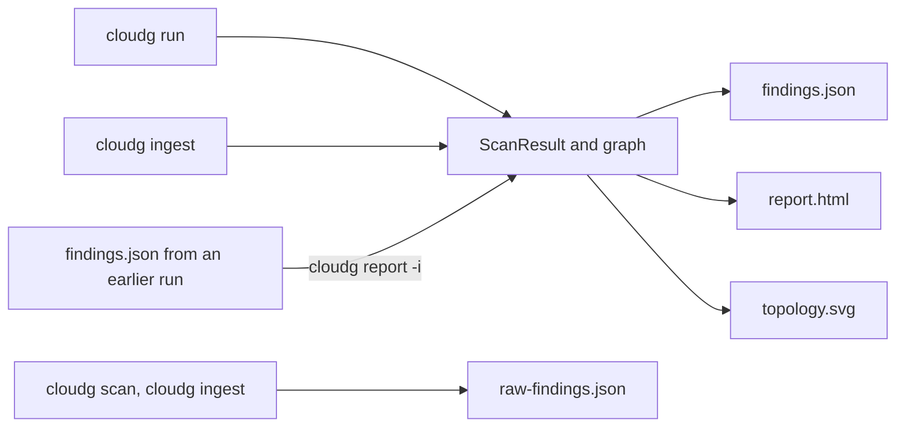

The renderers in `cloudg/renderers/` take a normalised `ScanResult` (assets, findings, compliance results) plus, when there is one, the D3 graph of the collected assets. They don't call any cloud API or scanner, which is why `cloudg report` can re-render an old run anywhere.

## Which command writes what



| Command | `findings.json` | `report.html` | `topology.svg` | `raw-findings.json` |
|---|---|---|---|---|
| `cloudg run` | Yes | Yes | Yes | No |
| `cloudg ingest` | With `--format json` or `all` | With `--format html` or `all` | No | Always |
| `cloudg report` | With `--format json` or `all` | With `--format html` or `all` | With `--format svg` or `all` | No |
| `cloudg scan` | No | No | No | Always |
| `run_pipeline()`, `run_from_reports()` | Yes | Yes | No | No |

`cloudg run` writes more than these (GraphML, Cytoscape JSON, the ontology, RAG chunks, Terraform); those come from the graph and analysis phases and are listed on [Output files](/reference/output-files/).

Those three are the only report formats. There is no CSV, SARIF or PDF writer in 0.6.0. `findings.json` is easy to convert, though; there's a [CSV recipe](#exporting-to-csv) further down.

## findings.json

`JSONExporter` writes one JSON object with six keys:

```json title="findings.json"
{
  "metadata": {
    "scan_id": "e0d347bc-b1bc-4f3e-8d1a-0cc98878e0d9",
    "provider": null,
    "account_id": null,
    "region": null,
    "started_at": "2026-10-09 16:27:37.437338",
    "completed_at": "2026-10-09 16:27:37.437314"
  },
  "summary": {
    "total_assets": 0,
    "total_findings": 5,
    "total_edges": 0,
    "severity_breakdown": {"CRITICAL": 2, "HIGH": 3},
    "compliance_frameworks": ["CIS", "CIS-AWS", "CVE", "NIST-CSF-AWS"]
  },
  "assets": [],
  "findings": [],
  "compliance": [],
  "graph": {"nodes": [], "links": []}
}
```

`assets`, `findings` and `compliance` are the Pydantic models from `cloudg.schema.models`, serialised in JSON mode. Assets leave out `raw_data`. Findings include the computed `risk_score`. `graph` holds D3 nodes and links for `cloudg run`, and is empty for ingest. In the `metadata` block, the normaliser doesn't fill in `provider`, `account_id` or `region` in 0.6.0, so expect `null` there, and both timestamps are the time of normalisation. The field-by-field reference is on [Output files](/reference/output-files/), and the models are on [Data models](/api/models/).

`raw-findings.json` is different: a bare JSON list of `Finding` objects as the parsers produced them, before deduplication, rescoring or compliance mapping. It has no `summary`, `compliance` or `graph`.

## report.html

The HTML report is one file rendered from the Jinja template `cloudg/templates/report.html.j2`. The data is embedded in the page as JSON, so you can mail it, attach it to a ticket or archive it next to `findings.json`.

The header shows the scan ID, provider and account, a button that downloads the embedded data, and six counters: total assets, total findings, and the CRITICAL, HIGH, MEDIUM and LOW counts. Below it are four tabs.

The Infrastructure Map tab draws a D3 tree of account, region, VPC, subnet and resources, built from each asset's `region` and its `vpc_id` / `subnet_id` metadata. Assets with neither land under "Global / Ungrouped". Nodes with findings get a red ring and internet-exposed ones an orange ring. Toggle Layout switches to a force-directed graph of the collected graph plus one triangle node per finding (linked to its resource by a `FINDING_AFFECTS` edge) and one diamond per compliance framework (linked to its findings by `COMPLIANCE_GOVERNS`). With no assets, as after `cloudg ingest`, the tab goes straight to that force view, which then shows findings and frameworks only.

The Findings tab lists every finding, sorted by severity, with dropdown filters for severity and source tool and a text search over title, resource and description. Clicking a row opens a side panel with the description, evidence, remediation, CVSS score, frameworks and risk score.

Analytics has four Chart.js charts: severity distribution, asset types, findings by source tool, and compliance per framework.

Compliance shows one card per framework with Pass and Fail counts. As explained in [Compliance frameworks](/guides/compliance/#report-html), cloudg only records controls that have findings, so Pass is 0 and the percentage bar reads 0%. Read Fail as the number of affected controls.

The download button saves a file named `findings.json` that holds only `findings`, `graph` and the tree data. It isn't the same file cloudg writes, but `cloudg report -i` and the viewer both accept it.

:::warning The report needs network access
`report.html` loads Chart.js 4.4.0 and D3 7 from `cdn.jsdelivr.net`. Opened without network access, the findings table and detail panel still work, but the map, the charts and the compliance cards stay empty because the page's script stops at the first D3 call. The `report.inline_js` config key doesn't change this in 0.6.0. For air-gapped use, build an [offline template](#a-report-that-works-offline).
:::

The page also inserts finding titles, descriptions and evidence into its HTML without escaping them. Scanner output can contain resource names and descriptions that other people control, so treat a report built from someone else's scan files like any other HTML from that source.

If the template can't be found or fails to render, cloudg logs a warning and writes a plain fallback page instead: the counters and a findings table, with no script at all.

## topology.svg

`SVGRenderer` draws a static map of the collected assets: VPCs and VNets as containers, subnets inside them, compute, databases and functions inside the subnets, and IAM principals and security groups in side panels. It needs assets, so it only means something after `cloudg run`, or after `cloudg report` on a `findings.json` that has assets.

## cloudg report

`cloudg report` reads a `findings.json` and renders it again. Use it to regenerate the HTML after upgrading cloudg, to produce just the SVG, or to rebuild a report on a machine that never had cloud access.

```bash tab="CLI"
cloudg report -i ./reports/findings.json -o ./reports-rerendered
cloudg report -i ./reports/findings.json -o ./reports-rerendered --format html
cloudg report -i ./archive/2026-09-30/findings.json -o ./archive/2026-09-30/svg --format svg
```

```bash tab="Docker"
docker run --rm \
  -v "$PWD/reports:/data" \
  ghcr.io/morpheuslord/cloudg:latest report -i /data/findings.json -o /data/rerendered
```

| Flag | Meaning |
|---|---|
| `-i, --input` | Path to a `findings.json`. Required. |
| `-o, --output` | Output directory, `./reports` by default |
| `--format` | `html`, `json`, `svg` or `all` (default) |

A missing input file prints `Input file not found` and exits with code 1.

`cloudg report` rebuilds the `ScanResult` from three keys of the input: `assets`, `findings` and `graph`. The rest is not carried over:

| In the input | After `cloudg report` |
|---|---|
| `assets`, `findings`, `graph` | Kept |
| `compliance` | Dropped: the new `findings.json` has an empty list, and the Compliance tab and chart are empty |
| Edges between assets | Not stored in `findings.json`, so `topology.svg` has no connections |
| `metadata` | A new scan ID and new timestamps |

:::warning Don't render into the input's directory
`-o` defaults to `./reports`, which is also where `cloudg run` and `cloudg ingest` write. `cloudg report -i ./reports/findings.json` with no `-o` overwrites the original `findings.json` with a copy that has no compliance results. Always give `-o` a different directory.
:::

`cloudg report` only reads the `findings.json` object. Given `raw-findings.json`, which is a list, it fails with `AttributeError: 'list' object has no attribute 'get'`. To turn raw findings into reports, use the [Python route below](#from-raw-findings).

## Rendering from Python

The three renderers are plain classes. Each takes an output directory and writes one file, returning its path.

| Class | Call | Default file |
|---|---|---|
| `cloudg.renderers.json_export.JSONExporter(output_dir=".")` | `.export(scan_result, graph_json=None, filename="findings.json")` | `findings.json` |
| `cloudg.renderers.html_report.HTMLReportGenerator(template_dir=None, output_dir=".")` | `.generate(scan_result, graph_json=None, filename="report.html")` | `report.html` |
| `cloudg.renderers.svg.SVGRenderer(output_dir=".")` | `.render(assets, edges, findings_by_resource=None, filename="topology.svg", width=1800, height=1400)` | `topology.svg` |

### Re-render and keep compliance

This does what `cloudg report` does, but carries the compliance results over:

```python title="rerender.py"
import json
from pathlib import Path

from cloudg.renderers.html_report import HTMLReportGenerator
from cloudg.renderers.json_export import JSONExporter
from cloudg.schema.models import CloudAsset, ComplianceResult, Finding, ScanResult

data = json.loads(Path("./reports/findings.json").read_text())

scan_result = ScanResult(
    assets=[CloudAsset.model_validate(a) for a in data.get("assets", [])],
    findings=[Finding.model_validate(f) for f in data.get("findings", [])],
    compliance=[ComplianceResult.model_validate(c) for c in data.get("compliance", [])],
)
graph = data.get("graph") or {"nodes": [], "links": []}

out = "./reports-rerendered"
print(HTMLReportGenerator(output_dir=out).generate(scan_result, graph_json=graph))
print(JSONExporter(output_dir=out).export(scan_result, graph_json=graph))
print(len(scan_result.compliance), "compliance results kept")
```

### From raw findings {#from-raw-findings}

`raw-findings.json` from `cloudg scan` (or `cloudg ingest`) hasn't been normalised yet. Load it, normalise it, then render:

```python title="raw_to_reports.py"
import json
from pathlib import Path

from cloudg import CloudGConfig, CloudGEngine
from cloudg.renderers.html_report import HTMLReportGenerator
from cloudg.renderers.json_export import JSONExporter
from cloudg.schema.models import Finding

raw = json.loads(Path("./reports/raw-findings.json").read_text())
findings = [Finding.model_validate(item) for item in raw]

engine = CloudGEngine(CloudGConfig())
scan_result = engine.normalise_findings(findings)

out = "./reports-from-raw"
print(JSONExporter(output_dir=out).export(scan_result))
print(HTMLReportGenerator(output_dir=out).generate(scan_result))
print(len(scan_result.compliance), "compliance results")
```

`normalise_findings()` uses `config.rulesets.rules_dir`, so a custom ruleset applies here too.

### A report that works offline {#a-report-that-works-offline}

`HTMLReportGenerator` accepts a `template_dir` holding a `report.html.j2`. The script below copies cloudg's own template and replaces the two CDN script tags with the libraries' source, wrapped in `` so Jinja leaves the JavaScript alone. Run it once on a machine with network access; the resulting template works anywhere.

```python title="build_offline_template.py"
"""Make a copy of cloudg's report template with Chart.js and D3 inlined."""
import urllib.request
from pathlib import Path

import cloudg

LIBS = {
    "https://cdn.jsdelivr.net/npm/chart.js@4.4.0/dist/chart.umd.min.js",
    "https://cdn.jsdelivr.net/npm/d3@7/dist/d3.min.js",
}

source = Path(cloudg.__file__).parent / "templates" / "report.html.j2"
template = source.read_text()

for url in LIBS:
    tag = f'<script src="{url}"></script>'
    if tag not in template:
        raise SystemExit(f"script tag not found, template changed: {url}")
    js = urllib.request.urlopen(url, timeout=30).read().decode("utf-8")
    template = template.replace(tag, "<script>" + js + "</script>")

out = Path("offline-template")
out.mkdir(exist_ok=True)
(out / "report.html.j2").write_text(template)
print("wrote", out / "report.html.j2", len(template), "bytes")
```

Then render with it:

```python title="offline_report.py"
import json
from pathlib import Path

from cloudg.renderers.html_report import HTMLReportGenerator
from cloudg.schema.models import CloudAsset, ComplianceResult, Finding, ScanResult

data = json.loads(Path("./reports/findings.json").read_text())
scan_result = ScanResult(
    assets=[CloudAsset.model_validate(a) for a in data.get("assets", [])],
    findings=[Finding.model_validate(f) for f in data.get("findings", [])],
    compliance=[ComplianceResult.model_validate(c) for c in data.get("compliance", [])],
)

generator = HTMLReportGenerator(template_dir="./offline-template", output_dir="./reports-offline")
print(generator.generate(scan_result, graph_json=data.get("graph")))
```

The result is about 530 KB, most of it the two libraries. The same mechanism works for your own design: copy the template, change it, and pass `template_dir`. The variables available to a template are `scan_id`, `provider`, `account_id`, `started_at`, `completed_at`, `total_assets`, `total_findings`, `severity_counts`, `resource_types`, `source_tools`, `compliance_summary`, `findings` and `assets`, plus JSON-string versions (`severity_counts_json`, `resource_types_json`, `source_tools_json`, `compliance_summary_json`, `findings_json`, `assets_json`, `graph_json`, `hierarchy_json`, `findings_per_resource_json`) for embedding in scripts.

### Exporting to CSV {#exporting-to-csv}

For a spreadsheet or a ticketing import, flatten the findings:

```python title="findings_to_csv.py"
import csv
import json
from pathlib import Path

data = json.loads(Path("./reports/findings.json").read_text())
columns = ["severity", "risk_score", "source_tool", "title", "resource_arn",
           "source_finding_id", "compliance_frameworks", "remediation"]

with open("findings.csv", "w", newline="") as fh:
    writer = csv.DictWriter(fh, fieldnames=columns, extrasaction="ignore")
    writer.writeheader()
    for finding in data["findings"]:
        row = dict(finding)
        row["compliance_frameworks"] = ";".join(finding.get("compliance_frameworks", []))
        writer.writerow(row)

print("wrote", len(data["findings"]), "rows to findings.csv")
```

## The report viewer

`docs/viewer.html` in the repository is a standalone page for browsing results without generating anything. Open it in a browser and drop a file on it, or use Open a report. It reads `findings.json` from `cloudg run`, `cloudg ingest` or `cloudg report`, and the bare list in `raw-findings.json` from `cloudg scan`. The file is parsed in the browser and not uploaded anywhere. The page starts with built-in sample data, marked with a "sample data" badge, until you load your own.

It shows severity and tool counts, failed compliance controls per framework (top ten), the most affected resources, a sortable and filterable findings table, and the topology when the file has graph data. Raw findings have no compliance or graph, and the page says so. Like the report, it loads D3 from a CDN (`cdnjs.cloudflare.com`).

## Configuration

`config.yaml` has a `report:` section:

```yaml title="config.yaml"
report:
  formats: [html, json, svg]
  inline_js: true
  output_dir: ./reports
```

None of the three keys affects report generation in 0.6.0. The commands decide formats with `--format` and the location with `-o`, the HTML always loads its libraries from the CDN, and the only reader of `report.output_dir` is the MCP server, which uses it as the default workspace directory. Set `-o` explicitly. The keys are listed on the [report config page](/reference/config/report/).

## Next

:::links
- [cloudg report](/cli/report/) The command reference.
- [Output files](/reference/output-files/) Every file cloudg writes, field by field.
- [Compliance frameworks](/guides/compliance/) What the compliance output means.
- [Ingesting existing output](/guides/ingesting/) Reports from scans that ran elsewhere.
:::
