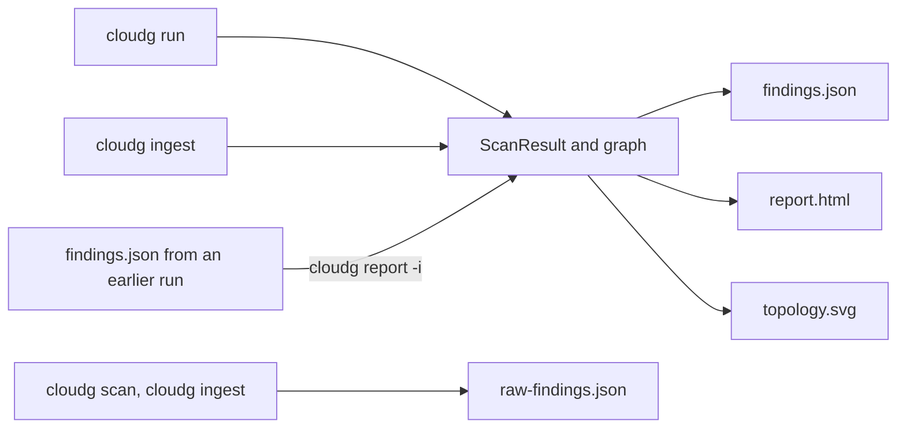

The renderers in `cloudg/renderers/` take a normalised `ScanResult` (assets, findings, compliance results) plus, when there is one, the D3 graph of the collected assets. They don't call any cloud API or scanner, which is why `cloudg report` can re-render an old run anywhere.

## Which command writes what



| Command | `findings.json` | `report.html` | `topology.svg` | `raw-findings.json` |
|---|---|---|---|---|
| `cloudg run` | Yes | Yes | Yes | No |
| `cloudg ingest` | With `--format json` or `all` | With `--format html` or `all` | No | Always |
| `cloudg report` | With `--format json` or `all` | With `--format html` or `all` | With `--format svg` or `all` | No |
| `cloudg scan` | No | No | No | Always |
| `run_pipeline()` | Yes | Yes | Yes | No |
| `run_from_reports()` | Yes | Yes | No | No |

`cloudg run`, `run_pipeline()` and `run_from_reports()` write the formats listed in `report.formats`, all three by default. `run_from_reports()` never writes `topology.svg`, because it has no collected assets to draw. `cloudg ingest` and `cloudg report` go by `--format` instead.

`cloudg run` writes more than these (GraphML, Cytoscape JSON when `graph.export_cytoscape` is on, the ontology, RAG chunks, Terraform); those come from the graph and analysis phases and are listed on [Output files](/reference/output-files/).

Those three are the only report formats. There is no CSV, SARIF or PDF writer in 0.6.0. `findings.json` is easy to convert, though; there's a [CSV recipe](#exporting-to-csv) further down.

## findings.json

`JSONExporter` writes one JSON object with seven keys:

```json title="findings.json"
{
  "metadata": {
    "scan_id": "79964dcf-69c0-4bcb-9d69-2261811e2f67",
    "provider": null,
    "account_id": null,
    "region": null,
    "started_at": "2026-10-10T05:47:10.313561",
    "completed_at": "2026-10-10T05:47:10.313549"
  },
  "summary": {
    "total_assets": 0,
    "total_findings": 5,
    "total_edges": 0,
    "severity_breakdown": {"CRITICAL": 2, "HIGH": 3},
    "compliance_frameworks": ["CIS", "CIS-AWS", "CVE", "NIST-CSF-AWS"]
  },
  "assets": [],
  "findings": [],
  "compliance": [],
  "edges": [],
  "graph": {"nodes": [], "links": []}
}
```

`assets`, `findings`, `compliance` and `edges` are the Pydantic models from `cloudg.schema.models`, serialised in JSON mode. Assets leave out `raw_data`. Findings include the computed `risk_score`. `edges` holds the collected `NetworkEdge` objects, so `cloudg report` can draw the topology again. `graph` holds D3 nodes and links for `cloudg run`, and is empty for ingest. In the `metadata` block, the normaliser doesn't fill in `provider`, `account_id` or `region` in 0.6.0, so expect `null` there. Both timestamps are ISO 8601 strings set at normalisation time, and a `completed_at` that was never set is `null`. The field-by-field reference is on [Output files](/reference/output-files/), and the models are on [Data models](/api/models/).

`raw-findings.json` is different: a bare JSON list of `Finding` objects as the parsers produced them, before deduplication, rescoring or compliance mapping. It has no `summary`, `compliance` or `graph`.

## report.html

The HTML report is one file rendered from the Jinja template `cloudg/templates/report.html.j2`. The data is embedded in the page as JSON, and so are Chart.js 4.4.0 and D3 7.9.0, so the page works offline. You can mail it, attach it to a ticket or archive it next to `findings.json`.

The header shows the scan ID, provider and account, a button that downloads the embedded data, and six counters: total assets, total findings, and the CRITICAL, HIGH, MEDIUM and LOW counts. Below it are four tabs.

The Infrastructure Map tab draws a D3 tree of account, region, VPC, subnet and resources, built from each asset's `region` and its `vpc_id` / `subnet_id` metadata. Assets with neither land under "Global / Ungrouped". Nodes with findings get a red ring and internet-exposed ones an orange ring. Toggle Layout switches to a force-directed graph of the collected graph plus one triangle node per finding (linked to its resource by a `FINDING_AFFECTS` edge) and one diamond per compliance framework (linked to its findings by `COMPLIANCE_GOVERNS`). With no assets, as after `cloudg ingest`, the tab goes straight to that force view, which then shows findings and frameworks only.

The Findings tab lists every finding, sorted by severity, with dropdown filters for severity and source tool and a text search over title, resource and description. Clicking a row, filtered or not, opens a side panel for that finding with the description, evidence, remediation, CVSS score, frameworks and risk score.

Analytics has four Chart.js charts: severity distribution, asset types, findings by source tool, and compliance per framework.

Compliance shows one card per framework with Pass and Fail counts. As explained in [Compliance frameworks](/guides/compliance/#report-html), Fail counts the controls that have findings, and Pass counts the controls that only Prowler's passing checks map to. Without passing-check data in the input (no Prowler, or scanners that only report failures), Pass is 0 and the percentage bar reads 0%.

The download button saves a file named `findings.json` that holds only `findings`, `graph` and the tree data. It isn't the same file cloudg writes, but `cloudg report -i` and the viewer both accept it.

The two libraries come from `cloudg/templates/vendor/` in the package and add about 485 KB to the file. With `report.inline_js: false` the page loads the same pinned builds from `cdn.jsdelivr.net` instead, with Subresource Integrity hashes, which gives a smaller file that needs network access to show the map, charts and compliance cards.

Everything that comes from scanner output or cloud metadata (titles, descriptions, evidence, resource ids, asset names, framework names) is HTML-escaped before it reaches the page, and the embedded JSON cannot close its `<script>` element early. A report built from someone else's scan files is safe to open.

If the template can't be found or fails to render, cloudg logs a warning and writes a plain fallback page instead: the counters and a findings table, with no script at all.

## topology.svg

`SVGRenderer` draws a static map of the collected assets: VPCs and VNets as containers, subnets inside them, compute, databases and functions inside the subnets, and IAM principals and security groups in side panels. It needs assets, so it only means something after `cloudg run`, or after `cloudg report` on a `findings.json` that has assets.

## cloudg report

`cloudg report` reads a `findings.json` and renders it again. Use it to regenerate the HTML after upgrading cloudg, to produce just the SVG, or to rebuild a report on a machine that never had cloud access.

```bash tab="CLI"
cloudg report -i ./reports/findings.json -o ./reports-rerendered
cloudg report -i ./reports/findings.json -o ./reports-rerendered --format html
cloudg report -i ./archive/2026-09-30/findings.json -o ./archive/2026-09-30/svg --format svg
```

```bash tab="Docker"
docker run --rm \
  -v "$PWD/reports:/data" \
  ghcr.io/morpheuslord/cloudg:latest report -i /data/findings.json -o /data/rerendered
```

| Flag | Meaning |
|---|---|
| `-i, --input` | Path to a `findings.json`, or a `raw-findings.json`. Required. |
| `-o, --output` | Output directory, `./reports` by default |
| `--format` | `html`, `json`, `svg` or `all` (default) |
| `--overwrite` | Allow writing `findings.json` over the input file |

A missing input file prints `Input file not found` and exits with code 1.

`cloudg report` restores the whole run from a `findings.json`:

| In the input | After `cloudg report` |
|---|---|
| `assets`, `findings`, `graph` | Kept |
| `compliance` | Kept, so the Compliance tab and chart show the same results |
| `edges` | Kept, so `topology.svg` has its connections. A `findings.json` written before the `edges` key existed gets its edges rebuilt from the `graph` links. |
| `metadata` | Kept: scan ID, provider, account, region, `started_at` and `completed_at` |

Given a `raw-findings.json` (the bare list from `cloudg scan` or `cloudg ingest`), `cloudg report` normalises it first: deduplication, scoring and compliance mapping, as `cloudg ingest` does.

`-o` defaults to `./reports`, which is also where `cloudg run` and `cloudg ingest` write. So that `cloudg report -i ./reports/findings.json` doesn't replace its own input, the command refuses to write `findings.json` over the input file and exits with code 1:

```console
$ cloudg report -i ./reports/findings.json
────────────────────────────── Report Generation ───────────────────────────────
╭───────────────────── ✗ Refusing to overwrite the input ──────────────────────╮
│ reports/findings.json would be replaced by the new findings.json. Pass -o    │
│ <another directory>, --format html/svg, or --overwrite.                      │
╰──────────────────────────────────────────────────────────────────────────────╯
```

Give `-o` another directory, render only `--format html` or `svg`, or pass `--overwrite` when replacing the file is what you want.

## Rendering from Python

The three renderers are plain classes. Each takes an output directory and writes one file, returning its path.

| Class | Call | Default file |
|---|---|---|
| `cloudg.renderers.json_export.JSONExporter(output_dir=".")` | `.export(scan_result, graph_json=None, filename="findings.json")` | `findings.json` |
| `cloudg.renderers.html_report.HTMLReportGenerator(template_dir=None, output_dir=".", inline_js=True)` | `.generate(scan_result, graph_json=None, filename="report.html")` | `report.html` |
| `cloudg.renderers.svg.SVGRenderer(output_dir=".")` | `.render(assets, edges, findings_by_resource=None, filename="topology.svg", width=1800, height=1400)` | `topology.svg` |

### From raw findings {#from-raw-findings}

`raw-findings.json` from `cloudg scan` (or `cloudg ingest`) hasn't been normalised yet. `cloudg report -i raw-findings.json` normalises and renders it in one step; in Python, load it, normalise it, then render:

```python title="raw_to_reports.py"
import json
from pathlib import Path

from cloudg import CloudGConfig, CloudGEngine
from cloudg.renderers.html_report import HTMLReportGenerator
from cloudg.renderers.json_export import JSONExporter
from cloudg.schema.models import Finding

raw = json.loads(Path("./reports/raw-findings.json").read_text())
findings = [Finding.model_validate(item) for item in raw]

engine = CloudGEngine(CloudGConfig())
scan_result = engine.normalise_findings(findings)

out = "./reports-from-raw"
print(JSONExporter(output_dir=out).export(scan_result))
print(HTMLReportGenerator(output_dir=out).generate(scan_result))
print(len(scan_result.compliance), "compliance results")
```

`normalise_findings()` uses `config.rulesets.rules_dir`, so a custom ruleset applies here too.

### Your own template

`HTMLReportGenerator(template_dir=...)` renders a `report.html.j2` from that directory instead of the packaged one. Copy `cloudg/templates/report.html.j2`, change it, and pass the directory. The variables available to a template are `scan_id`, `provider`, `account_id`, `started_at`, `completed_at`, `total_assets`, `total_findings`, `severity_counts`, `resource_types`, `source_tools`, `compliance_summary`, `findings` and `assets`, plus JSON-string versions (`severity_counts_json`, `resource_types_json`, `source_tools_json`, `compliance_summary_json`, `findings_json`, `assets_json`, `graph_json`, `hierarchy_json`, `findings_per_resource_json`) for embedding in scripts. The JSON strings are already safe inside a `<script>` element; mark them `|safe` there. For the libraries, `inline_js` says whether to embed them, `vendored_js.chartjs` and `vendored_js.d3` hold their source, and `cdn_js` holds the pinned CDN URLs and integrity hashes. Autoescaping is on, so any other value you print is escaped.

### Exporting to CSV {#exporting-to-csv}

For a spreadsheet or a ticketing import, flatten the findings:

```python title="findings_to_csv.py"
import csv
import json
from pathlib import Path

data = json.loads(Path("./reports/findings.json").read_text())
columns = ["severity", "risk_score", "source_tool", "title", "resource_arn",
           "source_finding_id", "compliance_frameworks", "remediation"]

with open("findings.csv", "w", newline="") as fh:
    writer = csv.DictWriter(fh, fieldnames=columns, extrasaction="ignore")
    writer.writeheader()
    for finding in data["findings"]:
        row = dict(finding)
        row["compliance_frameworks"] = ";".join(finding.get("compliance_frameworks", []))
        writer.writerow(row)

print("wrote", len(data["findings"]), "rows to findings.csv")
```

## The report viewer

`docs/viewer.html` in the repository is a standalone page for browsing results without generating anything. Open it in a browser and drop a file on it, or use Open a report. It reads `findings.json` from `cloudg run`, `cloudg ingest` or `cloudg report`, and the bare list in `raw-findings.json` from `cloudg scan`. The file is parsed in the browser and not uploaded anywhere. The page starts with built-in sample data, marked with a "sample data" badge, until you load your own.

It shows severity and tool counts, failed compliance controls per framework (top ten), the most affected resources, a sortable and filterable findings table, and the topology when the file has graph data. Raw findings have no compliance or graph, and the page says so. Unlike the report, it loads D3 from a CDN (`cdnjs.cloudflare.com`).

## Configuration

`config.yaml` has a `report:` section:

```yaml title="config.yaml"
report:
  formats: [html, json, svg]
  inline_js: true
  output_dir: ./reports
```

`formats` lists the reports that `cloudg run`, `run_pipeline()` and `run_from_reports()` write; unknown names are dropped with a warning. `cloudg ingest` and `cloudg report` use `--format` instead. `inline_js` embeds Chart.js and D3 in `report.html` (`true`, the default) or loads them from the CDN (`false`); every command that writes the HTML report reads it. `output_dir` is where the `CloudGEngine` methods write when they get no `output_dir`, and the MCP server's default workspace directory. The CLI commands use `-o` (default `./reports`) and ignore it. The keys are listed on the [report config page](/reference/config/report/).

## Next

:::links
- [cloudg report](/cli/report/) The command reference.
- [Output files](/reference/output-files/) Every file cloudg writes, field by field.
- [Compliance frameworks](/guides/compliance/) What the compliance output means.
- [Ingesting existing output](/guides/ingesting/) Reports from scans that ran elsewhere.
:::
