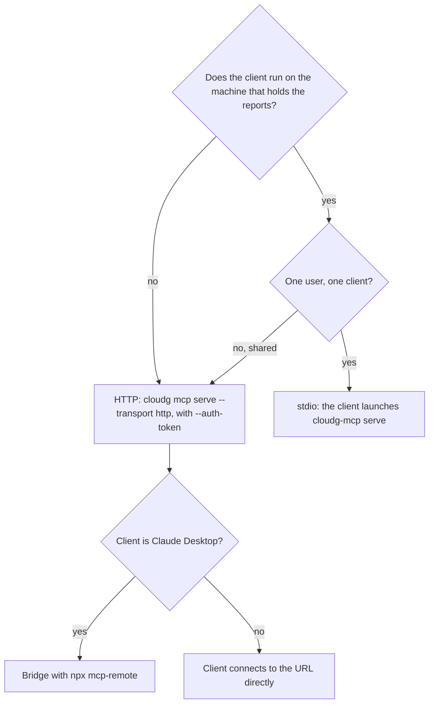

Most people run cloudg over stdio: the client starts `cloudg mcp serve` as a child process when it opens and stops it when it closes. You don't keep a server running, and nothing listens on a port. HTTP is for the other cases: a server shared by several people, a client on a different machine, or a gateway in front of it.



## Before you start

You need cloudg 0.6.0 or newer on Python 3.11 or newer. The base install includes the MCP layer and a dependency-free server; the `mcp` extra adds the official SDK, which only matters if you want `--flavor sdk`.

```bash tab="pip"
pip install cloudg
```

```bash tab="uv"
uv pip install cloudg
```

You also need something to look at: an `inventory-map.json` from [cloudg map](/cli/map/), a `findings.json` from [cloudg run](/cli/run/), or native scanner output that [cloudg ingest](/cli/ingest/) understands. The examples below assume `./reports/inventory-map.json`.

If you installed cloudg in editable mode before 0.6.0, run `pip install -e .` again so the `cloudg-mcp` console script gets created.

## Set up a stdio client

::::steps
### Check that the server loads your data

Run one tool from a terminal before touching any client config. `cloudg mcp call` goes through the same layer, policy and transforms the server uses, so if this works, the server will too.

```bash
cloudg mcp call workspace_status --dataset prod=./reports/inventory-map.json
```

The result lists the dataset with its asset, edge and finding counts, and the allowed roots. An error here (wrong path, unknown policy) is the same error the client would hide from you later.

### Generate the snippet

`cloudg mcp config --client NAME` prints the JSON for that client on stdout and a one-line hint on stderr about where it goes. It finds the launch command itself: a `cloudg-mcp` executable on `PATH` first, then `cloudg` (giving `cloudg mcp serve`), then the current Python interpreter with `-m cloudg.mcp serve`. The command is written as an absolute path, because desktop apps often start with a minimal `PATH`.

The output below is from an install where `cloudg-mcp` was found on `PATH`; your path will differ.

```json tab="Claude Desktop" title="claude_desktop_config.json"
{
  "mcpServers": {
    "cloudg": {
      "command": "/home/you/.venv/bin/cloudg-mcp",
      "args": [
        "serve"
      ]
    }
  }
}
```

```json tab="Claude Code" title=".mcp.json"
{
  "mcpServers": {
    "cloudg": {
      "type": "stdio",
      "command": "/home/you/.venv/bin/cloudg-mcp",
      "args": [
        "serve"
      ],
      "env": {}
    }
  }
}
```

```json tab="Cursor" title="~/.cursor/mcp.json"
{
  "mcpServers": {
    "cloudg": {
      "command": "/home/you/.venv/bin/cloudg-mcp",
      "args": [
        "serve"
      ]
    }
  }
}
```

```json tab="VS Code" title=".vscode/mcp.json"
{
  "servers": {
    "cloudg": {
      "type": "stdio",
      "command": "/home/you/.venv/bin/cloudg-mcp",
      "args": [
        "serve"
      ]
    }
  }
}
```

The commands that produced them are `cloudg mcp config --client claude-desktop` (the default), `--client claude-code`, `--client cursor` and `--client vscode`. `--name` changes the server key from `cloudg`, and `--command "CMD ARGS"` replaces the detected launch command (it is split with `shlex`).

:::note Interpreter fallback
In a virtualenv where neither script is on `PATH`, the command is the interpreter and the arguments are `["-m", "cloudg.mcp", "serve"]`. That works just as well; it only looks different.
:::

### Put it where the client reads it

Each client reads a different file. cloudg's hint on stderr names it, and the table repeats it. Where a client keeps its global config on macOS, Windows or Linux is the client's business; use the client's own menu to open it when in doubt.

| Client | File | Notes |
|---|---|---|
| Claude Desktop | `claude_desktop_config.json` | Open it with Settings, Developer, Edit Config. Merge the `cloudg` entry into the existing `mcpServers` object, then restart Claude Desktop |
| Claude Code | `.mcp.json` in the project root | Or register the inner entry with `claude mcp add-json cloudg '<entry JSON>'` |
| Cursor | `~/.cursor/mcp.json` (all projects) or `.cursor/mcp.json` (one project) | Same shape as Claude Desktop |
| VS Code | `.vscode/mcp.json` | Or add the same object under `"mcp"` in `settings.json`. Note the top-level key is `servers`, not `mcpServers` |

For Claude Code, the one-line form with the entry from the snippet above:

```bash
claude mcp add-json cloudg '{"type": "stdio", "command": "/home/you/.venv/bin/cloudg-mcp", "args": ["serve"], "env": {}}'
```

### Restart the client and start a conversation

The server sends instructions on `initialize` that tell the model to begin with `workspace_status`. If you did not preload a dataset, ask the assistant to load one by absolute path, for example "Load /srv/cloudg/reports/inventory-map.json and show me the internet-exposed assets with HIGH findings." That path has to be inside an allowed root, which the next section explains.
::::

## Load your reports with --dataset

Pass the same options to `config` that you would pass to `serve`, and they are appended to the launch arguments. `--dataset` takes `NAME=PATH` or a bare `PATH`, and `config` resolves the path to an absolute one, since the client starts the server from a working directory you don't control.

```console
$ cloudg mcp config --client claude-desktop --policy strict \
    --dataset prod=./reports/inventory-map.json --read-only
{
  "mcpServers": {
    "cloudg": {
      "command": "/home/you/.venv/bin/cloudg-mcp",
      "args": [
        "serve",
        "--policy",
        "strict",
        "--dataset",
        "prod=/home/you/cloud-audit/reports/inventory-map.json",
        "--read-only"
      ]
    }
  }
}
```

The path can be an `inventory-map.json`, the directory holding it (a `findings.json` next to it is merged in), a cloudg `findings.json` report, or native output from Prowler (ASFF), ScoutSuite, Checkov or Trivy. Without a name, the dataset is named after the parent directory for `inventory-map.json` and after the file stem otherwise. Repeat `--dataset` to preload several. They load in order and each becomes active in turn, so the last one is active when the conversation starts; the model can switch with `select_dataset`.

Preloaded paths skip the allowed-roots check, because you chose them. Datasets the model loads later with `load_dataset` don't. By default the allowed roots are the server's working directory and the configured report directory, minus `/` and your home directory, and a desktop client usually starts the server from one of those two. So set the roots explicitly in the entry's `env` block:

```json title="claude_desktop_config.json"
{
  "mcpServers": {
    "cloudg": {
      "command": "/home/you/.venv/bin/cloudg-mcp",
      "args": ["serve", "--policy", "standard"],
      "env": {"CLOUDG_MCP_ALLOWED_ROOTS": "/srv/cloudg/reports:/srv/cloudg/scans"}
    }
  }
}
```

The separator is `os.pathsep`: `:` on macOS and Linux, `;` on Windows. Export tools write under the report directory, which is added to the roots if it is not already inside one.

## Choose a policy

`--policy` takes a built-in profile name, a path to a `.yaml`, `.yml` or `.json` policy file, or inline JSON starting with `{`. Without it the server uses `$CLOUDG_MCP_POLICY`, or `standard`. The profiles live in `cloudg/mcp/policies/`:

| Profile | Use it when | Tools listed |
|---|---|---|
| `standard` | The default. Real identifiers, secrets redacted, cloud text fenced | 73 |
| `read_only` | The model must not call cloud APIs, start scanners or write files | 66 |
| `airgapped` | Same, but local report and Terraform exports are fine | 69 |
| `audit` | `read_only` plus a log of every call and inline provenance labels | 66 |
| `strict` | The model must not see real account ids, ARNs, names, IPs or e-mails | 61 |
| `soc-analyst` | A starting point for a shared server with `analyst`, `lead` and `collector` roles | 62 (local user) |
| `open` | Throwaway local experiments with data you made up. Secrets pass verbatim | 74 |

The counts are what `cloudg mcp tools --policy NAME` lists for the local user in 0.6.0. Run that command with your policy and, for HTTP, with `--role ROLE`, to see exactly what a client will get before you hand it out.

Under `strict`, pseudonyms come from a key that is random per process, so they change every time the client restarts the server and old ones stop resolving. Put `CLOUDG_MCP_VAULT_KEY` in the entry's `env` block if pseudonyms must stay stable across conversations, and keep that value away from the model. The [built-in profiles](/mcp/privacy/built-in-profiles/) page shows the same calls under every profile, and [loading and composing policies](/mcp/privacy/loading-and-composing-policies/) covers writing your own with `extends`.

## Read-only mode

There are two ways to stop a model from changing anything outside its own memory, and they are not identical.

The `--read-only` flag removes tools from the registry before the policy sees them: every tool with the `write_fs`, `cloud_access` or `exec` capability, and every tool annotated destructive. That takes out the four live collectors, the three file exports (`export_ontology`, `export_report`, `export_terraform`) and `unload_dataset`. Under `standard`, which already hides `reveal_token`, 65 tools remain. The flag combines with any policy.

The `read_only` profile hides tools through the policy instead (capabilities `cloud_access`, `exec` and `write_fs` denied) and keeps `unload_dataset`, for 66 tools. Either way the model can still load datasets from the allowed roots, snapshot them and suppress findings in memory, since those don't leave the process.

## Connect over HTTP with a token

Start the server first. Give each token an explicit principal id, because the audit log records the id:

```bash
export CLOUDG_MCP_TOKEN="$(openssl rand -hex 24)"
cloudg mcp serve --transport http --dataset prod=./reports/inventory-map.json \
  --auth-token env:CLOUDG_MCP_TOKEN:analyst:alice
```

It listens on `http://127.0.0.1:8765/mcp` (change with `--host`, `--port` and `--path`) and, with the native flavor, answers `GET /healthz` without a token. `--flavor auto` picks the official SDK when `cloudg[mcp]` is installed, and that flavor has no `/healthz`; add `--flavor native` if your load balancer needs one. The spec format is `TOKEN[:ROLES[:ID]]`, read from the right; `env:VARNAME` takes the token from a variable, and the principal always gets the `default` role on top of the ones listed. An empty token, including one from an unset variable, stops the server before it starts.

Then generate the client side with `--transport http` and `--token-env`, naming the variable that holds the token on the client's machine. `--policy`, `--dataset` and `--read-only` do nothing in this mode, since the server is already running with its own options. Use `--url` for anything other than the default address.

```json tab="Claude Desktop" title="claude_desktop_config.json"
{
  "mcpServers": {
    "cloudg": {
      "command": "npx",
      "args": [
        "-y",
        "mcp-remote",
        "http://127.0.0.1:8765/mcp",
        "--header",
        "Authorization:Bearer ${CLOUDG_MCP_TOKEN}"
      ]
    }
  }
}
```

```json tab="Claude Code" title=".mcp.json"
{
  "mcpServers": {
    "cloudg": {
      "type": "http",
      "url": "http://127.0.0.1:8765/mcp",
      "headers": {
        "Authorization": "Bearer ${CLOUDG_MCP_TOKEN}"
      }
    }
  }
}
```

```json tab="Cursor" title="~/.cursor/mcp.json"
{
  "mcpServers": {
    "cloudg": {
      "url": "http://127.0.0.1:8765/mcp",
      "headers": {
        "Authorization": "Bearer ${env:CLOUDG_MCP_TOKEN}"
      }
    }
  }
}
```

```json tab="VS Code" title=".vscode/mcp.json"
{
  "servers": {
    "cloudg": {
      "type": "http",
      "url": "http://127.0.0.1:8765/mcp",
      "headers": {
        "Authorization": "Bearer ${env:CLOUDG_MCP_TOKEN}"
      }
    }
  }
}
```

Each client expands the variable in its own syntax: `${VAR}` in Claude Code, `${env:VAR}` in Cursor and VS Code. The token itself never appears in the file. Claude Desktop's config only launches local commands, so cloudg bridges to the URL with `npx mcp-remote` and passes the header on its command line. That entry has no `env` block, and whether `${CLOUDG_MCP_TOKEN}` gets a value depends on the environment Claude Desktop hands to `npx`, which the cloudg docs have not tested. If the server answers 401, add `"env": {"CLOUDG_MCP_TOKEN": "..."}` to the entry by hand.

To reach the server from another host, bind to a public address and keep the token: `--host 0.0.0.0` together with `--allowed-host 'mcp.internal.example:*'` (and `--allowed-origin` for browser clients). The [CLI reference](/mcp/server/cli-reference/) lists every serve option.

## Troubleshooting

### The client shows no tools, or disconnects at once

Copy the `command` and `args` from the client config and run them in a terminal. If the process exits, the reason is on stderr. The usual ones:

| Message or symptom | Cause | Fix |
|---|---|---|
| `Error: Dataset not found: /path/...` | A `--dataset` path that doesn't exist | Fix the path; regenerate with `cloudg mcp config` so it is absolute |
| `Error: Unknown policy 'NAME': not a profile (...) or an existing file` | Typo in `--policy`, or a relative file path that doesn't resolve from the client's working directory | Use a profile name or an absolute file path |
| `command not found`, or the client log says it can't spawn | The command isn't on the client's `PATH` | Use the absolute path `cloudg mcp config` prints |
| Starts in a terminal, empty tool list in the client | The policy hides everything for this principal | Check `cloudg mcp tools --policy P --role R` with the same options |

A client also drops the connection when anything other than protocol messages reaches stdout. The server redirects stray `print()` calls to stderr while it runs, but a wrapper script that echoes something before `exec`-ing the server will break the stream. `cloudg -v mcp serve` is safe; verbose logs go to stderr.

### load_dataset says the path is outside the allowed roots

The model asked for a file outside `CLOUDG_MCP_ALLOWED_ROOTS`. The error lists the roots it checked. Add the directory to that variable in the entry's `env`, or preload the file with `--dataset`.

### HTTP answers 401, 403 or 421

401 means the `Authorization` header was missing or the token didn't match; check that the variable is set where the client runs. 403 `Forbidden: invalid Origin` means a browser-style `Origin` header that isn't loopback or allowed; add it with `--allowed-origin`. 421 `Invalid Host header` means a loopback-bound server received a `Host` other than `localhost`, `127.0.0.1` or `[::1]`, which is what DNS rebinding looks like and also what a reverse proxy forwarding its public name looks like; add the name with `--allowed-host 'name:*'`.

### A token with a colon in it is rejected

Specs are read from the right, so `abc:def` means token `abc` with role `def`. Write such a token in the full form (`abc:def::` or `abc:def:analyst:`) or put it in a variable and use `env:VAR:ROLES:ID`.

### Pseudonyms from yesterday no longer resolve

The vault key is random per process unless `CLOUDG_MCP_VAULT_KEY` is set. Set it in the client's `env` block.

### The client complains about a missing outputSchema

Under every profile except `open`, tools don't advertise `outputSchema`, because masking can change a field's type and a client must reject content that doesn't match an advertised schema. The structured content is still sent. This is deliberate; see [troubleshooting and FAQ](/mcp/server/troubleshooting-and-faq/) for this and the other cases (timeouts, large results, "cooling down" from live tools).

:::links
- [Quick start](/mcp/server/quick-start-with-a-desktop-client/) The same setup with captured output from the sample estate.
- [cloudg mcp config](/cli/mcp-config/) Every option of the config command.
- [cloudg mcp serve](/cli/mcp-serve/) Transports, flavors, tokens, Host and Origin checks.
- [Built-in profiles](/mcp/privacy/built-in-profiles/) What each policy changes, call by call.
- [Principals and roles](/mcp/privacy/principals-and-roles/) Map tokens to roles and give each role its own view.
- [Troubleshooting and FAQ](/mcp/server/troubleshooting-and-faq/) The full list of known problems.
:::
