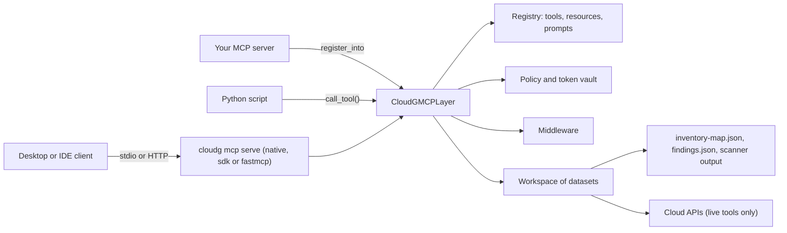
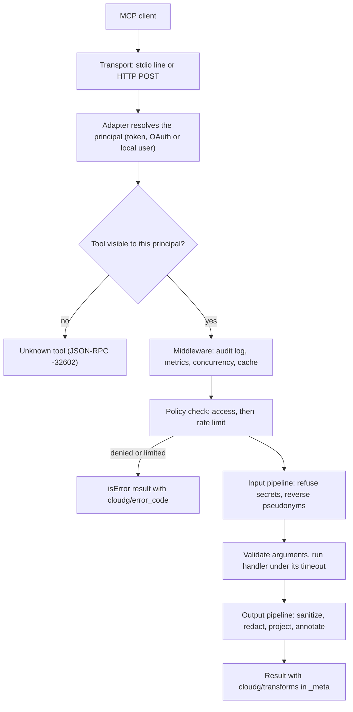

The MCP layer lives in `cloudg/mcp/` and ships with the base `pip install cloudg`. It takes the files cloudg already writes (`inventory-map.json`, `findings.json`, native scanner output) and turns them into tools an assistant can call: "which internet-exposed assets have HIGH findings?", "what breaks if this IAM role goes away?", "which CIS controls fail in the shared-services account?". The model asks, cloudg answers from its own graph and data model, and a policy decides what the model may see and do on the way.

It is written for three kinds of reader. People who run Claude Desktop, Claude Code, Cursor or VS Code and want to point it at a cloud estate should read [Connect a client](/mcp/connect/) next. Operators who already run an MCP server or gateway can mount cloudg into it. And Python authors (an agent framework, a test suite, a batch job) can call the same tools in-process, with no MCP traffic at all.

## One layer, three ways in

The center of the package is one class, `CloudGMCPLayer`. It holds a registry of tools, resources, templates and prompts, a workspace of loaded datasets, a policy, and a middleware chain. Every request ends up in one of four methods on it: `call_tool`, `read_resource`, `get_prompt` or `complete`. Because of that, a policy you write once applies identically to a desktop client on stdio, a web client on HTTP, a server you mounted cloudg into, and a Python script.

| Mode | Entry point | Use it when |
|---|---|---|
| Standalone server | `cloudg mcp serve` | You want cloudg as its own MCP server for a desktop client or a gateway |
| Mounted | `layer.register_into(server)` | You already run an MCP server (official `mcp` SDK 1.x or 2.x, or `fastmcp` 2, 3 or 4) and want cloudg's tools inside it |
| In-process | `await layer.call_tool(...)` | You are in Python and do not need MCP on the wire |



The [server section](/mcp/server/what-the-layer-is/) covers the layer in depth, [mounting](/mcp/server/mounting-into-an-existing-mcp-server/) covers the second mode and [in-process use](/mcp/server/in-process-use/) the third.

## What an assistant can do with it

The default catalog has 74 tools in ten categories. The counts below come from running `cloudg mcp tools --policy open --json` against the 0.6.0 code and grouping by `_meta["cloudg/category"]`.

| Category | Tools | What the tools do |
|---|---|---|
| `workspace` | 8 | Load, select, snapshot, diff and unload datasets; `workspace_status` is where a model should start |
| `inventory` | 11 | Search assets (`find_assets`), fetch one with its relations (`get_asset`), count and group, list accounts, regions and tags, report collector coverage and the AWS Organization |
| `graph` | 17 | Neighbours, shortest paths, attack paths from the internet, identity-based lateral movement, internet exposure, dependencies, blast radius, centrality, sub-graph export |
| `findings` | 10 | List, summarise and prioritise findings (`top_risks`), suppress and restore them in memory, ingest scanner reports, generate reachability findings |
| `compliance` | 5 | Frameworks, posture per framework, controls, one control's status, assets with the most failures |
| `ontology` | 6 | Ontology statistics, read-only SPARQL, semantic neighbourhoods, relation groups, RAG chunks, ontology export |
| `export` | 3 | Terraform preview and export, report files |
| `live` | 5 | `map_inventory`, `collect_assets`, `run_scanners`, `run_pipeline` against real cloud APIs, plus `rate_limit_status` |
| `meta` | 4 | What this caller may use, and cloudg's vocabulary of asset, edge and relation types |
| `privacy` | 5 | The active policy, a transform preview, the detector list, the decision log, and `reveal_token` |

The default `standard` policy hides `reveal_token`, so `cloudg mcp tools` lists 73. The stricter profiles hide more (see [policies](#policies-and-privacy) below). Every tool is documented with its arguments, return fields and a captured example in the [tool index](/mcp/tools/tool-index/) and the per-category pages such as [graph](/mcp/tools/graph/) and [findings](/mcp/tools/findings/).

The four collecting tools in `live` are the only ones that touch a cloud provider. They check credentials before the first API call, refuse to re-collect a scope that was collected a couple of minutes ago, and are hidden by every built-in profile except `open` and `standard`. The details are in [live tools and the credential preflight](/mcp/server/live-tools-and-the-credential-preflight/).

### Resources and prompts

Resources are read-only documents a client can attach to a conversation without a tool call. There are 13 fixed resources, such as `cloudg://workspace`, `cloudg://findings/summary`, `cloudg://compliance`, `cloudg://graph/d3`, `cloudg://ontology/turtle` and `cloudg://policy`, and 11 templates that take a parameter: `cloudg://assets/{+ref}`, `cloudg://assets/{+ref}/neighbors`, `cloudg://findings/{finding_id}`, `cloudg://compliance/{framework}` and so on. `cloudg mcp serve` adds a 14th resource, `cloudg://metrics`, with call counts and latencies. Template arguments complete as you type: in the sample estate, asking for `ref` values matching `web` returns asset ids such as `web-1` and `sg-web`.

The 11 prompts are packaged analysis workflows that a user picks from the client's prompt menu. They tell the model which tools to call and in what order:

| Prompt | Required arguments |
|---|---|
| `security_posture_review`, `executive_summary`, `attack_surface_report`, `cross_account_trust_review` | none |
| `investigate_asset`, `blast_radius_assessment`, `change_impact_analysis` | `ref` |
| `compliance_gap_analysis` | `framework` |
| `remediation_plan` | none (`severity` optional) |
| `incident_triage` | `finding_id` |
| `drift_review` | `base` |

The full list with arguments and rendered output is in [resources and resource templates](/mcp/tools/resources-and-resource-templates/) and [prompts](/mcp/tools/prompts/).

## Workspaces and datasets

The server keeps one in-memory workspace. It holds named datasets, one of which is active, and every tool takes an optional `dataset` argument that defaults to the active one. A dataset is one loaded view of infrastructure: assets, edges, findings, compliance results, coverage and organization data, plus where it came from.

Datasets get into the workspace in three ways. The operator can preload them with `--dataset NAME=PATH` when starting the server. The model can call `load_dataset` with a path. Or a live tool collects a fresh one from the cloud. The loader detects what a path holds: a directory with `inventory-map.json` (a `findings.json` next to it is merged in), a cloudg `findings.json`, or Prowler ASFF, ScoutSuite, Checkov or Trivy output, which is normalised and mapped to compliance frameworks on load.

The graph, dependency graph, centrality scores and RDF ontology are built the first time a tool needs them and cached until the dataset changes. On a large estate the first `attack_paths` or `sparql_query` call is the slow one. The workspace holds 16 datasets; loading a 17th evicts the oldest inactive one.

Two safety rules matter in practice. First, the model can only read and write inside the allowed roots: by default the directory the server was started from and the configured report directory, with `/` and your home directory left out. Set `CLOUDG_MCP_ALLOWED_ROOTS` to change them. Second, paths given with `--dataset` skip that check, because the operator typed them. `snapshot_dataset` and `diff_datasets` let a model compare two versions of an estate, which is what the `drift_review` prompt does. More in [the workspace](/mcp/server/the-workspace/).

## The request lifecycle

Every tool call takes the same route, whatever transport it arrived on.



A few details are easy to miss. A tool the policy hides gives exactly the same "Unknown tool" error as a tool that does not exist, so a model cannot probe for what it is missing. Arguments are validated against a pydantic model built from the handler's signature, and unknown keys are rejected. Synchronous handlers run in a worker thread so a slow graph build does not block other requests, and every call has a timeout (300 seconds by default, longer for the live tools). The result is sent twice, as `structuredContent` and as indented JSON text for clients that ignore structured output; the text copy is capped at 200,000 characters. Errors from the handler pass through the same output pipeline as results, because exception messages tend to quote ARNs.

The step-by-step version, including resources, prompts and completions, is in [the request lifecycle](/mcp/server/the-request-lifecycle/). Error codes are listed in [errors](/mcp/server/errors/) and the middleware hooks in [middleware](/mcp/server/middleware/).

## Policies and privacy

A policy is a YAML document that says who may call what, how often, and what happens to the data in each direction. Seven profiles ship in `cloudg/mcp/policies/`, and you choose one with `--policy` or `CLOUDG_MCP_POLICY`:

| Profile | What it does | Tools listed for the local user |
|---|---|---|
| `open` | Nothing. Secrets reach the model verbatim. Local experiments only | 74 |
| `standard` (default) | Redacts secrets, drops private keys, masks credential ids, fences attacker-controllable text, refuses secrets in arguments | 73 |
| `airgapped` | `standard`, plus no cloud calls and no scanner processes; local exports allowed | 69 |
| `read_only` | `standard`, plus no cloud calls, processes or file writes | 66 |
| `audit` | `read_only` with a decision log of every call and inline provenance labels | 66 |
| `strict` | Pseudonymises accounts, ARNs, names, IPs, e-mails and tag values; hides restricted tools | 61 |
| `soc-analyst` | Example multi-role policy: pseudonymised analysts, revealing leads, a collector role | 62 |

The tool counts were measured with `cloudg mcp tools --policy NAME` on 0.6.0. `soc-analyst` gives different numbers per role (60 for `analyst`, 70 for `lead`).

The output pipeline in `standard` runs four transforms in order. `sanitize` strips invisible and bidi characters and wraps text that reads like instructions in `⟦untrusted⟧` fences, because anyone who can tag a resource can plant "ignore previous instructions" in a tag. `redact` replaces secrets found in metadata (EC2 `user_data`, connection strings, SAS signatures) with `[REDACTED:...]`. `project` drops `raw_data` and caps string and result size. `annotate` adds a provenance report. On the way in, `guard_secrets` refuses any argument that contains a secret.

Under `strict` the redactor also pseudonymises identifiers through the token vault. Pseudonyms keep their format, so a 12-digit account id stays 12 digits and an ARN stays a valid ARN, and they are deterministic for the life of the vault key. The model can pass `res-8de954a6d9` back as a `ref` and the input pipeline resolves the real asset before the handler runs. Set `CLOUDG_MCP_VAULT_KEY` if pseudonyms must survive a server restart; without it a random key is generated per process.

One side effect surprises people: under every profile except `open`, tools do not advertise an `outputSchema`, since masking can change a field's type and clients reject structured content that does not match a schema. The data is still sent. The [privacy section](/mcp/privacy/threat-model-and-goals/) covers the threat model, [what the policy touches](/mcp/privacy/what-the-policy-touches/), the [built-in profiles](/mcp/privacy/built-in-profiles/) file by file, and [the token vault](/mcp/privacy/the-token-vault/).

## Transports and flavors

`cloudg mcp serve --transport stdio` (the default) is for clients that launch the server as a child process and talk newline-delimited JSON-RPC over its stdin and stdout. stdout carries protocol messages only; the server redirects stray `print()` calls and writes to file descriptor 1 to stderr while it runs.

`--transport http` serves streamable HTTP on `http://127.0.0.1:8765/mcp`, with sessions, server-sent events for progress, and `/healthz`. `--transport sse` adds the deprecated HTTP+SSE endpoints for old clients. Both protocol eras are served: the handshake versions from 2024-11-05 to 2025-11-25, and the stateless 2026-07-28 version.

The flavor picks which implementation speaks MCP. The layer and results are identical across them.

| Flavor | Implementation | Needs |
|---|---|---|
| `auto` (default) | `sdk` if the official SDK imports, else `native` | nothing |
| `native` | cloudg's own server, standard library only | nothing |
| `sdk` | the official SDK's low-level `Server`, uvicorn for HTTP | `pip install "cloudg[mcp]"` |
| `fastmcp` | `fastmcp.FastMCP` with cloudg components | `pip install fastmcp` |

The native flavor supports every serve option, including `--cors-origin`, `--page-size` and `/healthz`. See [transports and protocol versions](/mcp/server/transports-and-protocol-versions/) and [flavors](/mcp/server/flavors/).

## Security model in brief

Every transport binds to 127.0.0.1 by default. On HTTP, `--auth-token TOKEN[:ROLES[:ID]]` maps static bearer tokens to principals with roles, which the policy's `roles:` section uses; tokens are kept only as SHA-256 digests and compared in constant time. Every flavor checks `Origin` and `Host` headers against allow-lists to block DNS rebinding, and the native server warns at start-up when bound to a non-loopback address without tokens. On stdio, tokens are ignored and the caller is the local user.

File access is confined to the allowed roots and writes to the output directory. Error messages never repeat the caller's arguments. The JSONL audit log (`--audit-log`) records every call with hashed argument values, and every pseudonym reversal is logged at WARNING. `--registry` imports and runs Python code, so its value must never come from untrusted input. The longer list is in [security model in brief](/mcp/server/security-model-in-brief/).

## Examples

Serve over stdio with the `strict` profile and one preloaded dataset. This is what a desktop client runs:

```bash
cloudg mcp serve --policy strict --dataset prod=./reports/inventory-map.json
```

Serve over streamable HTTP with a bearer token read from the environment. The token principal gets the role `analyst` and the id `alice`, which is what the audit log records:

```bash
export CLOUDG_MCP_TOKEN="$(openssl rand -hex 24)"
cloudg mcp serve --transport http --dataset prod=./reports/inventory-map.json \
  --auth-token env:CLOUDG_MCP_TOKEN:analyst:alice --audit-log mcp-audit.jsonl
```

The server prints `cloudg MCP server (native, http) listening on http://127.0.0.1:8765/mcp` to stderr. A POST without the header gets `401` with `WWW-Authenticate: Bearer realm="cloudg-mcp"`; with `Authorization: Bearer $CLOUDG_MCP_TOKEN` the `initialize` answer carries an `Mcp-Session-Id`.

`cloudg mcp call` runs one tool in-process through the full layer (policy, transforms, middleware) and prints the structured result. It exits 1 when the tool returns an error, so it works in shell scripts:

```console
$ cloudg mcp call find_assets --dataset prod=./reports/inventory-map.json \
    --args '{"internet_exposed": true, "limit": 2, "fields": ["name", "type", "account_id"]}'
{
  "dataset": "prod",
  "total": 6,
  "offset": 0,
  "returned": 2,
  "next_cursor": "c2.ae39283d581a",
  "truncated": true,
  "items": [
    {"id": "bastion", "name": "bastion", "type": "EC2", "account_id": "111111111111"},
    {"id": "az-vm", "name": "jump-vm", "type": "VIRTUAL_MACHINE", "account_id": "00000000-aaaa-bbbb-cccc-000000000001"}
  ]
}
```

That output came from the synthetic estate in `tests/mcp/fixtures/sample_estate.py` (items reformatted onto one line each). Add `--raw` to see the whole `CallToolResult`, including `_meta`.

The same in Python, under `strict`, showing a pseudonym used as the argument of the next call:

```python title="ask_estate.py"
import asyncio
from pathlib import Path

from cloudg.config import CloudGConfig
from cloudg.mcp import CloudGMCPLayer, NotFoundError, Principal, Workspace


async def main() -> None:
    reports = Path("reports").resolve()
    ws = Workspace(CloudGConfig(), allowed_roots=[reports], output_dir=reports / "mcp-out")
    layer = CloudGMCPLayer(policy="strict", workspace=ws)

    loaded = await layer.call_tool("load_dataset", {"path": str(reports), "name": "prod"})
    print("loaded", loaded.structured["total_assets"], "assets")

    exposed = await layer.call_tool(
        "find_assets",
        {"internet_exposed": True, "limit": 3, "fields": ["name", "type", "account_id"]},
    )
    for item in exposed.structured["items"]:
        print(item["type"], item["name"], item["account_id"])
    print("transforms:", sorted(exposed.meta["cloudg/transforms"]["pseudonymized"]))

    # A pseudonym goes straight back into the next call.
    first = exposed.structured["items"][0]["id"]
    detail = await layer.call_tool("get_asset", {"ref": first})
    print(detail.structured["name"], detail.structured["max_severity"])

    # strict hides the live tools, so to this caller they do not exist.
    try:
        await layer.call_tool("map_inventory", {}, principal=Principal(id="alice", roles={"analyst"}))
    except NotFoundError as exc:
        print("refused:", exc)


asyncio.run(main())
```

```text
loaded 44 assets
EC2 res-e991bc4472 504423825804
VIRTUAL_MACHINE res-88ebc3a1d8 5dd921c1-d60a-8312-93ba-971ec3c02712
S3_BUCKET res-766425e86e 504423825804
transforms: ['aws_account_id', 'azure_subscription_id', 'dataset_name', 'resource_name']
res-e991bc4472 HIGH
refused: Unknown tool: map_inventory
```

The pseudonyms change between runs unless `CLOUDG_MCP_VAULT_KEY` is set. Note the last line: in Python a hidden tool raises `NotFoundError`, while denials, rate limits and handler errors come back as a `ToolResult` with `is_error` set.

## Where to go next

:::links
- [Connect a client](/mcp/connect/) Claude Desktop, Claude Code, Cursor and VS Code, step by step.
- [Quick start](/mcp/server/quick-start-with-a-desktop-client/) Check your data in a terminal before wiring a client.
- [CLI reference](/mcp/server/cli-reference/) Every option of serve, tools, call, read and config.
- [Tool index](/mcp/tools/tool-index/) All 74 tools with category, sensitivity and a one-line summary.
- [Conventions](/mcp/tools/conventions-shared-by-every-tool/) Paging, field selection, asset references and the result envelope.
- [Recipes](/mcp/tools/recipes/) Multi-step investigations as tool-call sequences.
- [Built-in profiles](/mcp/privacy/built-in-profiles/) The seven policies side by side, with the same calls under each.
- [Policy schema](/mcp/privacy/policy-schema-reference/) Write your own policy, roles and rules.
- [In-process use](/mcp/server/in-process-use/) CloudGMCPLayer, Principal and ToolContext from Python.
- [Internals](/mcp/internals/package-map/) How the package is built, for contributors.
:::
